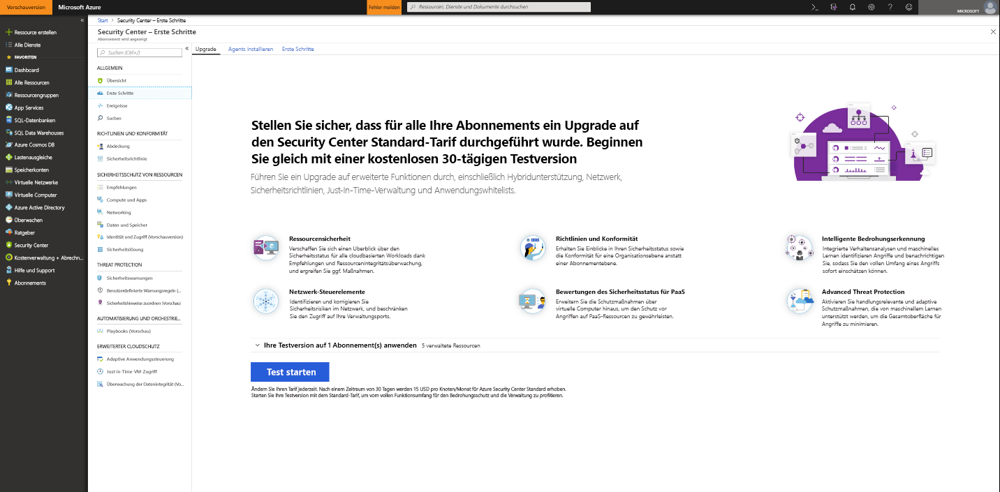
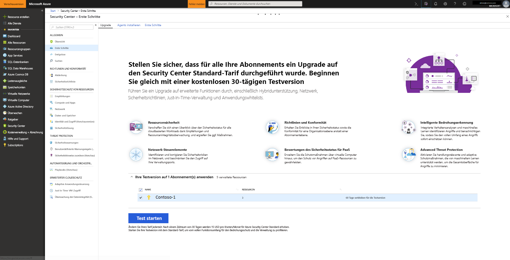

# Integrieren von Azure Security Center Standard für erhöhte Sicherheit
Führen Sie ein Upgrade auf Security Center Standard durch, um von erhöhter Sicherheit und besserem Schutz vor Bedrohungen für Ihre Hybridcloud-Workloads zu profitieren.  Sie können die Standard-Edition kostenlos testen. Weitere Informationen finden Sie auf der Seite mit den [Preisen für Security Center](https://azure.microsoft.com/pricing/details/security-center/).

Security Center Standard umfasst Folgendes:

- **Hybridsicherheit:** Verschaffen Sie sich einen einheitlichen Überblick über die Sicherheit sämtlicher lokaler und cloudbasierter Workloads. Wenden Sie Sicherheitsrichtlinien an, und bewerten Sie kontinuierlich die Sicherheit Ihrer Hybridcloud-Workloads, um die Einhaltung von Sicherheitsstandards zu gewährleisten. Sammeln, durchsuchen und analysieren Sie Sicherheitsdaten aus verschiedensten Quellen (einschließlich Firewalls und Partnerlösungen).
- **Erweiterte Bedrohungserkennung:** Verwenden Sie erweiterte Analysefunktionen und den Microsoft Intelligent Security Graph, um der Entwicklung von Cyberangriffen immer einen Schritt voraus zu sein.  Nutzen Sie integrierte Verhaltensanalysen und Machine Learning, um Angriffe und Zero-Day-Exploits zu erkennen. Überwachen Sie Netzwerke, Computer und Clouddienste auf neue Angriffe und auf Aktivitäten nach einer Sicherheitsverletzung. Optimieren Sie die Untersuchung mit interaktiven Tools und kontextbezogenen Informationen zu Bedrohungen.
- **Zugriffs- und Anwendungskontrollen:** Blockieren Sie Schadsoftware und andere unerwünschte Anwendungen mithilfe von Whitelist-Empfehlungen, die auf Ihre spezifischen Workloads abgestimmt sind und durch Machine Learning unterstützt werden. Verkleinern Sie die Angriffsfläche des Netzwerks mit kontrolliertem Just-in-Time-Zugriff auf die Verwaltungsports virtueller Azure-Computer, um die Gefahr von Brute-Force- und anderen Netzwerkangriffen erheblich zu senken.

## Erkennen ungeschützter Ressourcen     
Security Center erkennt automatisch alle Azure-Abonnements oder -Arbeitsbereiche, für die Security Center Standard nicht aktiviert ist. Dazu zählen unter anderem Azure-Abonnements mit Security Center Free sowie Arbeitsbereiche, für die die Sicherheitslösung nicht aktiviert ist.

Sie können ein Upgrade für ein gesamtes Azure-Abonnement auf den Standard-Tarif durchführen, da diese Änderung von allen unterstützten Ressourcen des Abonnements geerbt wird. Wenn Sie den Standard-Tarif auf einen Arbeitsbereich anwenden, gilt dieser Tarif auch für alle Ressourcen, die Berichte an den Arbeitsbereich senden.

> [!NOTE]
> Möglicherweise möchten Sie Ihre Kosten verwalten und den Umfang der für eine Lösung gesammelten Daten begrenzen, indem Sie sie auf einen bestimmten Satz von Agents beschränken. Mit der [Zielgruppenadressierung für Lösungen](../operations-management-suite/operations-management-suite-solution-targeting.md) können Sie einen Bereich auf die Lösung anwenden und eine Teilmenge von Computern im Arbeitsbereich als Ziel angeben.  Bei Verwendung der Zielgruppenadressierung für Lösungen führt Security Center den Arbeitsbereich als Arbeitsbereich ohne Lösung auf.
>
>

## Upgraden eines Azure-Abonnements oder -Arbeitsbereichs
So upgraden Sie ein Abonnement oder einen Arbeitsbereich auf „Standard“
1. Wählen Sie im Security Center im Hauptmenü die Option **Erste Schritte** aus.
  
2. Unter **Upgrade** werden von Security Center für die Integration geeignete Abonnements und Arbeitsbereiche aufgeführt. 
   - Klicken Sie auf den erweiterbaren Bereich **Ihre Testversion anwenden**, um eine Liste aller Abonnements und Arbeitsbereiche mit einem Berechtigungsstatus für Ihre Testversion anzuzeigen.
   -    Sie können Abonnements und Arbeitsbereiche aktualisieren, die keine Berechtigung für die Testversion haben.
   -    Sie können berechtigte Arbeitsbereiche und Abonnements auswählen, um Ihre Testversion zu starten.
3.  Klicken Sie auf **Testversion starten**, um Ihre Testversion für die ausgewählten Abonnements zu starten.
  

   > [!NOTE]
   > Die Free-Funktionen von Security Center werden nur auf Ihre Azure-VMs und -VM Scale Sets angewendet. Die Free-Funktionen werden nicht auf Ihre Azure-fremden Computer angewendet. Wenn Sie „Standard“ auswählen, werden die Standard-Funktionen auf alle virtuellen Azure-Computer, VM Scale Sets und Azure-fremden Computer angewendet, die Berichte an den Arbeitsbereich senden. Wir empfehlen, „Standard“ anzuwenden, um die Sicherheit Ihrer Azure-basierten und Azure-fremden Ressourcen zu verbessern.
   >
   >

## Integrieren Azure-fremder Computer
Security Center kann den Sicherheitsstatus Ihrer Azure-fremden Computer überwachen. Dazu müssen die entsprechenden Ressourcen jedoch zunächst integriert werden. Azure-fremde Computer können über das Blatt **Erste Schritte** oder über das Blatt **Compute** hinzugefügt werden. Beide Methoden werden hier Schritt für Schritt erläutert.

### Hinzufügen neuer Azure-fremder Computer über **Erste Schritte**

1. Kehren Sie zu **Erste Schritte** zurück.   
2. Wählen Sie die Registerkarte **Erste Schritte** aus.

   

3. Klicken Sie auf **Konfigurieren** unter **Neue Nicht-Azure-Computer hinzufügen**. Es wird eine Liste Ihrer Log Analytics-Arbeitsbereiche angezeigt. Die Liste enthält, falls zutreffend, den Standardarbeitsbereich, der von Security Center für Sie erstellt wurde, wenn die automatische Bereitstellung aktiviert wurde. Wählen Sie diesen Arbeitsbereich oder einen anderen Arbeitsbereich aus, den Sie verwenden möchten.

   ![Hinzufügen eines Azure-fremden Computers][7]

Gegebenenfalls bereits vorhandene Arbeitsbereiche werden unter **Add new Non-Azure computers** (Neue Azure-fremde Computer hinzufügen) aufgeführt. Sie können Computer einem vorhandenen Arbeitsbereich hinzufügen oder einen neuen Arbeitsbereich erstellen. Klicken Sie zum Erstellen eines neuen Arbeitsbereichs auf den Link zum **Hinzufügen eines neuen Arbeitsbereichs**.

### Hinzufügen neuer Azure-fremder Computer über **Compute**

**Erstellen eines neuen Arbeitsbereichs und Hinzufügen eines Computers**

1. Klicken Sie unter **Add new non-Azure computers** (Neue Azure-fremde Computer hinzufügen) auf den Link zum **Hinzufügen eines neuen Arbeitsbereichs**.

   ![Hinzufügen eines neuen Arbeitsbereichs][4]

2. Klicken Sie unter **Sicherheit und Überwachung** auf **OMS-Arbeitsbereich**, um einen neuen Arbeitsbereich zu erstellen.
   > [!NOTE]
   > OMS-Arbeitsbereiche werden jetzt als Log Analytics-Arbeitsbereiche bezeichnet.
3. Geben Sie unter **OMS-Arbeitsbereich** die Informationen für Ihren Arbeitsbereich ein.
4. Klicken Sie unter **OMS-Arbeitsbereich** auf **OK**.  Nachdem Sie auf „OK“ geklickt haben, erhalten Sie einen Downloadlink für einen Windows- oder Linux-Agent sowie Schlüssel für Ihre Arbeitsbereichs-ID, die Sie zum Konfigurieren des Agents benötigen.
5. Klicken Sie unter **Sicherheit und Überwachung** auf **OK**.

**Auswählen eines vorhandenen Arbeitsbereichs und Hinzufügen eines Computers**

Sie können einen Computer mithilfe des Workflows unter **Onboarding** hinzufügen, wie weiter oben gezeigt. Sie können einen Computer aber auch mithilfe des Workflows unter **Compute** hinzufügen. In diesem Beispiel verwenden wir **Compute**.

1. Kehren Sie zum Hauptmenü von Security Center und zum Dashboard **Übersicht** zurück.

   ![Übersicht][5]

2. Wählen Sie **Compute und Apps** aus.
3. Wählen Sie unter **Compute und Apps** die Option **Computer hinzufügen** aus.

   ![Blatt „Compute“][6]

4. Wählen Sie unter **Add new non-Azure computers** (Neue Azure-fremde Computer hinzufügen) einen Arbeitsbereich aus, mit dem Sie Ihren Computer verbinden möchten, und klicken Sie anschließend auf **Computer hinzufügen**.

   ![Hinzufügen von Computern][7]

   Auf dem Blatt **Direkt-Agent** erhalten Sie einen Downloadlink für einen Windows- oder Linux-Agent sowie die Arbeitsbereichs-ID und zugehörige Schlüssel, die Sie zum Konfigurieren des Agents benötigen.   

## Nächste Schritte
In diesem Artikel haben Sie gelernt, wie Sie Azure-basierte und Azure-fremde Ressourcen integrieren, um von der erhöhten Sicherheit von Security Center zu profitieren.  Informationen zu weiteren Möglichkeiten mit Ihren integrierten Ressourcen finden Sie unter den folgenden Links:

- [Aktivieren der Datensammlung](security-center-enable-data-collection.md)
- [Bericht über Bedrohungen](security-center-threat-report.md)
- [Verwalten des Zugriffs auf virtuelle Computer mithilfe des Just-In-Time-Features](security-center-just-in-time.md)

<!--Image references-->
[1]: ./media/security-center-onboarding/onboard.png
[2]: ./media/security-center-onboarding/onboard-subscription.png
[3]: ./media/security-center-onboarding/get-started.png
[4]: ./media/security-center-onboarding/create-workspace.png
[5]: ./media/security-center-onboarding/overview.png
[6]: ./media/security-center-onboarding/compute-blade.png
[7]: ./media/security-center-onboarding/add-computer.png
[8]: ./media/security-center-onboarding/onboard-workspace.png
