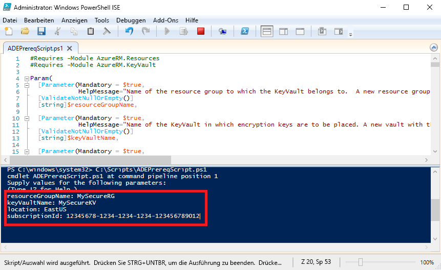

# <a name="quickstart-encrypt-a-windows-iaas-vm-with-azure-powershell"></a>Schnellstart: Verschlüsseln eines virtuellen Windows-IaaS-Computers mit Azure PowerShell

Mit Azure Disk Encryption können Sie die Datenträger von virtuellen Windows- und Linux-IaaS-Computern verschlüsseln. Die Lösung ist in Azure Key Vault integriert, um Ihnen die Steuerung und Verwaltung der Datenträgerverschlüsselungsschlüssel und -geheimnisse zu erleichtern. Mit der Verschlüsselungstechnologie nach Branchenstandard von Azure Disk Encryption können Sie den Schutz Ihrer virtuellen Computer im Ruhezustand gewährleisten. In dieser Schnellstartanleitung erstellen Sie einen virtuellen Windows Server 2016-Computer und verschlüsseln den Betriebssystem-Datenträger.

Wenn Sie kein Azure-Abonnement besitzen, können Sie ein [kostenloses Konto](https://azure.microsoft.com/free/?WT.mc_id=A261C142F) erstellen, bevor Sie beginnen.

## <a name="prerequisites"></a>Voraussetzungen

- Windows PowerShell ISE
- Installieren der [neuesten Version des AzureRM PowerShell-Moduls](/powershell/azure/azurerm/install-azurerm-ps?view=azurermps-6.13.0) bzw. Aktualisieren auf die neueste Version
    - Das AzureRM-Modul muss mindestens Version 6.0.0 aufweisen. `Get-Module AzureRM -ListAvailable | Select-Object -Property Name,Version,Path`
- Eine Kopie des [Skripts zur Überprüfung der Voraussetzungen für Azure Disk Encryption](https://raw.githubusercontent.com/Azure/azure-powershell/master/src/Compute/Compute/Extension/AzureDiskEncryption/Scripts/AzureDiskEncryptionPreRequisiteSetup.ps1)
    - Wenn Sie dieses Skript bereits besitzen, laden Sie eine neue Kopie herunter, da es vor Kurzem geändert wurde. 
    - Markieren Sie mithilfe von **STRG+A** den gesamten Text, und kopieren Sie ihn mit **STRG+C** in Editor.
    - Speichern Sie die Datei unter dem Namen **ADEPrereqScript.ps1**.


## <a name="sign-in-to-azure"></a>Anmelden bei Azure

1. Klicken Sie mit der rechten Maustaste auf **Windows PowerShell ISE** und anschließend auf **Als Administrator ausführen**.
1. Klicken Sie im Fenster **Administrator: Windows PowerShell ISE** auf **Ansicht** und anschließend auf **Skriptbereich anzeigen**.
1. Geben Sie im Skriptbereich das folgende Cmdlet ein: 

     ```azurepowershell
      Connect-AzureRMAccount
     ```

1. Klicken Sie auf den grünen Pfeil für **Skript ausführen**, oder drücken Sie F5. 
2. Schließen Sie über die interaktive Anmeldung die Verbindungsherstellung mit Ihrem Azure-Konto ab.
3. Kopieren Sie die zurückgegebene **Abonnement-ID**, um sie für die Ausführung des nächsten PowerShell-Skripts zu verwenden. 

## <a name="bkmk_PrereqScript"></a> Ausführen des Skripts zur Überprüfung der Voraussetzungen für Azure Disk Encryption
 **ADEPrereqScript.ps1** erstellt eine Ressourcengruppe und einen Schlüsseltresor und legt die Zugriffsrichtlinie für den Schlüsseltresor fest. Das Skript erstellt darüber hinaus eine Ressourcensperre für den Schlüsseltresor, um zu verhindern, dass er versehentlich gelöscht wird.  

1. Klicken Sie im Fenster **Administrator: Windows PowerShell ISE** auf **Datei** und anschließend auf **Öffnen**. Navigieren Sie zur Datei **ADEPrereqScript.ps1**, und doppelklicken Sie darauf. Das Skript wird im Skriptbereich geöffnet.
2. Klicken Sie zum Ausführen des Skripts auf den grünen Pfeil für **Skript ausführen**, oder drücken Sie F5. 
3. Geben Sie Namen für eine neue **Ressourcengruppe** und einen neuen **Schlüsseltresor** ein. Verwenden Sie keine vorhandene Ressourcengruppe bzw. keinen vorhandenen Schlüsseltresor für diese Schnellstartanleitung, da die Ressourcengruppe später gelöscht wird. 
4. Geben Sie den Standort ein, an dem die Ressourcen erstellt werden sollen, z.B. **EastUS**. Mit `Get-AzureRMLocation` können Sie eine Standortliste abrufen.
5. Fügen Sie Ihre **Abonnement-ID** ein. Die Abonnement-ID kann mit `Get-AzureRMSubscription` abgerufen werden.  
6. Klicken Sie auf den grünen Pfeil für **Skript ausführen**. 
7. Kopieren Sie die zurückgegebenen Werte für **DiskEncryptionKeyVaultUrl** und **DiskEncryptionKeyVaultId** zur späteren Verwendung.




## <a name="create-a-virtual-machine"></a>Erstellen eines virtuellen Computers 
Sie müssen einen virtuellen Computer erstellen, um seinen Datenträger verschlüsseln zu können. Mit dem verwendeten Skript wird ein virtueller Windows Server 2016-Computer mit 8 GB RAM und einem Betriebssystem-Datenträger mit 30 GB erstellt. 

1. Kopieren Sie das Skript in den Skriptbereich **Administrator: Windows PowerShell ISE**, und ändern Sie die ersten drei Variablen. Für die Ressourcengruppe und den Standort müssen Sie die gleichen Werte wie im [Skript zur Überprüfung der Voraussetzungen](#bkmk_PrereqScript) verwenden.  

   ```azurepowershell
    # Variables for common values
    $resourceGroup = "MySecureRG"
    $location = "EastUS"
    $vmName = "MySecureVM"
    
    # Create user object
    $cred = Get-Credential -Message "Enter a username and password for the virtual machine."
    
    # Create a resource group
    #New-AzureRmResourceGroup -Name $resourceGroup -Location $location
    
    # Create a subnet configuration
    $subnetConfig = New-AzureRmVirtualNetworkSubnetConfig -Name mySubnet -AddressPrefix 192.168.1.0/24
    
    # Create a virtual network
    $vnet = New-AzureRmVirtualNetwork -ResourceGroupName $resourceGroup -Location $location `
      -Name MYvNET -AddressPrefix 192.168.0.0/16 -Subnet $subnetConfig
    
    # Create a public IP address and specify a DNS name
    $pip = New-AzureRmPublicIpAddress -ResourceGroupName $resourceGroup -Location $location `
      -Name "mypublicdns$(Get-Random)" -AllocationMethod Static -IdleTimeoutInMinutes 4
    
    # Create an inbound network security group rule for port 3389
    $nsgRuleRDP = New-AzureRmNetworkSecurityRuleConfig -Name myNetworkSecurityGroupRuleRDP  -Protocol Tcp `
      -Direction Inbound -Priority 1000 -SourceAddressPrefix * -SourcePortRange * -DestinationAddressPrefix * `
      -DestinationPortRange 3389 -Access Allow
    
    # Create a network security group
    $nsg = New-AzureRmNetworkSecurityGroup -ResourceGroupName $resourceGroup -Location $location `
      -Name myNetworkSecurityGroup -SecurityRules $nsgRuleRDP
    
    # Create a virtual network card and associate with public IP address and NSG
    $nic = New-AzureRmNetworkInterface -Name myNic -ResourceGroupName $resourceGroup -Location $location `
      -SubnetId $vnet.Subnets[0].Id -PublicIpAddressId $pip.Id -NetworkSecurityGroupId $nsg.Id
    
    # Create a virtual machine configuration
    $vmConfig = New-AzureRmVMConfig -VMName $vmName -VMSize Standard_D2_v3 | `
    Set-AzureRmVMOperatingSystem -Windows -ComputerName $vmName -Credential $cred | `
    Set-AzureRmVMSourceImage -PublisherName MicrosoftWindowsServer -Offer WindowsServer -Skus 2016-Datacenter-smalldisk -Version latest | `
    Add-AzureRmVMNetworkInterface -Id $nic.Id
    
    # Create a virtual machine
    New-AzureRmVM -ResourceGroupName $resourceGroup -Location $location -VM $vmConfig
   ```

2. Klicken Sie auf den grünen Pfeil für **Skript ausführen**, um den virtuellen Computer zu erstellen.  


## <a name="encrypt-the-disk-of-the-vm"></a>Verschlüsseln des Datenträgers des virtuellen Computers
Sie haben einen Schlüsseltresor und einen virtuellen Computer erstellt und können nun den Datenträger mit dem Cmdlet **Set-AzureRmVmDiskEncryptionExtension** verschlüsseln. 
 
1. Führen Sie das folgende Cmdlet aus, um den Datenträger des virtuellen Computers zu verschlüsseln:

    ```azurepowershell
     Set-AzureRmVmDiskEncryptionExtension -ResourceGroupName "MySecureRG" -VMName "MySecureVM" `
     -DiskEncryptionKeyVaultId "<Returned by the prerequisites script>" -DiskEncryptionKeyVaultUrl "<Returned by the prerequisites script>"
     ```


1. Nach Abschluss der Verschlüsselung können Sie mit dem folgenden Cmdlet überprüfen, ob der Datenträger verschlüsselt ist: 

     ```azurepowershell
     Get-AzureRmVmDiskEncryptionStatus -ResourceGroupName "MySecureRG" -VMName "MySecureVM"
     ```
    
    
## <a name="clean-up-resources"></a>Bereinigen von Ressourcen
 Mit **ADEPrereqScript.ps1** wird eine Ressourcensperre für den Schlüsseltresor erstellt. Zum Bereinigen der Ressourcen aus dieser Schnellstartanleitung müssen Sie zuerst die Ressourcensperre entfernen und dann die Ressourcengruppe löschen. 

1. Entfernen Sie die Ressourcensperre für den Schlüsseltresor.

     ```azurepowershell
     $LockId =(Get-AzureRMResourceLock -ResourceGroupName "MySecureRG" -ResourceName "MySecureVault" -ResourceType "Microsoft.KeyVault/vaults").LockID 
     Remove-AzureRmResourceLock -LockID $LockId
      ```
    
2. Entfernen Sie die Ressourcengruppe. Hierdurch werden auch alle Ressourcen in der Gruppe gelöscht. 
     ```azurepowershell
      Remove-AzureRmResourceGroup -Name "MySecureRG"
      ```

## <a name="next-steps"></a>Nächste Schritte
Fahren Sie mit dem nächsten Artikel fort, um weitere Informationen zu den Voraussetzungen für Azure Disk Encryption und virtuelle IaaS-Computer zu erhalten.

> [!div class="nextstepaction"]
> [Azure Disk Encryption – Voraussetzungen](azure-security-disk-encryption-prerequisites.md)