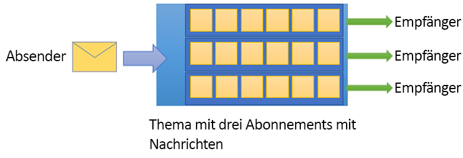

# Was ist Azure Service Bus?

Microsoft Azure Service Bus ist ein vollständig verwalteter Nachrichtenbroker für die [Unternehmensintegration](https://azure.com/integration). Service Bus wird in der Regel verwendet, um Anwendungen und Dienste voneinander zu entkoppeln, und ist eine zuverlässige und sichere Plattform für die asynchrone Übertragung von Daten und Zuständen. Die Datenübertragung zwischen verschiedenen Anwendungen und Diensten erfolgt mithilfe von *Nachrichten*. Nachrichten liegen im Binärformat vor und können JSON-Code, XML-Code oder nur Text enthalten. 

Im Anschluss finden Sie einige gängige Messagingszenarien:

* Messaging: Übertragung von Geschäftsdaten (beispielsweise Verkäufe/Bestellungen, Journale oder Bestandsbewegungen)
* Entkoppelung von Anwendungen: Verbesserung der Zuverlässigkeit und Skalierbarkeit von Anwendungen und Diensten (Client und Dienst müssen nicht gleichzeitig online sein.)
* Themen und Abonnements: Ermöglichung von 1:*n*-Beziehungen zwischen Herausgebern und Abonnenten
* Nachrichtensitzungen: Implementierung von Workflows, die die Sortierung oder Verzögerung von Nachrichten erfordern

## Namespaces

Ein Namespace ist ein Bereichscontainer für alle Messagingkomponenten. Ein einzelner Namespace kann mehrere Warteschlangen und Themen enthalten, und Namespaces fungieren häufig als Anwendungscontainer.

## Warteschlangen

Nachrichten werden an *Warteschlangen* gesendet und daraus empfangen. Warteschlangen ermöglichen die Speicherung von Nachrichten, bis die empfangende Anwendung empfangs- und verarbeitungsbereit ist.

Nachrichten in Warteschlangen werden bei ihrem Eingang sortiert und mit einem Zeitstempel versehen. Nachdem eine Nachricht akzeptiert wurde, wird sie sicher in redundantem Speicher gespeichert. Nachrichten werden im *Pull-Modus* zugestellt, der Nachrichten auf Anforderung übermittelt.

## Themen

Nachrichten können auch unter Verwendung von *Themen* gesendet und empfangen werden. Themen sind in Veröffentlichungs-/Abonnementszenarien hilfreich. Bei der Punkt-zu-Punkt-Kommunikation werden dagegen häufig Warteschlangen verwendet.

Themen können über mehrere unabhängige Abonnements verfügen. Ein Abonnent eines Themas kann eine Kopie jeder Nachricht erhalten, die an das Thema gesendet wird. Abonnements sind benannte Entitäten. Diese werden dauerhaft erstellt, können aber optional auch ablaufen oder automatisch gelöscht werden.

In bestimmten Szenarien sollen einzelne Abonnements unter Umständen nicht alle Nachrichten erhalten, die an ein Thema gesendet werden. In einem solchen Fall können Sie [Regeln und Filter](topic-filters.md) verwenden, um Bedingungen zu definieren, die optionale [Aktionen](topic-filters.md#actions) auslösen, bestimmte Nachrichten filtern und Nachrichteneigenschaften festlegen oder ändern.

## Erweiterte Funktionen

Service Bus verfügt auch über erweiterte Features für komplexere Messagingszenarien. Die wichtigsten dieser Features werden in den folgenden Abschnitten beschrieben:

### Nachrichtensitzungen

Mithilfe von Sitzungen können Sie in Service Bus eine FIFO-Garantie (First In – First Out) implementieren. [Nachrichtensitzungen](message-sessions.md) ermöglichen die gemeinsame und geordnete Verarbeitung unbegrenzter Sequenzen verwandter Nachrichten. 

### Automatische Weiterleitung

Mit der Funktion [Automatische Weiterleitung](service-bus-auto-forwarding.md) können Sie eine Warteschlange oder ein Abonnement mit einer weiteren Warteschlange oder einem Thema aus dem selben Namespace verketten. Wenn die automatische Weiterleitung aktiviert ist, entfernt Service Bus die Nachrichten automatisch, die in der ersten Warteschlange oder dem Abonnement (Quelle) platziert wurden, und fügt sie in die zweite Warteschlange oder das Thema (Ziel) ein.

### Unzustellbare Nachrichten

Service Bus unterstützt eine [Warteschlange für unzustellbare Nachrichten](service-bus-dead-letter-queues.md) (Dead-Letter Queue, DLQ). Darin werden Nachrichten gespeichert, die an keinen Empfänger übermittelt oder nicht verarbeitet werden können. Nachrichten aus der DLQ können entfernt und untersucht werden.

### Zeitgesteuerte Zustellung

Sie können Nachrichten zur [verzögerten Verarbeitung](message-sequencing.md#scheduled-messages) an eine Warteschlange oder ein Thema übergeben und so beispielsweise einen Auftrag planen, der zu einem bestimmten Zeitpunkt für die Verarbeitung durch ein System zur Verfügung gestellt werden soll.

### Nachrichtenverzögerung

Wenn eine Warteschlangen- oder ein Abonnementclient eine Nachricht erhält, die verarbeitet werden soll, aber die Verarbeitung aufgrund von besonderen Umständen innerhalb der Anwendung zu diesem Zeitpunkt nicht möglich ist, hat die Entität die Möglichkeit, das [Abrufen der Nachricht auf später zu verschieben](message-deferral.md). Die Nachricht verbleibt in der Warteschlange oder im Abonnement, wird jedoch zurückgestellt.

### Batchverarbeitung

Durch die [clientseitige Batchverarbeitung](service-bus-performance-improvements.md#client-side-batching) kann ein Warteschlangen- oder Themenclient das Senden einer Nachricht für einen bestimmten Zeitraum verzögern. Wenn der Client während dieses Zeitraums weitere Nachrichten sendet, werden die Nachrichten in einem einzigen Batch übertragen. 

### Transaktionen

Eine [Transaktion](service-bus-transactions.md) gruppiert mehrere Vorgänge in einem Ausführungsbereich. Service Bus unterstützt Gruppierungsvorgänge für eine einzelne Nachrichtenentität (Warteschlange, Thema, Abonnement) innerhalb eines Transaktionsbereichs.

### Filtern und Aktionen

Abonnenten können definieren, welche Nachrichten von einem Thema empfangen werden sollen. Diese Nachrichten werden in Form von [benannten Abonnementregeln](topic-filters.md) angegeben. Für jede übereinstimmende Regelbedingung erzeugt das Abonnement eine Kopie der Nachricht, die für jede übereinstimmende Regel anders kommentiert werden kann.

### Automatisches Löschen nach Leerlauf

[Automatisches Löschen nach Leerlauf](/dotnet/api/microsoft.servicebus.messaging.queuedescription.autodeleteonidle) ermöglicht das Angeben eines Leerlaufintervalls, nach dem die Warteschlange automatisch gelöscht wird. Die Mindestdauer ist fünf Minuten.

### Duplikaterkennung

Sollte ein Fehler dazu führen, dass der Client das Ergebnis eines Sendevorgangs nicht mit Bestimmtheit ermitteln kann, sorgt die [Duplikaterkennung](duplicate-detection.md) für Klarheit: Der Absender kann die gleiche Nachricht erneut senden, und die Warteschlange oder das Thema verwirft mögliche Duplikate.

### SAS, RBAC und verwaltete Identitäten für Azure-Ressourcen

Service Bus unterstützt Sicherheitsprotokolle wie [Shared Access Signatures](service-bus-sas.md) (SAS), die [rollenbasierte Zugriffssteuerung](service-bus-role-based-access-control.md) (Role Based Access Control, RBAC) und [verwaltete Identitäten für Azure-Ressourcen](service-bus-managed-service-identity.md).

### Georedundante Notfallwiederherstellung

Sollte eine Azure-Region oder ein Azure-Datencenter ausfallen, kann die Datenverarbeitung dank [georedundanter Notfallwiederherstellung](service-bus-geo-dr.md) in einer anderen Region oder in einem anderen Datencenter fortgesetzt werden.

### Sicherheit

Service Bus unterstützt die Standardprotokolle [AMQP 1.0](service-bus-amqp-overview.md) und [HTTP/REST](/rest/api/servicebus/).

## Clientbibliotheken

Service Bus unterstützt Clientbibliotheken für [.NET](https://github.com/Azure/azure-service-bus-dotnet/tree/master), [Java](https://github.com/Azure/azure-service-bus-java/tree/master) und [JMS](https://github.com/Azure/azure-service-bus/tree/master/samples/Java/qpid-jms-client).

## Integration

Service Bus lässt sich vollständig in folgende Azure-Dienste integrieren:

- [Event Grid](https://azure.microsoft.com/services/event-grid/) 
- [Logik-Apps](https://azure.microsoft.com/services/logic-apps/) 
- [Funktionen](https://azure.microsoft.com/services/functions/) 
- [Dynamics 365](https://dynamics.microsoft.com)
- [Stream Analytics](https://azure.microsoft.com/services/stream-analytics/)
 
## Nächste Schritte

Informationen zu den ersten Schritten mit Service Bus-Messaging finden Sie in folgenden Artikeln:

* [Gegenüberstellung der Azure-Messagingdienste](../event-grid/compare-messaging-services.md?toc=%2fazure%2fservice-bus-messaging%2ftoc.json&bc=%2fazure%2fservice-bus-messaging%2fbreadcrumb%2ftoc.json)
* [Informationen zum Standard- und Premium-Tarif für Azure Service Bus](https://azure.microsoft.com/pricing/details/service-bus/)
* [Leistung und Wartezeit beim Premium-Tarif von Azure Service Bus](https://techcommunity.microsoft.com/t5/Service-Bus-blog/Premium-Messaging-How-fast-is-it/ba-p/370722)
* Schnellstartanleitung für [.NET](service-bus-dotnet-get-started-with-queues.md), [Java](service-bus-java-how-to-use-queues.md) oder [JMS](service-bus-java-how-to-use-jms-api-amqp.md)
* [Service Bus Explorer](https://github.com/paolosalvatori/ServiceBusExplorer/releases)
