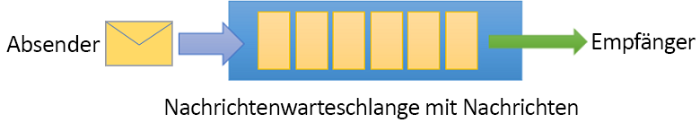
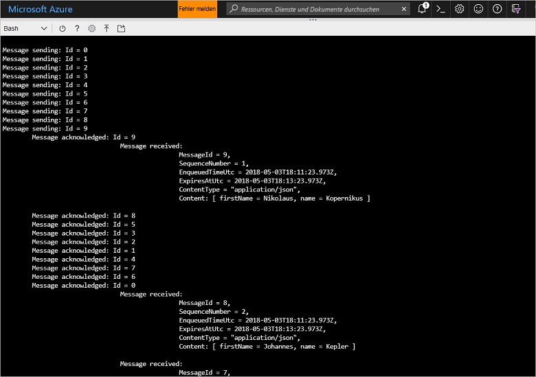

# <a name="quickstart-send-and-receive-messages-using-azure-cli-and-java"></a>Schnellstart: Senden und Empfangen von Nachrichten mit der Azure CLI und Java

Microsoft Azure Service Bus ist ein Nachrichtenbroker für die Unternehmensintegration, der sicheres Messaging und Zuverlässigkeit bietet. Ein typisches Service Bus-Szenario umfasst normalerweise die Entkopplung von zwei oder mehr Anwendungen (die Anwendungen müssen nicht gleichzeitig online sein), Diensten oder Prozessen, die Übertragung von Zustands- oder Datenänderungen und das Senden von Nachrichten zwischen den Anwendungen. 

Beispielsweise kann es sein, dass ein Einzelhandelsunternehmen seine Point-of-Sale-Daten an ein Backoffice oder regionales Verteilungszentrum sendet, um den Bestand auffüllen bzw. aktualisieren zu lassen. In diesem Fall sendet die Client-App Nachrichten an eine Service Bus-Warteschlange und empfängt Nachrichten von dort:



In dieser Schnellstartanleitung wird beschrieben, wie Sie Nachrichten mit Service Bus senden und empfangen, indem Sie die Azure CLI und die Service Bus-Java-Bibliothek verwenden. Falls Sie an technischeren Details interessiert sind, können Sie auch die [Beschreibung](#understand-the-sample-code) der wichtigen Elemente des Beispielcodes lesen.

Wenn Sie kein Azure-Abonnement besitzen, können Sie ein [kostenloses Konto][] erstellen, bevor Sie beginnen.

[!INCLUDE [cloud-shell-try-it.md](../../includes/cloud-shell-try-it.md)]

## <a name="log-in-to-azure"></a>Anmelden bei Azure

Klicken Sie im Menü oben rechts im Azure-Portal auf die Schaltfläche „Cloud Shell“, und wählen Sie in der Dropdownliste **Umgebung auswählen** die Option **Bash**. 

## <a name="use-cli-to-create-resources"></a>Verwenden der CLI zum Erstellen von Ressourcen

Führen Sie in Cloud Shell an der Bash-Eingabeaufforderung die folgenden Befehle aus, um Service Bus-Ressourcen bereitzustellen. Achten Sie darauf, dass Sie alle Platzhalter durch die entsprechenden Werte ersetzen:

```azurecli-interactive
# Create a resource group
az group create --name myResourceGroup --location eastus

# Create a Service Bus messaging namespace with a unique name
namespaceName=myNameSpace$RANDOM
az servicebus namespace create \
   --resource-group myResourceGroup \
   --name $namespaceName \
   --location eastus

# Create a Service Bus queue
az servicebus queue create --resource-group myResourceGroup \
   --namespace-name $namespaceName \
   --name myQueue

# Get the connection string for the namespace
connectionString=$(az servicebus namespace authorization-rule keys list \
   --resource-group myResourceGroup \
   --namespace-name  $namespaceName \
   --name RootManageSharedAccessKey \
   --query primaryConnectionString --output tsv)
```

Kopieren Sie nach Ausführung des letzten Befehls die Verbindungszeichenfolge und den von Ihnen ausgewählten Warteschlangennamen an einen temporären Ort, z.B. den Editor. Sie benötigen diese Angaben im nächsten Schritt.

## <a name="send-and-receive-messages"></a>Senden und Empfangen von Nachrichten

Nachdem Sie den Namespace und die Warteschlange erstellt haben und Sie über die erforderlichen Anmeldeinformationen verfügen, sind Sie zum Senden und Empfangen von Nachrichten bereit. Sie können sich den Code in [diesem GitHub-Ordner mit Beispielen](https://github.com/Azure/azure-service-bus/tree/master/samples/Java/quickstarts-and-tutorials/quickstart-java/src/main/java/samples/quickstart/SendAndReceiveMessages.java) ansehen.

1. Stellen Sie sicher, dass Cloud Shell geöffnet ist und dass die Bash-Eingabeaufforderung angezeigt wird.

2. Klonen Sie das [Service Bus-GitHub-Repository](https://github.com/Azure/azure-service-bus/), indem Sie den folgenden Befehl ausführen:

   ```bash
   git clone https://github.com/Azure/azure-service-bus.git
   ```

2. Ändern Sie das aktuelle Verzeichnis in den Ordner mit den Beispielen, indem Sie normale Schrägstriche als Pfadtrennzeichen verwenden:

   ```bash
   cd azure-service-bus/samples/Java/quickstarts-and-tutorials/quickstart-java 
   ```

3. Führen Sie den folgenden Befehl aus, um die Anwendung zu erstellen:
   
   ```bash
   mvn clean package -DskipTests
   ```

4. Führen Sie den folgenden Befehl aus, um das Programm auszuführen. Wenn Sie die Bash-Shell nicht neu gestartet haben, wird die Variable mit dem Verbindungszeichenfolgenwert automatisch ersetzt:

   ```bash
   java -jar ./target/samples.quickstart-1.0.0-jar-with-dependencies.jar -c $connectionString -q myQueue
   ```

6. Verfolgen Sie, wie zehn Nachrichten an die Warteschlange gesendet werden. Beachten Sie, dass die Reihenfolge der Nachrichten nicht garantiert ist. Sie können aber sehen, dass die Nachrichten gesendet und dann bestätigt und empfangen werden, und Sie sehen die Nutzlastdaten:

   

## <a name="clean-up-resources"></a>Bereinigen von Ressourcen

Führen Sie den folgenden Befehl aus, um die Ressourcengruppe, den Namespace und alle zugehörigen Ressourcen zu entfernen:

```azurecli-interactive
az group delete --resource-group myResourceGroup
```

## <a name="understand-the-sample-code"></a>Grundlagen des Beispielcodes

Dieser Abschnitt enthält weitere Details zu wichtigen Abschnitten des Beispielcodes. Sie finden den Code [hier](https://github.com/Azure/azure-service-bus/blob/master/samples/Java/quickstarts-and-tutorials/quickstart-java/src/main/java/samples/quickstart/SendAndReceiveMessages.java) im GitHub-Repository.

### <a name="get-connection-string-and-queue"></a>Abrufen der Verbindungszeichenfolge und der Warteschlange

Zuerst werden im Code zwei Zeichenfolgenvariablen deklariert, die als Argumente in der Befehlszeile an das Programm übergeben werden:

```java
String ConnectionString = null;
String QueueName = null;
```

Diese Werte werden über Parameter hinzugefügt und in der `runApp()`-Methode zugeordnet:

```java
public static void main(String[] args) {
    SendAndReceiveMessages app = new SendAndReceiveMessages();
    try {
        app.runApp(args);
        app.run();
    } catch (Exception e) {
        System.out.printf("%s", e.toString());
    }
    System.exit(0);
}

public void runApp(String[] args) {
    try {
        // parse connection string from command line             
        Options options = new Options();
        options.addOption(new Option("c", true, "Connection string"));
        options.addOption(new Option("q", true, "Queue Name"));
        CommandLineParser clp = new DefaultParser();
        CommandLine cl = clp.parse(options, args);
        if (cl.getOptionValue("c") != null && cl.getOptionValue("q") != null) {
            ConnectionString = cl.getOptionValue("c");
            QueueName =  cl.getOptionValue("q");
        }
        else
        {
            HelpFormatter formatter = new HelpFormatter();
            formatter.printHelp("run jar with", "", options, "", true);
        }

    } catch (Exception e) {
        System.out.printf("%s", e.toString());
    }
}
```

### <a name="create-queue-clients-to-send-and-receive"></a>Erstellen von Warteschlangenclients zum Senden und Empfangen

Für das Senden und Empfangen von Nachrichten erstellt die `run()`-Methode Warteschlangenclient-Instanzen, die aus der Verbindungszeichenfolge und dem Warteschlangennamen erstellt werden. Mit diesem Code werden zwei Warteschlangenclients erstellt, und zwar einer für das Senden und einer für das Empfangen:

```java
public void run() throws Exception {
// Create a QueueClient instance for receiving using the connection string builder
// We set the receive mode to "PeekLock", meaning the message is delivered
// under a lock and must be acknowledged ("completed") to be removed from the queue
QueueClient receiveClient = new QueueClient(new ConnectionStringBuilder(ConnectionString, QueueName), ReceiveMode.PEEKLOCK);
this.registerReceiver(receiveClient);

// Create a QueueClient instance for sending and then asynchronously send messages.
QueueClient sendClient = new QueueClient(new ConnectionStringBuilder(ConnectionString, QueueName), ReceiveMode.PEEKLOCK);
```

Die `run()`-Methode startet auch den Vorgang zum asynchronen Senden von Nachrichten und schließt den Absender, nachdem der Sendevorgang abgeschlossen wurde:

```java
this.sendMessagesAsync(sendClient).thenRunAsync(() -> sendClient.closeAsync());
``` 

### <a name="construct-and-send-messages"></a>Erstellen und Senden von Nachrichten

Die `sendMessagesAsync()`-Methode erstellt eine Gruppe von zehn Nachrichten und sendet diese asynchron mithilfe des Warteschlangenclients:

```java
CompletableFuture<Void> sendMessagesAsync(QueueClient sendClient) {
List<HashMap<String, String>> data =
        GSON.fromJson(
                "[" +
                        "{'name' = 'Einstein', 'firstName' = 'Albert'}," +
                        "{'name' = 'Heisenberg', 'firstName' = 'Werner'}," +
                        "{'name' = 'Curie', 'firstName' = 'Marie'}," +
                        "{'name' = 'Hawking', 'firstName' = 'Steven'}," +
                        "{'name' = 'Newton', 'firstName' = 'Isaac'}," +
                        "{'name' = 'Bohr', 'firstName' = 'Niels'}," +
                        "{'name' = 'Faraday', 'firstName' = 'Michael'}," +
                        "{'name' = 'Galilei', 'firstName' = 'Galileo'}," +
                        "{'name' = 'Kepler', 'firstName' = 'Johannes'}," +
                        "{'name' = 'Kopernikus', 'firstName' = 'Nikolaus'}" +
                        "]",
                new TypeToken<List<HashMap<String, String>>>() {}.getType());

List<CompletableFuture> tasks = new ArrayList<>();
for (int i = 0; i < data.size(); i++) {
    final String messageId = Integer.toString(i);
    Message message = new Message(GSON.toJson(data.get(i), Map.class).getBytes(UTF_8));
    message.setContentType("application/json");
    message.setLabel("Scientist");
    message.setMessageId(messageId);
    message.setTimeToLive(Duration.ofMinutes(2));
    System.out.printf("\nMessage sending: Id = %s", message.getMessageId());
    tasks.add(
            sendClient.sendAsync(message).thenRunAsync(() -> {
                System.out.printf("\n\tMessage acknowledged: Id = %s", message.getMessageId());
            }));
}
return CompletableFuture.allOf(tasks.toArray(new CompletableFuture<?>[tasks.size()]));
```

### <a name="receive-messages"></a>Empfangen von Nachrichten

Die `registerReceiver()`-Methode registriert den `RegisterMessageHandler`-Rückruf und legt außerdem einige Nachrichtenhandleroptionen fest:

```java
void registerReceiver(QueueClient queueClient) throws Exception {
    // register the RegisterMessageHandler callback
    queueClient.registerMessageHandler(new IMessageHandler() {
                           // callback invoked when the message handler loop has obtained a message
                           public CompletableFuture<Void> onMessageAsync(IMessage message) {
                               // receives message is passed to callback
                               if (message.getLabel() != null &&
                                       message.getContentType() != null &&
                                       message.getLabel().contentEquals("Scientist") &&
                                       message.getContentType().contentEquals("application/json")) {
                                    byte[] body = message.getBody();
                                   Map scientist = GSON.fromJson(new String(body, UTF_8), Map.class);

                                   System.out.printf(
                                           "\n\t\t\t\tMessage received: \n\t\t\t\t\t\tMessageId = %s, \n\t\t\t\t\t\tSequenceNumber = %s, \n\t\t\t\t\t\tEnqueuedTimeUtc = %s," +
                                                   "\n\t\t\t\t\t\tExpiresAtUtc = %s, \n\t\t\t\t\t\tContentType = \"%s\",  \n\t\t\t\t\t\tContent: [ firstName = %s, name = %s ]\n",
                                           message.getMessageId(),
                                           message.getSequenceNumber(),
                                           message.getEnqueuedTimeUtc(),
                                           message.getExpiresAtUtc(),
                                           message.getContentType(),
                                           scientist != null ? scientist.get("firstName") : "",
                                           scientist != null ? scientist.get("name") : "");
                               }
                               return CompletableFuture.completedFuture(null);
                           }

                           // callback invoked when the message handler has an exception to report
                           public void notifyException(Throwable throwable, ExceptionPhase exceptionPhase) {
                               System.out.printf(exceptionPhase + "-" + throwable.getMessage());
                           }
                       },
    // 1 concurrent call, messages are auto-completed, auto-renew duration
    new MessageHandlerOptions(1, true, Duration.ofMinutes(1)));

}
```

## <a name="next-steps"></a>Nächste Schritte

In diesem Artikel haben Sie einen Service Bus-Namespace und weitere erforderliche Ressourcen zum Senden und Empfangen von Nachrichten für eine Warteschlange erstellt. Weitere Informationen zum Schreiben von Code für das Senden und Empfangen von Nachrichten erhalten Sie im folgenden Tutorial zu Service Bus:

> [!div class="nextstepaction"]
> [Aktualisieren des Bestands mit der CLI und Java](./service-bus-tutorial-topics-subscriptions-cli.md)

[kostenloses Konto]: https://azure.microsoft.com/free/?ref=microsoft.com&utm_source=microsoft.com&utm_medium=docs&utm_campaign=visualstudio
[fully qualified domain name]: https://wikipedia.org/wiki/Fully_qualified_domain_name
[Install Azure CLI 2.0]: /cli/azure/install-azure-cli
[az group create]: /cli/azure/group#az_group_create