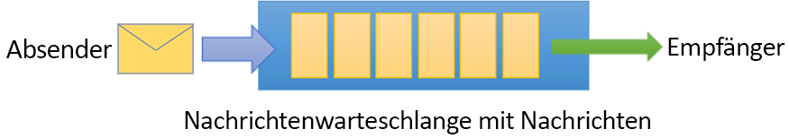
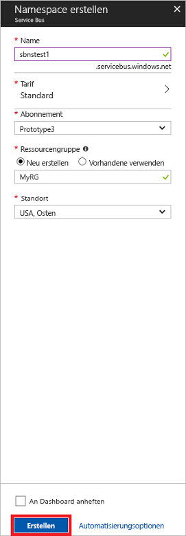

# <a name="quickstart-send-and-receive-messages-using-the-azure-portal-and-net"></a>Schnellstart: Senden und Empfangen von Nachrichten mit dem Azure-Portal und .NET

Microsoft Azure Service Bus ist ein Nachrichtenbroker für die Unternehmensintegration, der sicheres Messaging und absolute Zuverlässigkeit bietet. Ein typisches Service Bus-Szenario umfasst normalerweise die Entkopplung von zwei oder mehr Anwendungen, Diensten oder Prozessen und die Übertragung von Zustands- oder Datenänderungen. Szenarien dieser Art können die Planung mehrerer Batchaufträge in einer anderen Anwendung oder einem Dienst oder die Auslösung der Auftragsabwicklung umfassen. Beispielsweise kann es sein, dass ein Einzelhandelsunternehmen seine Point-of-Sale-Daten an ein Backoffice oder regionales Verteilungszentrum sendet, um den Bestand auffüllen bzw. aktualisieren zu lassen. Bei diesem Szenario sendet die Client-App Nachrichten an eine Service Bus-Warteschlange und empfängt Nachrichten von dieser Warteschlange.  



In dieser Schnellstartanleitung wird beschrieben, wie Sie Nachrichten an eine Service Bus-Warteschlange senden und von ihr empfangen. Sie verwenden das [Azure-Portal][Azure portal], um einen Messaging-Namespace und eine Warteschlange innerhalb dieses Namespace zu erstellen und die Anmeldeinformationen dieses Namespace für die Autorisierung zu beschaffen. Anschließend wird gezeigt, wie Sie für diese Warteschlange das Senden und Empfangen von Nachrichten über die [.NET-Standardbibliothek](https://www.nuget.org/packages/Microsoft.Azure.ServiceBus) durchführen.

Wenn Sie kein Azure-Abonnement besitzen, können Sie ein [kostenloses Konto][] erstellen, bevor Sie beginnen.

## <a name="prerequisites"></a>Voraussetzungen

Damit Sie dieses Tutorial ausführen können, müssen folgende Komponenten installiert sein:

- [Visual Studio 2017 Update 3 (Version 15.3, 26730.01)](http://www.visualstudio.com/vs) oder höher
- [NET Core SDK](https://www.microsoft.com/net/download/windows) ab Version 2.0

## <a name="log-on-to-the-azure-portal"></a>Anmelden am Azure-Portal

Beginnen Sie im [Azure-Portal][Azure portal], und melden Sie sich mit Ihrem Azure-Abonnement an. Der erste Schritt ist die Erstellung eines Service Bus-Namespace vom Typ **Messaging**.

## <a name="create-a-service-bus-namespace"></a>Erstellen eines Service Bus-Namespace

Ein Service Bus-Messaging-Namespace stellt einen eindeutigen Bereichscontainer bereit, auf den über seinen [Vollqualifizierter Domänenname][] verwiesen wird. In diesem Container erstellen Sie jeweils mindestens eine Warteschlange, ein Thema und ein Abonnement. Im folgenden Beispiel wird ein Service Bus-Messaging-Namespace in einer neuen oder vorhandenen [Ressourcengruppe](/azure/azure-resource-manager/resource-group-portal) erstellt:

1. Klicken Sie im linken Navigationsbereich des Portals auf **+ Ressource erstellen**, und klicken Sie anschließend auf **Enterprise Integration** > **Service Bus**.
2. Geben Sie im Dialogfeld **Namespace erstellen** einen Namen für den Namespace ein. Das System überprüft sofort, ob dieser Name verfügbar ist.
3. Wählen Sie den Tarif („Standard“ oder „Premium“) aus, nachdem Sie sichergestellt haben, dass der Name verfügbar ist.
4. Wählen Sie im Feld **Abonnement** ein Azure-Abonnement aus, in dem der Namespace erstellt werden soll.
5. Wählen Sie im Feld **Ressourcengruppe** eine vorhandene Ressourcengruppe für den Namespace aus, oder erstellen Sie eine neue Ressourcengruppe.      
6. Wählen Sie im Feld **Standort** das Land oder die Region aus, in dem bzw. in der Ihr Namespace gehostet werden soll.
7. Klicken Sie auf **Create**. Ihr Dienstnamespace wird nun erstellt und aktiviert. Ggf. müssen Sie einige Minuten warten, bis die Ressourcen für Ihr Konto durch das System bereitgestellt werden.



### <a name="obtain-the-management-credentials"></a>Abrufen der Verwaltungsanmeldeinformationen

Beim Erstellen eines neuen Namespace wird automatisch eine SAS-Regel (Shared Access Signature) mit einem zugeordneten Paar aus primären und sekundären Schlüsseln generiert, mit denen Sie jeweils die volle Kontrolle über sämtliche Aspekte des Namespace haben. Führen Sie diese Schritte aus, um die erste Regel zu kopieren: 

1.  Klicken Sie auf **Alle Ressourcen** und dann auf den neu erstellten Namespacenamen.
2. Klicken Sie im Namespacefenster auf **Richtlinien für gemeinsamen Zugriff**.
3. Klicken Sie im Bildschirm **Richtlinien für gemeinsamen Zugriff** auf **RootManageSharedAccessKey**.
4. Klicken Sie im Fenster **Richtlinie: RootManageSharedAccessKey** neben **Primäre Verbindungszeichenfolge** auf die Schaltfläche **Kopieren**, um die Verbindungszeichenfolge zur späteren Verwendung in die Zwischenablage zu kopieren. Fügen Sie diesen Wert in den Editor oder an einem anderen temporären Speicherort ein. 

    ![connection-string][connection-string]
5. Wiederholen Sie den vorherigen Schritt, um den Wert von **Primärschlüssel** zu kopieren und zur späteren Verwendung an einem temporären Speicherort einzufügen.

## <a name="create-a-queue"></a>Erstellen einer Warteschlange

Geben Sie zum Erstellen einer Service Bus-Warteschlange den Namespace an, unter dem die Erstellung erfolgen soll. Im folgenden Beispiel wird veranschaulicht, wie Sie im Portal eine Warteschlange erstellen:

1. Klicken Sie im linken Navigationsbereich des Portals auf **Service Bus**. (Wird **Service Bus** nicht angezeigt, klicken Sie auf **More services** (Weitere Dienste)).
2. Klicken Sie auf den Namespace, in dem die Warteschlange erstellt werden soll.
3. Klicken Sie im Namespacefenster auf **Warteschlangen** und dann im Fenster **Warteschlangen** auf **+ Warteschlange**.
4. Geben Sie den **Warteschlangennamen** ein, und lassen Sie die anderen Werte unverändert.
5. Klicken Sie unten im Fenster auf **Erstellen**.
6. Notieren Sie sich den Warteschlangennamen.

## <a name="send-and-receive-messages"></a>Senden und Empfangen von Nachrichten

Nachdem der Namespace und die Warteschlange bereitgestellt wurden und Sie über die erforderlichen Anmeldeinformationen verfügen, sind Sie zum Senden und Empfangen von Nachrichten bereit. Sie können sich den Code in [diesem GitHub-Ordner mit Beispielen](https://github.com/Azure/azure-service-bus/tree/master/samples/Java/quickstarts-and-tutorials/quickstart-jms) ansehen.

Gehen Sie wie folgt vor, um den Code auszuführen:

1. Klonen Sie das [Service Bus-GitHub-Repository](https://github.com/Azure/azure-service-bus/), indem Sie den folgenden Befehl ausführen:

   ```shell
   git clone https://github.com/Azure/azure-service-bus.git
   ```

3. Navigieren Sie zum Beispielordner `azure-service-bus\samples\DotNet\GettingStarted\BasicSendReceiveQuickStart\BasicSendReceiveQuickStart`.

4. Kopieren Sie die Verbindungszeichenfolge und den Warteschlangennamen, den Sie im Abschnitt [Abrufen der Verwaltungsanmeldeinformationen](#obtain-the-management-credentials) beschafft haben.

5.  Geben Sie an einer Eingabeaufforderung den folgenden Befehl ein:

   ```shell
   dotnet build
   ```

6.  Navigieren Sie zum Ordner `bin\Debug\netcoreapp2.0`.

7.  Geben Sie den folgenden Befehl ein, um das Programm auszuführen. Ersetzen Sie `myConnectionString` durch den zuvor abgerufenen Wert und `myQueueName` durch den Namen der von Ihnen erstellten Warteschlange:

   ```shell
   dotnet BasicSendReceiveQuickStart.dll -ConnectionString "myConnectionString" -QueueName "myQueueName"
   ``` 

8. Verfolgen Sie, wie zehn Nachrichten an die Warteschlange gesendet und anschließend von der Warteschlange empfangen werden:

   

## <a name="clean-up-resources"></a>Bereinigen von Ressourcen

Sie können das Portal verwenden, um die Ressourcengruppe, den Namespace und die Warteschlange zu entfernen.

## <a name="understand-the-sample-code"></a>Grundlagen des Beispielcodes

Dieser Abschnitt enthält weitere Details zur Funktionsweise des Beispielcodes. 

### <a name="get-connection-string-and-queue"></a>Abrufen der Verbindungszeichenfolge und der Warteschlange

Die Verbindungszeichenfolge und der Warteschlangenname werden als Befehlszeilenargumente an die `Main()`-Methode übergeben. `Main()` deklariert zwei Zeichenfolgenvariablen für diese Werte:

```csharp
static void Main(string[] args)
{
    string ServiceBusConnectionString = "";
    string QueueName = "";

    for (int i = 0; i < args.Length; i++)
    {
        var p = new Program();
        if (args[i] == "-ConnectionString")
        {
            Console.WriteLine($"ConnectionString: {args[i+1]}");
            ServiceBusConnectionString = args[i + 1]; 
        }
        else if(args[i] == "-QueueName")
        {
            Console.WriteLine($"QueueName: {args[i+1]}");
            QueueName = args[i + 1];
        }                
    }

    if (ServiceBusConnectionString != "" && QueueName != "")
        MainAsync(ServiceBusConnectionString, QueueName).GetAwaiter().GetResult();
    else
    {
        Console.WriteLine("Specify -Connectionstring and -QueueName to execute the example.");
        Console.ReadKey();
    }                            
}
```
 
Die `Main()`-Methode startet dann die asynchrone Nachrichtenschleife `MainAsync()`.

### <a name="message-loop"></a>Nachrichtenschleife

Die Methode „MainAsync()“ erstellt einen Warteschlangenclient mit den Befehlszeilenargumenten, ruft einen Nachrichtenhandler für den Empfang mit dem Namen `RegisterOnMessageHandlerAndReceiveMessages()` auf und sendet die Nachrichten:

```csharp
static async Task MainAsync(string ServiceBusConnectionString, string QueueName)
{
    const int numberOfMessages = 10;
    queueClient = new QueueClient(ServiceBusConnectionString, QueueName);

    Console.WriteLine("======================================================");
    Console.WriteLine("Press any key to exit after receiving all the messages.");
    Console.WriteLine("======================================================");

    // Register QueueClient's MessageHandler and receive messages in a loop
    RegisterOnMessageHandlerAndReceiveMessages();

    // Send Messages
    await SendMessagesAsync(numberOfMessages);

    Console.ReadKey();

    await queueClient.CloseAsync();
}
```

Die `RegisterOnMessageHandlerAndReceiveMessages()`-Methode legt lediglich einige Nachrichtenhandleroptionen fest und ruft dann die `RegisterMessageHandler()`-Methode des Warteschlangenclients auf, über die der Empfangsvorgang gestartet wird:

```csharp
static void RegisterOnMessageHandlerAndReceiveMessages()
{
    // Configure the MessageHandler Options in terms of exception handling, number of concurrent messages to deliver etc.
    var messageHandlerOptions = new MessageHandlerOptions(ExceptionReceivedHandler)
    {
        // Maximum number of Concurrent calls to the callback `ProcessMessagesAsync`, set to 1 for simplicity.
        // Set it according to how many messages the application wants to process in parallel.
        MaxConcurrentCalls = 1,

        // Indicates whether MessagePump should automatically complete the messages after returning from User Callback.
        // False below indicates the Complete will be handled by the User Callback as in `ProcessMessagesAsync` below.
        AutoComplete = false
    };

    // Register the function that will process messages
    queueClient.RegisterMessageHandler(ProcessMessagesAsync, messageHandlerOptions);
} 
```

### <a name="send-messages"></a>Senden von Nachrichten

Die Vorgänge zum Erstellen und Senden von Nachrichten erfolgen in der `SendMessagesAsync()`-Methode:

```csharp
static async Task SendMessagesAsync(int numberOfMessagesToSend)
{
    try
    {
        for (var i = 0; i < numberOfMessagesToSend; i++)
        {
            // Create a new message to send to the queue
            string messageBody = $"Message {i}";
            var message = new Message(Encoding.UTF8.GetBytes(messageBody));

            // Write the body of the message to the console
            Console.WriteLine($"Sending message: {messageBody}");

            // Send the message to the queue
            await queueClient.SendAsync(message);
        }
    }
    catch (Exception exception)
    {
        Console.WriteLine($"{DateTime.Now} :: Exception: {exception.Message}");
    }
}
```

### <a name="process-messages"></a>Verarbeiten von Nachrichten

Die `ProcessMessagesAsync()`-Methode führt die Bestätigung, Verarbeitung und den Abschluss des Empfangsvorgangs für die Nachrichten durch:

```csharp
static async Task ProcessMessagesAsync(Message message, CancellationToken token)
{
    // Process the message
    Console.WriteLine($"Received message: SequenceNumber:{message.SystemProperties.SequenceNumber} Body:{Encoding.UTF8.GetString(message.Body)}");

    // Complete the message so that it is not received again.
    await queueClient.CompleteAsync(message.SystemProperties.LockToken);
}
```

## <a name="next-steps"></a>Nächste Schritte

In diesem Artikel haben Sie einen Service Bus-Namespace und weitere erforderliche Ressourcen zum Senden und Empfangen von Nachrichten für eine Warteschlange erstellt. Weitere Informationen zum Schreiben von Code für das Senden und Empfangen von Nachrichten erhalten Sie im folgenden Tutorial zu Service Bus:

> [!div class="nextstepaction"]
> [Aktualisieren des Bestands über das Azure-Portal](./service-bus-tutorial-topics-subscriptions-portal.md)


[kostenloses Konto]: https://azure.microsoft.com/free/?ref=microsoft.com&utm_source=microsoft.com&utm_medium=docs&utm_campaign=visualstudio
[Vollqualifizierter Domänenname]: https://wikipedia.org/wiki/Fully_qualified_domain_name
[Azure portal]: https://portal.azure.com/

[connection-string]: ./media/service-bus-quickstart-portal/connection-string.png
[service-bus-flow]: ./media/service-bus-quickstart-portal/service-bus-flow.png
