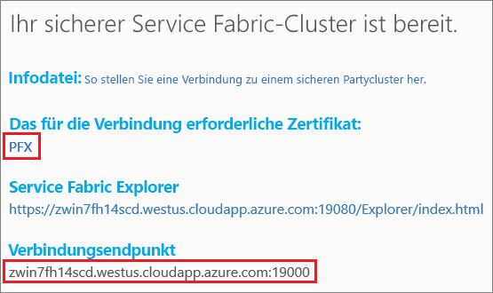

# <a name="quickstart-deploy-windows-containers-to-service-fabric"></a>Schnellstart: Bereitstellen von Windows-Containern in Service Fabric

Azure Service Fabric ist eine Plattform für verteilte Systeme zum Bereitstellen und Verwalten von skalierbaren und zuverlässigen Microservices und Containern.

Zum Ausführen einer vorhandenen Anwendung eines Windows-Containers in einem Service Fabric-Cluster sind keine Änderungen an Ihrer Anwendung erforderlich. In dieser Schnellstartanleitung erfahren Sie, wie Sie ein vorgefertigtes Docker-Containerimage in einer Service Fabric-Anwendung bereitstellen. Nach Abschluss des Vorgangs verfügen Sie über einen aktiven Container für Windows Server 2016 Nano Server und IIS. Diese Schnellstartanleitung enthält Informationen zum Bereitstellen eines Windows-Containers. Informationen zum Bereitstellen eines Linux-Containers finden Sie in [dieser Schnellstartanleitung](service-fabric-quickstart-containers-linux.md).

![IIS-Standardwebseite][iis-default]

In dieser Schnellstartanleitung wird Folgendes vermittelt:

* Packen eines Docker-Imagecontainers
* Konfigurieren der Kommunikation
* Erstellen und Packen der Service Fabric-Anwendung
* Bereitstellen der Containeranwendung in Azure

## <a name="prerequisites"></a>Voraussetzungen

* Ein Azure-Abonnement. (Sie können ein [kostenloses Konto](https://azure.microsoft.com/free/?WT.mc_id=A261C142F) erstellen.)
* Ein Entwicklungscomputer, auf dem Folgendes ausgeführt wird:
  * Visual Studio 2015 oder Visual Studio 2017
  * [Service Fabric-SDK und -Tools](service-fabric-get-started.md)

## <a name="package-a-docker-image-container-with-visual-studio"></a>Packen eines Docker-Imagecontainers mit Visual Studio

Das Service Fabric-SDK und die Tools stellen eine Dienstvorlage bereit, um Sie beim Bereitstellen eines Containers für einen Service Fabric-Cluster zu unterstützen.

Starten Sie Visual Studio als Administrator.  Wählen Sie **Datei** > **Neu** > **Projekt**.

Wählen Sie **Service Fabric-Anwendung**, benennen Sie sie „MyFirstContainer“, und klicken Sie auf **OK**.

Wählen Sie unter **Gehostete Container und Anwendungen** die Vorlage **Container**.

Geben Sie unter **Imagename** die Zeichenfolge „microsoft/iis:nanoserver“ ([Basisimage für Windows Server Nano Server und IIS](https://hub.docker.com/r/microsoft/iis/)) ein.

Konfigurieren Sie die Zuordnung von Containerport zu Hostport, sodass an Port 80 eingehende Anforderungen für den Dienst dem Port 80 des Containers zugeordnet werden.  Legen Sie **Containerport** auf „80“ und **hostPort** auf „80“ fest.  

Nennen Sie den Dienst „MyContainerService“, und klicken Sie auf **OK**.

![Dialogfeld „Neuer Dienst“][new-service]

## <a name="specify-the-os-build-for-your-container-image"></a>Angeben des Betriebssystembuilds für Ihr Containerimage
Mit einer bestimmten Windows Server-Version erstellte Container können unter Umständen nicht auf einem Host mit einer anderen Version von Windows Server ausgeführt werden. Beispielsweise können Container, die mit Windows Server 1709 erstellt wurden, nicht auf Hosts mit Windows Server 2016 ausgeführt werden. Weitere Informationen finden Sie unter [Erstellen Ihrer ersten Service Fabric-Containeranwendung unter Windows](service-fabric-get-started-containers.md#windows-server-container-os-and-host-os-compatibility). 

Bei Version 6.1 oder höheren Version der Service Fabric-Runtime können Sie mehrere Betriebssystemimages pro Container angeben und jedes Image mit der Buildversion des Betriebssystems markieren, unter dem es bereitgestellt werden soll. Dadurch wird sichergestellt, dass Ihre Anwendung auf Hosts mit verschiedenen Versionen des Windows-Betriebssystems ausgeführt wird. Weitere Informationen finden Sie unter [Angeben spezifischer Containerimages für den Build des Betriebssystems](service-fabric-get-started-containers.md#specify-os-build-specific-container-images). 

Microsoft veröffentlicht verschiedene Images für IIS-Versionen, die auf unterschiedlichen Versionen von Windows Server basieren. Fügen Sie der Datei *ApplicationManifest.xml* die folgenden Zeilen hinzu, um sicherzustellen, dass Service Fabric einen mit der Version von Windows Server kompatiblen Container bereitstellt, die auf den Clusterknoten ausgeführt wird, auf denen Ihre Anwendung bereitgestellt wird. Die Buildversion für Windows Server 2016 lautet 14393, und die Buildversion für Windows Server-Version 1709 lautet 16299. 

```xml
    <ContainerHostPolicies CodePackageRef="Code"> 
      <ImageOverrides> 
        ...
          <Image Name="microsoft/iis:nanoserverDefault" /> 
          <Image Name= "microsoft/iis:nanoserver" Os="14393" /> 
          <Image Name="microsoft/iis:windowsservercore-1709" Os="16299" /> 
      </ImageOverrides> 
    </ContainerHostPolicies> 
```

Das Dienstmanifest gibt weiterhin nur ein Image für den Nanoserver `microsoft/iis:nanoserver` an. 

## <a name="create-a-cluster"></a>Erstellen eines Clusters

Sie können einem Partycluster beitreten, um die Anwendung in einem Cluster in Azure bereitzustellen. Partycluster sind kostenlose, zeitlich begrenzte Service Fabric-Cluster, die in Azure gehostet und vom Service Fabric-Team ausgeführt werden, in denen jeder Benutzer Anwendungen bereitstellen und mehr über die Plattform erfahren kann.  Der Cluster verwendet ein einzelnes selbstsigniertes Zertifikat für Knoten-zu-Knoten- und Client-zu-Knoten-Sicherheit. Partycluster unterstützen Container. Wenn Sie einen eigenen Cluster einrichten und verwenden möchten, muss der Cluster unter einer SKU ausgeführt werden, die Container unterstützt (beispielsweise Windows Server 2016 Datacenter mit Containern).

Melden Sie sich an, und [treten Sie einem Windows-Cluster bei](http://aka.ms/tryservicefabric). Klicken Sie auf den Link **PFX**, um das PFX-Zertifikat auf Ihren Computer herunterzuladen. Klicken Sie auf den Link **How to connect to a secure Party cluster?** (Herstellen einer Verbindung mit einem sicheren Partycluster), und kopieren Sie das Zertifikatkennwort. Das Zertifikat, das Zertifikatkennwort und der Wert für **Verbindungsendpunkt** werden in den folgenden Schritten verwendet.



> [!Note]
> Pro Stunde ist eine begrenzte Anzahl von Partyclustern verfügbar. Sollte beim Registrieren für einen Partycluster ein Fehler auftreten, können Sie eine Weile warten und es dann erneut versuchen. Alternativ können Sie die Schritte aus dem [Tutorial zum Bereitstellen einer .NET-App](https://docs.microsoft.com/azure/service-fabric/service-fabric-tutorial-deploy-app-to-party-cluster#deploy-the-sample-application) ausführen, um in Ihrem Azure-Abonnement einen Service Fabric-Cluster zu erstellen und die Anwendung darin bereitzustellen. Der über Visual Studio erstellte Cluster unterstützt Container. Nachdem Sie die Anwendung in Ihrem Cluster bereitgestellt und überprüft haben, können Sie direkt mit [Vollständige Beispiele für Service Fabric-Anwendungs- und Dienstmanifeste](#complete-example-service-fabric-application-and-service-manifests) in dieser Schnellstartanleitung fortfahren.
>

Installieren Sie das PFX-Zertifikat auf einem Windows-Computer im Zertifikatspeicher *CurrentUser\My*.

```powershell
PS C:\mycertificates> Import-PfxCertificate -FilePath .\party-cluster-873689604-client-cert.pfx -CertStoreLocation Cert:\CurrentUser\My -Password (ConvertTo-SecureString 873689604 -AsPlainText -Force)


  PSParentPath: Microsoft.PowerShell.Security\Certificate::CurrentUser\My

Thumbprint                                Subject
----------                                -------
3B138D84C077C292579BA35E4410634E164075CD  CN=zwin7fh14scd.westus.cloudapp.azure.com
```

Notieren Sie sich den Fingerabdruck für den nächsten Schritt.

## <a name="deploy-the-application-to-azure-using-visual-studio"></a>Bereitstellen der Anwendung für Azure mithilfe von Visual Studio

Nachdem die Anwendung nun bereit ist, können Sie sie direkt aus Visual Studio in einem Cluster bereitstellen.

Klicken Sie im Projektmappen-Explorer mit der rechten Maustaste auf **MyFirstContainer**, und wählen Sie **Veröffentlichen** aus. Das Dialogfeld „Veröffentlichen“ wird angezeigt.

Kopieren Sie den **Verbindungsendpunkt** von der Seite des Partyclusters in das Feld **Verbindungsendpunkt**. Beispiel: `zwin7fh14scd.westus.cloudapp.azure.com:19000`. Klicken Sie auf **Erweiterte Verbindungsparameter**, und überprüfen Sie die Informationen zu den Verbindungsparametern.  Die Werte *FindValue* und *ServerCertThumbprint* müssen dem Fingerabdruck des im vorherigen Schritt installierten Zertifikats entsprechen.


Klicken Sie auf **Veröffentlichen**.

Jede Anwendung im Cluster muss einen eindeutigen Namen besitzen.  Bei Partyclustern handelt es sich jedoch um eine öffentliche, freigegebene Umgebung, und unter Umständen tritt in einer vorhandenen Anwendung ein Konflikt auf.  Kommt es zu einem Namenskonflikt, benennen Sie das Visual Studio-Projekt um, und stellen Sie es erneut bereit.

Navigieren Sie in einem Browser zu dem **Verbindungsendpunkt**, der auf der Partyclusterseite angegeben ist. Sie können der URL optional den Schemabezeichner (`http://`) voranstellen und den Port (`:80`) an die URL anfügen. Beispiel: http://zwin7fh14scd.westus.cloudapp.azure.com:80. Die IIS-Standardwebseite sollte angezeigt werden: ![IIS-Standardwebseite][iis-default]

## <a name="next-steps"></a>Nächste Schritte

In diesem Schnellstart haben Sie Folgendes gelernt:

* Packen eines Docker-Imagecontainers
* Konfigurieren der Kommunikation
* Erstellen und Packen der Service Fabric-Anwendung
* Bereitstellen der Containeranwendung in Azure

Weitere Informationen zur Verwendung von Windows-Containern in Service Fabric finden Sie im Tutorial für Windows-Container-Apps.

> [!div class="nextstepaction"]
> [Erstellen einer Windows-Container-App](./service-fabric-host-app-in-a-container.md)

[iis-default]: ./media/service-fabric-quickstart-containers/iis-default.png
[publish-dialog]: ./media/service-fabric-quickstart-containers/publish-dialog.png
[new-service]: ./media/service-fabric-quickstart-containers/NewService.png
