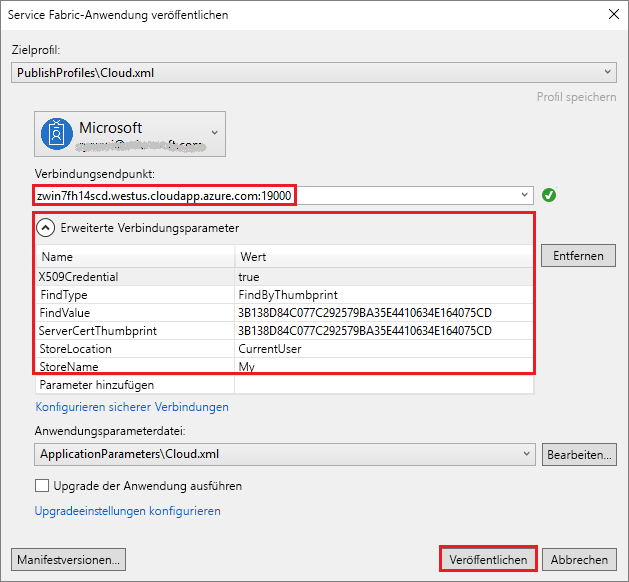

# <a name="quickstart-deploy-windows-containers-to-service-fabric"></a>Schnellstart: Bereitstellen von Windows-Containern in Service Fabric

Azure Service Fabric ist eine Plattform für verteilte Systeme zum Bereitstellen und Verwalten von skalierbaren und zuverlässigen Microservices und Containern.

Zum Ausführen einer vorhandenen Anwendung eines Windows-Containers in einem Service Fabric-Cluster sind keine Änderungen an Ihrer Anwendung erforderlich. In dieser Schnellstartanleitung erfahren Sie, wie Sie ein vorgefertigtes Docker-Containerimage in einer Service Fabric-Anwendung bereitstellen. Nach Abschluss des Vorgangs verfügen Sie über einen aktiven Container für Windows Server Core 2016 Server und IIS. Diese Schnellstartanleitung enthält Informationen zum Bereitstellen eines Windows-Containers. Informationen zum Bereitstellen eines Linux-Containers finden Sie in [dieser Schnellstartanleitung](service-fabric-quickstart-containers-linux.md).

![IIS-Standardwebseite][iis-default]

In dieser Schnellstartanleitung wird Folgendes vermittelt:

* Packen eines Docker-Imagecontainers
* Konfigurieren der Kommunikation
* Erstellen und Packen der Service Fabric-Anwendung
* Bereitstellen der Containeranwendung in Azure


[!INCLUDE [updated-for-az](../../includes/updated-for-az.md)]

## <a name="prerequisites"></a>Voraussetzungen

* Ein Azure-Abonnement. (Sie können ein [kostenloses Konto](https://azure.microsoft.com/free/?WT.mc_id=A261C142F) erstellen.)
* Ein Entwicklungscomputer, auf dem Folgendes ausgeführt wird:
  * Visual Studio 2015 oder Visual Studio 2017
  * [Service Fabric-SDK und -Tools](service-fabric-get-started.md)

## <a name="package-a-docker-image-container-with-visual-studio"></a>Packen eines Docker-Imagecontainers mit Visual Studio

Das Service Fabric-SDK und die Tools stellen eine Dienstvorlage bereit, um Sie beim Bereitstellen eines Containers für einen Service Fabric-Cluster zu unterstützen.

Starten Sie Visual Studio als Administrator.  Wählen Sie **Datei** > **Neu** > **Projekt**.

Wählen Sie **Service Fabric-Anwendung**, benennen Sie sie „MyFirstContainer“, und klicken Sie auf **OK**.

Wählen Sie unter **Gehostete Container und Anwendungen** die Vorlage **Container**.

Geben Sie unter **Imagename** die Zeichenfolge „mcr.microsoft.com/windows/servercore/iis:windowservercore-ltsc2016“ ([Basisimage für Windows Server Core und IIS](https://hub.docker.com/r/microsoft-windows-servercore-iis)) ein.

Konfigurieren Sie die Zuordnung von Containerport zu Hostport, sodass an Port 80 eingehende Anforderungen für den Dienst dem Port 80 des Containers zugeordnet werden.  Legen Sie **Containerport** auf „80“ und **hostPort** auf „80“ fest.  

Nennen Sie den Dienst „MyContainerService“, und klicken Sie auf **OK**.

![Dialogfeld „Neuer Dienst“][new-service]

## <a name="specify-the-os-build-for-your-container-image"></a>Angeben des Betriebssystembuilds für Ihr Containerimage

Mit einer bestimmten Windows Server-Version erstellte Container können unter Umständen nicht auf einem Host mit einer anderen Version von Windows Server ausgeführt werden. Beispielsweise können Container, die mit Windows Server 1709 erstellt wurden, nicht auf Hosts mit Windows Server 2016 ausgeführt werden. Weitere Informationen finden Sie unter [Erstellen Ihrer ersten Service Fabric-Containeranwendung unter Windows](service-fabric-get-started-containers.md#windows-server-container-os-and-host-os-compatibility). 

Bei Version 6.1 oder höheren Version der Service Fabric-Runtime können Sie mehrere Betriebssystemimages pro Container angeben und jedes Image mit der Buildversion des Betriebssystems markieren, unter dem es bereitgestellt werden soll. Dadurch wird sichergestellt, dass Ihre Anwendung auf Hosts mit verschiedenen Versionen des Windows-Betriebssystems ausgeführt wird. Weitere Informationen finden Sie unter [Angeben spezifischer Containerimages für den Build des Betriebssystems](service-fabric-get-started-containers.md#specify-os-build-specific-container-images). 

Microsoft veröffentlicht verschiedene Images für IIS-Versionen, die auf unterschiedlichen Versionen von Windows Server basieren. Fügen Sie der Datei *ApplicationManifest.xml* die folgenden Zeilen hinzu, um sicherzustellen, dass Service Fabric einen mit der Version von Windows Server kompatiblen Container bereitstellt, die auf den Clusterknoten ausgeführt wird, auf denen Ihre Anwendung bereitgestellt wird. Die Buildversion für Windows Server 2016 lautet 14393, und die Buildversion für Windows Server-Version 1709 lautet 16299.

```xml
    <ContainerHostPolicies CodePackageRef="Code"> 
      <ImageOverrides> 
        ...
          <Image Name="mcr.microsoft.com/windows/servercore/iis:windowservercore-1803" /> 
          <Image Name= "mcr.microsoft.com/windows/servercore/iis:windowservercore-ltsc2016" Os="14393" /> 
          <Image Name="mcr.microsoft.com/windows/servercore/iis:windowservercore-1709" Os="16299" /> 
      </ImageOverrides> 
    </ContainerHostPolicies> 
```

Das Dienstmanifest gibt weiterhin nur ein Image für den Nanoserver `mcr.microsoft.com/windows/servercore/iis:windowservercore-ltsc2016` an.

Ändern Sie außerdem in der Datei *ApplicationManifest.xml* den Wert von **PasswordEncrypted** in **false**. Konto und Kennwort sind für das öffentliche Containerimage im Docker-Hub leer. Da die Verschlüsselung eines leeren Kennworts einen Buildfehler zur Folge hätte, deaktivieren wir die Verschlüsselung.

```xml
<RepositoryCredentials AccountName="" Password="" PasswordEncrypted="false" />
```

## <a name="create-a-cluster"></a>Erstellen eines Clusters

Das folgende Beispielskript erstellt einen Service Fabric-Cluster mit fünf Knoten, der mit einem X.509-Zertifikat geschützt wird. Der Befehl erstellt ein selbstsigniertes Zertifikat und lädt es in einen neuen Key Vault hoch. Das Zertifikat wird außerdem in ein lokales Verzeichnis kopiert. Weitere Informationen zum Erstellen eines Clusters mithilfe dieses Skripts finden Sie unter [Erstellen von Service Fabric-Clustern](scripts/service-fabric-powershell-create-secure-cluster-cert.md).

Installieren Sie bei Bedarf Azure PowerShell anhand der Anweisungen im [Azure PowerShell-Handbuch](/powershell/azure/overview).

Führen Sie vor der Ausführung des folgenden Skripts zunächst `Connect-AzAccount` in PowerShell aus, um eine Verbindung mit Azure zu erstellen.

Kopieren Sie das folgende Skript in die Zwischenablage, und öffnen Sie **Windows PowerShell ISE**.  Fügen Sie den Inhalt in das leere Fenster „Untitled1.ps1“ ein. Geben Sie anschließend Werte für die Variablen im Skript an: `subscriptionId`, `certpwd`, `certfolder`, `adminuser`, `adminpwd` usw.  Das Verzeichnis, das Sie für `certfolder` angeben, muss vorhanden sein, wenn Sie das Skript ausführen.

[!code-powershell[main](../../powershell_scripts/service-fabric/create-secure-cluster/create-secure-cluster.ps1 "Create a Service Fabric cluster")]

Nachdem Sie Ihre Werte für die Variablen angegeben haben, drücken Sie **F5**, um das Skript auszuführen.

Warten Sie, bis das Skript ausgeführt und der Cluster erstellt wurde, und suchen Sie dann in der Ausgabe nach `ClusterEndpoint`. Beispiel: 

```powershell
...
ClusterEndpoint : https://southcentralus.servicefabric.azure.com/runtime/clusters/b76e757d-0b97-4037-a184-9046a7c818c0
```

### <a name="install-the-certificate-for-the-cluster"></a>Installieren des Zertifikats für den Cluster

Als Nächstes installieren wir das PFX-Zertifikat im Zertifikatspeicher *CurrentUser\My*. Die PFX-Datei befindet sich in dem Verzeichnis, das Sie mithilfe der Umgebungsvariablen `certfolder` im obigen PowerShell-Skript angegeben haben.

Navigieren Sie zu diesem Verzeichnis, und führen Sie den folgenden PowerShell-Befehl aus. Fügen Sie dabei den Namen der PFX-Datei aus dem Verzeichnis `certfolder` sowie das Kennwort ein, das Sie in der Variablen `certpwd` angegeben haben. In diesem Beispiel ist das aktuelle Verzeichnis auf das Verzeichnis festgelegt, das durch die Variable `certfolder` im PowerShell-Skript angegeben ist. Von dort aus wird der Befehl `Import-PfxCertificate` ausgeführt:

```powershell
PS C:\mycertificates> Import-PfxCertificate -FilePath .\mysfclustergroup20190130193456.pfx -CertStoreLocation Cert:\CurrentUser\My -Password (ConvertTo-SecureString Password#1234 -AsPlainText -Force)
```

Der Befehl gibt den Fingerabdruck zurück:

```powershell
  ...
  PSParentPath: Microsoft.PowerShell.Security\Certificate::CurrentUser\My

Thumbprint                                Subject
----------                                -------
0AC30A2FA770BEF566226CFCF75A6515D73FC686  CN=mysfcluster.SouthCentralUS.cloudapp.azure.com
```

Speichern Sie den Fingerabdruckwert für den nächsten Schritt.

## <a name="deploy-the-application-to-azure-using-visual-studio"></a>Bereitstellen der Anwendung für Azure mithilfe von Visual Studio

Nachdem die Anwendung nun bereit ist, können Sie sie direkt aus Visual Studio in einem Cluster bereitstellen.

Klicken Sie im Projektmappen-Explorer mit der rechten Maustaste auf **MyFirstContainer**, und wählen Sie **Veröffentlichen** aus. Das Dialogfeld „Veröffentlichen“ wird angezeigt.

Kopieren Sie den Inhalt, der nach Ausführung des Befehls `Import-PfxCertificate` im PowerShell-Fenster nach **CN=** angegeben war, und fügen Sie ihm den Port `19000` hinzu. Beispiel: `mysfcluster.SouthCentralUS.cloudapp.azure.com:19000`. Kopieren Sie ihn in das Feld **Verbindungsendpunkt**. Speichern Sie diesen Wert. Er wird in einem späteren Schritt benötigt.

Klicken Sie auf **Erweiterte Verbindungsparameter**, und überprüfen Sie die Informationen zu den Verbindungsparametern.  Die Werte *FindValue* und *ServerCertThumbprint* müssen dem Fingerabdruck des Zertifikats entsprechen, das Sie im vorherigen Schritt durch Ausführen von `Import-PfxCertificate` installiert haben.



Klicken Sie auf **Veröffentlichen**.

Jede Anwendung im Cluster muss einen eindeutigen Namen besitzen. Kommt es zu einem Namenskonflikt, benennen Sie das Visual Studio-Projekt um, und stellen Sie es erneut bereit.

Navigieren Sie in einem Browser zu der Adresse, die Sie im vorherigen Schritt im Feld **Verbindungsendpunkt** angegeben haben. Sie können der URL optional den Schemabezeichner (`http://`) voranstellen und den Port (`:80`) an die URL anfügen. Beispiel: http:\//mysfcluster.SouthCentralUS.cloudapp.azure.com:80.

 Die IIS-Standardwebseite sollte angezeigt werden: ![IIS-Standardwebseite][iis-default]

## <a name="clean-up"></a>Bereinigen

Während der Ausführung des Clusters fallen weiterhin Gebühren an. Daher empfiehlt es sich ggf,. den Cluster zu [löschen](service-fabric-cluster-delete.md).

## <a name="next-steps"></a>Nächste Schritte

In diesem Schnellstart haben Sie Folgendes gelernt:

* Packen eines Docker-Imagecontainers
* Konfigurieren der Kommunikation
* Erstellen und Packen der Service Fabric-Anwendung
* Bereitstellen der Containeranwendung in Azure

Weitere Informationen zur Verwendung von Windows-Containern in Service Fabric finden Sie im Tutorial für Windows-Container-Apps.

> [!div class="nextstepaction"]
> [Erstellen einer Windows-Container-App](./service-fabric-host-app-in-a-container.md)

[iis-default]: ./media/service-fabric-quickstart-containers/iis-default.png
[publish-dialog]: ./media/service-fabric-quickstart-containers/publish-dialog.png
[new-service]: ./media/service-fabric-quickstart-containers/NewService.png
