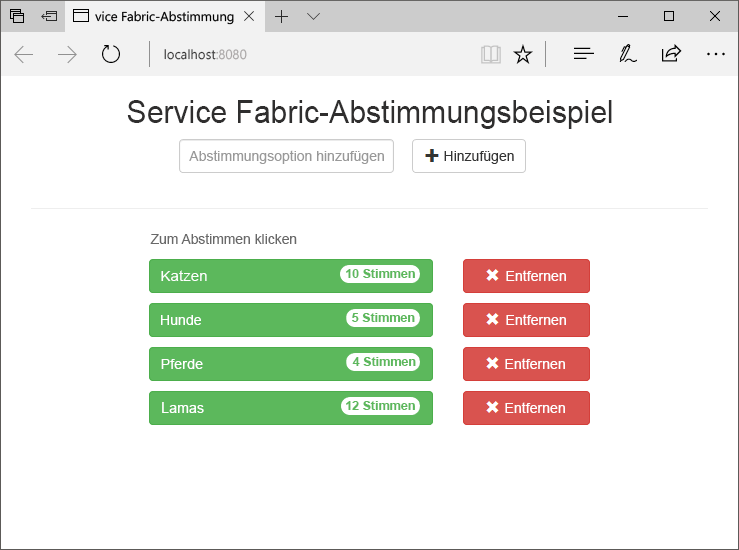
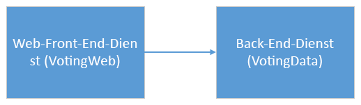
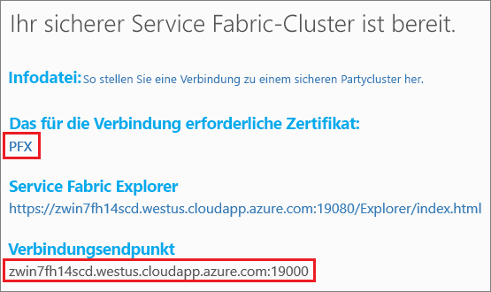
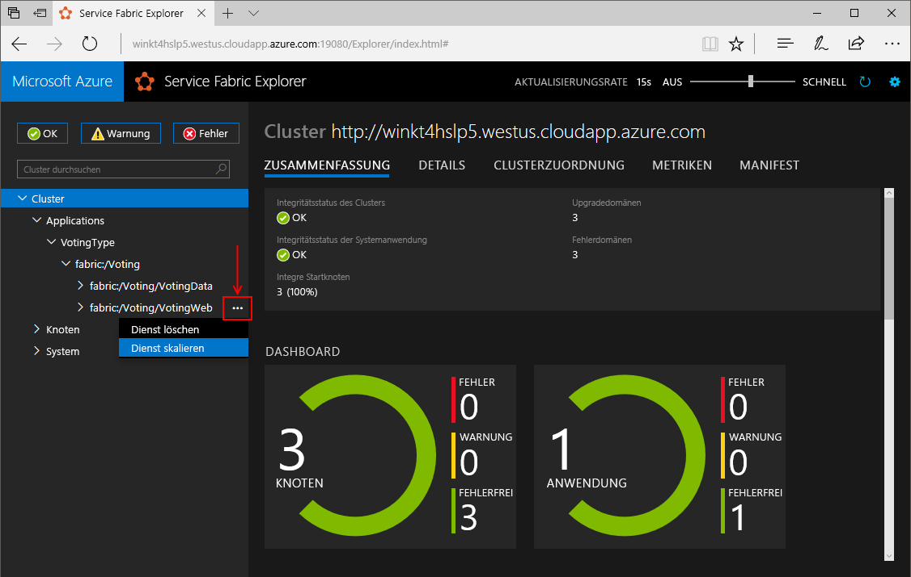
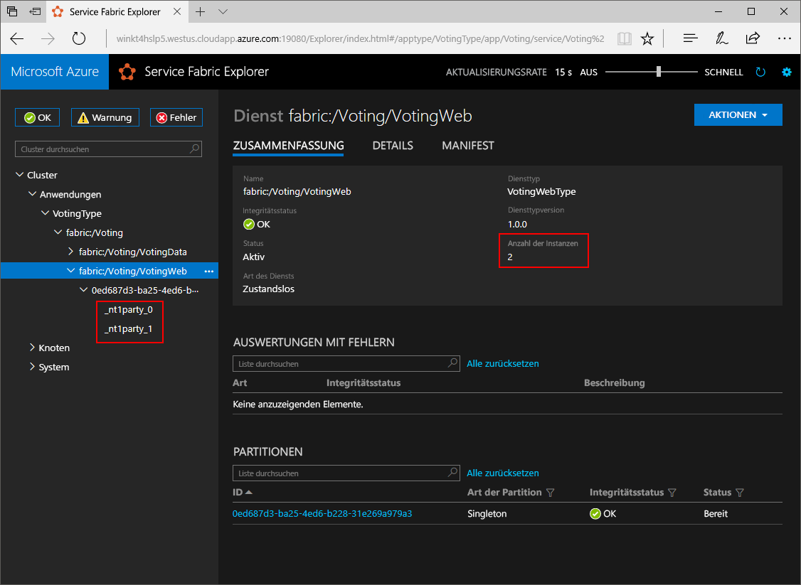
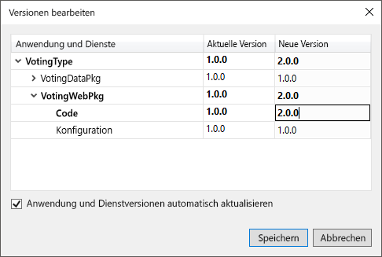
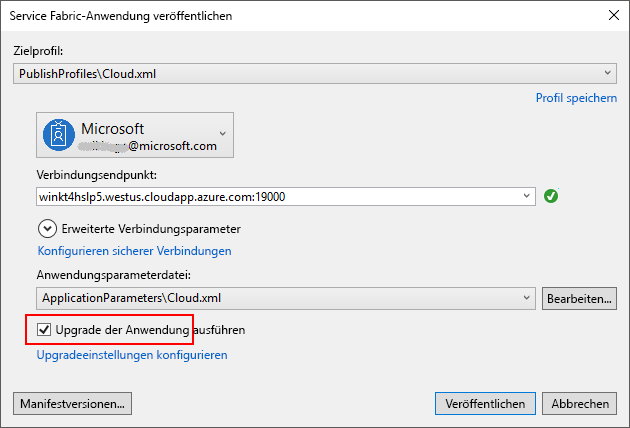
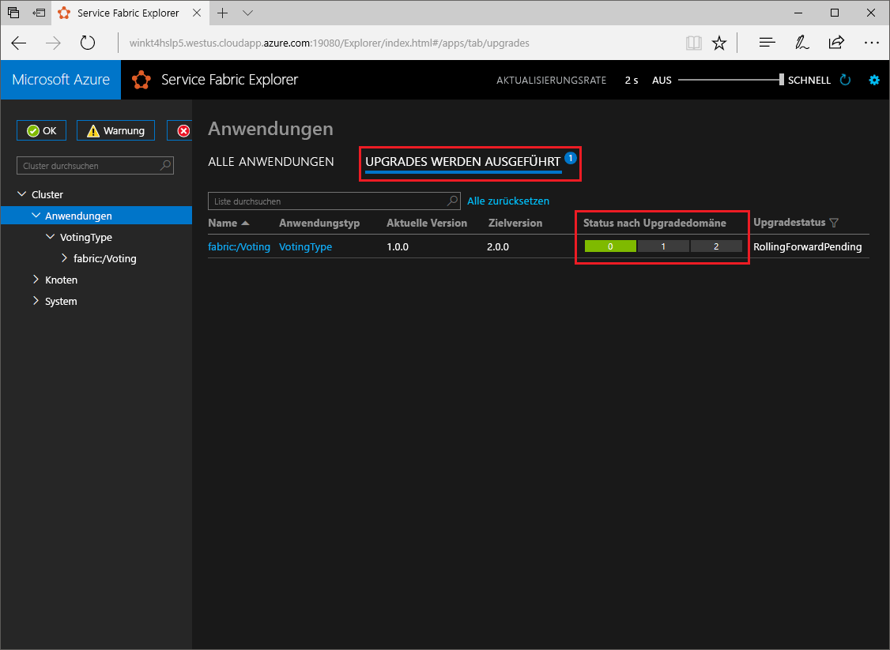

# <a name="quickstart-create-a-net-service-fabric-application-in-azure"></a>Schnellstart: Erstellen einer .NET Service Fabric-Anwendung in Azure
Azure Service Fabric ist eine Plattform für verteilte Systeme zum Bereitstellen und Verwalten von skalierbaren und zuverlässigen Microservices und Containern. 

In diesem Schnellstart wird gezeigt, wie Sie Ihre erste .NET-Anwendung für Service Fabric bereitstellen. Am Ende verfügen Sie über eine Abstimmungsanwendung mit einem ASP.NET Core-Web-Front-End, mit der Abstimmungsergebnisse im Cluster in einem zustandsbehafteten Back-End-Dienst gespeichert werden.



Mithilfe dieser Anwendung erfahren Sie Folgendes:
> [!div class="checklist"]
> * Erstellen einer Anwendung mit .NET und Service Fabric
> * Verwenden von ASP.NET Core als Web-Front-End
> * Speichern von Anwendungsdaten in einem zustandsbehafteten Dienst
> * Lokales Debuggen Ihrer Anwendung
> * Bereitstellen der Anwendung in einem Cluster in Azure
> * Horizontales Hochskalieren der Anwendung über mehrere Knoten hinweg
> * Durchführen eines parallelen Anwendungsupgrades

## <a name="prerequisites"></a>Voraussetzungen
So führen Sie diesen Schnellstart durch:
1. [Installieren Sie Visual Studio 2017](https://www.visualstudio.com/) mit den Workloads **Azure-Entwicklung** und **ASP.NET und Webentwicklung**.
2. [Installation von Git](https://git-scm.com/)
3. [Installieren Sie das Microsoft Azure Service Fabric-SDK](http://www.microsoft.com/web/handlers/webpi.ashx?command=getinstallerredirect&appid=MicrosoftAzure-ServiceFabric-CoreSDK).
4. Führen Sie den folgenden Befehl aus, um für Visual Studio die Bereitstellung im lokalen Service Fabric-Cluster zu ermöglichen:
    ```powershell
    Set-ExecutionPolicy -ExecutionPolicy Unrestricted -Force -Scope CurrentUser
    ```

>[!NOTE]
> Die Beispielanwendung in dieser Schnellstartanleitung verwendet Features, die unter Windows 7 nicht verfügbar sind.
>

## <a name="download-the-sample"></a>Herunterladen des Beispiels
Führen Sie in einem Befehlsfenster den folgenden Befehl aus, um das Beispiel-App-Repository auf Ihren lokalen Computer zu klonen.
```
git clone https://github.com/Azure-Samples/service-fabric-dotnet-quickstart
```

## <a name="run-the-application-locally"></a>Lokales Ausführen der Anwendung
Klicken Sie im Menü „Start“ mit der rechten Maustaste auf das Visual Studio-Symbol, und wählen Sie die Option **Als Administrator ausführen**. Um den Debugger an Ihre Dienste anzufügen, müssen Sie Visual Studio als Administrator ausführen.

Öffnen Sie die Visual Studio-Lösung **Voting.sln** aus dem geklonten Repository.  

Standardmäßig ist die Abstimmungsanwendung so festgelegt, dass sie an Port 8080 lauscht.  Der Anwendungsport wird in der Datei */VotingWeb/PackageRoot/ServiceManifest.xml* festgelegt.  Sie können den Anwendungsport ändern, indem Sie das Attribut **Port** im Element **Endpoint** aktualisieren.  Wenn Sie die Anwendung lokal bereitstellen und ausführen möchten, muss der Anwendungsport auf dem Computer geöffnet und verfügbar sein.  Wenn Sie den Anwendungsport ändern, ersetzen Sie im gesamten Artikel „8080“ durch den Wert des neuen Anwendungsports.

Drücken Sie **F5**, um die Anwendung bereitzustellen.

> [!NOTE]
> Wenn Sie die Anwendung zum ersten Mal ausführen und bereitstellen, erstellt Visual Studio einen lokalen Cluster für das Debuggen. Dieser Vorgang kann einige Zeit dauern. Der Status der Clustererstellung wird im Ausgabefenster von Visual Studio angezeigt.  Die Ausgabe enthält die Meldung „Die Anwendungs-URL ist nicht festgelegt oder keine HTTP-/HTTPS-URL. Der Browser wird daher nicht für die Anwendung geöffnet.“  Diese Meldung deutet nicht auf einen Fehler, sondern darauf hin, dass ein Browser nicht automatisch gestartet wird.

Starten Sie nach Abschluss der Bereitstellung einen Browser, und öffnen Sie diese Seite: `http://localhost:8080` (Web-Front-End der Anwendung).


Sie können jetzt einen Satz mit Abstimmungsoptionen hinzufügen und die Abstimmung freigeben. Die Anwendung führt alle Daten in Ihrem Service Fabric-Cluster aus und speichert sie dort, ohne dass eine separate Datenbank verwendet werden muss.

## <a name="walk-through-the-voting-sample-application"></a>Durchlaufen der Beispielanwendung für die Abstimmung
Die Abstimmungsanwendung besteht aus zwei Diensten:
- Web-Front-End-Dienst (VotingWeb): Ein ASP.NET Core-Web-Front-End-Dienst, der die Webseite bereitstellt und Web-APIs für die Kommunikation mit dem Back-End-Dienst verfügbar macht.
- Back-End-Dienst (VotingData): Ein ASP.NET Core-Web-Dienst, der eine API verfügbar macht, um die Abstimmungsergebnisse in einem zuverlässigen Wörterbuch zu speichern, das dauerhaft auf dem Datenträger vorhanden ist.



Beim Abstimmen in der Anwendung treten die folgenden Ereignisse ein:
1. Ein JavaScript sendet die Abstimmungsanforderung als HTTP PUT-Anforderung an die Web-API im Web-Front-End-Dienst.

2. Der Web-Front-End-Dienst nutzt einen Proxy, um eine HTTP PUT-Anforderung zu lokalisieren und an den Back-End-Dienst weiterzuleiten.

3. Der Back-End-Dienst erhält die eingehende Anforderung und speichert das aktualisierte Ergebnis in einem zuverlässigen Wörterbuch, das auf mehreren Knoten im Cluster repliziert und dauerhaft auf dem Datenträger gespeichert wird. Alle Daten der Anwendung werden im Cluster gespeichert, sodass keine Datenbank erforderlich ist.

## <a name="debug-in-visual-studio"></a>Debuggen in Visual Studio
Beim Debuggen der Anwendung in Visual Studio verwenden Sie einen lokalen Service Fabric-Entwicklungscluster. Sie haben die Möglichkeit, Ihre Oberfläche für das Debuggen an Ihr Szenario anzupassen. In dieser Anwendung werden Daten mithilfe eines zuverlässigen Wörterbuchs in einem Back-End-Dienst gespeichert. Standardmäßig wird die Anwendung von Visual Studio entfernt, wenn Sie den Debugger beenden. Die Entfernung der Anwendung führt dazu, dass auch die Daten im Back-End-Dienst entfernt werden. Um die Daten zwischen den Debugsitzungen beizubehalten, können Sie den **Debugmodus für die Anwendung** als Eigenschaft im Projekt **Voting** in Visual Studio ändern.

Führen Sie die folgenden Schritte aus, um zu ermitteln, was im Code passiert:
1. Öffnen Sie die Datei **/VotingWeb/Controllers/VotesController.cs**, und legen Sie in der **Put**-Methode der Web-API (Zeile 69) einen Breakpoint fest. Sie können in Visual Studio im Projektmappen-Explorer nach der Datei suchen.

2. Öffnen Sie die Datei **/VotingData/Controllers/VoteDataController.cs**, und legen Sie in der **Put**-Methode dieser Web-API (Zeile 54) einen Breakpoint fest.

3. Wechseln Sie zurück in den Browser, und klicken Sie auf eine Abstimmungsoption, oder fügen Sie eine neue Abstimmungsoption hinzu. Sie stoßen im API-Controller des Web-Front-Ends auf den ersten Breakpoint.
    - An diesem Punkt sendet das JavaScript im Browser eine Anforderung an den Web-API-Controller im Front-End-Dienst.
    
    

    - Erstellen Sie zunächst die URL zum Reverseproxy für den Back-End-Dienst **(1)**.
    - Senden Sie anschließend die HTTP-Anforderung PUT an den Reverseproxy **(2)**.
    - Geben Sie zum Schluss die Antwort vom Back-End-Dienst an den Client zurück **(3)**.

4. Drücken Sie **F5**, um fortzufahren.
    - Sie befinden sich jetzt am Breakpoint im Back-End-Dienst.
    
    

    - In der ersten Zeile der Methode **(1)** wird das `StateManager`-Element verwendet, um ein zuverlässiges Wörterbuch mit dem Namen `counts` abzurufen bzw. hinzuzufügen.
    - Für alle Interaktionen mit Werten in einem zuverlässigen Wörterbuch ist eine Transaktion erforderlich. Diese Transaktion wird mithilfe der Anweisung **(2)** erstellt.
    - Aktualisieren Sie in der Transaktion den Wert des relevanten Schlüssels für die Abstimmungsoption, und committen Sie den Vorgang **(3)**. Nachdem die Rückgabe für die Commit-Methode durchgeführt wurde, werden die Daten im Wörterbuch aktualisiert und auf anderen Knoten im Cluster repliziert. Die Daten sind jetzt sicher im Cluster gespeichert, und der Back-End-Dienst kann das Failover auf andere Knoten durchführen, während die Daten weiterhin verfügbar sind.
5. Drücken Sie **F5**, um fortzufahren.

Drücken Sie **UMSCHALT+F5**, um die Debugsitzung zu beenden.

## <a name="deploy-the-application-to-azure"></a>Bereitstellen der Anwendung für Azure
Für die Bereitstellung der Anwendung in Azure benötigen Sie einen Service Fabric-Cluster, der die Anwendung ausführt. 

### <a name="join-a-party-cluster"></a>Beitreten zu einem Partycluster
Partycluster sind kostenlose, zeitlich begrenzte Service Fabric-Cluster, die in Azure gehostet und vom Service Fabric-Team ausgeführt werden, in denen jeder Benutzer Anwendungen bereitstellen und mehr über die Plattform erfahren kann. Der Cluster verwendet ein einzelnes selbstsigniertes Zertifikat für Knoten-zu-Knoten- und Client-zu-Knoten-Sicherheit. 

Melden Sie sich an, und [treten Sie einem Windows-Cluster bei](http://aka.ms/tryservicefabric). Klicken Sie auf den Link **PFX**, um das PFX-Zertifikat auf Ihren Computer herunterzuladen. Klicken Sie auf den Link **How to connect to a secure Party cluster?** (Herstellen einer Verbindung mit einem sicheren Partycluster), und kopieren Sie das Zertifikatkennwort. Das Zertifikat, das Zertifikatkennwort und der Wert für **Verbindungsendpunkt** werden in den folgenden Schritten verwendet.



> [!Note]
> Pro Stunde ist eine begrenzte Anzahl von Partyclustern verfügbar. Sollte beim Registrieren für einen Partycluster ein Fehler auftreten, können Sie eine Weile warten und es dann erneut versuchen. Alternativ können Sie die Schritte aus dem [Tutorial zum Bereitstellen einer .NET-App](https://docs.microsoft.com/azure/service-fabric/service-fabric-tutorial-deploy-app-to-party-cluster#deploy-the-sample-application) ausführen, um in Ihrem Azure-Abonnement einen Service Fabric-Cluster zu erstellen und die Anwendung darin bereitzustellen. Falls Sie noch nicht über ein Azure-Abonnement verfügen, können Sie ein [kostenloses Konto](https://azure.microsoft.com/free/?WT.mc_id=A261C142F) erstellen. Nachdem Sie die Anwendung in Ihrem Cluster bereitgestellt und überprüft haben, können Sie direkt mit dem [Skalieren von Anwendungen und Diensten in einem Cluster](#scale-applications-and-services-in-a-cluster) in dieser Schnellstartanleitung fortfahren.
>


Installieren Sie das PFX-Zertifikat auf Ihrem Windows-Computer im Zertifikatspeicher *CurrentUser\My*.

```powershell
PS C:\mycertificates> Import-PfxCertificate -FilePath .\party-cluster-873689604-client-cert.pfx -CertStoreLocation Cert:\CurrentUser\My -Password (ConvertTo-SecureString 873689604 -AsPlainText -Force)


   PSParentPath: Microsoft.PowerShell.Security\Certificate::CurrentUser\My

Thumbprint                                Subject
----------                                -------
3B138D84C077C292579BA35E4410634E164075CD  CN=zwin7fh14scd.westus.cloudapp.azure.com
```

Notieren Sie sich den Fingerabdruck für einen späteren Schritt.

> [!Note]
> Der Web-Front-End-Dienst ist standardmäßig für das Lauschen auf eingehenden Datenverkehr an Port 8080 konfiguriert. Port 8080 ist im Partycluster geöffnet.  Wenn Sie den Anwendungsport ändern müssen, verwenden Sie einen der im Partycluster geöffneten Ports.
>

### <a name="deploy-the-application-using-visual-studio"></a>Bereitstellen der Anwendung mit Visual Studio
Nachdem die Anwendung nun bereit ist, können Sie sie direkt aus Visual Studio in einem Cluster bereitstellen.

1. Klicken Sie im Projektmappen-Explorer mit der rechten Maustaste auf **Voting**, und wählen Sie **Veröffentlichen**. Das Dialogfeld „Veröffentlichen“ wird angezeigt.


2. Kopieren Sie den **Verbindungsendpunkt** von der Seite des Partyclusters in das Feld **Verbindungsendpunkt**. Beispiel: `zwin7fh14scd.westus.cloudapp.azure.com:19000`. Klicken Sie auf **Erweiterte Verbindungsparameter**, und vergewissern Sie sich, dass die Werte für *FindValue* und *ServerCertThumbprint* dem Fingerabdruck des in einem früheren Schritt installierten Zertifikats entsprechen. 

    

    Jede Anwendung im Cluster muss einen eindeutigen Namen besitzen.  Bei Partyclustern handelt es sich jedoch um eine öffentliche, freigegebene Umgebung, und unter Umständen tritt in einer vorhandenen Anwendung ein Konflikt auf.  Kommt es zu einem Namenskonflikt, benennen Sie das Visual Studio-Projekt um, und stellen Sie es erneut bereit.

3. Klicken Sie auf **Veröffentlichen**.

4. Öffnen Sie einen Browser, und geben Sie die Clusteradresse gefolgt von „:8080“ ein, um die Anwendung im Cluster abzurufen (z.B. `http://zwin7fh14scd.westus.cloudapp.azure.com:8080`). Sie sollten jetzt sehen, dass die Anwendung im Cluster in Azure ausgeführt wird.

    

## <a name="scale-applications-and-services-in-a-cluster"></a>Skalieren von Anwendungen und Diensten in einem Cluster
Service Fabric-Dienste können für einen Cluster auf einfache Weise skaliert werden, um eine Änderung der Last für die Dienste auszugleichen. Sie skalieren einen Dienst, indem Sie die Anzahl von Instanzen ändern, die im Cluster ausgeführt werden. Sie haben mehrere Möglichkeiten, Ihre Dienste zu skalieren. Sie können Skripts oder Befehle aus PowerShell oder der Service Fabric CLI (sfctl) verwenden. In diesem Beispiel verwenden Sie Service Fabric Explorer.

Service Fabric Explorer wird in allen Service Fabric-Clustern ausgeführt und ist über einen Browser zugänglich, indem auf den HTTP-Verwaltungsport (19080) der Cluster zugegriffen wird, z.B. `http://zwin7fh14scd.westus.cloudapp.azure.com:19080`. 

Unter Umständen erscheint eine Browserwarnung mit dem Hinweis, dass der Ort nicht vertrauenswürdig ist. Dies ist auf das selbstsignierte Zertifikat zurückzuführen. Sie können die Warnung ignorieren und den Vorgang fortsetzen. Wenn Sie vom Browser dazu aufgefordert werden, wählen Sie das installierte Zertifikat aus, um eine Verbindung herzustellen. 

Führen Sie die folgenden Schritte aus, um den Web-Front-End-Dienst zu skalieren:

1. Öffnen Sie Service Fabric Explorer in Ihrem Cluster, z.B. `http://zwin7fh14scd.westus.cloudapp.azure.com:19080`.
2. Klicken Sie auf das Auslassungszeichen (drei Punkte) neben dem Knoten **fabric:/Voting/VotingWeb** in der Strukturansicht, und wählen Sie **Scale Service** (Dienst skalieren).

    

    Sie können jetzt angeben, dass die Anzahl von Instanzen des Web-Front-End-Diensts skaliert werden soll.

3. Ändern Sie die Anzahl in **2**, und klicken Sie auf **Scale Service** (Dienst skalieren).
4. Klicken Sie in der Strukturansicht auf den Knoten **fabric:/Voting/VotingWeb**, und erweitern Sie den Partitionsknoten (durch eine GUID dargestellt).

    

    Nach einer Verzögerung sehen Sie, dass der Dienst über zwei Instanzen verfügt.  In der Strukturansicht wird angezeigt, auf welchen Knoten die Instanzen ausgeführt werden.

Mit dieser einfachen Verwaltungsaufgabe wurden die verfügbaren Ressourcen für den Front-End-Dienst zum Verarbeiten der Benutzerauslastung verdoppelt. Es ist wichtig zu verstehen, dass Sie nicht mehrere Instanzen eines Diensts benötigen, damit er zuverlässig ausgeführt wird. Wenn ein Dienst ausfällt, wird von Service Fabric sichergestellt, dass im Cluster eine neue Dienstinstanz ausgeführt wird.

## <a name="perform-a-rolling-application-upgrade"></a>Durchführen eines parallelen Anwendungsupgrades
Beim Bereitstellen von neuen Updates für Ihre Anwendung führt Service Fabric den Rollout des Updates auf sichere Weise durch. Bei parallelen Upgrades kommt es während des Vorgangs nicht zu Ausfallzeiten, und bei Fehlern wird ein automatischer Rollback durchgeführt.

Gehen Sie zum Aktualisieren der Anwendung wie folgt vor:

1. Öffnen Sie die Datei **/VotingWeb/Views/Home/Index.cshtml** in Visual Studio.
2. Ändern Sie die Überschrift auf der Seite, indem Sie den Text ergänzen oder aktualisieren. Ändern Sie beispielsweise die Überschrift in „Service Fabric Voting Sample v2“.
3. Speichern Sie die Datei .
4. Klicken Sie im Projektmappen-Explorer mit der rechten Maustaste auf **Voting**, und wählen Sie **Veröffentlichen**. Das Dialogfeld „Veröffentlichen“ wird angezeigt.
5. Klicken Sie auf die Schaltfläche **Manifestversion**, um die Version des Diensts und der Anwendung zu ändern.
6. Ändern Sie die Version des **Code**-Elements unter **VotingWebPkg** beispielsweise in „2.0.0“, und klicken Sie auf **Speichern**.

    
7. Aktivieren Sie im Dialogfeld **Service Fabric-Anwendung veröffentlichen** das Kontrollkästchen „Upgrade der Anwendung ausführen“, und klicken Sie auf **Veröffentlichen**.

    
8. Öffnen Sie Ihren Browser, und navigieren Sie zu der Clusteradresse an Port 19080, z.B. `http://zwin7fh14scd.westus.cloudapp.azure.com:19080`.
9. Klicken Sie in der Strukturansicht auf den Knoten **Anwendungen** und dann im rechten Bereich auf **Upgrades in Progress** (Laufende Upgrades). Sie sehen, wie das Upgrade die Upgradedomänen in Ihrem Cluster durchläuft und wie sichergestellt wird, dass jede Domäne fehlerfrei ist, bevor mit der nächsten Domäne fortgefahren wird. Eine Upgradedomäne wird in der Statusanzeige grün angezeigt, wenn die Integrität der Domäne überprüft wurde.
    

    Mit Service Fabric werden Upgrades sicher gemacht, indem nach dem Aktualisieren des Diensts auf einem Knoten im Cluster jeweils zwei Minuten gewartet wird. Rechnen Sie damit, dass der gesamte Updatevorgang ca. acht Minuten dauert.

10. Während das Upgrade durchgeführt wird, können Sie die Anwendung weiterverwenden. Da zwei Instanzen des Diensts im Cluster ausgeführt werden, erhalten einige Anforderungen unter Umständen eine aktualisierte Version der Anwendung, während für andere weiterhin die alte Version verwendet wird.

## <a name="next-steps"></a>Nächste Schritte
In diesem Schnellstart haben Sie Folgendes gelernt:

> [!div class="checklist"]
> * Erstellen einer Anwendung mit .NET und Service Fabric
> * Verwenden von ASP.NET Core als Web-Front-End
> * Speichern von Anwendungsdaten in einem zustandsbehafteten Dienst
> * Lokales Debuggen Ihrer Anwendung
> * Bereitstellen der Anwendung in einem Cluster in Azure
> * Horizontales Hochskalieren der Anwendung über mehrere Knoten hinweg
> * Durchführen eines parallelen Anwendungsupgrades

Weitere Informationen zu Service Fabric und .NET finden Sie im Tutorial zum folgenden Thema:
> [!div class="nextstepaction"]
> [.NET-Anwendung in Service Fabric](service-fabric-tutorial-create-dotnet-app.md)
