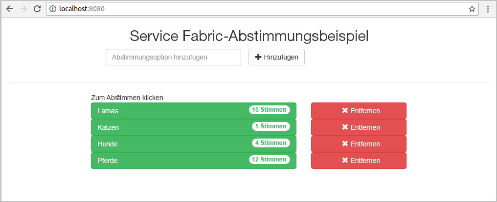
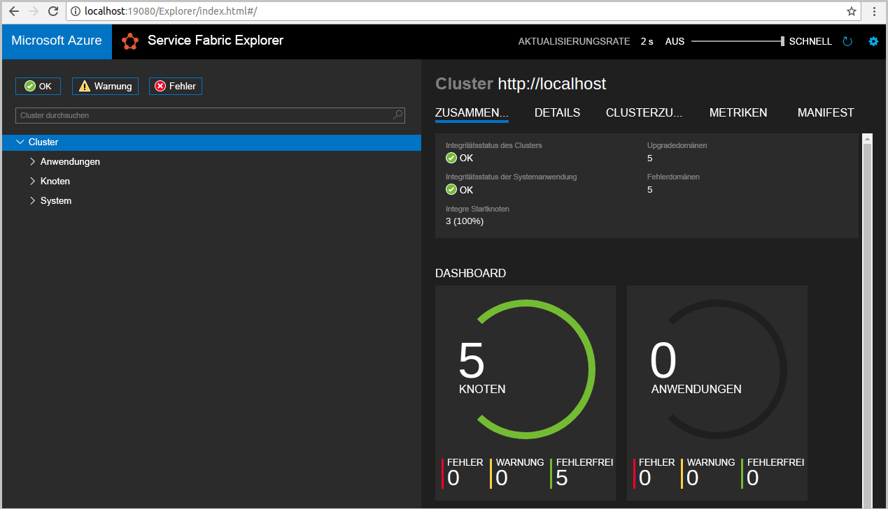
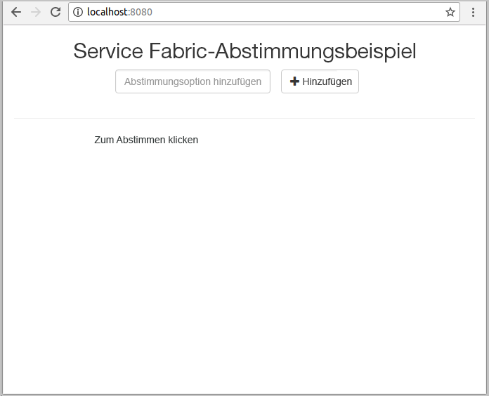
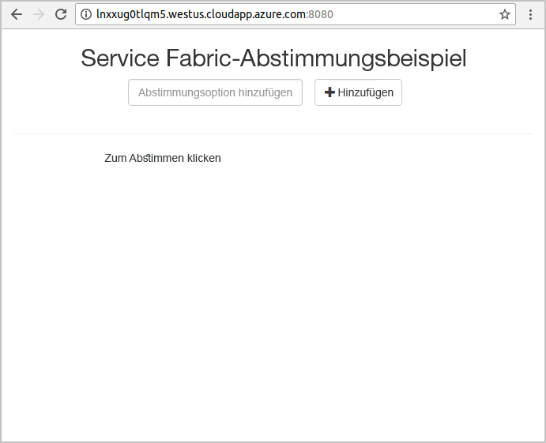
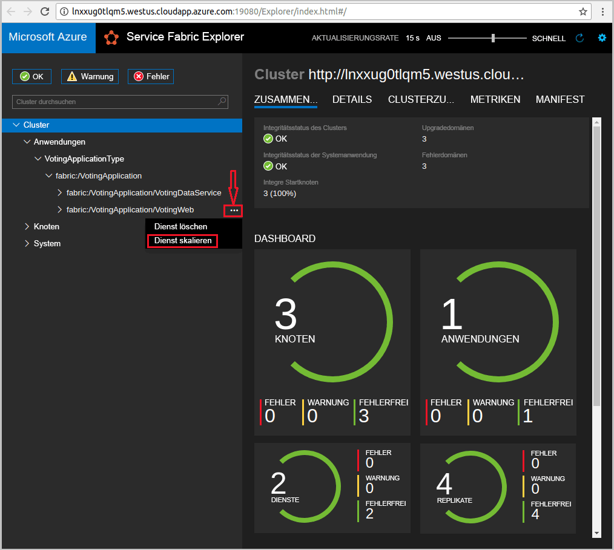
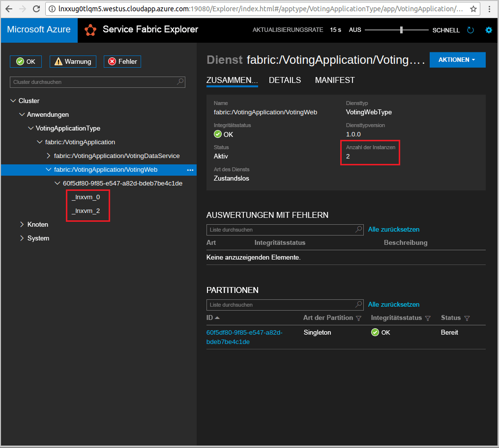

# <a name="create-a-java-application"></a>Erstellen einer Java-Anwendung
Azure Service Fabric ist eine Plattform, mit der verteilte Systeme bereitgestellt und skalierbare und zuverlässige Microservices und Container verwaltet werden können. 

In diesem Schnellstart wird veranschaulicht, wie Sie Ihre erste Java-Anwendung in Service Fabric mithilfe der Eclipse-IDE auf einem Linux-Entwicklercomputer bereitstellen. Das Ergebnis ist eine Anwendung mit einem Java-Web-Front-End, mit der Abstimmungsergebnisse im Cluster in einem zustandsbehafteten Back-End-Dienst gespeichert werden.



In dieser Schnellstartanleitung wird Folgendes vermittelt:

> [!div class="checklist"]
> * Verwenden von Eclipse als Tool für Ihre Service Fabric-Java-Anwendungen
> * Bereitstellen der Anwendung im Cluster 
> * Bereitstellen der Anwendung in einem Cluster in Azure
> * Horizontales Hochskalieren der Anwendung über mehrere Knoten hinweg

## <a name="prerequisites"></a>Voraussetzungen
So führen Sie diesen Schnellstart durch:
1. [Installieren Sie das Service Fabric SDK und die Service Fabric-Befehlszeilenschnittstelle (Command Line Interface, CLI).](https://docs.microsoft.com/en-us/azure/service-fabric/service-fabric-get-started-linux#installation-methods)
2. [Installieren Sie Git.](https://git-scm.com/)
3. [Installieren Sie Eclipse.](https://www.eclipse.org/downloads/)
4. [Richten Sie eine Java-Umgebung ein](https://docs.microsoft.com/en-us/azure/service-fabric/service-fabric-get-started-linux#set-up-java-development), und führen Sie auch die optionalen Schritte für die Installation des Eclipse-Plug-Ins aus. 

## <a name="download-the-sample"></a>Herunterladen des Beispiels
Führen Sie in einem Befehlsfenster den folgenden Befehl aus, um das Beispiel-App-Repository auf Ihren lokalen Computer zu klonen.
```
git clone https://github.com/Azure-Samples/service-fabric-java-quickstart.git
```

## <a name="run-the-application-locally"></a>Lokales Ausführen der Anwendung
1. Starten Sie Ihren lokalen Cluster mit dem folgenden Befehl:

    ```bash
    sudo /opt/microsoft/sdk/servicefabric/common/clustersetup/devclustersetup.sh
    ```
    Es kann einige Zeit dauern, bis der lokale Cluster startet. Um zu prüfen, ob der Cluster vollständig betriebsbereit ist, greifen Sie unter **http://localhost:19080** auf Service Fabric Explorer zu. Wenn die fünf Knoten fehlerfrei sind, wird der lokale Cluster ausgeführt. 
    
    

2. Öffnen Sie Eclipse.
3. Klicken Sie auf „File“ (Datei) -> „Open Projects from File System…“ (Projekte aus Dateisystem öffnen…). 
4. Klicken Sie auf „Directory“ (Verzeichnis), und wählen Sie im Ordner `service-fabric-java-quickstart` das Verzeichnis `Voting` aus, das Sie aus Github geklont haben. Klicken Sie auf Fertig stellen. 

    
    
5. Das Projekt `Voting` befindet sich nun im Paket-Explorer von Eclipse. 
6. Klicken Sie mit der rechten Maustaste auf das Projekt und anschließend in der Dropdownliste **Service Fabric** auf **Publish Application...** (Anwendung veröffentlichen…). Wählen Sie **PublishProfiles/Local.json** als Zielprofil („Target Profile“) aus, und klicken Sie auf „Publish“ (Veröffentlichen). 

    
    
7. Öffnen Sie Ihren bevorzugten Browser, und greifen Sie über **http://localhost:8080** auf die Anwendung zu. 

    
    
Sie können jetzt einen Satz mit Abstimmungsoptionen hinzufügen und die Abstimmung freigeben. Die Anwendung führt alle Daten in Ihrem Service Fabric-Cluster aus und speichert sie dort, ohne dass eine separate Datenbank verwendet werden muss.

## <a name="deploy-the-application-to-azure"></a>Bereitstellen der Anwendung für Azure

### <a name="set-up-your-azure-service-fabric-cluster"></a>Einrichten des Azure Service Fabric-Clusters
Um die Anwendung in einem Cluster in Azure bereitzustellen, erstellen Sie einen eigenen Cluster oder einen Partycluster.

Bei Partyclustern handelt es sich um zeitlich begrenzte kostenlose Service Fabric-Cluster, die in Azure gehostet werden. Sie werden vom Service Fabric-Team ausgeführt, und alle Interessenten können Anwendungen bereitstellen und sich mit der Plattform vertraut machen. [Befolgen Sie die Anweisungen](http://aka.ms/tryservicefabric), um Zugriff auf einen Partycluster zu erhalten. 

Informationen zum Erstellen Ihres eigenen Clusters finden Sie unter [Erstellen Ihres ersten Service Fabric-Clusters in Azure](service-fabric-get-started-azure-cluster.md).

> [!Note]
> Der Web-Front-End-Dienst ist für das Lauschen auf eingehenden Datenverkehr über Port 8080 konfiguriert. Stellen Sie sicher, dass der Port in Ihrem Cluster geöffnet ist. Wenn Sie den Partycluster verwenden, ist dieser Port geöffnet.
>

### <a name="deploy-the-application-using-eclipse"></a>Bereitstellen der Anwendung mithilfe von Eclipse
Nachdem die Anwendung und Ihr Cluster nun bereitstehen, können Sie sie über Eclipse direkt in einem Cluster bereitstellen.

1. Öffnen Sie im Verzeichnis **PublishProfiles** die Datei **Cloud.json**, und füllen Sie die Felder `ConnectionIPOrURL` und `ConnectionPort` ordnungsgemäß aus. Beispiel: 

    ```bash
    {
         "ClusterConnectionParameters": 
         {
            "ConnectionIPOrURL": "lnxxug0tlqm5.westus.cloudapp.azure.com",
            "ConnectionPort": "19080",
            "ClientKey": "",
            "ClientCert": ""
         }
    }
    ```

2. Klicken Sie mit der rechten Maustaste auf das Projekt und anschließend in der Dropdownliste **Service Fabric** auf **Publish Application...** (Anwendung veröffentlichen…). Wählen Sie **PublishProfiles/Cloud.json** als Zielprofil („Target Profile“) aus, und klicken Sie auf „Publish“ (Veröffentlichen). 

    

3. Öffnen Sie Ihren bevorzugten Browser, und greifen Sie über **http://\<VerbindungsIPoderURL>:8080** auf die Anwendung zu. 

    
    
## <a name="scale-applications-and-services-in-a-cluster"></a>Skalieren von Anwendungen und Diensten in einem Cluster
Dienste können clusterweit skaliert werden, um eine Änderung der Last für die Dienste auszugleichen. Sie skalieren einen Dienst, indem Sie die Anzahl von Instanzen ändern, die im Cluster ausgeführt werden. Für das Skalieren gibt es verschiedene Möglichkeiten. Sie können z.B. Skripts oder Befehle der Service Fabric-CLI (sfctl) verwenden. In diesem Beispiel verwenden wir Service Fabric Explorer.

Service Fabric Explorer wird in allen Service Fabric-Clustern ausgeführt und ist über einen Browser zugänglich, indem auf den HTTP-Verwaltungsport (19080) der Cluster zugegriffen wird, z.B. `http://lnxxug0tlqm5.westus.cloudapp.azure.com:19080`.

Führen Sie die folgenden Schritte aus, um den Web-Front-End-Dienst zu skalieren:

1. Öffnen Sie Service Fabric Explorer in Ihrem Cluster, z.B. `http://lnxxug0tlqm5.westus.cloudapp.azure.com:19080`.
2. Klicken Sie auf das Auslassungszeichen (drei Punkte) neben dem Knoten **fabric:/Voting/VotingWeb** in der Strukturansicht, und wählen Sie **Scale Service** (Dienst skalieren).

    

    Sie können jetzt angeben, dass die Anzahl von Instanzen des Web-Front-End-Diensts skaliert werden soll.

3. Ändern Sie die Anzahl in **2**, und klicken Sie auf **Scale Service** (Dienst skalieren).
4. Klicken Sie in der Strukturansicht auf den Knoten **fabric:/Voting/VotingWeb**, und erweitern Sie den Partitionsknoten (durch eine GUID dargestellt).

    

    Sie sehen nun, dass der Dienst über zwei Instanzen verfügt, und in der Strukturansicht ist zu erkennen, auf welchen Knoten die Instanzen ausgeführt werden.

Mit dieser einfachen Verwaltungsaufgabe haben wir die Ressourcen verdoppelt, die für unseren Front-End-Dienst zum Verarbeiten der Benutzerauslastung verfügbar sind. Es ist wichtig zu verstehen, dass Sie nicht mehrere Instanzen eines Diensts benötigen, damit er zuverlässig ausgeführt wird. Wenn ein Dienst ausfällt, wird von Service Fabric sichergestellt, dass im Cluster eine neue Dienstinstanz ausgeführt wird.

## <a name="next-steps"></a>Nächste Schritte
In diesem Schnellstart haben Sie Folgendes gelernt:

> [!div class="checklist"]
> * Verwenden von Eclipse als Tool für Ihre Service Fabric-Java-Anwendungen
> * Bereitstellen von Java-Anwendungen im lokalen Cluster 
> * Bereitstellen von Java-Anwendungen in einem Azure-Cluster
> * Horizontales Hochskalieren der Anwendung über mehrere Knoten hinweg

* Weitere Informationen zum [Debuggen von Diensten in Java mithilfe von Eclipse](service-fabric-debugging-your-application-java.md)
* Weitere Informationen zum [Einrichten von Continuous Integration & Deployment mithilfe von Jenkins](service-fabric-cicd-your-linux-java-application-with-jenkins.md)
* Sehen Sie sich die anderen [Java-Beispiele](https://github.com/Azure-Samples/service-fabric-java-getting-started) an