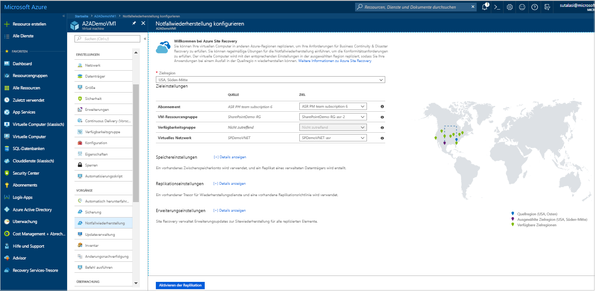
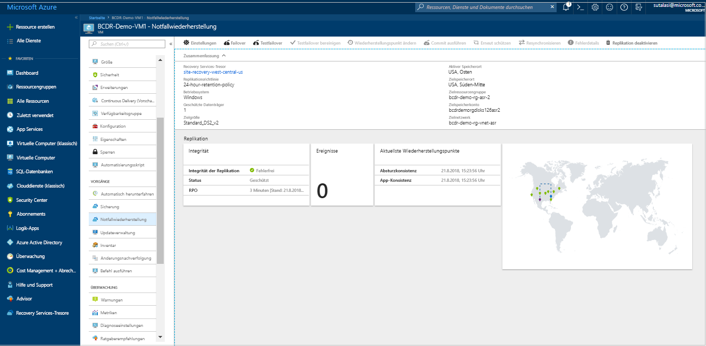
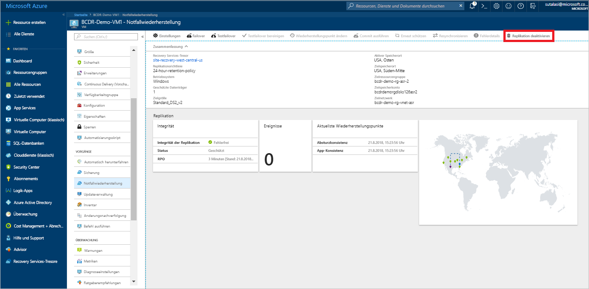

# Replizieren einer Azure-VM in eine andere Azure-Region (Vorschau)

Der Dienst [Azure Site Recovery](site-recovery-overview.md) unterstützt Ihre Strategien für Geschäftskontinuität und Notfallwiederherstellung, indem die Verfügbarkeit Ihrer Geschäftsanwendungen bei geplanten und ungeplanten Ausfällen gewährleistet wird. Site Recovery verwaltet und koordiniert die Notfallwiederherstellung von lokalen Computern sowie virtuellen Azure-Computern (VMs), einschließlich Replikation, Failover und Wiederherstellung.

Dieser Schnellstart beschreibt, wie eine Azure-VM in eine andere Azure-Region repliziert wird.

Wenn Sie kein Azure-Abonnement besitzen, können Sie ein [kostenloses Konto](https://azure.microsoft.com/free/?WT.mc_id=A261C142F) erstellen, bevor Sie beginnen.

## Anmelden an Azure

Melden Sie sich unter „http://portal.azure.com“ beim Azure-Portal an.

## Aktivieren der Replikation für die Azure-VM

1. Klicken Sie im Azure-Portal auf **Virtuelle Computer**, und wählen Sie die VM aus, die Sie replizieren möchten.

2. Klicken Sie in den **Einstellungen** auf **Notfallwiederherstellung (Vorschau)**.
3. Wählen Sie unter **Configure disaster recovery** (Notfallwiederherstellung konfigurieren) > **Zielregion** die Zielregion aus, in die Sie replizieren möchten.
4. Akzeptieren Sie für diesen Schnellstart die anderen Standardeinstellungen.
5. Klicken Sie auf **Replikation aktivieren**. Dadurch wird ein Auftrag gestartet, um die Replikation der VM zu aktivieren.

    

## Überprüfen der Einstellungen

Nach Abschluss des Replikationsauftrags können Sie den Replikationsstatus überprüfen, die Replikationseinstellungen ändern und die Bereitstellung testen.

1. Klicken Sie im VM-Menü auf **Notfallwiederherstellung (Vorschau)**.
2. Sie können die Replikationsintegrität, die erstellten Wiederherstellungspunkte und die Quell- und Zielregionen auf der Karte überprüfen.

   

## Bereinigen von Ressourcen

Die Replikation der VM in der primären Region wird beendet, wenn Sie die Replikation der VM deaktivieren:

- Die Quellreplikationseinstellungen werden automatisch bereinigt.
- Die Site Recovery-Abrechnung für die VM wird auch beendet.

Beenden Sie die Replikation wie folgt:

1. Wählen Sie den virtuellen Computer aus.
2. Klicken Sie unter **Notfallwiederherstellung (Vorschau)** auf **Mehr**.
3. Klicken Sie auf **Replikation deaktivieren**.

   

## Nächste Schritte

In diesem Schnellstart haben Sie eine einzelne VM in eine sekundäre Region repliziert.

> [!div class="nextstepaction"]
> [Konfigurieren der Notfallwiederherstellung für Azure-VMs](azure-to-azure-tutorial-enable-replication.md)

