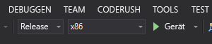

# Schnellstart: Erstellen einer HoloLens-App mit Azure Spatial Anchors in C++/WinRT und DirectX

In dieser Schnellstartanleitung wird beschrieben, wie Sie mit [Azure Spatial Anchors](../overview.md) eine HoloLens-App in C++/WinRT und DirectX erstellen. Azure Spatial Anchors ist ein plattformübergreifender Entwicklerdienst, mit dem Sie Mixed Reality-Umgebungen mit Objekten erstellen können, die ihre Position im Zeitverlauf geräteübergreifend beibehalten. Nach Abschluss des Vorgangs verfügen Sie über eine HoloLens-App, mit der ein räumlicher Anker gespeichert und abgerufen werden kann.

Sie lernen Folgendes:

> [!div class="checklist"]
> * Erstellen eines Spatial Anchors-Kontos
> * Konfigurieren des Bezeichners und Kontoschlüssels für das Spatial Anchors-Konto
> * Bereitstellen und Ausführen auf einem HoloLens-Gerät

[!INCLUDE [quickstarts-free-trial-note](../../../includes/quickstarts-free-trial-note.md)]

## Voraussetzungen

Stellen Sie für diese Schnellstartanleitung sicher, dass Sie über Folgendes verfügen:

- Einen Windows-Computer mit Installation von <a href="https://www.visualstudio.com/downloads/" target="_blank">Visual Studio 2017+</a> mit der Workload **Entwicklung für die universelle Windows-Plattform** und der Komponente **Windows 10 SDK (10.0.17763.0 oder höher)** und <a href="https://git-scm.com/download/win" target="_blank">Git für Windows</a>.
- Die [C++/WinRT-Visual Studio-Erweiterung (VSIX)](https://aka.ms/cppwinrt/vsix) für Visual Studio sollte über den [Visual Studio Marketplace](https://marketplace.visualstudio.com/) installiert werden.
- Ein HoloLens-Gerät mit aktiviertem [Entwicklermodus](https://docs.microsoft.com/windows/mixed-reality/using-visual-studio). Für diesen Artikel wird ein HoloLens-Gerät mit dem [Windows 10-Update von Oktober 2018](https://docs.microsoft.com/windows/mixed-reality/release-notes-october-2018 ) (auch als RS5 bezeichnet) benötigt. Öffnen Sie zum Aktualisieren auf das neueste HoloLens-Release die App **Einstellungen**, navigieren Sie zu **Update und Sicherheit**, und wählen Sie anschließend die Schaltfläche **Nach Updates suchen**.
- Für Ihre App muss im AppX-Manifest die Funktion **spatialPerception** festgelegt werden.

[!INCLUDE [Create Spatial Anchors resource](../../../includes/spatial-anchors-get-started-create-resource.md)]

## Öffnen des Beispielprojekts

[!INCLUDE [Clone Sample Repo](../../../includes/spatial-anchors-clone-sample-repository.md)]

Öffnen Sie `HoloLens\DirectX\SampleHoloLens.sln` in Visual Studio.

## Konfigurieren des Kontobezeichners und -schlüssels

Im nächsten Schritt wird die App zur Verwendung des Kontobezeichners und Kontoschlüssels konfiguriert. Diese haben Sie beim [Einrichten der Spatial Anchors-Ressource](#create-a-spatial-anchors-resource) in einen Text-Editor kopiert.

Öffnen Sie `HoloLens\DirectX\SampleHoloLens\ViewController.cpp`.

Suchen Sie nach dem Feld `SpatialAnchorsAccountKey`, und ersetzen Sie `Set me` durch den Kontoschlüssel.

Suchen Sie nach dem Feld `SpatialAnchorsAccountId`, und ersetzen Sie `Set me` durch den Kontobezeichner.

## Bereitstellen der App für HoloLens

Ändern Sie **Projektmappenkonfiguration** in **Release** und **Solution Platform** (Projektmappenplattform) in **x86**, und wählen Sie in den Optionen für das Bereitstellungsziel die Option **Gerät**.

Verwenden Sie bei Einsatz von HoloLens 2 **ARM** als **Projektmappenplattform** anstelle von **x86**.

Schalten Sie das HoloLens-Gerät ein, melden Sie sich an, und stellen Sie dafür per USB-Kabel eine Verbindung mit dem PC her.

Wählen Sie **Debuggen** > **Debuggen starten**, um Ihre App bereitzustellen und den Debugvorgang zu starten.

Befolgen Sie in der App die Anleitung zum Anordnen und Abrufen eines Ankers.

Beenden Sie die App in Visual Studio, indem Sie entweder **Debuggen beenden** wählen oder **UMSCHALT+F5** drücken.

[!INCLUDE [Clean-up section](../../../includes/clean-up-section-portal.md)]

[!INCLUDE [Next steps](../../../includes/spatial-anchors-quickstarts-nextsteps.md)]

> [!div class="nextstepaction"]
> [Tutorial: Freigeben für Sitzungen und Geräte mit Azure Spatial Anchors](../tutorials/tutorial-share-anchors-across-devices.md)
