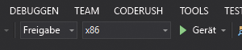

# Schnellstart: Erstellen einer HoloLens-Unity-App mit Azure Spatial Anchors

In dieser Schnellstartanleitung wird beschrieben, wie Sie mit [Azure Spatial Anchors](../overview.md) eine HoloLens-Unity-App erstellen. Azure Spatial Anchors ist ein plattformübergreifender Entwicklerdienst, mit dem Sie Mixed Reality-Umgebungen mit Objekten erstellen können, die ihre Position im Zeitverlauf geräteübergreifend beibehalten. Nach Abschluss des Vorgangs verfügen Sie über eine mit Unity erstellte HoloLens-App, mit der ein räumlicher Anker gespeichert und abgerufen werden kann.

Sie lernen Folgendes:

> [!div class="checklist"]
> * Erstellen eines Spatial Anchors-Kontos
> * Vorbereiten von Unity-Buildeinstellungen
> * Konfigurieren des Bezeichners und Kontoschlüssels für das Spatial Anchors-Konto
> * Exportieren des HoloLens-Visual Studio-Projekts
> * Bereitstellen und Ausführen auf einem HoloLens-Gerät

[!INCLUDE [quickstarts-free-trial-note](../../../includes/quickstarts-free-trial-note.md)]

## Voraussetzungen

Stellen Sie für diese Schnellstartanleitung sicher, dass Sie über Folgendes verfügen:

- Einen Windows-Computer mit Installation von <a href="https://unity3d.com/get-unity/download" target="_blank">Unity 2018.3+</a> und <a href="https://www.visualstudio.com/downloads/" target="_blank">Visual Studio 2017+</a> sowie der Workload **Entwicklung für die universelle Windows-Plattform**.
- Ein HoloLens-Gerät mit aktiviertem [Entwicklermodus](https://docs.microsoft.com/windows/mixed-reality/using-visual-studio).
- Für Ihre App muss die Funktion **SpatialPerception** unter **Buildeinstellungen**->**Playereinstellungen**->**Veröffentlichungseinstellungen**->**Funktionen** festgelegt werden.
- Für Ihre App muss **Virtual Reality Supported** (Unterstützung für virtuelle Realität) mit **Windows Mixed Reality SDK** unter **Buildeinstellungen**->**Playereinstellungen**->**XR Settings** (XR-Einstellungen) aktiviert sein.

[!INCLUDE [Create Spatial Anchors resource](../../../includes/spatial-anchors-get-started-create-resource.md)]

## Öffnen des Beispielprojekts in Unity

[!INCLUDE [Clone Sample Repo](../../../includes/spatial-anchors-clone-sample-repository.md)]

Öffnen Sie Unity, und öffnen Sie das Projekt im Ordner `Unity`.

Öffnen Sie **Buildeinstellungen**, indem Sie **Datei** -> **Buildeinstellungen** wählen.

Wählen Sie im Abschnitt **Plattform** die Option **Universelle Windows-Plattform**. Ändern Sie das **Zielgerät** in **HoloLens**.

Wählen Sie **Plattform wechseln**, um die Plattform in **Universelle Windows-Plattform** zu ändern.

Schließen Sie das Fenster **Buildeinstellungen**.

## Konfigurieren des Kontobezeichners und -schlüssels

Navigieren Sie im Bereich **Projekt** zu `Assets/AzureSpatialAnchorsPlugin/Examples`, und öffnen Sie die Szenendatei `AzureSpatialAnchorsBasicDemo.unity`.

[!INCLUDE [Configure Unity Scene](../../../includes/spatial-anchors-unity-configure-scene.md)]

Speichern Sie die Szene, indem Sie **Datei** -> **Speichern** wählen.

## Exportieren des HoloLens-Visual Studio-Projekts

[!INCLUDE [Export Unity Project](../../../includes/spatial-anchors-unity-export-project-snip.md)]

Wählen Sie **Build**, um ein Dialogfeld zu öffnen. Wählen Sie anschließend einen Ordner für den Export des HoloLens-Visual Studio-Projekts aus.

Nach Abschluss des Exports wird ein Ordner mit dem exportierten HoloLens-Projekt angezeigt.

## Bereitstellen der HoloLens-Anwendung

Doppelklicken Sie im Ordner auf `HelloAR U3D.sln`, um das Projekt in Visual Studio zu öffnen.

Ändern Sie **Projektmappenkonfiguration** in **Release** und **Solution Platform** (Projektmappenplattform) in **x86**, und wählen Sie in den Optionen für das Bereitstellungsziel die Option **Gerät**.

Schalten Sie das HoloLens-Gerät ein, melden Sie sich an, und stellen Sie dafür per USB-Kabel eine Verbindung mit dem PC her.

Wählen Sie **Debuggen** > **Debuggen starten**, um Ihre App bereitzustellen und den Debugvorgang zu starten.

Befolgen Sie in der App die Anleitung zum Anordnen und Abrufen eines Ankers.

Beenden Sie die App in Visual Studio, indem Sie entweder **Debuggen beenden** wählen oder **UMSCHALT+F5** drücken.

[!INCLUDE [Clean-up section](../../../includes/clean-up-section-portal.md)]

[!INCLUDE [Next steps](../../../includes/spatial-anchors-quickstarts-nextsteps.md)]

> [!div class="nextstepaction"]
> [Tutorial: Freigeben für Sitzungen und Geräte mit Azure Spatial Anchors](../tutorials/tutorial-share-anchors-across-devices.md)
