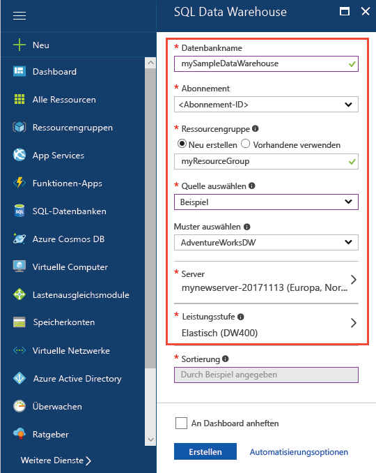
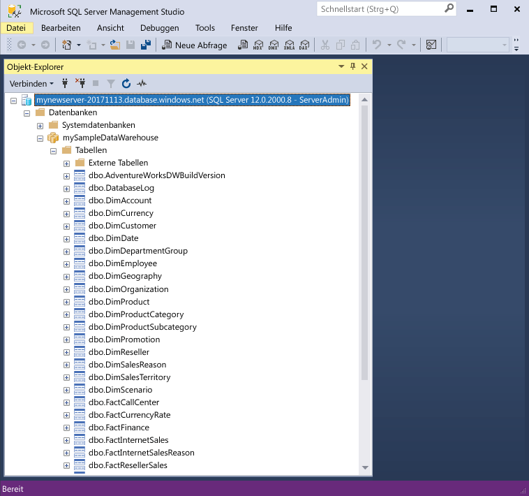
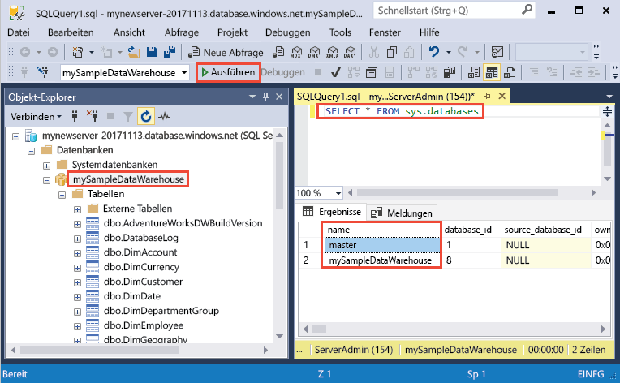
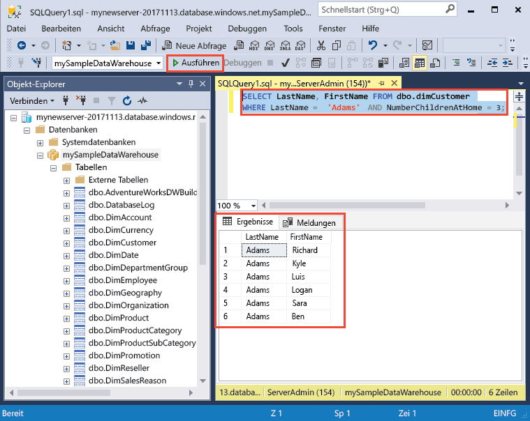

# <a name="create-and-query-an-azure-sql-data-warehouse-in-the-azure-portal"></a>Erstellen und Abfragen einer Azure SQL Data Warehouse-Instanz im Azure-Portal

Erstellen Sie schnell eine Azure SQL Data Warehouse-Instanz mit dem Azure-Portal, und fragen Sie sie ab.

Wenn Sie kein Azure-Abonnement besitzen, können Sie ein [kostenloses Konto](https://azure.microsoft.com/free/) erstellen, bevor Sie beginnen.

## <a name="before-you-begin"></a>Voraussetzungen

Laden Sie die aktuelle Version von [SQL Server Management Studio](/sql/ssms/download-sql-server-management-studio-ssms.md) (SSMS) herunter, und installieren Sie sie.

## <a name="sign-in-to-the-azure-portal"></a>Melden Sie sich auf dem Azure-Portal an.

Melden Sie sich auf dem [Azure-Portal](https://portal.azure.com/)an.

## <a name="create-a-data-warehouse"></a>Erstellen eines Data Warehouse

Eine Azure SQL Data Warehouse-Instanz wird mit einem definierten Satz von [Computeressourcen](performance-tiers.md) erstellt. Die Datenbank wird innerhalb einer [Azure-Ressourcengruppe](../azure-resource-manager/resource-group-overview.md) und auf einem [logischen Azure SQL-Server](../sql-database/sql-database-features.md) erstellt. 

Führen Sie diese Schritte aus, um eine SQL Data Warehouse-Instanz mit den AdventureWorksDW-Beispieldaten zu erstellen. 

1. Klicken Sie im Azure-Portal oben links auf die Schaltfläche **Neu**.

2. Wählen Sie auf der Seite **Neu** die Option **Datenbanken** und dann auf der Seite **Neu** unter **Ausgewählte** die Option **SQL Data Warehouse** aus.

    

3. Füllen Sie das SQL Data Warehouse-Formular mit den folgenden Informationen aus:   

    | Einstellung | Empfohlener Wert | Beschreibung | 
    | ------- | --------------- | ----------- | 
    | **Datenbankname** | mySampleDataWarehouse | Gültige Datenbanknamen finden Sie unter [Database Identifiers](/sql/relational-databases/databases/database-identifiers) (Datenbankbezeichner). Hinweis: Ein Data Warehouse ist ein Datenbanktyp.| 
    | **Abonnement** | Ihr Abonnement  | Ausführliche Informationen zu Ihren Abonnements finden Sie unter [Abonnements](https://account.windowsazure.com/Subscriptions). |
    | **Ressourcengruppe** | myResourceGroup | Gültige Ressourcengruppennamen finden Sie unter [Naming rules and restrictions](https://docs.microsoft.com/azure/architecture/best-practices/naming-conventions) (Benennungsregeln und Einschränkungen). |
    | **Quelle auswählen** | Beispiel | Legt fest, dass eine Beispieldatenbank geladen wird. Hinweis: Ein Data Warehouse ist ein Datenbanktyp. |
    | **Beispiel auswählen** | AdventureWorksDW | Legt fest, dass die Beispieldatenbank „AdventureWorksDW“ geladen wird.  |

    

4. Klicken Sie auf **Server**, um einen neuen Server für Ihre neue Datenbank zu erstellen und zu konfigurieren. Füllen Sie das Formular **Neuer Server** mit den folgenden Informationen aus: 

    | Einstellung | Empfohlener Wert | Beschreibung | 
    | ------------ | ------------------ | ------------------------------------------------- | 
    | **Servername** | Ein global eindeutiger Name | Gültige Servernamen finden Sie unter [Naming rules and restrictions](https://docs.microsoft.com/azure/architecture/best-practices/naming-conventions) (Benennungsregeln und Einschränkungen). | 
    | **Serveradministratoranmeldung** | Ein gültiger Name | Gültige Anmeldenamen finden Sie unter [Database Identifiers](https://docs.microsoft.com/sql/relational-databases/databases/database-identifiers) (Datenbankbezeichner).|
    | **Kennwort** | Ein gültiges Kennwort | Ihr Kennwort muss mindestens acht Zeichen umfassen und Zeichen aus drei der folgenden Kategorien enthalten: Großbuchstaben, Kleinbuchstaben, Zahlen und nicht alphanumerische Zeichen. |
    | **Standort** | Gültiger Standort | Informationen zu Regionen finden Sie unter [Azure-Regionen](https://azure.microsoft.com/regions/). |

    

5. Klicken Sie auf **Auswählen**.

6. Klicken Sie auf **Leistungsstufe**, um die Leistungskonfiguration für das Data Warehouse festzulegen.

7. Wählen Sie für dieses Tutorial die Leistungsstufe **Optimiert für Elastizität** aus. Der Schieberegler ist standardmäßig auf **DW400** gesetzt.  Schieben Sie ihn nach oben und unten, um sich mit der Funktionsweise vertraut zu machen. 

    

8. Klicken Sie auf **Anwenden**.

9. Nachdem Sie das SQL-Datenbank-Formular ausgefüllt haben, können Sie auf **Erstellen** klicken, um die Datenbank bereitzustellen. Die Bereitstellung dauert einige Minuten. 

    

10. Klicken Sie in der Symbolleiste auf **Benachrichtigungen**, um den Bereitstellungsprozess zu überwachen.
    
     

## <a name="create-a-server-level-firewall-rule"></a>Erstellen einer Firewallregel auf Serverebene

Der SQL Data Warehouse-Dienst erstellt eine Firewall auf Serverebene, um zu verhindern, dass externe Anwendungen und Tools eine Verbindung mit dem Server oder Datenbanken auf dem Server herstellen. Zum Herstellen von Konnektivität können Sie Firewallregeln hinzufügen, mit denen Konnektivität für bestimmte IP-Adressen ermöglicht wird.  Führen Sie die folgenden Schritte aus, um eine [Firewallregel auf Serverebene](../sql-database/sql-database-firewall-configure.md) für die IP-Adresse Ihres Clients zu erstellen. 

> [!NOTE]
> SQL Data Warehouse kommuniziert über Port 1433. Wenn Sie versuchen, eine Verbindung über ein Unternehmensnetzwerk herzustellen, wird ausgehender Datenverkehr über Port 1433 von der Firewall Ihres Netzwerks unter Umständen nicht zugelassen. In diesem Fall können Sie nur dann eine Verbindung mit Ihrem Azure SQL-Datenbankserver herstellen, wenn Ihre IT-Abteilung Port 1433 öffnet.
>

1. Klicken Sie nach Abschluss der Bereitstellung im Menü auf der linken Seite auf **SQL-Datenbanken**, und klicken Sie dann auf der Seite **SQL-Datenbanken** auf **mySampleDatabase**. Die Übersichtsseite für Ihre Datenbank wird geöffnet, die den vollqualifizierten Servernamen (z.B. **mynewserver-20171113.database.windows.net**) und Optionen für die weitere Konfiguration enthält. 

2. Kopieren Sie diesen vollqualifizierten Servernamen, um in den nachfolgenden Schnellstarts eine Verbindung mit Ihrem Server und den Datenbanken herzustellen. Klicken Sie auf den Servernamen, um die Servereinstellungen zu öffnen.

    

3. Klicken Sie auf den Servernamen, 
4. um die Servereinstellungen zu öffnen.

    

5. Klicken Sie auf **Firewalleinstellungen anzeigen**. Die Seite **Firewalleinstellungen** für den SQL-Datenbankserver wird geöffnet. 

    

4. Klicken Sie in der Symbolleiste auf **Client-IP-Adresse hinzufügen**, um Ihre aktuelle IP-Adresse einer neuen Firewallregel hinzuzufügen. Eine Firewallregel kann Port 1433 für eine einzelne IP-Adresse oder einen Bereich von IP-Adressen öffnen.

5. Klicken Sie auf **Speichern**. Für Ihre aktuelle IP-Adresse wird eine Firewallregel auf Serverebene erstellt, und auf dem logischen Server wird Port 1433 geöffnet.

6. Klicken Sie auf **OK**, und schließen Sie anschließend die Seite **Firewalleinstellungen**.

Jetzt können Sie mithilfe dieser IP-Adresse eine Verbindung mit dem SQL-Server und den zugehörigen Data Warehouses herstellen. Die Verbindung über SQL Server Management Studio oder ein anderes Tool Ihrer Wahl hergestellt werden. Verwenden Sie zum Herstellen der Verbindung das Serveradministratorkonto, das Sie zuvor erstellt haben.  

> [!IMPORTANT]
> Standardmäßig ist der Zugriff über die SQL-Datenbank-Firewall für alle Azure-Dienste aktiviert. Klicken Sie auf dieser Seite auf **AUS** und dann auf **Speichern**, um die Firewall für alle Azure-Dienste zu deaktivieren.

## <a name="get-the-fully-qualified-server-name"></a>Abrufen des vollqualifizierten Servernamens

Rufen Sie den vollqualifizierten Servernamen für Ihren SQL-Server im Azure-Portal ab. Später verwenden Sie den vollqualifizierten Namen zum Herstellen einer Verbindung mit dem Server.

1. Melden Sie sich auf dem [Azure-Portal](https://portal.azure.com/)an.
2. Wählen Sie im Menü auf der linken Seite die Option **SQL-Datenbanken**, und klicken Sie auf der Seite **SQL-Datenbanken** auf Ihre Datenbank. 
3. Suchen Sie im Azure-Portal auf der Seite für Ihre Datenbank unter **Zusammenfassung** nach Ihrer Datenbank, und kopieren Sie den **Servernamen**. In diesem Beispiel lautet der vollqualifizierte Name „mynewserver-20171113.database.windows.net“. 

      

## <a name="connect-to-the-server-as-server-admin"></a>Herstellen einer Verbindung mit dem Server als Serveradministrator

In diesem Abschnitt wird [SQL Server Management Studio](/sql/ssms/download-sql-server-management-studio-ssms.md) zum Herstellen einer Verbindung mit Ihrem Azure SQL-Server verwendet.

1. Öffnen Sie SQL Server Management Studio.

2. Geben Sie im Dialogfeld **Mit Server verbinden** die folgenden Informationen ein:

   | Einstellung       | Empfohlener Wert | Beschreibung | 
   | ------------ | ------------------ | ------------------------------------------------- | 
   | Servertyp | Datenbankmodul | Dieser Wert ist erforderlich. |
   | Servername | Der vollqualifizierte Servername | Beispiel: **mynewserver-20171113.database.windows.net**. |
   | Authentifizierung | SQL Server-Authentifizierung | In diesem Tutorial ist die SQL-Authentifizierung der einzige konfigurierte Authentifizierungstyp. |
   | Anmeldung | Das Serveradministratorkonto | Hierbei handelt es sich um das Konto, das Sie beim Erstellen des Servers angegeben haben. |
   | Kennwort | Das Kennwort für das Serveradministratorkonto | Hierbei handelt es sich um das Kennwort, das Sie beim Erstellen des Servers angegeben haben. |

    

4. Klicken Sie auf **Verbinden**. Die Objekt-Explorer-Fenster wird in SSMS geöffnet. 

5. Erweitern Sie im Objekt-Explorer die Option **Datenbanken**. Erweitern Sie dann **mySampleDatabase**, um die Objekte in der neuen Datenbank anzuzeigen.

     

## <a name="run-some-queries"></a>Ausführen einiger Abfragen

SQL Data Warehouse verwendet T-SQL als Abfragesprache. Führen Sie die folgenden Schritte aus, um ein Abfragefenster zu öffnen und einige T-SQL-Abfragen auszuführen:

1. Klicken Sie mit der rechten Maustaste auf **mySampleDataWarehouse**, und wählen Sie **Neue Abfrage** aus.  Ein neues Abfragefenster wird geöffnet.
2. Geben Sie im Abfragefenster den folgenden Befehl ein, um eine Liste mit Datenbanken anzuzeigen.

    ```sql
    SELECT * FROM sys.databases
    ```

3. Klicken Sie auf **Ausführen**.  Die Abfrageergebnisse zeigen zwei Datenbanken an: **master** und **mySampleDataWarehouse**.

    

4. Zum Überprüfen einiger Daten verwenden Sie den folgenden Befehl, um die Anzahl der Kunden mit dem Nachnamen Baar anzuzeigen, die drei Kinder zu Hause haben. In den Ergebnissen sind sechs Kunden aufgelistet. 

    ```sql
    SELECT LastName, FirstName FROM dbo.dimCustomer
    WHERE LastName = 'Adams' AND NumberChildrenAtHome = 3;
    ```

    

## <a name="clean-up-resources"></a>Bereinigen von Ressourcen

Ihnen werden Gebühren für Ihre Data Warehouse-Einheiten und in Ihrem Data Warehouse gespeicherte Daten in Rechnung gestellt. Diese Compute- und Speicherressourcen werden separat in Rechnung gestellt. 

- Falls Sie die Daten im Speicher belassen möchten, können Sie Computeressourcen anhalten, wenn Sie das Data Warehouse nicht verwenden. Wenn Sie Computeressourcen anhalten, werden Ihnen nur die Datenspeichergebühren in Rechnung gestellt. Sie können Computeressourcen fortsetzen, wenn Sie mit den Daten arbeiten möchten.
- Wenn zukünftig keine Gebühren anfallen sollen, können Sie das Data Warehouse löschen. 

Führen Sie die folgenden Schritte aus, um Ressourcen nach Wunsch zu bereinigen.

1. Melden Sie sich beim [Azure-Portal](https://portal.azure.com) an, und klicken Sie auf das Data Warehouse.

    

1. Zum Anhalten von Computeressourcen klicken Sie auf die Schaltfläche **Anhalten**. Wenn das Data Warehouse angehalten ist, wird die Schaltfläche **Starten** angezeigt.  Klicken Sie zum Fortsetzen der Computeressourcen auf **Starten**.

2. Wenn Sie das Data Warehouse entfernen möchten, damit keine Gebühren für Compute- oder Speicherressourcen anfallen, klicken Sie auf **Löschen**.

3. Zum Entfernen des erstellten SQL-Servers klicken Sie auf **mynewserver 20171113.database.windows.net** (siehe Abbildung oben), und klicken Sie dann auf **Löschen**.  Seien Sie bei diesem Löschvorgang vorsichtig, da beim Löschen des Servers auch alle Datenbanken gelöscht werden, die dem Server zugewiesen sind.

4. Zum Entfernen der Ressourcengruppe klicken Sie auf **myResourceGroup**, und klicken Sie dann auf **Ressourcengruppe löschen**.


## <a name="next-steps"></a>Nächste Schritte
Sie haben jetzt ein Data Warehouse sowie eine Firewallregel erstellt, diese mit Ihrem Data Warehouse verbunden und einige Abfragen ausgeführt. Weitere Informationen zu Azure SQL Data Warehouse erhalten Sie im Tutorial zum Laden von Daten.
> [!div class="nextstepaction"]
>[Laden von Daten in ein SQL-Data Warehouse](load-data-from-azure-blob-storage-using-polybase.md)