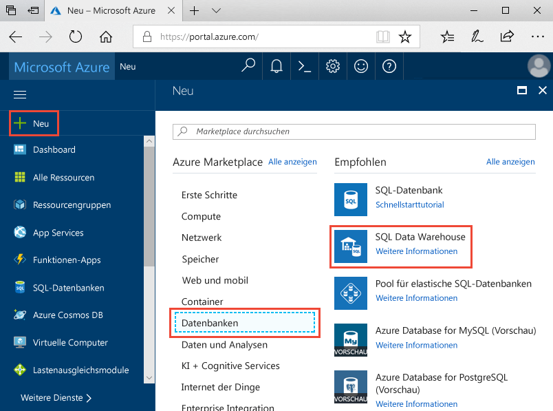
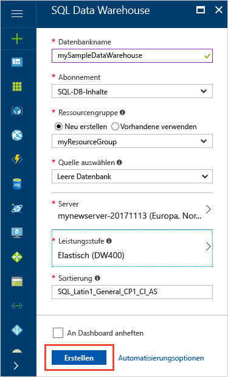
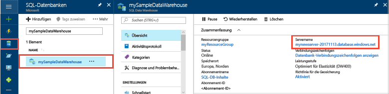
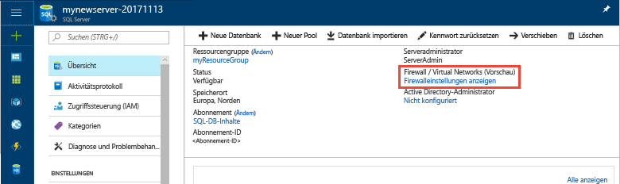
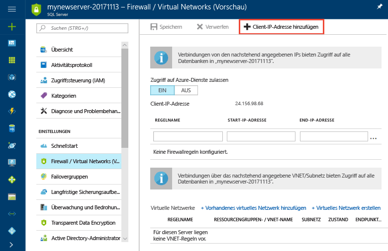
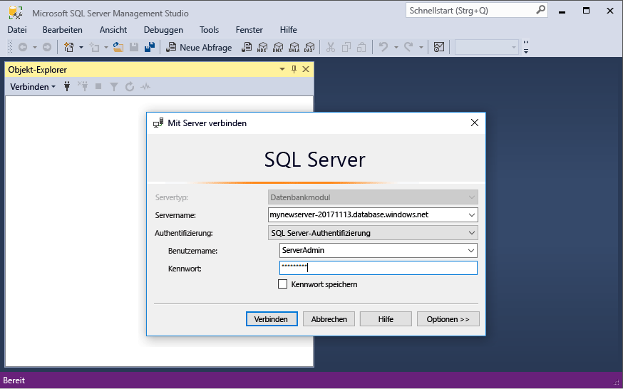

# <a name="tutorial-load-new-york-taxicab-data-to-azure-sql-data-warehouse"></a>Tutorial: Laden von Daten zu New Yorker Taxis in Azure SQL Data Warehouse

In diesem Tutorial wird PolyBase verwendet, um Daten zu New Yorker Taxis aus einem öffentlichen Azure-Blob in Azure SQL Data Warehouse zu laden. In diesem Tutorial werden das [Azure-Portal](https://portal.azure.com) und [SQL Server Management Studio](/sql/ssms/download-sql-server-management-studio-ssms) (SSMS) für folgende Zwecke verwendet: 

> [!div class="checklist"]
> * Erstellen eines Data Warehouse im Azure-Portal
> * Einrichten einer Firewallregel auf Serverebene im Azure-Portal
> * Herstellen einer Verbindung mit dem Data Warehouse mit SSMS
> * Erstellen eines festgelegten Benutzers zum Laden von Daten
> * Erstellen externer Tabellen für Daten in Azure Blob Storage
> * Verwenden der T-SQL-Anweisung CTAS zum Laden von Daten in das Data Warehouse
> * Anzeigen des Fortschritts beim Laden von Daten
> * Erstellen von Statistiken für die neu geladenen Daten

Wenn Sie kein Azure-Abonnement besitzen, können Sie ein [kostenloses Konto](https://azure.microsoft.com/free/) erstellen, bevor Sie beginnen.

## <a name="before-you-begin"></a>Voraussetzungen

Bevor Sie mit diesem Tutorial beginnen, laden Sie die neueste Version von [SQL Server Management Studio](/sql/ssms/download-sql-server-management-studio-ssms) (SSMS) herunter, und installieren Sie sie.


## <a name="log-in-to-the-azure-portal"></a>Anmelden beim Azure-Portal

Melden Sie sich beim [Azure-Portal](https://portal.azure.com/)an.

## <a name="create-a-blank-sql-data-warehouse"></a>Erstellen eines leeren SQL Data Warehouse

Ein Azure SQL Data Warehouse wird mit einer definierten Gruppe von [Computeressourcen](memory-and-concurrency-limits.md) erstellt. Die Datenbank wird in einer [Azure-Ressourcengruppe](../azure-resource-manager/resource-group-overview.md) und auf einem [logischen Azure SQL-Server](../sql-database/sql-database-features.md) erstellt. 

Führen Sie die folgenden Schritte aus, um eine leere SQL Data Warehouse-Instanz zu erstellen. 

1. Klicken Sie im Azure-Portal links oben auf **Ressource erstellen**.

2. Wählen Sie auf der Seite **Neu** die Option **Datenbanken** und dann auf der Seite **Neu** unter **Ausgewählte** die Option **SQL Data Warehouse** aus.

    

3. Füllen Sie das SQL Data Warehouse-Formular mit den folgenden Informationen aus:   

   | Einstellung | Empfohlener Wert | BESCHREIBUNG | 
   | ------- | --------------- | ----------- | 
   | **Datenbankname** | mySampleDataWarehouse | Gültige Datenbanknamen finden Sie unter [Database Identifiers](/sql/relational-databases/databases/database-identifiers) (Datenbankbezeichner). | 
   | **Abonnement** | Ihr Abonnement  | Ausführliche Informationen zu Ihren Abonnements finden Sie unter [Abonnements](https://account.windowsazure.com/Subscriptions). |
   | **Ressourcengruppe** | myResourceGroup | Gültige Ressourcengruppennamen finden Sie unter [Naming rules and restrictions](https://docs.microsoft.com/azure/architecture/best-practices/naming-conventions) (Benennungsregeln und Einschränkungen). |
   | **Quelle auswählen** | Leere Datenbank | Gibt an, dass eine leere Datenbank erstellt werden soll. Hinweis: Ein Data Warehouse ist ein Datenbanktyp.|

    

4. Klicken Sie auf **Server**, um einen neuen Server für Ihre neue Datenbank zu erstellen und zu konfigurieren. Füllen Sie das Formular **Neuer Server** mit den folgenden Informationen aus: 

    | Einstellung | Empfohlener Wert | BESCHREIBUNG | 
    | ------- | --------------- | ----------- |
    | **Servername** | Ein global eindeutiger Name | Gültige Servernamen finden Sie unter [Naming rules and restrictions](https://docs.microsoft.com/azure/architecture/best-practices/naming-conventions) (Benennungsregeln und Einschränkungen). | 
    | **Serveradministratoranmeldung** | Ein gültiger Name | Gültige Anmeldenamen finden Sie unter [Database Identifiers](https://docs.microsoft.com/sql/relational-databases/databases/database-identifiers) (Datenbankbezeichner).|
    | **Kennwort** | Ein gültiges Kennwort | Ihr Kennwort muss mindestens acht Zeichen umfassen und Zeichen aus drei der folgenden Kategorien enthalten: Großbuchstaben, Kleinbuchstaben, Zahlen und nicht alphanumerische Zeichen. |
    | **Location** | Gültiger Standort | Informationen zu Regionen finden Sie unter [Azure-Regionen](https://azure.microsoft.com/regions/). |

    

5. Klicken Sie auf **Auswählen**.

6. Klicken Sie auf **Leistungsebene**, um anzugeben, ob „Gen1“ oder „Gen2“ als Data Warehouse verwendet werden soll, und um die Anzahl von Data Warehouse-Einheiten festzulegen. 

7. Wählen Sie in diesem Tutorial **Gen2** von SQL Data Warehouse aus. Der Schieberegler ist standardmäßig auf **DW1000c** festgelegt.  Schieben Sie ihn nach oben und unten, um sich mit der Funktionsweise vertraut zu machen. 

    

8. Klicken Sie auf **Anwenden**.
9. Wählen Sie auf der Seite „SQL Data Warehouse“ eine **Sortierung** für die leere Datenbank aus. Verwenden Sie für dieses Tutorial den Standardwert. Weitere Informationen über Sortierungen finden Sie unter [Sortierungen](/sql/t-sql/statements/collations).

11. Nachdem Sie das SQL-Datenbank-Formular ausgefüllt haben, können Sie auf **Erstellen** klicken, um die Datenbank bereitzustellen. Die Bereitstellung dauert einige Minuten. 

    

12. Klicken Sie in der Symbolleiste auf **Benachrichtigungen**, um den Bereitstellungsprozess zu überwachen.
    
     

## <a name="create-a-server-level-firewall-rule"></a>Erstellen einer Firewallregel auf Serverebene

Der SQL Data Warehouse-Dienst erstellt eine Firewall auf Serverebene, um zu verhindern, dass externe Anwendungen und Tools eine Verbindung mit dem Server oder Datenbanken auf dem Server herstellen. Zum Herstellen von Konnektivität können Sie Firewallregeln hinzufügen, mit denen Konnektivität für bestimmte IP-Adressen ermöglicht wird.  Führen Sie die folgenden Schritte aus, um eine [Firewallregel auf Serverebene](../sql-database/sql-database-firewall-configure.md) für die IP-Adresse Ihres Clients zu erstellen. 

> [!NOTE]
> SQL Data Warehouse kommuniziert über Port 1433. Wenn Sie versuchen, eine Verbindung über ein Unternehmensnetzwerk herzustellen, wird ausgehender Datenverkehr über Port 1433 von der Firewall Ihres Netzwerks unter Umständen nicht zugelassen. In diesem Fall können Sie nur dann eine Verbindung mit Ihrem Azure SQL-Datenbank-Server herstellen, wenn Ihre IT-Abteilung Port 1433 öffnet.
>

1. Klicken Sie nach Abschluss der Bereitstellung im Menü auf der linken Seite auf **SQL-Datenbanken**, und klicken Sie dann auf der Seite **SQL-Datenbanken** auf **mySampleDatabase**. Die Übersichtsseite für Ihre Datenbank wird geöffnet. Auf dieser Seite wird der vollqualifizierte Servername (z. B. **mynewserver-20180430.database.windows.net**) angezeigt, und es werden Optionen zur weiteren Konfiguration bereitgestellt. 

2. Kopieren Sie diesen vollqualifizierten Servernamen, um in den nachfolgenden Schnellstarts eine Verbindung mit Ihrem Server und den Datenbanken herzustellen. Klicken Sie anschließend auf den Servernamen, um die Servereinstellungen zu öffnen.

     

3. Klicken Sie auf den Servernamen, um die Servereinstellungen zu öffnen.

     

5. Klicken Sie auf **Firewalleinstellungen anzeigen**. Die Seite **Firewalleinstellungen** für den SQL-Datenbank-Server wird geöffnet. 

     

4. Klicken Sie in der Symbolleiste auf **Client-IP-Adresse hinzufügen**, um Ihre aktuelle IP-Adresse einer neuen Firewallregel hinzuzufügen. Eine Firewallregel kann Port 1433 für eine einzelne IP-Adresse oder einen Bereich von IP-Adressen öffnen.

5. Klicken Sie auf **Speichern**. Für Ihre aktuelle IP-Adresse wird eine Firewallregel auf Serverebene erstellt, und auf dem logischen Server wird Port 1433 geöffnet.

6. Klicken Sie auf **OK**, und schließen Sie anschließend die Seite **Firewalleinstellungen**.

Jetzt können Sie mithilfe dieser IP-Adresse eine Verbindung mit dem SQL-Server und den zugehörigen Data Warehouses herstellen. Die Verbindung über SQL Server Management Studio oder ein anderes Tool Ihrer Wahl hergestellt werden. Verwenden Sie zum Herstellen der Verbindung das Serveradministratorkonto, das Sie zuvor erstellt haben.  

> [!IMPORTANT]
> Standardmäßig ist der Zugriff über die SQL-Datenbank-Firewall für alle Azure-Dienste aktiviert. Klicken Sie auf dieser Seite auf **AUS** und dann auf **Speichern**, um die Firewall für alle Azure-Dienste zu deaktivieren.

## <a name="get-the-fully-qualified-server-name"></a>Abrufen des vollqualifizierten Servernamens

Rufen Sie den vollqualifizierten Servernamen für Ihren SQL-Server im Azure-Portal ab. Später verwenden Sie den vollqualifizierten Namen zum Herstellen einer Verbindung mit dem Server.

1. Melden Sie sich beim [Azure-Portal](https://portal.azure.com/)an.
2. Wählen Sie im linken Menü die Option **SQL Data Warehouses** aus, und klicken Sie dann auf der Seite **SQL Data Warehouses** auf Ihre Datenbank. 
3. Suchen Sie im Azure-Portal auf der Seite für Ihre Datenbank unter **Zusammenfassung** nach Ihrer Datenbank, und kopieren Sie den **Servernamen**. In diesem Beispiel lautet der vollqualifizierte Name „mynewserver-20180430.database.windows.net“. 

      

## <a name="connect-to-the-server-as-server-admin"></a>Herstellen einer Verbindung mit dem Server als Serveradministrator

In diesem Abschnitt wird [SQL Server Management Studio](/sql/ssms/download-sql-server-management-studio-ssms) zum Herstellen einer Verbindung mit Ihrem Azure SQL-Server verwendet.

1. Öffnen Sie SQL Server Management Studio.

2. Geben Sie im Dialogfeld **Mit Server verbinden** die folgenden Informationen ein:

    | Einstellung      | Empfohlener Wert | BESCHREIBUNG | 
    | ------------ | --------------- | ----------- | 
    | Servertyp | Datenbank-Engine | Dieser Wert ist erforderlich. |
    | Servername | Der vollqualifizierte Servername | Der Name sollte etwa wie folgt lauten: **mynewserver-20180430.database.windows.net**. |
    | Authentication | SQL Server-Authentifizierung | In diesem Tutorial haben wir als einzigen Authentifizierungstyp die SQL-Authentifizierung konfiguriert. |
    | Anmeldung | Das Serveradministratorkonto | Hierbei handelt es sich um das Konto, das Sie beim Erstellen des Servers angegeben haben. |
    | Password | Das Kennwort für das Serveradministratorkonto | Hierbei handelt es sich um das Kennwort, das Sie beim Erstellen des Servers angegeben haben. |

    

4. Klicken Sie auf **Verbinden**. Die Objekt-Explorer-Fenster wird in SSMS geöffnet. 

5. Erweitern Sie im Objekt-Explorer die Option **Datenbanken**. Erweitern Sie dann **Systemdatenbanken** und **Master**, um die Objekte in der Masterdatenbank anzuzeigen.  Erweitern Sie **mySampleDatabase**, um die Objekte in der neuen Datenbank anzuzeigen.

     

## <a name="create-a-user-for-loading-data"></a>Erstellen eines Benutzers zum Laden von Daten

Das Serveradministratorkonto dient zum Ausführen von Verwaltungsvorgänge und eignet sich nicht zum Ausführen von Abfragen für Benutzerdaten. Das Laden von Daten ist ein speicherintensiver Vorgang. Arbeitsspeicher-Höchstwerte werden gemäß der bereitgestellten SQL Data Warehouse-Generation, den [Data Warehouse-Einheiten](what-is-a-data-warehouse-unit-dwu-cdwu.md) und der [Ressourcenklasse](resource-classes-for-workload-management.md) definiert. 

Es wird empfohlen, eine Anmeldung und einen Benutzer speziell zum Laden von Daten zu erstellen. Fügen Sie dann den Benutzer für das Laden einer [Ressourcenklasse](resource-classes-for-workload-management.md) hinzu, die eine geeignete maximale Speicherbelegung ermöglicht.

Da Sie momentan als Serveradministrator verbunden sind, können Sie Anmeldungen und Benutzer erstellen. Führen Sie die folgenden Schritte aus, um eine Anmeldung und einen Benutzer mit dem Namen **LoaderRC20** zu erstellen. Weisen Sie den Benutzer dann der Ressourcenklasse **staticrc20** zu. 

1.  Klicken Sie in SSMS mit der rechten Maustaste auf **Master**, um ein Dropdownmenü anzuzeigen, und wählen Sie **Neue Abfrage** aus. Ein neues Abfragefenster wird geöffnet.

    

2. Geben Sie im Abfragefenster die folgenden T-SQL-Befehle ein, um eine Anmeldung und einen Benutzer mit dem Namen „LoaderRC20“ zu erstellen, und ersetzen Sie dabei Ihr eigenes Kennwort durch „a123STRONGpassword!“. 

    ```sql
    CREATE LOGIN LoaderRC20 WITH PASSWORD = 'a123STRONGpassword!';
    CREATE USER LoaderRC20 FOR LOGIN LoaderRC20;
    ```

3. Klicken Sie auf **Ausführen**.

4. Klicken Sie mit der rechten Maustaste auf **mySampleDataWarehouse**, und wählen Sie **Neue Abfrage** aus. Ein neues Abfragefenster wird geöffnet.  

    
 
5. Geben Sie die folgenden T-SQL-Befehle ein, um einen Datenbankbenutzer mit dem Namen „LoaderRC20“ für die Anmeldung „LoaderRC20“ zu erstellen. Die zweite Zeile gewährt dem neuen Benutzer CONTROL-Berechtigungen für das neue Data Warehouse.  Diese Berechtigungen ähneln der Festlegung des Benutzers als Besitzer der Datenbank. Die dritte Zeile fügt den neuen Benutzer als Mitglied der [Ressourcenklasse](resource-classes-for-workload-management.md) „staticrc20“ hinzu.

    ```sql
    CREATE USER LoaderRC20 FOR LOGIN LoaderRC20;
    GRANT CONTROL ON DATABASE::[mySampleDataWarehouse] to LoaderRC20;
    EXEC sp_addrolemember 'staticrc20', 'LoaderRC20';
    ```

6. Klicken Sie auf **Ausführen**.

## <a name="connect-to-the-server-as-the-loading-user"></a>Herstellen einer Verbindung mit dem Server als ladender Benutzer

Im ersten Schritt zum Laden von Daten melden Sie sich als „LoaderRC20“ an.  

1. Klicken Sie im Objekt-Explorer auf das Dropdownmenü **Verbinden**, und wählen Sie **Datenbank-Engine** aus. Das Dialogfeld **Mit Server verbinden** wird angezeigt.

    

2. Geben Sie den vollqualifizierten Servernamen und dann **LoaderRC20** als Anmeldenamen ein.  Geben Sie Ihr Kennwort für „LoaderRC20“ ein.

3. Klicken Sie auf **Verbinden**.

4. Wenn die Verbindung bereitsteht, werden zwei Serververbindungen im Objekt-Explorer angezeigt: eine Verbindung als „ServerAdmin“ und eine Verbindung als „MedRCLogin“.

    

## <a name="create-external-tables-for-the-sample-data"></a>Erstellen externer Tabellen für die Beispieldaten

Sie können nun mit dem Laden von Daten in das neue Data Warehouse beginnen. In diesem Tutorial wird gezeigt, wie Sie mit externen Tabellen Daten zu New Yorker Taxis aus einem Azure-Speicherblob laden. Informationen zum Übertragen Ihrer Daten in Azure Blob Storage oder zum direkten Laden der Daten aus Ihrer Quelle in SQL Data Warehouse finden Sie in der [Ladeübersicht](sql-data-warehouse-overview-load.md).

Führen Sie die folgenden SQL-Skripts aus, und geben Sie Informationen zu den Daten an, die Sie laden möchten. Diese Informationen umfassen den aktuellen Speicherort der Daten, das Format des Dateninhalts und die Tabellendefinition für die Daten. 

1. Im vorherigen Abschnitt haben Sie sich als „LoaderRC20“ beim Data Warehouse angemeldet. Klicken Sie in SSMS mit der rechten Maustaste auf die Verbindung „LoaderRC20“, und wählen Sie **Neue Abfrage** aus.  Ein neues Abfragefenster wird angezeigt. 

    

2. Vergleichen Sie Ihr Abfragefenster mit der Abbildung oben.  Überprüfen Sie, ob das neue Abfragefenster als „LoaderRC20“ ausgeführt wird und Abfragen für die Datenbank „mySampleDataWarehouse“ durchgeführt werden. Verwenden Sie dieses Abfragefenster zum Ausführen aller Ladeschritte.

3. Erstellen Sie einen Hauptschlüssel für die Datenbank „mySampleDataWarehouse“. Der Hauptschlüssel muss nur jeweils einmal pro Datenbank erstellt werden. 

    ```sql
    CREATE MASTER KEY;
    ```

4. Führen Sie die folgende Anweisung [CREATE EXTERNAL DATA SOURCE](/sql/t-sql/statements/create-external-data-source-transact-sql) aus, um den Speicherort des Azure-Blobs zu definieren. Dies ist der Speicherort der externen Taxidaten.  Zum Ausführen eines Befehls, den Sie im Abfragefenster angefügt haben, markieren Sie die auszuführenden Befehle, und klicken Sie auf **Ausführen**.

    ```sql
    CREATE EXTERNAL DATA SOURCE NYTPublic
    WITH
    (
        TYPE = Hadoop,
        LOCATION = 'wasbs://2013@nytaxiblob.blob.core.windows.net/'
    );
    ```

5. Führen Sie die folgende T-SQL-Anweisung [CREATE EXTERNAL FILE FORMAT](/sql/t-sql/statements/create-external-file-format-transact-sql) aus, um Formatierungseigenschaften und Optionen für die externe Datendatei anzugeben. Diese Anweisung gibt an, dass die externen Daten als Text gespeichert und die Werte durch senkrechte Striche („|“) getrennt sind. Die externe Datei wird mit Gzip komprimiert. 

    ```sql
    CREATE EXTERNAL FILE FORMAT uncompressedcsv
    WITH (
        FORMAT_TYPE = DELIMITEDTEXT,
        FORMAT_OPTIONS ( 
            FIELD_TERMINATOR = ',',
            STRING_DELIMITER = '',
            DATE_FORMAT = '',
            USE_TYPE_DEFAULT = False
        )
    );
    CREATE EXTERNAL FILE FORMAT compressedcsv
    WITH ( 
        FORMAT_TYPE = DELIMITEDTEXT,
        FORMAT_OPTIONS ( FIELD_TERMINATOR = '|',
            STRING_DELIMITER = '',
        DATE_FORMAT = '',
            USE_TYPE_DEFAULT = False
        ),
        DATA_COMPRESSION = 'org.apache.hadoop.io.compress.GzipCodec'
    );
    ```

6.  Führen Sie die folgende Anweisung [CREATE SCHEMA](/sql/t-sql/statements/create-schema-transact-sql) aus, um ein Schema für das externe Dateiformat zu erstellen. Das Schema bietet eine Möglichkeit zum Organisieren der externen Tabellen, die Sie nun erstellen.

    ```sql
    CREATE SCHEMA ext;
    ```

7. Erstellen von externen Tabellen Die Tabellendefinitionen sind in SQL Data Warehouse gespeichert, aber die Tabellen verweisen auf Daten, die in Azure Blob Storage gespeichert sind. Führen Sie die folgenden T-SQL-Befehle aus, um mehrere externe Tabellen zu erstellen, die alle auf das Azure-Blob verweisen, das wir zuvor in der externen Datenquelle definiert haben.

    ```sql
    CREATE EXTERNAL TABLE [ext].[Date] 
    (
        [DateID] int NOT NULL,
        [Date] datetime NULL,
        [DateBKey] char(10) COLLATE SQL_Latin1_General_CP1_CI_AS NULL,
        [DayOfMonth] varchar(2) COLLATE SQL_Latin1_General_CP1_CI_AS NULL,
        [DaySuffix] varchar(4) COLLATE SQL_Latin1_General_CP1_CI_AS NULL,
        [DayName] varchar(9) COLLATE SQL_Latin1_General_CP1_CI_AS NULL,
        [DayOfWeek] char(1) COLLATE SQL_Latin1_General_CP1_CI_AS NULL,
        [DayOfWeekInMonth] varchar(2) COLLATE SQL_Latin1_General_CP1_CI_AS NULL,
        [DayOfWeekInYear] varchar(2) COLLATE SQL_Latin1_General_CP1_CI_AS NULL,
        [DayOfQuarter] varchar(3) COLLATE SQL_Latin1_General_CP1_CI_AS NULL,
        [DayOfYear] varchar(3) COLLATE SQL_Latin1_General_CP1_CI_AS NULL,
        [WeekOfMonth] varchar(1) COLLATE SQL_Latin1_General_CP1_CI_AS NULL,
        [WeekOfQuarter] varchar(2) COLLATE SQL_Latin1_General_CP1_CI_AS NULL,
        [WeekOfYear] varchar(2) COLLATE SQL_Latin1_General_CP1_CI_AS NULL,
        [Month] varchar(2) COLLATE SQL_Latin1_General_CP1_CI_AS NULL,
        [MonthName] varchar(9) COLLATE SQL_Latin1_General_CP1_CI_AS NULL,
        [MonthOfQuarter] varchar(2) COLLATE SQL_Latin1_General_CP1_CI_AS NULL,
        [Quarter] char(1) COLLATE SQL_Latin1_General_CP1_CI_AS NULL,
        [QuarterName] varchar(9) COLLATE SQL_Latin1_General_CP1_CI_AS NULL,
        [Year] char(4) COLLATE SQL_Latin1_General_CP1_CI_AS NULL,
        [YearName] char(7) COLLATE SQL_Latin1_General_CP1_CI_AS NULL,
        [MonthYear] char(10) COLLATE SQL_Latin1_General_CP1_CI_AS NULL,
        [MMYYYY] char(6) COLLATE SQL_Latin1_General_CP1_CI_AS NULL,
        [FirstDayOfMonth] date NULL,
        [LastDayOfMonth] date NULL,
        [FirstDayOfQuarter] date NULL,
        [LastDayOfQuarter] date NULL,
        [FirstDayOfYear] date NULL,
        [LastDayOfYear] date NULL,
        [IsHolidayUSA] bit NULL,
        [IsWeekday] bit NULL,
        [HolidayUSA] varchar(50) COLLATE SQL_Latin1_General_CP1_CI_AS NULL
    )
    WITH
    (
        LOCATION = 'Date',
        DATA_SOURCE = NYTPublic,
        FILE_FORMAT = uncompressedcsv,
        REJECT_TYPE = value,
        REJECT_VALUE = 0
    ); 
    CREATE EXTERNAL TABLE [ext].[Geography]
    (
        [GeographyID] int NOT NULL,
        [ZipCodeBKey] varchar(10) COLLATE SQL_Latin1_General_CP1_CI_AS NOT NULL,
        [County] varchar(50) COLLATE SQL_Latin1_General_CP1_CI_AS NULL,
        [City] varchar(50) COLLATE SQL_Latin1_General_CP1_CI_AS NULL,
        [State] varchar(50) COLLATE SQL_Latin1_General_CP1_CI_AS NULL,
        [Country] varchar(50) COLLATE SQL_Latin1_General_CP1_CI_AS NULL,
        [ZipCode] varchar(50) COLLATE SQL_Latin1_General_CP1_CI_AS NULL
    )
    WITH
    (
        LOCATION = 'Geography',
        DATA_SOURCE = NYTPublic,
        FILE_FORMAT = uncompressedcsv,
        REJECT_TYPE = value,
        REJECT_VALUE = 0 
    );      
    CREATE EXTERNAL TABLE [ext].[HackneyLicense]
    (
        [HackneyLicenseID] int NOT NULL,
        [HackneyLicenseBKey] varchar(50) COLLATE SQL_Latin1_General_CP1_CI_AS NOT NULL,
        [HackneyLicenseCode] varchar(50) COLLATE SQL_Latin1_General_CP1_CI_AS NULL
    )
    WITH
    (
        LOCATION = 'HackneyLicense',
        DATA_SOURCE = NYTPublic,
        FILE_FORMAT = uncompressedcsv,
        REJECT_TYPE = value,
        REJECT_VALUE = 0
    );
    CREATE EXTERNAL TABLE [ext].[Medallion]
    (
        [MedallionID] int NOT NULL,
        [MedallionBKey] varchar(50) COLLATE SQL_Latin1_General_CP1_CI_AS NOT NULL,
        [MedallionCode] varchar(50) COLLATE SQL_Latin1_General_CP1_CI_AS NULL
    )
    WITH
    (
        LOCATION = 'Medallion',
        DATA_SOURCE = NYTPublic,
        FILE_FORMAT = uncompressedcsv,
        REJECT_TYPE = value,
        REJECT_VALUE = 0
    )
    ;  
    CREATE EXTERNAL TABLE [ext].[Time]
    (
        [TimeID] int NOT NULL,
        [TimeBKey] varchar(8) COLLATE SQL_Latin1_General_CP1_CI_AS NOT NULL,
        [HourNumber] tinyint NOT NULL,
        [MinuteNumber] tinyint NOT NULL,
        [SecondNumber] tinyint NOT NULL,
        [TimeInSecond] int NOT NULL,
        [HourlyBucket] varchar(15) COLLATE SQL_Latin1_General_CP1_CI_AS NOT NULL,
        [DayTimeBucketGroupKey] int NOT NULL,
        [DayTimeBucket] varchar(100) COLLATE SQL_Latin1_General_CP1_CI_AS NOT NULL
    )
    WITH
    (
        LOCATION = 'Time',
        DATA_SOURCE = NYTPublic,
        FILE_FORMAT = uncompressedcsv,
        REJECT_TYPE = value,
        REJECT_VALUE = 0
    );
    CREATE EXTERNAL TABLE [ext].[Trip]
    (
        [DateID] int NOT NULL,
        [MedallionID] int NOT NULL,
        [HackneyLicenseID] int NOT NULL,
        [PickupTimeID] int NOT NULL,
        [DropoffTimeID] int NOT NULL,
        [PickupGeographyID] int NULL,
        [DropoffGeographyID] int NULL,
        [PickupLatitude] float NULL,
        [PickupLongitude] float NULL,
        [PickupLatLong] varchar(50) COLLATE SQL_Latin1_General_CP1_CI_AS NULL,
        [DropoffLatitude] float NULL,
        [DropoffLongitude] float NULL,
        [DropoffLatLong] varchar(50) COLLATE SQL_Latin1_General_CP1_CI_AS NULL,
        [PassengerCount] int NULL,
        [TripDurationSeconds] int NULL,
        [TripDistanceMiles] float NULL,
        [PaymentType] varchar(50) COLLATE SQL_Latin1_General_CP1_CI_AS NULL,
        [FareAmount] money NULL,
        [SurchargeAmount] money NULL,
        [TaxAmount] money NULL,
        [TipAmount] money NULL,
        [TollsAmount] money NULL,
        [TotalAmount] money NULL
    )
    WITH
    (
        LOCATION = 'Trip2013',
        DATA_SOURCE = NYTPublic,
        FILE_FORMAT = compressedcsv,
        REJECT_TYPE = value,
        REJECT_VALUE = 0
    );
    CREATE EXTERNAL TABLE [ext].[Weather]
    (
        [DateID] int NOT NULL,
        [GeographyID] int NOT NULL,
        [PrecipitationInches] float NOT NULL,
        [AvgTemperatureFahrenheit] float NOT NULL
    )
    WITH
    (
        LOCATION = 'Weather',
        DATA_SOURCE = NYTPublic,
        FILE_FORMAT = uncompressedcsv,
        REJECT_TYPE = value,
        REJECT_VALUE = 0
    )
    ;
    ```

8. Erweitern Sie im Objekt-Explorer die Option „mySampleDataWarehouse“, um die Liste der externen Tabellen anzuzeigen, die Sie gerade erstellt haben.

    

## <a name="load-the-data-into-your-data-warehouse"></a>Laden der Daten in das Data Warehouse

In diesem Abschnitt werden die soeben definierten externen Tabellen verwendet, um die Beispieldaten aus Azure Storage Blob in SQL Data Warehouse zu laden.  

> [!NOTE]
> In diesem Tutorial werden die Daten direkt in die endgültige Tabelle geladen. In einer Produktionsumgebung verwenden Sie normalerweise CREATE TABLE AS SELECT für das Laden in eine Stagingtabelle. Während sich die Daten in der Stagingtabelle befinden, können Sie alle erforderlichen Transformationen durchführen. Zum Anfügen der Daten einer Stagingtabelle an eine Produktionstabelle können Sie die INSERT...SELECT-Anweisung verwenden. Weitere Informationen finden Sie unter [Einfügen von Daten in eine Produktionstabelle](guidance-for-loading-data.md#inserting-data-into-a-production-table).
> 

Das Skript verwendet die T-SQL-Anweisung [CREATE TABLE AS SELECT (CTAS)](/sql/t-sql/statements/create-table-as-select-azure-sql-data-warehouse), um die Daten aus Azure Storage Blob in neue Tabellen in Ihrem Data Warehouse zu laden. CTAS erstellt eine neue Tabelle basierend auf den Ergebnissen einer SELECT-Anweisung. Die neue Tabelle weist die gleichen Spalten und Datentypen wie die Ergebnisse der SELECT-Anweisung auf. Wenn mit der SELECT-Anweisung eine Auswahl aus einer externen Tabelle getroffen wird, importiert SQL Data Warehouse die Daten in eine relationale Tabelle im Data Warehouse. 

1. Führen Sie das folgende Skript aus, um die Daten in neue Tabellen im Data Warehouse zu laden.

    ```sql
    CREATE TABLE [dbo].[Date]
    WITH
    ( 
        DISTRIBUTION = ROUND_ROBIN,
        CLUSTERED COLUMNSTORE INDEX
    )
    AS SELECT * FROM [ext].[Date]
    OPTION (LABEL = 'CTAS : Load [dbo].[Date]')
    ;
    CREATE TABLE [dbo].[Geography]
    WITH
    ( 
        DISTRIBUTION = ROUND_ROBIN,
        CLUSTERED COLUMNSTORE INDEX
    )
    AS
    SELECT * FROM [ext].[Geography]
    OPTION (LABEL = 'CTAS : Load [dbo].[Geography]')
    ;
    CREATE TABLE [dbo].[HackneyLicense]
    WITH
    ( 
        DISTRIBUTION = ROUND_ROBIN,
        CLUSTERED COLUMNSTORE INDEX
    )
    AS SELECT * FROM [ext].[HackneyLicense]
    OPTION (LABEL = 'CTAS : Load [dbo].[HackneyLicense]')
    ;
    CREATE TABLE [dbo].[Medallion]
    WITH
    (
        DISTRIBUTION = ROUND_ROBIN,
        CLUSTERED COLUMNSTORE INDEX
    )
    AS SELECT * FROM [ext].[Medallion]
    OPTION (LABEL = 'CTAS : Load [dbo].[Medallion]')
    ;
    CREATE TABLE [dbo].[Time]
    WITH
    (
        DISTRIBUTION = ROUND_ROBIN,
        CLUSTERED COLUMNSTORE INDEX
    )
    AS SELECT * FROM [ext].[Time]
    OPTION (LABEL = 'CTAS : Load [dbo].[Time]')
    ;
    CREATE TABLE [dbo].[Weather]
    WITH
    ( 
        DISTRIBUTION = ROUND_ROBIN,
        CLUSTERED COLUMNSTORE INDEX
    )
    AS SELECT * FROM [ext].[Weather]
    OPTION (LABEL = 'CTAS : Load [dbo].[Weather]')
    ;
    CREATE TABLE [dbo].[Trip]
    WITH
    (
        DISTRIBUTION = ROUND_ROBIN,
        CLUSTERED COLUMNSTORE INDEX
    )
    AS SELECT * FROM [ext].[Trip]
    OPTION (LABEL = 'CTAS : Load [dbo].[Trip]')
    ;
    ```

2. Sehen Sie Ihren Daten beim Laden zu. Sie laden mehrere GB an Daten und komprimieren diese in hoch performante gruppierte Columnstore-Indizes. Führen Sie die folgende Abfrage mit dynamischen Verwaltungssichten (DMVs) aus, um den Status des Ladevorgangs anzuzeigen. Nach dem Starten der Abfrage können Sie sich einen Kaffee und einen Imbiss holen, während SQL Data Warehouse einige anstrengende Arbeit erledigt.

    ```sql
    SELECT
        r.command,
        s.request_id,
        r.status,
        count(distinct input_name) as nbr_files,
        sum(s.bytes_processed)/1024/1024/1024.0 as gb_processed
    FROM 
        sys.dm_pdw_exec_requests r
        INNER JOIN sys.dm_pdw_dms_external_work s
        ON r.request_id = s.request_id
    WHERE
        r.[label] = 'CTAS : Load [dbo].[Date]' OR
        r.[label] = 'CTAS : Load [dbo].[Geography]' OR
        r.[label] = 'CTAS : Load [dbo].[HackneyLicense]' OR
        r.[label] = 'CTAS : Load [dbo].[Medallion]' OR
        r.[label] = 'CTAS : Load [dbo].[Time]' OR
        r.[label] = 'CTAS : Load [dbo].[Weather]' OR
        r.[label] = 'CTAS : Load [dbo].[Trip]'
    GROUP BY
        r.command,
        s.request_id,
        r.status
    ORDER BY
        nbr_files desc, 
        gb_processed desc;
    ```

3. Zeigen Sie alle Systemabfragen an.

    ```sql
    SELECT * FROM sys.dm_pdw_exec_requests;
    ```

4. Freuen Sie sich darüber, dass Ihre Daten sauber in das Data Warehouse geladen werden.

    

## <a name="authenticate-using-managed-identities-to-load-optional"></a>Authentifizieren über verwaltete Identitäten für das Laden (optional)
Das Laden mithilfe von PolyBase und die Authentifizierung über verwaltete Identitäten ist die sicherste Methode und ermöglicht es Ihnen, VNET-Dienstendpunkte mit Azure Storage zu nutzen. 

### <a name="prerequisites"></a>Voraussetzungen
1.  Installieren Sie Azure PowerShell anhand [dieses Leitfadens](https://docs.microsoft.com/powershell/azure/install-az-ps).
2.  Falls Sie über ein universelles Speicherkonto (v1) oder ein Blobspeicherkonto verfügen, müssen Sie zuerst das Upgrade auf Version 2 des universellen Speicherkontos durchführen, indem Sie [diesen Leitfaden](https://docs.microsoft.com/azure/storage/common/storage-account-upgrade) verwenden.
3.  Im Einstellungsmenü **Firewalls und virtuelle Netzwerke** des Azure Storage-Kontos muss die Option **Vertrauenswürdigen Microsoft-Diensten den Zugriff auf dieses Speicherkonto erlauben** aktiviert sein. Weitere Informationen finden Sie in [diesem Leitfaden](https://docs.microsoft.com/azure/storage/common/storage-network-security#exceptions).

#### <a name="steps"></a>Schritte
1. **Registrieren Sie Ihren SQL-Datenbank-Server** in PowerShell mit Azure Active Directory (AAD):

   ```powershell
   Connect-AzAccount
   Select-AzSubscription -SubscriptionId your-subscriptionId
   Set-AzSqlServer -ResourceGroupName your-database-server-resourceGroup -ServerName your-database-servername -AssignIdentity
   ```
    
   1. Erstellen Sie ein **Speicherkonto vom Typ „Universell v2“**, indem Sie [diesen Leitfaden](https://docs.microsoft.com/azure/storage/common/storage-quickstart-create-account) verwenden.

   > [!NOTE]
   > - Falls Sie über ein universelles Speicherkonto (v1) oder ein Blobspeicherkonto verfügen, müssen Sie zuerst das **Upgrade auf Version 2** durchführen, indem Sie [diesen Leitfaden](https://docs.microsoft.com/azure/storage/common/storage-account-upgrade) verwenden.
    
1. Navigieren Sie unter Ihrem Speicherkonto zu **Zugriffssteuerung (IAM)**, und klicken Sie auf **Rollenzuweisung hinzufügen**. Weisen Sie Ihrem SQL-Datenbank-Server die RBAC-Rolle **Mitwirkender an Storage-Blobdaten** zu.

   > [!NOTE] 
   > Nur Mitglieder mit der Berechtigung „Besitzer“ können diesen Schritt ausführen. Verschiedene integrierte Rollen für Azure-Ressourcen finden Sie in [diesem Leitfaden](https://docs.microsoft.com/azure/role-based-access-control/built-in-roles).
  
1. **PolyBase-Konnektivität mit dem Azure Storage-Konto:**
    
   1. Erstellen Sie mit **IDENTITY = 'Managed Service Identity'** Ihre datenbankweit gültigen Anmeldeinformationen:

       ```SQL
       CREATE DATABASE SCOPED CREDENTIAL msi_cred WITH IDENTITY = 'Managed Service Identity';
       ```
       > [!NOTE] 
       > - Es ist nicht erforderlich, für den Azure Storage-Zugriffsschlüssel den Zusatz SECRET anzugeben, da bei diesem Vorgang die [verwaltete Identität](https://docs.microsoft.com/azure/active-directory/managed-identities-azure-resources/overview) im Hintergrund verwendet wird.
       > - Der IDENTITY-Name sollte **'Managed Service Identity'** lauten, damit die PolyBase-Konnektivität mit dem Azure Storage-Konto funktioniert.
    
   1. Erstellen Sie die externe Datenquelle, indem Sie die datenbankweiten Anmeldeinformationen mit der verwalteten Dienstidentität angeben.
        
   1. Führen Sie Abfragen wie gewohnt durch, indem Sie [externe Tabellen](https://docs.microsoft.com/sql/t-sql/statements/create-external-table-transact-sql) verwenden.

Beachten Sie die Dokumentation https://docs.microsoft.com/azure/sql-database/sql-database-vnet-service-endpoint-rule-overview, wenn Sie VNET-Dienstendpunkte für SQL Data Warehouse einrichten möchten. 

## <a name="clean-up-resources"></a>Bereinigen von Ressourcen

Es werden Ihnen Computeressourcen und Daten, die Sie in das Data Warehouse geladen haben, in Rechnung gestellt. Diese werden separat berechnet. 

- Falls Sie die Daten im Speicher belassen möchten, können Sie Computeressourcen anhalten, wenn Sie das Data Warehouse nicht verwenden. Durch das Anhalten von Computeressourcen wird Ihnen nur die Datenspeicherung berechnet, und Sie können die Computeressourcen fortsetzen, sobald Sie mit den Daten arbeiten möchten.
- Wenn zukünftig keine Gebühren anfallen sollen, können Sie das Data Warehouse löschen. 

Führen Sie die folgenden Schritte aus, um Ressourcen nach Wunsch zu bereinigen.

1. Melden Sie sich beim [Azure-Portal](https://portal.azure.com) an, und klicken Sie auf das Data Warehouse.

    

2. Zum Anhalten von Computeressourcen klicken Sie auf die Schaltfläche **Anhalten**. Wenn das Data Warehouse angehalten ist, wird eine Schaltfläche **Starten** angezeigt.  Klicken Sie zum Fortsetzen der Computeressourcen auf **Starten**.

3. Wenn Sie das Data Warehouse entfernen möchten, damit keine Gebühren für Compute- oder Speicherressourcen anfallen, klicken Sie auf **Löschen**.

4. Klicken Sie zum Entfernen des von Ihnen erstellten SQL-Servers auf **mynewserver-20180430.database.windows.net** (siehe Abbildung oben), und klicken Sie dann auf **Löschen**.  Seien Sie dabei vorsichtig, denn durch das Löschen des Servers werden auch alle Datenbanken gelöscht, die dem Server zugewiesen sind.

5. Zum Entfernen der Ressourcengruppe klicken Sie auf **myResourceGroup**, und klicken Sie dann auf **Ressourcengruppe löschen**.

## <a name="next-steps"></a>Nächste Schritte 
In diesem Tutorial haben Sie gelernt, wie ein Data Warehouse und ein Benutzer zum Laden von Daten erstellt werden. Sie haben externe Tabellen erstellt, um die Struktur für die in Azure Storage Blob gespeicherten Daten zu definieren, und dann die PolyBase-Anweisung „CREATE TABLE AS SELECT“ verwendet, um Daten in das Data Warehouse zu laden. 

Sie haben folgende Schritte ausgeführt:
> [!div class="checklist"]
> * Erstellen eines Data Warehouse im Azure-Portal
> * Einrichten einer Firewallregel auf Serverebene im Azure-Portal
> * Herstellen einer Verbindung mit dem Data Warehouse mit SSMS
> * Erstellen eines festgelegten Benutzers zum Laden von Daten
> * Erstellen externer Tabellen für Daten in Azure Storage Blob
> * Verwenden der T-SQL-Anweisung CTAS zum Laden von Daten in das Data Warehouse
> * Anzeigen des Fortschritts beim Laden von Daten
> * Erstellen von Statistiken für die neu geladenen Daten

Fahren Sie mit der Übersicht über die Migration fort, um zu erfahren, wie Sie eine vorhandene Datenbank in SQL Data Warehouse migrieren.

> [!div class="nextstepaction"]
>[Informationen zum Migrieren einer vorhandenen Datenbank in SQL Data Warehouse](sql-data-warehouse-overview-migrate.md)
