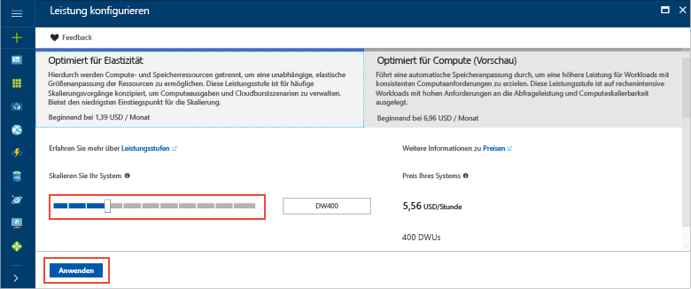

# <a name="tutorial-load-data-to-azure-sql-data-warehouse"></a>Tutorial: Laden von Daten in Azure SQL Data Warehouse

In diesem Tutorial wird PolyBase zum Laden des Data Warehouse „WideWorldImportersDW“ aus Azure-Blobspeicher in Azure SQL Data Warehouse verwendet. In diesem Tutorial werden das [Azure-Portal](https://portal.azure.com) und [SQL Server Management Studio](/sql/ssms/download-sql-server-management-studio-ssms) (SSMS) für folgende Zwecke verwendet: 

> [!div class="checklist"]
> * Erstellen eines Data Warehouse im Azure-Portal
> * Einrichten einer Firewallregel auf Serverebene im Azure-Portal
> * Herstellen einer Verbindung mit dem Data Warehouse mit SSMS
> * Erstellen eines festgelegten Benutzers zum Laden von Daten
> * Erstellen von externen Tabellen, für die Azure-Blobs als Datenquelle verwendet werden
> * Verwenden der T-SQL-Anweisung CTAS zum Laden von Daten in das Data Warehouse
> * Anzeigen des Fortschritts beim Laden von Daten
> * Generieren von Daten für ein Jahr in der Datumsdimension und in Tabellen mit Umsatzdaten
> * Erstellen von Statistiken für die neu geladenen Daten

Wenn Sie kein Azure-Abonnement besitzen, können Sie ein [kostenloses Konto](https://azure.microsoft.com/free/) erstellen, bevor Sie beginnen.

## <a name="before-you-begin"></a>Voraussetzungen

Bevor Sie mit diesem Tutorial beginnen, laden Sie die neueste Version von [SQL Server Management Studio](/sql/ssms/download-sql-server-management-studio-ssms) (SSMS) herunter, und installieren Sie sie.


## <a name="log-in-to-the-azure-portal"></a>Anmelden beim Azure-Portal

Melden Sie sich beim [Azure-Portal](https://portal.azure.com/)an.

## <a name="create-a-blank-sql-data-warehouse"></a>Erstellen eines leeren SQL Data Warehouse

Ein Azure SQL Data Warehouse wird mit einer definierten Gruppe von [Computeressourcen](memory-and-concurrency-limits.md) erstellt. Die Datenbank wird in einer [Azure-Ressourcengruppe](../azure-resource-manager/resource-group-overview.md) und auf einem [logischen Azure SQL-Server](../sql-database/sql-database-features.md) erstellt. 

Führen Sie die folgenden Schritte aus, um eine leere SQL Data Warehouse-Instanz zu erstellen. 

1. Klicken Sie im Azure-Portal links oben auf **Ressource erstellen**.

2. Wählen Sie auf der Seite **Neu** die Option **Datenbanken** und dann auf der Seite **Neu** unter **Ausgewählte** die Option **SQL Data Warehouse** aus.

    

3. Füllen Sie das SQL Data Warehouse-Formular mit den folgenden Informationen aus:   

   | Einstellung | Empfohlener Wert | BESCHREIBUNG | 
   | ------- | --------------- | ----------- | 
   | **Datenbankname** | SampleDW | Gültige Datenbanknamen finden Sie unter [Database Identifiers](/sql/relational-databases/databases/database-identifiers) (Datenbankbezeichner). | 
   | **Abonnement** | Ihr Abonnement  | Ausführliche Informationen zu Ihren Abonnements finden Sie unter [Abonnements](https://account.windowsazure.com/Subscriptions). |
   | **Ressourcengruppe** | SampleRG | Gültige Ressourcengruppennamen finden Sie unter [Naming rules and restrictions](https://docs.microsoft.com/azure/architecture/best-practices/naming-conventions) (Benennungsregeln und Einschränkungen). |
   | **Quelle auswählen** | Leere Datenbank | Gibt an, dass eine leere Datenbank erstellt werden soll. Hinweis: Ein Data Warehouse ist ein Datenbanktyp.|

    

4. Klicken Sie auf **Server**, um einen neuen Server für Ihre neue Datenbank zu erstellen und zu konfigurieren. Füllen Sie das Formular **Neuer Server** mit den folgenden Informationen aus: 

    | Einstellung | Empfohlener Wert | BESCHREIBUNG | 
    | ------- | --------------- | ----------- |
    | **Servername** | Ein global eindeutiger Name | Gültige Servernamen finden Sie unter [Naming rules and restrictions](https://docs.microsoft.com/azure/architecture/best-practices/naming-conventions) (Benennungsregeln und Einschränkungen). | 
    | **Serveradministratoranmeldung** | Ein gültiger Name | Gültige Anmeldenamen finden Sie unter [Database Identifiers](https://docs.microsoft.com/sql/relational-databases/databases/database-identifiers) (Datenbankbezeichner).|
    | **Kennwort** | Ein gültiges Kennwort | Ihr Kennwort muss mindestens acht Zeichen umfassen und Zeichen aus drei der folgenden Kategorien enthalten: Großbuchstaben, Kleinbuchstaben, Zahlen und nicht alphanumerische Zeichen. |
    | **Location** | Gültiger Standort | Informationen zu Regionen finden Sie unter [Azure-Regionen](https://azure.microsoft.com/regions/). |

    

5. Klicken Sie auf **Auswählen**.

6. Klicken Sie auf **Leistungsstufe**, um anzugeben, ob das Data Warehouse für Elastizität oder Compute optimiert wird, und um die Anzahl von Data Warehouse-Einheiten festzulegen. 

7. Wählen Sie für dieses Tutorial die Dienstebene **Optimiert für Elastizität** aus. Der Schieberegler ist standardmäßig auf **DW400** gesetzt.  Schieben Sie ihn nach oben und unten, um sich mit der Funktionsweise vertraut zu machen. 

    

8. Klicken Sie auf **Anwenden**.
9. Wählen Sie auf der Seite „SQL Data Warehouse“ eine **Sortierung** für die leere Datenbank aus. Verwenden Sie für dieses Tutorial den Standardwert. Weitere Informationen über Sortierungen finden Sie unter [Sortierungen](/sql/t-sql/statements/collations).

11. Nachdem Sie das SQL-Datenbank-Formular ausgefüllt haben, können Sie auf **Erstellen** klicken, um die Datenbank bereitzustellen. Die Bereitstellung dauert einige Minuten. 

    

12. Klicken Sie in der Symbolleiste auf **Benachrichtigungen**, um den Bereitstellungsprozess zu überwachen.
    
     

## <a name="create-a-server-level-firewall-rule"></a>Erstellen einer Firewallregel auf Serverebene

Der SQL Data Warehouse-Dienst erstellt eine Firewall auf Serverebene, um zu verhindern, dass externe Anwendungen und Tools eine Verbindung mit dem Server oder Datenbanken auf dem Server herstellen. Zum Herstellen von Konnektivität können Sie Firewallregeln hinzufügen, mit denen Konnektivität für bestimmte IP-Adressen ermöglicht wird.  Führen Sie die folgenden Schritte aus, um eine [Firewallregel auf Serverebene](../sql-database/sql-database-firewall-configure.md) für die IP-Adresse Ihres Clients zu erstellen. 

> [!NOTE]
> SQL Data Warehouse kommuniziert über Port 1433. Wenn Sie versuchen, eine Verbindung über ein Unternehmensnetzwerk herzustellen, wird ausgehender Datenverkehr über Port 1433 von der Firewall Ihres Netzwerks unter Umständen nicht zugelassen. In diesem Fall können Sie nur dann eine Verbindung mit Ihrem Azure SQL-Datenbank-Server herstellen, wenn Ihre IT-Abteilung Port 1433 öffnet.
>

1. Klicken Sie nach Abschluss der Bereitstellung im Menü auf der linken Seite auf **SQL-Datenbanken**, und klicken Sie dann auf der Seite **SQL-Datenbanken** auf **SampleDW**. Die Übersichtsseite für Ihre Datenbank wird geöffnet, die den vollqualifizierten Servernamen (z.B. **sample-svr.database.windows.net**) und Optionen für die weitere Konfiguration enthält. 

2. Kopieren Sie diesen vollqualifizierten Servernamen, um in den nachfolgenden Schnellstarts eine Verbindung mit Ihrem Server und den Datenbanken herzustellen. Klicken Sie auf den Servernamen, um die Servereinstellungen zu öffnen.

     

3. Klicken Sie auf den Servernamen, um die Servereinstellungen zu öffnen.

     

5. Klicken Sie auf **Firewalleinstellungen anzeigen**. Die Seite **Firewalleinstellungen** für den SQL-Datenbank-Server wird geöffnet. 

     

4.  Klicken Sie in der Symbolleiste auf **Client-IP-Adresse hinzufügen**, um Ihre aktuelle IP-Adresse einer neuen Firewallregel hinzuzufügen. Eine Firewallregel kann Port 1433 für eine einzelne IP-Adresse oder einen Bereich von IP-Adressen öffnen.

5. Klicken Sie auf **Speichern**. Für Ihre aktuelle IP-Adresse wird eine Firewallregel auf Serverebene erstellt, und auf dem logischen Server wird Port 1433 geöffnet.

6. Klicken Sie auf **OK**, und schließen Sie anschließend die Seite **Firewalleinstellungen**.

Jetzt können Sie mithilfe dieser IP-Adresse eine Verbindung mit dem SQL-Server und den zugehörigen Data Warehouses herstellen. Die Verbindung über SQL Server Management Studio oder ein anderes Tool Ihrer Wahl hergestellt werden. Verwenden Sie zum Herstellen der Verbindung das Serveradministratorkonto, das Sie zuvor erstellt haben.  

> [!IMPORTANT]
> Standardmäßig ist der Zugriff über die SQL-Datenbank-Firewall für alle Azure-Dienste aktiviert. Klicken Sie auf dieser Seite auf **AUS** und dann auf **Speichern**, um die Firewall für alle Azure-Dienste zu deaktivieren.

## <a name="get-the-fully-qualified-server-name"></a>Abrufen des vollqualifizierten Servernamens

Rufen Sie den vollqualifizierten Servernamen für Ihren SQL-Server im Azure-Portal ab. Später verwenden Sie den vollqualifizierten Namen zum Herstellen einer Verbindung mit dem Server.

1. Melden Sie sich beim [Azure-Portal](https://portal.azure.com/)an.
2. Wählen Sie im Menü auf der linken Seite die Option **SQL-Datenbanken**, und klicken Sie auf der Seite **SQL-Datenbanken** auf Ihre Datenbank. 
3. Suchen Sie im Azure-Portal auf der Seite für Ihre Datenbank unter **Zusammenfassung** nach Ihrer Datenbank, und kopieren Sie den **Servernamen**. In diesem Beispiel lautet der vollqualifizierte Name „mynewserver-20171113.database.windows.net“. 

      

## <a name="connect-to-the-server-as-server-admin"></a>Herstellen einer Verbindung mit dem Server als Serveradministrator

In diesem Abschnitt wird [SQL Server Management Studio](/sql/ssms/download-sql-server-management-studio-ssms) zum Herstellen einer Verbindung mit Ihrem Azure SQL-Server verwendet.

1. Öffnen Sie SQL Server Management Studio.

2. Geben Sie im Dialogfeld **Mit Server verbinden** die folgenden Informationen ein:

    | Einstellung      | Empfohlener Wert | BESCHREIBUNG | 
    | ------------ | --------------- | ----------- | 
    | Servertyp | Datenbank-Engine | Dieser Wert ist erforderlich. |
    | Servername | Der vollqualifizierte Servername | **sample-svr.database.windows.net** ist beispielsweise ein vollqualifizierter Servername. |
    | Authentication | SQL Server-Authentifizierung | In diesem Tutorial ist die SQL-Authentifizierung der einzige konfigurierte Authentifizierungstyp. |
    | Anmeldung | Das Serveradministratorkonto | Hierbei handelt es sich um das Konto, das Sie beim Erstellen des Servers angegeben haben. |
    | Password | Das Kennwort für das Serveradministratorkonto | Hierbei handelt es sich um das Kennwort, das Sie beim Erstellen des Servers angegeben haben. |

    

4. Klicken Sie auf **Verbinden**. Die Objekt-Explorer-Fenster wird in SSMS geöffnet. 

5. Erweitern Sie im Objekt-Explorer die Option **Datenbanken**. Erweitern Sie dann **Systemdatenbanken** und **Master**, um die Objekte in der Masterdatenbank anzuzeigen.  Erweitern Sie **mySampleDatabase**, um die Objekte in der neuen Datenbank anzuzeigen.

     

## <a name="create-a-user-for-loading-data"></a>Erstellen eines Benutzers zum Laden von Daten

Das Serveradministratorkonto dient zum Ausführen von Verwaltungsvorgänge und eignet sich nicht zum Ausführen von Abfragen für Benutzerdaten. Das Laden von Daten ist ein speicherintensiver Vorgang. Arbeitsspeicher-Höchstwerte werden entsprechend der verwendeten SQL Data Warehouse-Generation, der [Data Warehouse-Einheiten](what-is-a-data-warehouse-unit-dwu-cdwu.md) und der [Ressourcenklasse](resource-classes-for-workload-management.md) definiert. 

Es wird empfohlen, eine Anmeldung und einen Benutzer speziell zum Laden von Daten zu erstellen. Fügen Sie dann den Benutzer für das Laden einer [Ressourcenklasse](resource-classes-for-workload-management.md) hinzu, die eine geeignete maximale Speicherbelegung ermöglicht.

Da Sie momentan als Serveradministrator verbunden sind, können Sie Anmeldungen und Benutzer erstellen. Führen Sie die folgenden Schritte aus, um eine Anmeldung und einen Benutzer mit dem Namen **LoaderRC60** zu erstellen. Weisen Sie den Benutzer dann der Ressourcenklasse **staticrc60** zu. 

1.  Klicken Sie in SSMS mit der rechten Maustaste auf **Master**, um ein Dropdownmenü anzuzeigen, und wählen Sie **Neue Abfrage** aus. Ein neues Abfragefenster wird geöffnet.

    

2. Geben Sie im Abfragefenster die folgenden T-SQL-Befehle ein, um eine Anmeldung und einen Benutzer mit dem Namen „LoaderRC60“ zu erstellen, und ersetzen Sie dabei Ihr eigenes Kennwort durch „a123STRONGpassword!“. 

    ```sql
    CREATE LOGIN LoaderRC60 WITH PASSWORD = 'a123STRONGpassword!';
    CREATE USER LoaderRC60 FOR LOGIN LoaderRC60;
    ```

3. Klicken Sie auf **Ausführen**.

4. Klicken Sie mit der rechten Maustaste auf **SampleDW**, und wählen Sie **Neue Abfrage**. Ein neues Abfragefenster wird geöffnet.  

    
 
5. Geben Sie die folgenden T-SQL-Befehle ein, um einen Datenbankbenutzer mit dem Namen „LoaderRC60“ für die Anmeldung „LoaderRC60“ zu erstellen. Die zweite Zeile gewährt dem neuen Benutzer CONTROL-Berechtigungen für das neue Data Warehouse.  Diese Berechtigungen ähneln der Festlegung des Benutzers als Besitzer der Datenbank. Die dritte Zeile fügt den neuen Benutzer als Mitglied der [Ressourcenklasse](resource-classes-for-workload-management.md) „staticrc60“ hinzu.

    ```sql
    CREATE USER LoaderRC60 FOR LOGIN LoaderRC60;
    GRANT CONTROL ON DATABASE::[SampleDW] to LoaderRC60;
    EXEC sp_addrolemember 'staticrc60', 'LoaderRC60';
    ```

6. Klicken Sie auf **Ausführen**.

## <a name="connect-to-the-server-as-the-loading-user"></a>Herstellen einer Verbindung mit dem Server als ladender Benutzer

Im ersten Schritt zum Laden von Daten melden Sie sich als „LoaderRC60“ an.  

1. Klicken Sie im Objekt-Explorer auf das Dropdownmenü **Verbinden**, und wählen Sie **Datenbank-Engine** aus. Das Dialogfeld **Mit Server verbinden** wird angezeigt.

    

2. Geben Sie den vollqualifizierten Servernamen und dann **LoaderRC60** als Anmeldenamen ein.  Geben Sie Ihr Kennwort für „LoaderRC60“ ein.

3. Klicken Sie auf **Verbinden**.

4. Wenn die Verbindung bereitsteht, werden zwei Serververbindungen im Objekt-Explorer angezeigt: eine Verbindung als „ServerAdmin“ und eine Verbindung als „LoaderRC60“.

    

## <a name="create-external-tables-and-objects"></a>Erstellen von externen Tabellen und Objekten

Sie können nun mit dem Laden von Daten in das neue Data Warehouse beginnen. Informationen zum Übertragen Ihrer Daten in Azure-Blobspeicher oder zum direkten Laden der Daten aus Ihrer Quelle in SQL Data Warehouse finden Sie in der [Ladeübersicht](sql-data-warehouse-overview-load.md).

Führen Sie die folgenden SQL-Skripts aus, um Informationen zu den Daten anzugeben, die Sie laden möchten. Diese Informationen umfassen den aktuellen Speicherort der Daten, das Format des Dateninhalts und die Tabellendefinition für die Daten. Die Daten befinden sich in einem öffentlichen Azure-Blob.

1. Im vorherigen Abschnitt haben Sie sich als „LoaderRC60“ beim Data Warehouse angemeldet. Klicken Sie in SSMS unter Ihrer LoaderRC60-Verbindung mit der rechten Maustaste auf **SampleDW**, und wählen Sie **Neue Abfrage**.  Ein neues Abfragefenster wird angezeigt. 

    

2. Vergleichen Sie Ihr Abfragefenster mit der Abbildung oben.  Überprüfen Sie, ob das neue Abfragefenster als „LoaderRC60“ ausgeführt wird und Abfragen für die Datenbank „SampleDW“ durchgeführt werden. Verwenden Sie dieses Abfragefenster zum Ausführen aller Ladeschritte.

3. Erstellen Sie einen Hauptschlüssel für die Datenbank „SampleDW“. Der Hauptschlüssel muss nur jeweils einmal pro Datenbank erstellt werden. 

    ```sql
    CREATE MASTER KEY;
    ```

4. Führen Sie die folgende Anweisung [CREATE EXTERNAL DATA SOURCE](/sql/t-sql/statements/create-external-data-source-transact-sql) aus, um den Speicherort des Azure-Blobs zu definieren. Dies ist der Speicherort der externen Taxidaten.  Zum Ausführen eines Befehls, den Sie im Abfragefenster angefügt haben, markieren Sie die auszuführenden Befehle, und klicken Sie auf **Ausführen**.

    ```sql
    CREATE EXTERNAL DATA SOURCE WWIStorage
    WITH
    (
        TYPE = Hadoop,
        LOCATION = 'wasbs://wideworldimporters@sqldwholdata.blob.core.windows.net'
    );
    ```

5. Führen Sie die folgende T-SQL-Anweisung [CREATE EXTERNAL FILE FORMAT](/sql/t-sql/statements/create-external-file-format-transact-sql) aus, um die Formatierungseigenschaften und Optionen für die externe Datendatei anzugeben. Diese Anweisung gibt an, dass die externen Daten als Text gespeichert und die Werte durch senkrechte Striche („|“) getrennt sind.  

    ```sql
    CREATE EXTERNAL FILE FORMAT TextFileFormat 
    WITH 
    (   
        FORMAT_TYPE = DELIMITEDTEXT,
        FORMAT_OPTIONS
        (   
            FIELD_TERMINATOR = '|',
            USE_TYPE_DEFAULT = FALSE 
        )
    );
    ```

6.  Führen Sie die folgenden [CREATE SCHEMA](/sql/t-sql/statements/create-schema-transact-sql)-Anweisungen aus, um ein Schema für das externe Dateiformat zu erstellen. Das Schema „ext“ bietet eine Möglichkeit zum Organisieren der externen Tabellen, die Sie nun erstellen. Mit dem Schema „wwi“ werden die Standardtabellen organisiert, die die Daten enthalten. 

    ```sql
    CREATE SCHEMA ext;
    GO
    CREATE SCHEMA wwi;
    ```

7. Erstellen von externen Tabellen Die Tabellendefinitionen sind in SQL Data Warehouse gespeichert, aber die Tabellen verweisen auf Daten, die in Azure Blob Storage gespeichert sind. Führen Sie die folgenden T-SQL-Befehle aus, um mehrere externe Tabellen zu erstellen, die alle auf das Azure-Blob verweisen, das Sie zuvor in der externen Datenquelle definiert haben.

    ```sql
    CREATE EXTERNAL TABLE [ext].[dimension_City](
        [City Key] [int] NOT NULL,
        [WWI City ID] [int] NOT NULL,
        [City] [nvarchar](50) NOT NULL,
        [State Province] [nvarchar](50) NOT NULL,
        [Country] [nvarchar](60) NOT NULL,
        [Continent] [nvarchar](30) NOT NULL,
        [Sales Territory] [nvarchar](50) NOT NULL,
        [Region] [nvarchar](30) NOT NULL,
        [Subregion] [nvarchar](30) NOT NULL,
        [Location] [nvarchar](76) NULL,
        [Latest Recorded Population] [bigint] NOT NULL,
        [Valid From] [datetime2](7) NOT NULL,
        [Valid To] [datetime2](7) NOT NULL,
        [Lineage Key] [int] NOT NULL
    )
    WITH (LOCATION='/v1/dimension_City/',   
        DATA_SOURCE = WWIStorage,  
        FILE_FORMAT = TextFileFormat,
        REJECT_TYPE = VALUE,
        REJECT_VALUE = 0
    );  
    CREATE EXTERNAL TABLE [ext].[dimension_Customer] (
        [Customer Key] [int] NOT NULL,
        [WWI Customer ID] [int] NOT NULL,
        [Customer] [nvarchar](100) NOT NULL,
        [Bill To Customer] [nvarchar](100) NOT NULL,
        [Category] [nvarchar](50) NOT NULL,
        [Buying Group] [nvarchar](50) NOT NULL,
        [Primary Contact] [nvarchar](50) NOT NULL,
        [Postal Code] [nvarchar](10) NOT NULL,
        [Valid From] [datetime2](7) NOT NULL,
        [Valid To] [datetime2](7) NOT NULL,
        [Lineage Key] [int] NOT NULL
    )
    WITH (LOCATION='/v1/dimension_Customer/',   
        DATA_SOURCE = WWIStorage,  
        FILE_FORMAT = TextFileFormat,
        REJECT_TYPE = VALUE,
        REJECT_VALUE = 0
    );  
    CREATE EXTERNAL TABLE [ext].[dimension_Employee] (
        [Employee Key] [int] NOT NULL,
        [WWI Employee ID] [int] NOT NULL,
        [Employee] [nvarchar](50) NOT NULL,
        [Preferred Name] [nvarchar](50) NOT NULL,
        [Is Salesperson] [bit] NOT NULL,
        [Photo] [varbinary](300) NULL,
        [Valid From] [datetime2](7) NOT NULL,
        [Valid To] [datetime2](7) NOT NULL,
        [Lineage Key] [int] NOT NULL
    )
    WITH ( LOCATION='/v1/dimension_Employee/',   
        DATA_SOURCE = WWIStorage,  
        FILE_FORMAT = TextFileFormat,
        REJECT_TYPE = VALUE,
        REJECT_VALUE = 0
    );
    CREATE EXTERNAL TABLE [ext].[dimension_PaymentMethod] (
        [Payment Method Key] [int] NOT NULL,
        [WWI Payment Method ID] [int] NOT NULL,
        [Payment Method] [nvarchar](50) NOT NULL,
        [Valid From] [datetime2](7) NOT NULL,
        [Valid To] [datetime2](7) NOT NULL,
        [Lineage Key] [int] NOT NULL
    )
    WITH ( LOCATION ='/v1/dimension_PaymentMethod/',   
        DATA_SOURCE = WWIStorage,  
        FILE_FORMAT = TextFileFormat,
        REJECT_TYPE = VALUE,
        REJECT_VALUE = 0
    );
    CREATE EXTERNAL TABLE [ext].[dimension_StockItem](
        [Stock Item Key] [int] NOT NULL,
        [WWI Stock Item ID] [int] NOT NULL,
        [Stock Item] [nvarchar](100) NOT NULL,
        [Color] [nvarchar](20) NOT NULL,
        [Selling Package] [nvarchar](50) NOT NULL,
        [Buying Package] [nvarchar](50) NOT NULL,
        [Brand] [nvarchar](50) NOT NULL,
        [Size] [nvarchar](20) NOT NULL,
        [Lead Time Days] [int] NOT NULL,
        [Quantity Per Outer] [int] NOT NULL,
        [Is Chiller Stock] [bit] NOT NULL,
        [Barcode] [nvarchar](50) NULL,
        [Tax Rate] [decimal](18, 3) NOT NULL,
        [Unit Price] [decimal](18, 2) NOT NULL,
        [Recommended Retail Price] [decimal](18, 2) NULL,
        [Typical Weight Per Unit] [decimal](18, 3) NOT NULL,
        [Photo] [varbinary](300) NULL,
        [Valid From] [datetime2](7) NOT NULL,
        [Valid To] [datetime2](7) NOT NULL,
        [Lineage Key] [int] NOT NULL
    )
    WITH ( LOCATION ='/v1/dimension_StockItem/',   
        DATA_SOURCE = WWIStorage,  
        FILE_FORMAT = TextFileFormat,
        REJECT_TYPE = VALUE,
        REJECT_VALUE = 0
    );
    CREATE EXTERNAL TABLE [ext].[dimension_Supplier](
        [Supplier Key] [int] NOT NULL,
        [WWI Supplier ID] [int] NOT NULL,
        [Supplier] [nvarchar](100) NOT NULL,
        [Category] [nvarchar](50) NOT NULL,
        [Primary Contact] [nvarchar](50) NOT NULL,
        [Supplier Reference] [nvarchar](20) NULL,
        [Payment Days] [int] NOT NULL,
        [Postal Code] [nvarchar](10) NOT NULL,
        [Valid From] [datetime2](7) NOT NULL,
        [Valid To] [datetime2](7) NOT NULL,
        [Lineage Key] [int] NOT NULL
    )
    WITH ( LOCATION ='/v1/dimension_Supplier/',   
        DATA_SOURCE = WWIStorage,  
        FILE_FORMAT = TextFileFormat,
        REJECT_TYPE = VALUE,
        REJECT_VALUE = 0
    );
    CREATE EXTERNAL TABLE [ext].[dimension_TransactionType](
        [Transaction Type Key] [int] NOT NULL,
        [WWI Transaction Type ID] [int] NOT NULL,
        [Transaction Type] [nvarchar](50) NOT NULL,
        [Valid From] [datetime2](7) NOT NULL,
        [Valid To] [datetime2](7) NOT NULL,
        [Lineage Key] [int] NOT NULL
    )    
    WITH ( LOCATION ='/v1/dimension_TransactionType/',   
        DATA_SOURCE = WWIStorage,  
        FILE_FORMAT = TextFileFormat,
        REJECT_TYPE = VALUE,
        REJECT_VALUE = 0
    );
    CREATE EXTERNAL TABLE [ext].[fact_Movement] (
        [Movement Key] [bigint] NOT NULL,
        [Date Key] [date] NOT NULL,
        [Stock Item Key] [int] NOT NULL,
        [Customer Key] [int] NULL,
        [Supplier Key] [int] NULL,
        [Transaction Type Key] [int] NOT NULL,
        [WWI Stock Item Transaction ID] [int] NOT NULL,
        [WWI Invoice ID] [int] NULL,
        [WWI Purchase Order ID] [int] NULL,
        [Quantity] [int] NOT NULL,
        [Lineage Key] [int] NOT NULL
    )
    WITH ( LOCATION ='/v1/fact_Movement/',   
        DATA_SOURCE = WWIStorage,  
        FILE_FORMAT = TextFileFormat,
        REJECT_TYPE = VALUE,
        REJECT_VALUE = 0
    );
    CREATE EXTERNAL TABLE [ext].[fact_Order] (
        [Order Key] [bigint] NOT NULL,
        [City Key] [int] NOT NULL,
        [Customer Key] [int] NOT NULL,
        [Stock Item Key] [int] NOT NULL,
        [Order Date Key] [date] NOT NULL,
        [Picked Date Key] [date] NULL,
        [Salesperson Key] [int] NOT NULL,
        [Picker Key] [int] NULL,
        [WWI Order ID] [int] NOT NULL,
        [WWI Backorder ID] [int] NULL,
        [Description] [nvarchar](100) NOT NULL,
        [Package] [nvarchar](50) NOT NULL,
        [Quantity] [int] NOT NULL,
        [Unit Price] [decimal](18, 2) NOT NULL,
        [Tax Rate] [decimal](18, 3) NOT NULL,
        [Total Excluding Tax] [decimal](18, 2) NOT NULL,
        [Tax Amount] [decimal](18, 2) NOT NULL,
        [Total Including Tax] [decimal](18, 2) NOT NULL,
        [Lineage Key] [int] NOT NULL
    )
    WITH ( LOCATION ='/v1/fact_Order/',   
        DATA_SOURCE = WWIStorage,  
        FILE_FORMAT = TextFileFormat,
        REJECT_TYPE = VALUE,
        REJECT_VALUE = 0
    );
    CREATE EXTERNAL TABLE [ext].[fact_Purchase] (
        [Purchase Key] [bigint] NOT NULL,
        [Date Key] [date] NOT NULL,
        [Supplier Key] [int] NOT NULL,
        [Stock Item Key] [int] NOT NULL,
        [WWI Purchase Order ID] [int] NULL,
        [Ordered Outers] [int] NOT NULL,
        [Ordered Quantity] [int] NOT NULL,
        [Received Outers] [int] NOT NULL,
        [Package] [nvarchar](50) NOT NULL,
        [Is Order Finalized] [bit] NOT NULL,
        [Lineage Key] [int] NOT NULL
    )
    WITH ( LOCATION ='/v1/fact_Purchase/',   
        DATA_SOURCE = WWIStorage,  
        FILE_FORMAT = TextFileFormat,
        REJECT_TYPE = VALUE,
        REJECT_VALUE = 0
    );
    CREATE EXTERNAL TABLE [ext].[fact_Sale] (
        [Sale Key] [bigint] NOT NULL,
        [City Key] [int] NOT NULL,
        [Customer Key] [int] NOT NULL,
        [Bill To Customer Key] [int] NOT NULL,
        [Stock Item Key] [int] NOT NULL,
        [Invoice Date Key] [date] NOT NULL,
        [Delivery Date Key] [date] NULL,
        [Salesperson Key] [int] NOT NULL,
        [WWI Invoice ID] [int] NOT NULL,
        [Description] [nvarchar](100) NOT NULL,
        [Package] [nvarchar](50) NOT NULL,
        [Quantity] [int] NOT NULL,
        [Unit Price] [decimal](18, 2) NOT NULL,
        [Tax Rate] [decimal](18, 3) NOT NULL,
        [Total Excluding Tax] [decimal](18, 2) NOT NULL,
        [Tax Amount] [decimal](18, 2) NOT NULL,
        [Profit] [decimal](18, 2) NOT NULL,
        [Total Including Tax] [decimal](18, 2) NOT NULL,
        [Total Dry Items] [int] NOT NULL,
        [Total Chiller Items] [int] NOT NULL,
        [Lineage Key] [int] NOT NULL
    )
    WITH ( LOCATION ='/v1/fact_Sale/',   
        DATA_SOURCE = WWIStorage,  
        FILE_FORMAT = TextFileFormat,
        REJECT_TYPE = VALUE,
        REJECT_VALUE = 0
    );
    CREATE EXTERNAL TABLE [ext].[fact_StockHolding] (
        [Stock Holding Key] [bigint] NOT NULL,
        [Stock Item Key] [int] NOT NULL,
        [Quantity On Hand] [int] NOT NULL,
        [Bin Location] [nvarchar](20) NOT NULL,
        [Last Stocktake Quantity] [int] NOT NULL,
        [Last Cost Price] [decimal](18, 2) NOT NULL,
        [Reorder Level] [int] NOT NULL,
        [Target Stock Level] [int] NOT NULL,
        [Lineage Key] [int] NOT NULL
    )
    WITH ( LOCATION ='/v1/fact_StockHolding/',   
        DATA_SOURCE = WWIStorage,  
        FILE_FORMAT = TextFileFormat,
        REJECT_TYPE = VALUE,
        REJECT_VALUE = 0
    );
    CREATE EXTERNAL TABLE [ext].[fact_Transaction] (
        [Transaction Key] [bigint] NOT NULL,
        [Date Key] [date] NOT NULL,
        [Customer Key] [int] NULL,
        [Bill To Customer Key] [int] NULL,
        [Supplier Key] [int] NULL,
        [Transaction Type Key] [int] NOT NULL,
        [Payment Method Key] [int] NULL,
        [WWI Customer Transaction ID] [int] NULL,
        [WWI Supplier Transaction ID] [int] NULL,
        [WWI Invoice ID] [int] NULL,
        [WWI Purchase Order ID] [int] NULL,
        [Supplier Invoice Number] [nvarchar](20) NULL,
        [Total Excluding Tax] [decimal](18, 2) NOT NULL,
        [Tax Amount] [decimal](18, 2) NOT NULL,
        [Total Including Tax] [decimal](18, 2) NOT NULL,
        [Outstanding Balance] [decimal](18, 2) NOT NULL,
        [Is Finalized] [bit] NOT NULL,
        [Lineage Key] [int] NOT NULL
    )
    WITH ( LOCATION ='/v1/fact_Transaction/',   
        DATA_SOURCE = WWIStorage,  
        FILE_FORMAT = TextFileFormat,
        REJECT_TYPE = VALUE,
        REJECT_VALUE = 0
    );
    ```

8. Erweitern Sie im Objekt-Explorer die Option „SampleDW“, um die Liste mit den externen Tabellen anzuzeigen, die Sie gerade erstellt haben.

    

## <a name="load-the-data-into-your-data-warehouse"></a>Laden der Daten in das Data Warehouse

In diesem Abschnitt werden die soeben definierten externen Tabellen verwendet, um die Beispieldaten aus dem Azure-Blob in SQL Data Warehouse zu laden.  

> [!NOTE]
> In diesem Tutorial werden die Daten direkt in die endgültige Tabelle geladen. In einer Produktionsumgebung verwenden Sie normalerweise CREATE TABLE AS SELECT für das Laden in eine Stagingtabelle. Während sich die Daten in der Stagingtabelle befinden, können Sie alle erforderlichen Transformationen durchführen. Zum Anfügen der Daten einer Stagingtabelle an eine Produktionstabelle können Sie die INSERT...SELECT-Anweisung verwenden. Weitere Informationen finden Sie unter [Einfügen von Daten in eine Produktionstabelle](guidance-for-loading-data.md#inserting-data-into-a-production-table).
> 

Das Skript verwendet die T-SQL-Anweisung [CREATE TABLE AS SELECT (CTAS)](/sql/t-sql/statements/create-table-as-select-azure-sql-data-warehouse), um die Daten aus Azure Storage Blob in neue Tabellen in Ihrem Data Warehouse zu laden. CTAS erstellt eine neue Tabelle basierend auf den Ergebnissen einer SELECT-Anweisung. Die neue Tabelle weist die gleichen Spalten und Datentypen wie die Ergebnisse der SELECT-Anweisung auf. Wenn mit der SELECT-Anweisung eine Auswahl aus einer externen Tabelle getroffen wird, importiert SQL Data Warehouse die Daten in eine relationale Tabelle im Data Warehouse. 

Mit diesem Skript werden keine Daten in die Tabellen „wwi.dimension_Date“ und „wwi.fact_Sales“ geladen. Diese Tabellen werden in einem späteren Schritt generiert, um sicherzustellen, dass die Tabellen über eine ausreichend große Anzahl von Zeilen verfügen.

1. Führen Sie das folgende Skript aus, um die Daten in neue Tabellen im Data Warehouse zu laden.

    ```sql
    CREATE TABLE [wwi].[dimension_City]
    WITH
    ( 
        DISTRIBUTION = REPLICATE,
        CLUSTERED COLUMNSTORE INDEX
    )
    AS
    SELECT * FROM [ext].[dimension_City]
    OPTION (LABEL = 'CTAS : Load [wwi].[dimension_City]')
    ;

    CREATE TABLE [wwi].[dimension_Customer]
    WITH
    ( 
        DISTRIBUTION = REPLICATE,
        CLUSTERED COLUMNSTORE INDEX
    )
    AS
    SELECT * FROM [ext].[dimension_Customer]
    OPTION (LABEL = 'CTAS : Load [wwi].[dimension_Customer]')
    ;

    CREATE TABLE [wwi].[dimension_Employee]
    WITH
    ( 
        DISTRIBUTION = REPLICATE,
        CLUSTERED COLUMNSTORE INDEX
    )
    AS
    SELECT * FROM [ext].[dimension_Employee]
    OPTION (LABEL = 'CTAS : Load [wwi].[dimension_Employee]')
    ;

    CREATE TABLE [wwi].[dimension_PaymentMethod]
    WITH
    ( 
        DISTRIBUTION = REPLICATE,
        CLUSTERED COLUMNSTORE INDEX
    )
    AS
    SELECT * FROM [ext].[dimension_PaymentMethod]
    OPTION (LABEL = 'CTAS : Load [wwi].[dimension_PaymentMethod]')
    ;

    CREATE TABLE [wwi].[dimension_StockItem]
    WITH
    ( 
        DISTRIBUTION = REPLICATE,
        CLUSTERED COLUMNSTORE INDEX
    )
    AS
    SELECT * FROM [ext].[dimension_StockItem]
    OPTION (LABEL = 'CTAS : Load [wwi].[dimension_StockItem]')
    ;

    CREATE TABLE [wwi].[dimension_Supplier]
    WITH
    ( 
        DISTRIBUTION = REPLICATE,
        CLUSTERED COLUMNSTORE INDEX
    )
    AS
    SELECT * FROM [ext].[dimension_Supplier]
    OPTION (LABEL = 'CTAS : Load [wwi].[dimension_Supplier]')
    ;

    CREATE TABLE [wwi].[dimension_TransactionType]
    WITH
    ( 
        DISTRIBUTION = REPLICATE,
        CLUSTERED COLUMNSTORE INDEX
    )
    AS
    SELECT * FROM [ext].[dimension_TransactionType]
    OPTION (LABEL = 'CTAS : Load [wwi].[dimension_TransactionType]')
    ;

    CREATE TABLE [wwi].[fact_Movement]
    WITH
    ( 
        DISTRIBUTION = HASH([Movement Key]),
        CLUSTERED COLUMNSTORE INDEX
    )
    AS
    SELECT * FROM [ext].[fact_Movement]
    OPTION (LABEL = 'CTAS : Load [wwi].[fact_Movement]')
    ;

    CREATE TABLE [wwi].[fact_Order]
    WITH
    ( 
        DISTRIBUTION = HASH([Order Key]),
        CLUSTERED COLUMNSTORE INDEX
    )
    AS
    SELECT * FROM [ext].[fact_Order]
    OPTION (LABEL = 'CTAS : Load [wwi].[fact_Order]')
    ;

    CREATE TABLE [wwi].[fact_Purchase]
    WITH
    ( 
        DISTRIBUTION = HASH([Purchase Key]),
        CLUSTERED COLUMNSTORE INDEX
    )
    AS
    SELECT * FROM [ext].[fact_Purchase]
    OPTION (LABEL = 'CTAS : Load [wwi].[fact_Purchase]')
    ;

    CREATE TABLE [wwi].[seed_Sale]
    WITH
    ( 
        DISTRIBUTION = HASH([WWI Invoice ID]),
        CLUSTERED COLUMNSTORE INDEX
    )
    AS
    SELECT * FROM [ext].[fact_Sale]
    OPTION (LABEL = 'CTAS : Load [wwi].[seed_Sale]')
    ;

    CREATE TABLE [wwi].[fact_StockHolding]
    WITH
    ( 
        DISTRIBUTION = HASH([Stock Holding Key]),
        CLUSTERED COLUMNSTORE INDEX
    )
    AS
    SELECT * FROM [ext].[fact_StockHolding]
    OPTION (LABEL = 'CTAS : Load [wwi].[fact_StockHolding]')
    ;

    CREATE TABLE [wwi].[fact_Transaction]
    WITH
    ( 
        DISTRIBUTION = HASH([Transaction Key]),
        CLUSTERED COLUMNSTORE INDEX
    )
    AS
    SELECT * FROM [ext].[fact_Transaction]
    OPTION (LABEL = 'CTAS : Load [wwi].[fact_Transaction]')
    ;
    ```

2. Sehen Sie Ihren Daten beim Laden zu. Sie laden mehrere GB an Daten und komprimieren diese in hoch performante gruppierte Columnstore-Indizes. Öffnen Sie ein neues Abfragefenster in „SampleDW“, und führen Sie die folgende Abfrage aus, um den Status des Ladevorgangs anzuzeigen. Nach dem Starten der Abfrage können Sie sich einen Kaffee und einen Imbiss holen, während SQL Data Warehouse einige anstrengende Arbeit erledigt.

    ```sql
    SELECT
        r.command,
        s.request_id,
        r.status,
        count(distinct input_name) as nbr_files,
        sum(s.bytes_processed)/1024/1024/1024 as gb_processed
    FROM 
        sys.dm_pdw_exec_requests r
        INNER JOIN sys.dm_pdw_dms_external_work s
        ON r.request_id = s.request_id
    WHERE
        r.[label] = 'CTAS : Load [wwi].[dimension_City]' OR
        r.[label] = 'CTAS : Load [wwi].[dimension_Customer]' OR
        r.[label] = 'CTAS : Load [wwi].[dimension_Employee]' OR
        r.[label] = 'CTAS : Load [wwi].[dimension_PaymentMethod]' OR
        r.[label] = 'CTAS : Load [wwi].[dimension_StockItem]' OR
        r.[label] = 'CTAS : Load [wwi].[dimension_Supplier]' OR
        r.[label] = 'CTAS : Load [wwi].[dimension_TransactionType]' OR
        r.[label] = 'CTAS : Load [wwi].[fact_Movement]' OR
        r.[label] = 'CTAS : Load [wwi].[fact_Order]' OR
        r.[label] = 'CTAS : Load [wwi].[fact_Purchase]' OR
        r.[label] = 'CTAS : Load [wwi].[fact_StockHolding]' OR
        r.[label] = 'CTAS : Load [wwi].[fact_Transaction]'
    GROUP BY
        r.command,
        s.request_id,
        r.status
    ORDER BY
        nbr_files desc, 
        gb_processed desc;
    ```

3. Zeigen Sie alle Systemabfragen an.

    ```sql
    SELECT * FROM sys.dm_pdw_exec_requests;
    ```

4. Freuen Sie sich darüber, dass Ihre Daten sauber in das Data Warehouse geladen werden.

    

## <a name="create-tables-and-procedures-to-generate-the-date-and-sales-tables"></a>Erstellen von Tabellen und Prozeduren zum Generieren der Tabellen „Date“ und „Sales“

In diesem Abschnitt werden die Tabellen „wwi.dimension_Date“ und „wwi.fact_Sales“ erstellt. Außerdem werden gespeicherte Prozeduren erstellt, mit denen Millionen von Zeilen in den Tabellen „wwi.dimension_Date“ und „wwi.fact_Sales“ generiert werden.

1. Erstellen Sie die Tabellen „dimension_Date“ und „fact_Sale“.  

    ```sql
    CREATE TABLE [wwi].[dimension_Date]
    (
        [Date] [datetime] NOT NULL,
        [Day Number] [int] NOT NULL,
        [Day] [nvarchar](10) NOT NULL,
        [Month] [nvarchar](10) NOT NULL,
        [Short Month] [nvarchar](3) NOT NULL,
        [Calendar Month Number] [int] NOT NULL,
        [Calendar Month Label] [nvarchar](20) NOT NULL,
        [Calendar Year] [int] NOT NULL,
        [Calendar Year Label] [nvarchar](10) NOT NULL,
        [Fiscal Month Number] [int] NOT NULL,
        [Fiscal Month Label] [nvarchar](20) NOT NULL,
        [Fiscal Year] [int] NOT NULL,
        [Fiscal Year Label] [nvarchar](10) NOT NULL,
        [ISO Week Number] [int] NOT NULL
    )
    WITH 
    (
        DISTRIBUTION = REPLICATE,
        CLUSTERED INDEX ([Date])
    );
    CREATE TABLE [wwi].[fact_Sale]
    (
        [Sale Key] [bigint] IDENTITY(1,1) NOT NULL,
        [City Key] [int] NOT NULL,
        [Customer Key] [int] NOT NULL,
        [Bill To Customer Key] [int] NOT NULL,
        [Stock Item Key] [int] NOT NULL,
        [Invoice Date Key] [date] NOT NULL,
        [Delivery Date Key] [date] NULL,
        [Salesperson Key] [int] NOT NULL,
        [WWI Invoice ID] [int] NOT NULL,
        [Description] [nvarchar](100) NOT NULL,
        [Package] [nvarchar](50) NOT NULL,
        [Quantity] [int] NOT NULL,
        [Unit Price] [decimal](18, 2) NOT NULL,
        [Tax Rate] [decimal](18, 3) NOT NULL,
        [Total Excluding Tax] [decimal](18, 2) NOT NULL,
        [Tax Amount] [decimal](18, 2) NOT NULL,
        [Profit] [decimal](18, 2) NOT NULL,
        [Total Including Tax] [decimal](18, 2) NOT NULL,
        [Total Dry Items] [int] NOT NULL,
        [Total Chiller Items] [int] NOT NULL,
        [Lineage Key] [int] NOT NULL
    )
    WITH
    (
        DISTRIBUTION = HASH ( [WWI Invoice ID] ),
        CLUSTERED COLUMNSTORE INDEX
    )
    ```

2. Erstellen Sie „[wwi].[InitialSalesDataPopulation]“, um die Anzahl von Zeilen in „[wwi].[seed_Sale]“ um das Achtfache zu erhöhen. 

    ```sql
    CREATE PROCEDURE [wwi].[InitialSalesDataPopulation] AS
    BEGIN
        INSERT INTO [wwi].[seed_Sale] (
            [Sale Key], [City Key], [Customer Key], [Bill To Customer Key], [Stock Item Key], [Invoice Date Key], [Delivery Date Key], [Salesperson Key], [WWI Invoice ID], [Description], [Package], [Quantity], [Unit Price], [Tax Rate], [Total Excluding Tax], [Tax Amount], [Profit], [Total Including Tax], [Total Dry Items], [Total Chiller Items], [Lineage Key]
        )
        SELECT
            [Sale Key], [City Key], [Customer Key], [Bill To Customer Key], [Stock Item Key], [Invoice Date Key], [Delivery Date Key], [Salesperson Key], [WWI Invoice ID], [Description], [Package], [Quantity], [Unit Price], [Tax Rate], [Total Excluding Tax], [Tax Amount], [Profit], [Total Including Tax], [Total Dry Items], [Total Chiller Items], [Lineage Key]
        FROM [wwi].[seed_Sale]

        INSERT INTO [wwi].[seed_Sale] (
            [Sale Key], [City Key], [Customer Key], [Bill To Customer Key], [Stock Item Key], [Invoice Date Key], [Delivery Date Key], [Salesperson Key], [WWI Invoice ID], [Description], [Package], [Quantity], [Unit Price], [Tax Rate], [Total Excluding Tax], [Tax Amount], [Profit], [Total Including Tax], [Total Dry Items], [Total Chiller Items], [Lineage Key]
        )
        SELECT
            [Sale Key], [City Key], [Customer Key], [Bill To Customer Key], [Stock Item Key], [Invoice Date Key], [Delivery Date Key], [Salesperson Key], [WWI Invoice ID], [Description], [Package], [Quantity], [Unit Price], [Tax Rate], [Total Excluding Tax], [Tax Amount], [Profit], [Total Including Tax], [Total Dry Items], [Total Chiller Items], [Lineage Key]
        FROM [wwi].[seed_Sale]

        INSERT INTO [wwi].[seed_Sale] (
            [Sale Key], [City Key], [Customer Key], [Bill To Customer Key], [Stock Item Key], [Invoice Date Key], [Delivery Date Key], [Salesperson Key], [WWI Invoice ID], [Description], [Package], [Quantity], [Unit Price], [Tax Rate], [Total Excluding Tax], [Tax Amount], [Profit], [Total Including Tax], [Total Dry Items], [Total Chiller Items], [Lineage Key]
        )
        SELECT
            [Sale Key], [City Key], [Customer Key], [Bill To Customer Key], [Stock Item Key], [Invoice Date Key], [Delivery Date Key], [Salesperson Key], [WWI Invoice ID], [Description], [Package], [Quantity], [Unit Price], [Tax Rate], [Total Excluding Tax], [Tax Amount], [Profit], [Total Including Tax], [Total Dry Items], [Total Chiller Items], [Lineage Key]
        FROM [wwi].[seed_Sale]
    END
    ```

3. Erstellen Sie diese gespeicherte Prozedur, mit der Zeilen in „wwi.dimension_Date“ eingefügt werden.

    ```sql
    CREATE PROCEDURE [wwi].[PopulateDateDimensionForYear] @Year [int] AS
    BEGIN
        IF OBJECT_ID('tempdb..#month', 'U') IS NOT NULL 
            DROP TABLE #month
        CREATE TABLE #month (
            monthnum int,
            numofdays int
        )
        WITH ( DISTRIBUTION = ROUND_ROBIN, heap )
        INSERT INTO #month
            SELECT 1, 31 UNION SELECT 2, CASE WHEN (@YEAR % 4 = 0 AND @YEAR % 100 <> 0) OR @YEAR % 400 = 0 THEN 29 ELSE 28 END UNION SELECT 3,31 UNION SELECT 4,30 UNION SELECT 5,31 UNION SELECT 6,30 UNION SELECT 7,31 UNION SELECT 8,31 UNION SELECT 9,30 UNION SELECT 10,31 UNION SELECT 11,30 UNION SELECT 12,31

        IF OBJECT_ID('tempdb..#days', 'U') IS NOT NULL 
            DROP TABLE #days
        CREATE TABLE #days (days int)
        WITH (DISTRIBUTION = ROUND_ROBIN, HEAP)

        INSERT INTO #days
            SELECT 1 UNION SELECT 2 UNION SELECT 3 UNION SELECT 4 UNION SELECT 5 UNION SELECT 6 UNION SELECT 7 UNION SELECT 8 UNION SELECT 9 UNION SELECT 10 UNION SELECT 11 UNION SELECT 12 UNION SELECT 13 UNION SELECT 14 UNION SELECT 15 UNION SELECT 16 UNION SELECT 17 UNION SELECT 18 UNION SELECT 19 UNION SELECT 20    UNION SELECT 21 UNION SELECT 22 UNION SELECT 23 UNION SELECT 24 UNION SELECT 25 UNION SELECT 26 UNION SELECT 27 UNION SELECT 28 UNION SELECT 29 UNION SELECT 30 UNION SELECT 31

        INSERT [wwi].[dimension_Date] (
            [Date], [Day Number], [Day], [Month], [Short Month], [Calendar Month Number], [Calendar Month Label], [Calendar Year], [Calendar Year Label], [Fiscal Month Number], [Fiscal Month Label], [Fiscal Year], [Fiscal Year Label], [ISO Week Number] 
        )
        SELECT
            CAST(CAST(monthnum AS VARCHAR(2)) + '/' + CAST([days] AS VARCHAR(3)) + '/' + CAST(@year AS CHAR(4)) AS DATE) AS [Date]
            ,DAY(CAST(CAST(monthnum AS VARCHAR(2)) + '/' + CAST([days] AS VARCHAR(3)) + '/' + CAST(@year AS CHAR(4)) AS DATE)) AS [Day Number]
            ,CAST(DATENAME(day, CAST(CAST(monthnum AS VARCHAR(2)) + '/' + CAST([days] AS VARCHAR(3)) + '/' + CAST(@year AS CHAR(4)) AS DATE)) AS NVARCHAR(10)) AS [Day]
            ,CAST(DATENAME(month, CAST(CAST(monthnum AS VARCHAR(2)) + '/' + CAST([days] AS VARCHAR(3)) + '/' + CAST(@year as char(4)) AS DATE)) AS nvarchar(10)) AS [Month]
            ,CAST(SUBSTRING(DATENAME(month, CAST(CAST(monthnum as varchar(2)) + '/' + CAST([days] as varchar(3)) + '/' + CAST(@year as char(4)) AS DATE)), 1, 3) AS nvarchar(3)) AS [Short Month]
            ,MONTH(CAST(CAST(monthnum as varchar(2)) + '/' + CAST([days] as varchar(3)) + '/' + CAST(@year as char(4)) AS DATE)) AS [Calendar Month Number]
            ,CAST(N'CY' + CAST(YEAR(CAST(CAST(monthnum as varchar(2)) + '/' + CAST([days] as varchar(3)) + '/' + CAST(@year as char(4)) AS DATE)) AS nvarchar(4)) + N'-' + SUBSTRING(DATENAME(month, CAST(CAST(monthnum as varchar(2)) + '/' + CAST([days] as varchar(3)) + '/' + CAST(@year as char(4)) AS DATE)), 1, 3) AS nvarchar(10)) AS [Calendar Month Label]
            ,YEAR(CAST(CAST(monthnum as varchar(2)) + '/' + CAST([days] as varchar(3)) + '/' + CAST(@year as char(4)) AS DATE)) AS [Calendar Year]
            ,CAST(N'CY' + CAST(YEAR(CAST(CAST(monthnum as varchar(2)) + '/' + CAST([days] as varchar(3)) + '/' + CAST(@year as char(4)) AS DATE)) AS nvarchar(4)) AS nvarchar(10)) AS [Calendar Year Label]
            ,CASE WHEN MONTH(CAST(CAST(monthnum as varchar(2)) + '/' + CAST([days] as varchar(3)) + '/' + CAST(@year as char(4)) AS DATE)) IN (11, 12)
            THEN MONTH(CAST(CAST(monthnum as varchar(2)) + '/' + CAST([days] as varchar(3)) + '/' + CAST(@year as char(4)) AS DATE)) - 10
            ELSE MONTH(CAST(CAST(monthnum as varchar(2)) + '/' + CAST([days] as varchar(3)) + '/' + CAST(@year as char(4)) AS DATE)) + 2 END AS [Fiscal Month Number]
            ,CAST(N'FY' + CAST(CASE WHEN MONTH(CAST(CAST(monthnum as varchar(2)) + '/' + CAST([days] as varchar(3)) + '/' + CAST(@year as char(4)) AS DATE)) IN (11, 12)
            THEN YEAR(CAST(CAST(monthnum as varchar(2)) + '/' + CAST([days] as varchar(3)) + '/' + CAST(@year as char(4)) AS DATE)) + 1
            ELSE YEAR(CAST(CAST(monthnum as varchar(2)) + '/' + CAST([days] as varchar(3)) + '/' + CAST(@year as char(4)) AS DATE)) END AS nvarchar(4)) + N'-' + SUBSTRING(DATENAME(month, CAST(CAST(monthnum as varchar(2)) + '/' + CAST([days] as varchar(3)) + '/' + CAST(@year as char(4)) AS DATE)), 1, 3) AS nvarchar(20)) AS [Fiscal Month Label]
            ,CASE WHEN MONTH(CAST(CAST(monthnum as varchar(2)) + '/' + CAST([days] as varchar(3)) + '/' + CAST(@year as char(4)) AS DATE)) IN (11, 12)
            THEN YEAR(CAST(CAST(monthnum as varchar(2)) + '/' + CAST([days] as varchar(3)) + '/' + CAST(@year as char(4)) AS DATE)) + 1
            ELSE YEAR(CAST(CAST(monthnum as varchar(2)) + '/' + CAST([days] as varchar(3)) + '/' + CAST(@year as char(4)) AS DATE)) END AS [Fiscal Year]
            ,CAST(N'FY' + CAST(CASE WHEN MONTH(CAST(CAST(monthnum as varchar(2)) + '/' + CAST([days] as varchar(3)) + '/' + CAST(@year as char(4)) AS DATE)) IN (11, 12)
            THEN YEAR(CAST(CAST(monthnum as varchar(2)) + '/' + CAST([days] as varchar(3)) + '/' + CAST(@year as char(4)) AS DATE)) + 1
            ELSE YEAR(CAST(CAST(monthnum as varchar(2)) + '/' + CAST([days] as varchar(3)) + '/' + CAST(@year as char(4)) AS DATE))END AS nvarchar(4)) AS nvarchar(10)) AS [Fiscal Year Label]
            , DATEPART(ISO_WEEK, CAST(CAST(monthnum as varchar(2)) + '/' + CAST([days] as varchar(3)) + '/' + CAST(@year as char(4)) AS DATE)) AS [ISO Week Number]
    FROM #month m
        CROSS JOIN #days d
    WHERE d.days <= m.numofdays

    DROP table #month;
    DROP table #days;
    END;
    ```
4. Erstellen Sie diese Prozedur, mit der die Tabellen „wwi.dimension_Date“ und „wwi.fact_Sales“ aufgefüllt werden. Bei diesem Vorgang wird „[wwi].[PopulateDateDimensionForYear]“ aufgerufen, um „wwi.dimension_Date“ aufzufüllen.

    ```sql
    CREATE PROCEDURE [wwi].[Configuration_PopulateLargeSaleTable] @EstimatedRowsPerDay [bigint],@Year [int] AS
    BEGIN
        SET NOCOUNT ON;
        SET XACT_ABORT ON;

        EXEC [wwi].[PopulateDateDimensionForYear] @Year;

        DECLARE @OrderCounter bigint = 0;
        DECLARE @NumberOfSalesPerDay bigint = @EstimatedRowsPerDay;
        DECLARE @DateCounter date; 
        DECLARE @StartingSaleKey bigint;
        DECLARE @MaximumSaleKey bigint = (SELECT MAX([Sale Key]) FROM wwi.seed_Sale);
        DECLARE @MaxDate date;
        SET @MaxDate = (SELECT MAX([Invoice Date Key]) FROM wwi.fact_Sale)
        IF ( @MaxDate < CAST(@YEAR AS CHAR(4)) + '1231') AND (@MaxDate > CAST(@YEAR AS CHAR(4)) + '0101')
            SET @DateCounter = @MaxDate
        ELSE
            SET @DateCounter= CAST(@Year as char(4)) + '0101';

        PRINT 'Targeting ' + CAST(@NumberOfSalesPerDay AS varchar(20)) + ' sales per day.';

        DECLARE @OutputCounter varchar(20);
        DECLARE @variance DECIMAL(18,10);
        DECLARE @VariantNumberOfSalesPerDay BIGINT;

        WHILE @DateCounter < CAST(@YEAR AS CHAR(4)) + '1231'
        BEGIN
            SET @OutputCounter = CONVERT(varchar(20), @DateCounter, 112);
            RAISERROR(@OutputCounter, 0, 1);
            SET @variance = (SELECT RAND() * 10)*.01 + .95
            SET @VariantNumberOfSalesPerDay = FLOOR(@NumberOfSalesPerDay * @variance)

            SET @StartingSaleKey = @MaximumSaleKey - @VariantNumberOfSalesPerDay - FLOOR(RAND() * 20000);
            SET @OrderCounter = 0;

            INSERT [wwi].[fact_Sale] (
                [City Key], [Customer Key], [Bill To Customer Key], [Stock Item Key], [Invoice Date Key], [Delivery Date Key], [Salesperson Key], [WWI Invoice ID], [Description], Package, Quantity, [Unit Price], [Tax Rate], [Total Excluding Tax], [Tax Amount], Profit, [Total Including Tax], [Total Dry Items], [Total Chiller Items], [Lineage Key]
            )
            SELECT TOP(@VariantNumberOfSalesPerDay)
                [City Key], [Customer Key], [Bill To Customer Key], [Stock Item Key], @DateCounter, DATEADD(day, 1, @DateCounter), [Salesperson Key], [WWI Invoice ID], [Description], Package, Quantity, [Unit Price], [Tax Rate], [Total Excluding Tax], [Tax Amount], Profit, [Total Including Tax], [Total Dry Items], [Total Chiller Items], [Lineage Key]
            FROM [wwi].[seed_Sale]
            WHERE 
                 --[Sale Key] > @StartingSaleKey and /* IDENTITY DOES NOT WORK THE SAME IN SQLDW AND CAN'T USE THIS METHOD FOR VARIANT */
                [Invoice Date Key] >=cast(@YEAR AS CHAR(4)) + '-01-01'
            ORDER BY [Sale Key];

            SET @DateCounter = DATEADD(day, 1, @DateCounter);
        END;

    END;
    ```

## <a name="generate-millions-of-rows"></a>Millionen von Zeilen generieren
Verwenden Sie die gespeicherten Prozeduren, die Sie zum Generieren von Millionen von Zeilen in der Tabelle „wwi.fact_Sales“ und der entsprechenden Daten in der Tabelle „wwi.dimension_Date“ erstellt haben. 


1. Führen Sie dieses Verfahren aus, um „[wwi].[seed_Sale]“ mit mehr Zeilen anzulegen.

    ```sql    
    EXEC [wwi].[InitialSalesDataPopulation]
    ```

2. Führen Sie dieses Verfahren aus, um „wwi.fact_Sales“ mit 100.000 Zeilen pro Tag für jeden Tag des Jahres 2000 aufzufüllen.

    ```sql
    EXEC [wwi].[Configuration_PopulateLargeSaleTable] 100000, 2000
    ```
3. Die Datengenerierung im vorherigen Schritt kann eine Weile dauern, während das Jahr durchlaufen wird.  Öffnen Sie eine neue Abfrage, und führen Sie diesen SQL-Befehl aus, um anzuzeigen, bei welchem Tag sich der Prozess gerade befindet:

    ```sql
    SELECT MAX([Invoice Date Key]) FROM wwi.fact_Sale;
    ```

4. Führen Sie den folgenden Befehl aus, um den genutzten Speicherplatz anzuzeigen.

    ```sql
    EXEC sp_spaceused N'wwi.fact_Sale';
    ```

## <a name="populate-the-replicated-table-cache"></a>Auffüllen des replizierten Tabellencaches
SQL Data Warehouse repliziert eine Tabelle, indem die Daten auf jedem Computeknoten zwischengespeichert werden. Der Cache wird aufgefüllt, wenn eine Abfrage für die Tabelle ausgeführt wird. Aus diesem Grund kann für die erste Abfrage einer replizierten Tabelle zusätzliche Zeit zum Auffüllen des Caches erforderlich sein. Nachdem der Cache aufgefüllt wurde, werden Abfragen für replizierte Tabellen schneller ausgeführt.

Führen Sie diese SQL-Abfragen aus, um den replizierten Tabellencache auf den Computeknoten aufzufüllen. 

    ```sql
    SELECT TOP 1 * FROM [wwi].[dimension_City];
    SELECT TOP 1 * FROM [wwi].[dimension_Customer];
    SELECT TOP 1 * FROM [wwi].[dimension_Date];
    SELECT TOP 1 * FROM [wwi].[dimension_Employee];
    SELECT TOP 1 * FROM [wwi].[dimension_PaymentMethod];
    SELECT TOP 1 * FROM [wwi].[dimension_StockItem];
    SELECT TOP 1 * FROM [wwi].[dimension_Supplier];
    SELECT TOP 1 * FROM [wwi].[dimension_TransactionType];
    ```

## <a name="create-statistics-on-newly-loaded-data"></a>Erstellen von Statistiken für die neu geladenen Daten

Um eine hohe Abfrageleistung zu erzielen, ist es wichtig, nach dem ersten Laden Statistiken für jede Spalte der einzelnen Tabelle zu erstellen. Es ist auch wichtig, Statistiken nach wesentlichen Änderungen an den Daten zu aktualisieren. 

1. Erstellen Sie diese gespeicherte Prozedur, mit der Statistiken in allen Spalten aller Tabellen aktualisiert werden.

    ```sql
    CREATE PROCEDURE    [dbo].[prc_sqldw_create_stats]
    (   @create_type    tinyint -- 1 default 2 Fullscan 3 Sample
    ,   @sample_pct     tinyint
    )
    AS

    IF @create_type IS NULL
    BEGIN
        SET @create_type = 1;
    END;

    IF @create_type NOT IN (1,2,3)
    BEGIN
        THROW 151000,'Invalid value for @stats_type parameter. Valid range 1 (default), 2 (fullscan) or 3 (sample).',1;
    END;

    IF @sample_pct IS NULL
    BEGIN;
        SET @sample_pct = 20;
    END;

    IF OBJECT_ID('tempdb..#stats_ddl') IS NOT NULL
    BEGIN;
        DROP TABLE #stats_ddl;
    END;
    
    CREATE TABLE #stats_ddl
    WITH    (   DISTRIBUTION    = HASH([seq_nmbr])
            ,   LOCATION        = USER_DB
            )
    AS
    WITH T
    AS
    (
    SELECT      t.[name]                        AS [table_name]
    ,           s.[name]                        AS [table_schema_name]
    ,           c.[name]                        AS [column_name]
    ,           c.[column_id]                   AS [column_id]
    ,           t.[object_id]                   AS [object_id]
    ,           ROW_NUMBER()
                OVER(ORDER BY (SELECT NULL))    AS [seq_nmbr]
    FROM        sys.[tables] t
    JOIN        sys.[schemas] s         ON  t.[schema_id]       = s.[schema_id]
    JOIN        sys.[columns] c         ON  t.[object_id]       = c.[object_id]
    LEFT JOIN   sys.[stats_columns] l   ON  l.[object_id]       = c.[object_id]
                                        AND l.[column_id]       = c.[column_id]
                                        AND l.[stats_column_id] = 1
    LEFT JOIN    sys.[external_tables] e    ON    e.[object_id]        = t.[object_id]
    WHERE       l.[object_id] IS NULL
    AND            e.[object_id] IS NULL -- not an external table
    )
    SELECT  [table_schema_name]
    ,       [table_name]
    ,       [column_name]
    ,       [column_id]
    ,       [object_id]
    ,       [seq_nmbr]
    ,       CASE @create_type
            WHEN 1
            THEN    CAST('CREATE STATISTICS '+QUOTENAME('stat_'+table_schema_name+ '_' + table_name + '_'+column_name)+' ON '+QUOTENAME(table_schema_name)+'.'+QUOTENAME(table_name)+'('+QUOTENAME(column_name)+')' AS VARCHAR(8000))
            WHEN 2
            THEN    CAST('CREATE STATISTICS '+QUOTENAME('stat_'+table_schema_name+ '_' + table_name + '_'+column_name)+' ON '+QUOTENAME(table_schema_name)+'.'+QUOTENAME(table_name)+'('+QUOTENAME(column_name)+') WITH FULLSCAN' AS VARCHAR(8000))
            WHEN 3
            THEN    CAST('CREATE STATISTICS '+QUOTENAME('stat_'+table_schema_name+ '_' + table_name + '_'+column_name)+' ON '+QUOTENAME(table_schema_name)+'.'+QUOTENAME(table_name)+'('+QUOTENAME(column_name)+') WITH SAMPLE '+CONVERT(varchar(4),@sample_pct)+' PERCENT' AS VARCHAR(8000))
            END AS create_stat_ddl
    FROM T
    ;

    DECLARE @i INT              = 1
    ,       @t INT              = (SELECT COUNT(*) FROM #stats_ddl)
    ,       @s NVARCHAR(4000)   = N''
    ;

    WHILE @i <= @t
    BEGIN
        SET @s=(SELECT create_stat_ddl FROM #stats_ddl WHERE seq_nmbr = @i);
        PRINT @s
        EXEC sp_executesql @s
        SET @i+=1;
    END

    DROP TABLE #stats_ddl;
    ```

2. Führen Sie diesen Befehl aus, um Statistiken für alle Spalten aller Tabellen im Data Warehouse zu erstellen.

    ```sql
    EXEC [dbo].[prc_sqldw_create_stats] 1, NULL;
    ```

## <a name="clean-up-resources"></a>Bereinigen von Ressourcen

Es werden Ihnen Computeressourcen und Daten, die Sie in das Data Warehouse geladen haben, in Rechnung gestellt. Diese werden separat berechnet.  

Führen Sie die folgenden Schritte aus, um Ressourcen nach Wunsch zu bereinigen.

1. Melden Sie sich beim [Azure-Portal](https://portal.azure.com) an, und klicken Sie auf das Data Warehouse.

    

2. Falls Sie die Daten im Speicher belassen möchten, können Sie Computeressourcen anhalten, wenn Sie das Data Warehouse nicht verwenden. Durch das Anhalten von Computeressourcen wird Ihnen nur die Datenspeicherung berechnet, und Sie können die Computeressourcen fortsetzen, sobald Sie mit den Daten arbeiten möchten. Zum Anhalten von Computeressourcen klicken Sie auf die Schaltfläche **Anhalten**. Wenn das Data Warehouse angehalten ist, wird eine Schaltfläche **Starten** angezeigt.  Klicken Sie zum Fortsetzen der Computeressourcen auf **Starten**.

3. Wenn zukünftig keine Gebühren anfallen sollen, können Sie das Data Warehouse löschen. Wenn Sie das Data Warehouse entfernen möchten, damit keine Gebühren für Compute- oder Speicherressourcen anfallen, klicken Sie auf **Löschen**.

4. Zum Entfernen des erstellten SQL-Servers klicken Sie auf **sample-svr.database.windows.net** (siehe Abbildung oben) und dann auf **Löschen**.  Seien Sie dabei vorsichtig, denn durch das Löschen des Servers werden auch alle Datenbanken gelöscht, die dem Server zugewiesen sind.

5. Zum Entfernen der Ressourcengruppe klicken Sie auf **SampleRG** und dann auf **Ressourcengruppe löschen**.

## <a name="next-steps"></a>Nächste Schritte 
In diesem Tutorial haben Sie gelernt, wie ein Data Warehouse und ein Benutzer zum Laden von Daten erstellt werden. Sie haben externe Tabellen erstellt, um die Struktur für die in Azure Storage Blob gespeicherten Daten zu definieren, und dann die PolyBase-Anweisung „CREATE TABLE AS SELECT“ verwendet, um Daten in das Data Warehouse zu laden. 

Sie haben folgende Schritte ausgeführt:
> [!div class="checklist"]
> * Erstellen eines Data Warehouse im Azure-Portal
> * Einrichten einer Firewallregel auf Serverebene im Azure-Portal
> * Herstellen einer Verbindung mit dem Data Warehouse mit SSMS
> * Erstellen eines festgelegten Benutzers zum Laden von Daten
> * Erstellen externer Tabellen für Daten in Azure Storage Blob
> * Verwenden der T-SQL-Anweisung CTAS zum Laden von Daten in das Data Warehouse
> * Anzeigen des Fortschritts beim Laden von Daten
> * Erstellen von Statistiken für die neu geladenen Daten

Fahren Sie mit der Übersicht über die Migration fort, um zu erfahren, wie Sie eine vorhandene Datenbank in SQL Data Warehouse migrieren.

> [!div class="nextstepaction"]
>[Informationen zum Migrieren einer vorhandenen Datenbank in SQL Data Warehouse](sql-data-warehouse-overview-migrate.md)
