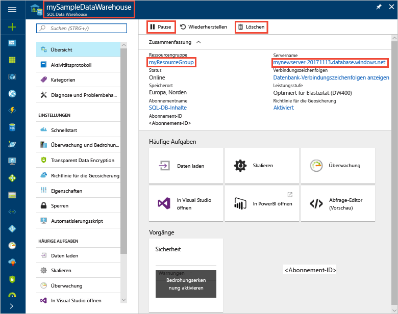

# <a name="quickstart-pause-and-resume-compute-in-azure-sql-data-warehouse-with-powershell"></a>Schnellstart: Anhalten und Fortsetzen von Computeressourcen in Azure SQL Data Warehouse mit PowerShell

Halten Sie Computeressourcen in Azure SQL Data Warehouse mithilfe von PowerShell an, um Kosten einzusparen. [Setzen Sie die Computeressourcen fort](sql-data-warehouse-manage-compute-overview.md), wenn Sie das Data Warehouse verwenden möchten.

Wenn Sie kein Azure-Abonnement besitzen, können Sie ein [kostenloses Konto](https://azure.microsoft.com/free/) erstellen, bevor Sie beginnen.

## <a name="before-you-begin"></a>Voraussetzungen

[!INCLUDE [updated-for-az](../../includes/updated-for-az.md)]

In diesem Schnellstart wird vorausgesetzt, dass Sie über ein SQL Data Warehouse verfügen, das Sie anhalten und fortsetzen können. Wenn Sie ein Data Warehouse erstellen müssen, können Sie mithilfe der Anweisungen unter [Erstellen und Verbinden – Portal](create-data-warehouse-portal.md) ein Data Warehouse namens **mySampleDataWarehouse** erstellen.

## <a name="log-in-to-azure"></a>Anmelden an Azure

Melden Sie sich mit dem Befehl [Connect-AzAccount](/powershell/module/az.accounts/connect-azaccount) bei Ihrem Azure-Abonnement an, und befolgen Sie die Anweisungen auf dem Bildschirm.

```powershell
Connect-AzAccount
```

Verwenden Sie [Get-AzSubscription](/powershell/module/az.accounts/get-azsubscription), um zu ermitteln, welches Abonnement Sie verwenden.

```powershell
Get-AzSubscription
```

Falls Sie ein anderes Abonnement als das Standardabonnement verwenden müssen, führen Sie [Set-AzContext](/powershell/module/az.accounts/set-azcontext) aus.

```powershell
Set-AzContext -SubscriptionName "MySubscription"
```

## <a name="look-up-data-warehouse-information"></a>Suche nach Informationen zum Data Warehouse

Suchen Sie nach dem Datenbanknamen, dem Servernamen und der Ressourcengruppe für das Data Warehouse, das Sie anhalten und fortsetzen möchten.

Führen Sie die folgenden Schritte aus, um nach Informationen zu Ihrem Data Warehouse zu suchen.

1. Melden Sie sich beim [Azure-Portal](https://portal.azure.com/) an.
2. Klicken Sie auf der linken Seite im Azure-Portal auf **SQL-Datenbanken**.
3. Wählen Sie auf der Seite **SQL-Datenbanken** den Eintrag **mySampleDataWarehouse** aus. Das Data Warehouse wird geöffnet.

    

4. Notieren Sie den Namen des Data Warehouse, das als Datenbankname verwendet wird. Notieren Sie außerdem den Servernamen und die Ressourcengruppe.
6. Wenn Ihr Server „foo.database.windows.net“ heißt, verwenden Sie in den PowerShell-Cmdlets nur den ersten Teil als Servername. In der Abbildung oben lautet der vollständige Servername „newserver-20171113.database.windows.net“. Löschen Sie das Suffix, und verwenden Sie im PowerShell-Cmdlet **newserver-20171113** als Servernamen.

## <a name="pause-compute"></a>Anhalten von Computeressourcen

Um Kosten zu sparen, können Sie Computeressourcen bei Bedarf anhalten und fortsetzen. Wenn Sie die Datenbank z.B. nachts oder am Wochenende nicht verwenden, können Sie sie während dieser Zeiträume anhalten und während des Tages wieder fortsetzen. Für Computeressourcen fallen keine Gebühren an, während die Datenbank angehalten ist. Allerdings wird Ihnen der Speicher weiterhin in Rechnung gestellt.

Wenn Sie eine Datenbank anhalten möchten, verwenden Sie das Cmdlet [Suspend-AzSqlDatabase](/powershell/module/az.sql/suspend-azsqldatabase). Im folgenden Beispiel wird ein Data Warehouse namens **mySampleDataWarehouse** angehalten, das auf einem Server mit dem Namen **newserver-20171113** gehostet wird. Der Server befindet sich in einer Azure-Ressourcengruppe namens **myResourceGroup**.


```Powershell
Suspend-AzSqlDatabase –ResourceGroupName "myResourceGroup" `
–ServerName "newserver-20171113" –DatabaseName "mySampleDataWarehouse"
```

In einer Variation ruft das nächste Beispiel die Datenbank in das $database-Objekt ab. Das Objekt wird dann an [Suspend-AzSqlDatabase](/powershell/module/az.sql/suspend-azsqldatabase) weitergereicht. Die Ergebnisse werden in dem Objekt „resultDatabase“ gespeichert. Der letzte Befehl zeigt die Ergebnisse an.

```Powershell
$database = Get-AzSqlDatabase –ResourceGroupName "myResourceGroup" `
–ServerName "newserver-20171113" –DatabaseName "mySampleDataWarehouse"
$resultDatabase = $database | Suspend-AzSqlDatabase
$resultDatabase
```


## <a name="resume-compute"></a>Fortsetzen von Computeressourcen

Verwenden Sie das Cmdlet [Resume-AzSqlDatabase](/powershell/module/az.sql/resume-azsqldatabase), um eine Datenbank zu starten. Im folgenden Beispiel wird eine Datenbank namens „mySampleDataWarehouse“ gestartet, die auf einem Server mit dem Namen „newserver-20171113“ gehostet wird. Der Server befindet sich in einer Azure-Ressourcengruppe namens „myResourceGroup“.

```Powershell
Resume-AzSqlDatabase –ResourceGroupName "myResourceGroup" `
–ServerName "newserver-20171113" -DatabaseName "mySampleDataWarehouse"
```

In einer Variation ruft das nächste Beispiel die Datenbank in das $database-Objekt ab. Anschließend wird das Objekt an [Resume-AzSqlDatabase](/powershell/module/az.sql/resume-azsqldatabase) weitergereicht, und die Ergebnisse werden in „$resultDatabase“ gespeichert. Der letzte Befehl zeigt die Ergebnisse an.

```Powershell
$database = Get-AzSqlDatabase –ResourceGroupName "ResourceGroup1" `
–ServerName "Server01" –DatabaseName "Database02"
$resultDatabase = $database | Resume-AzSqlDatabase
$resultDatabase
```

## <a name="check-status-of-your-data-warehouse-operation"></a>Überprüfen des Status Ihres Data Warehouse-Vorgangs

Verwenden Sie zum Überprüfen des Data Warehouse-Status das Cmdlet [Get-AzSqlDatabaseActivity](https://docs.microsoft.com/powershell/module/az.sql/Get-AzSqlDatabaseActivity#description).

```
Get-AzSqlDatabaseActivity -ResourceGroupName "ResourceGroup01" -ServerName "Server01" -DatabaseName "Database02"
```

## <a name="clean-up-resources"></a>Bereinigen von Ressourcen

Ihnen werden Gebühren für Ihre Data Warehouse-Einheiten und in Ihrem Data Warehouse gespeicherte Daten in Rechnung gestellt. Diese Compute- und Speicherressourcen werden separat in Rechnung gestellt.

- Wenn Sie die Daten im Speicher beibehalten möchten, halten Sie die Computeressourcen an.
- Wenn zukünftig keine Gebühren anfallen sollen, können Sie das Data Warehouse löschen.

Führen Sie die folgenden Schritte aus, um Ressourcen nach Wunsch zu bereinigen.

1. Melden Sie sich beim [Azure-Portal](https://portal.azure.com) an, und klicken Sie auf Ihr Data Warehouse.

    

2. Zum Anhalten von Computeressourcen klicken Sie auf die Schaltfläche **Anhalten**. Wenn das Data Warehouse angehalten ist, wird die Schaltfläche **Starten** angezeigt.  Klicken Sie zum Fortsetzen der Computeressourcen auf **Starten**.

3. Wenn Sie das Data Warehouse entfernen möchten, damit keine Gebühren für Compute- oder Speicherressourcen anfallen, klicken Sie auf **Löschen**.

4. Um die erstellte SQL Server-Instanz zu entfernen, klicken Sie auf **mynewserver-20171113.database.windows.net** und anschließend auf **Löschen**.  Seien Sie bei diesem Löschvorgang vorsichtig, da beim Löschen des Servers auch alle Datenbanken gelöscht werden, die dem Server zugewiesen sind.

5. Zum Entfernen der Ressourcengruppe klicken Sie auf **myResourceGroup**, und klicken Sie dann auf **Ressourcengruppe löschen**.


## <a name="next-steps"></a>Nächste Schritte

Sie haben die Computeressourcen für Ihr Data Warehouse angehalten und fortgesetzt. Weitere Informationen zu Azure SQL Data Warehouse erhalten Sie im Tutorial zum Laden von Daten.

> [!div class="nextstepaction"]
> [Laden von Daten in ein SQL-Data Warehouse](load-data-from-azure-blob-storage-using-polybase.md)
