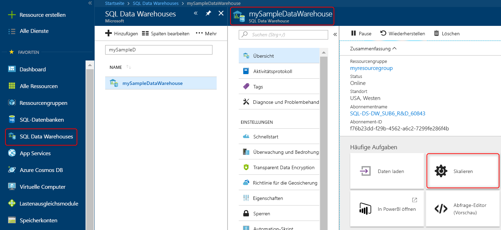

# Schnellstart: Skalieren von Computeressourcen in Azure SQL Data Warehouse im Azure-Portal

Skalieren Sie Computeressourcen in Azure SQL Data Warehouse im Azure-Portal. Skalieren Sie Computeressourcen hoch, um eine bessere Leistung zu erzielen, oder skalieren Sie sie herunter, um Kosten einzusparen. 

Wenn Sie kein Azure-Abonnement besitzen, können Sie ein [kostenloses Konto](https://azure.microsoft.com/free/) erstellen, bevor Sie beginnen.

## Melden Sie sich auf dem Azure-Portal an.

Melden Sie sich beim [Azure-Portal](https://portal.azure.com/) an.

## Voraussetzungen

Sie können ein bereits vorhandenes Data Warehouse skalieren oder mit dem [Schnellstart: Erstellen und Abfragen einer Azure SQL Data Warehouse-Instanz im Azure-Portal](create-data-warehouse-portal.md) ein Data Warehouse namens **mySampleDataWarehouse** erstellen.  Mit diesem Schnellstart wird **mySampleDataWarehouse** skaliert.

## Skalieren von Computeressourcen

Sie können in SQL Data Warehouse Computeressourcen durch Anpassen der Data Warehouse-Einheiten (DWUs) erhöhen oder verringern. Mit dem [Schnellstart: Erstellen und Abfragen einer Azure SQL Data Warehouse-Instanz im Azure-Portal](create-data-warehouse-portal.md) wurde **mySampleDataWarehouse** erstellt und mit 400 DWUs initialisiert. In den folgenden Schritten werden die DWUs für **mySampleDataWarehouse** angepasst.

So ändern Sie Data Warehouse-Einheiten

1. Klicken Sie auf der linken Seite im Azure-Portal auf **SQL-Datenbanken**.
2. Wählen Sie auf der Seite **SQL-Datenbanken** den Eintrag **mySampleDataWarehouse** aus. Das Data Warehouse wird geöffnet.
3. Klicken Sie auf **Skalieren**.

    

2. Verschieben Sie im Bereich „Skalieren“ den Schieberegler nach links oder rechts, um die DWU-Einstellung zu ändern.

    

3. Klicken Sie auf **Speichern**. Eine Bestätigungsmeldung wird angezeigt. Klicken Sie zur Bestätigung auf **Ja** oder zum Abbrechen auf **Nein**.

    

## Nächste Schritte
Sie haben nun erfahren, wie die Computeressourcen für Ihr Data Warehouse skaliert werden. Weitere Informationen zu Azure SQL Data Warehouse erhalten Sie im Tutorial zum Laden von Daten.

> [!div class="nextstepaction"]
>[Laden von Daten in ein SQL-Data Warehouse](load-data-from-azure-blob-storage-using-polybase.md)
