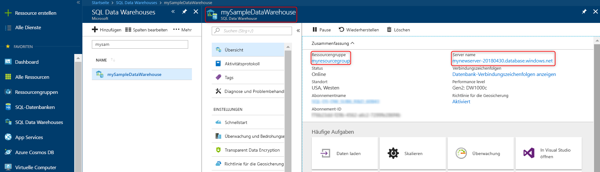

# <a name="quickstart-scale-compute-in-azure-sql-data-warehouse-in-powershell"></a>Schnellstart: Skalieren von Computeressourcen in Azure SQL Data Warehouse mithilfe von PowerShell

Skalieren Sie Computeressourcen in Azure SQL Data Warehouse mithilfe von PowerShell. [Skalieren Sie Computeressourcen zentral hoch](sql-data-warehouse-manage-compute-overview.md), um eine bessere Leistung zu erzielen, oder skalieren Sie sie zentral herunter, um Kosten einzusparen.

Wenn Sie kein Azure-Abonnement besitzen, können Sie ein [kostenloses Konto](https://azure.microsoft.com/free/) erstellen, bevor Sie beginnen.

## <a name="before-you-begin"></a>Voraussetzungen

[!INCLUDE [updated-for-az](../../includes/updated-for-az.md)]

In diesem Schnellstart wird vorausgesetzt, dass Sie über ein SQL Data Warehouse verfügen, das Sie skalieren können. Wenn Sie ein Data Warehouse erstellen müssen, verwenden Sie die Anweisungen unter [Erstellen und Verbinden – Portal](create-data-warehouse-portal.md), um ein Data Warehouse namens **mySampleDataWarehouse** zu erstellen.

## <a name="log-in-to-azure"></a>Anmelden an Azure

Melden Sie sich mit dem Befehl [Connect-AzAccount](/powershell/module/az.accounts/connect-azaccount) bei Ihrem Azure-Abonnement an, und befolgen Sie die Anweisungen auf dem Bildschirm.

```powershell
Connect-AzAccount
```

Verwenden Sie [Get-AzSubscription](/powershell/module/az.accounts/get-azsubscription), um zu ermitteln, welches Abonnement Sie verwenden.

```powershell
Get-AzSubscription
```

Falls Sie ein anderes Abonnement als das Standardabonnement verwenden müssen, führen Sie [Set-AzContext](/powershell/module/az.accounts/set-azcontext) aus.

```powershell
Set-AzContext -SubscriptionName "MySubscription"
```

## <a name="look-up-data-warehouse-information"></a>Suche nach Informationen zum Data Warehouse

Suchen Sie nach dem Datenbanknamen, dem Servernamen und der Ressourcengruppe für das Data Warehouse, das Sie anhalten und fortsetzen möchten.

Führen Sie die folgenden Schritte aus, um nach Informationen zu Ihrem Data Warehouse zu suchen.

1. Melden Sie sich beim [Azure-Portal](https://portal.azure.com/) an.
2. Klicken Sie auf der linken Seite im Azure-Portal auf **SQL Data Warehouses**.
3. Wählen Sie auf der Seite **SQL Data Warehouses** den Eintrag **mySampleDataWarehouse** aus. Hierdurch wird das Data Warehouse geöffnet.

    

4. Notieren Sie sich den Namen des Data Warehouse. Dieser wird als Datenbankname verwendet. Nicht vergessen: Ein Data Warehouse ist eine Art von Datenbank. Notieren Sie außerdem den Servernamen und die Ressourcengruppe. Sie verwenden diese Informationen in den Befehlen zum Anhalten und Fortsetzen.
5. Wenn Ihr Server „foo.database.windows.net“ heißt, verwenden Sie in den PowerShell-Cmdlets nur den ersten Teil als Servername. In der Abbildung oben lautet der vollständige Servername „newserver-20171113.database.windows.net“. Im PowerShell-Cmdlet wird als Servername **newserver-20180430** verwendet.

## <a name="scale-compute"></a>Skalieren von Computeressourcen

Sie können in SQL Data Warehouse Computeressourcen durch Anpassen der Data Warehouse-Einheiten (DWUs) erhöhen oder verringern. Mit dem [Schnellstart: Erstellen und Abfragen einer Azure SQL Data Warehouse-Instanz im Azure-Portal](create-data-warehouse-portal.md) wurde **mySampleDataWarehouse** erstellt und mit 400 DWUs initialisiert. In den folgenden Schritten werden die DWUs für **mySampleDataWarehouse** angepasst.

Um die Data Warehouse-Einheiten zu ändern, verwenden Sie das PowerShell-Cmdlet [Set AzSqlDatabase](/powershell/module/az.sql/set-azsqldatabase). Im folgenden Beispiel werden die Data Warehouse-Einheiten für die Datenbank **mySampleDataWarehouse**, die sich in der Ressourcengruppe **myResourceGroup** auf Server **mynewserver-20180430** befindet, auf DW300 gesetzt.

```Powershell
Set-AzSqlDatabase -ResourceGroupName "myResourceGroup" -DatabaseName "mySampleDataWarehouse" -ServerName "mynewserver-20171113" -RequestedServiceObjectiveName "DW300"
```

## <a name="check-data-warehouse-state"></a>Überprüfen des Data Warehouse-Zustands

Um den aktuellen Status des Data Warehouse zu ermitteln, verwenden Sie das PowerShell-Cmdlet [Get-AzSqlDatabase](/powershell/module/az.sql/get-azsqldatabase). Hiermit wird der Status der **mySampleDataWarehouse**-Datenbank in der Ressourcengruppe **myResourceGroup** und auf dem Server **mynewserver-20180430.database.windows.net** abgerufen.

```powershell
$database = Get-AzSqlDatabase -ResourceGroupName myResourceGroup -ServerName mynewserver-20171113 -DatabaseName mySampleDataWarehouse
$database
```

Das Ergebnis ähnelt folgendem:

```powershell
ResourceGroupName             : myResourceGroup
ServerName                    : mynewserver-20171113
DatabaseName                  : mySampleDataWarehouse
Location                      : North Europe
DatabaseId                    : 34d2ffb8-b70a-40b2-b4f9-b0a39833c974
Edition                       : DataWarehouse
CollationName                 : SQL_Latin1_General_CP1_CI_AS
CatalogCollation              :
MaxSizeBytes                  : 263882790666240
Status                        : Online
CreationDate                  : 11/20/2017 9:18:12 PM
CurrentServiceObjectiveId     : 284f1aff-fee7-4d3b-a211-5b8ebdd28fea
CurrentServiceObjectiveName   : DW300
RequestedServiceObjectiveId   : 284f1aff-fee7-4d3b-a211-5b8ebdd28fea
RequestedServiceObjectiveName :
ElasticPoolName               :
EarliestRestoreDate           :
Tags                          :
ResourceId                    : /subscriptions/xxxxxxxx-xxxx-xxxx-xxxx-xxxxxxxxxxxx/
                                resourceGroups/myResourceGroup/providers/Microsoft.Sql/servers/mynewserver-20171113/databases/mySampleDataWarehouse
CreateMode                    :
ReadScale                     : Disabled
ZoneRedundant                 : False
```

Den **Status** der Datenbank können Sie der Ausgabe entnehmen. In diesem Fall sehen Sie sich, dass diese Datenbank online ist.  Wenn Sie diesen Befehl ausführen, erhalten Sie als Statuswert entweder „Online“, „Wird angehalten“, „Wird fortgesetzt“, „Wird skaliert“ oder „Angehalten“.

Führen Sie den folgenden Befehl aus, um nur den Status anzuzeigen:

```powershell
$database | Select-Object DatabaseName,Status
```

## <a name="next-steps"></a>Nächste Schritte
Sie haben nun erfahren, wie die Computeressourcen für Ihr Data Warehouse skaliert werden. Weitere Informationen zu Azure SQL Data Warehouse erhalten Sie im Tutorial zum Laden von Daten.

> [!div class="nextstepaction"]
>[Laden von Daten in ein SQL-Data Warehouse](load-data-from-azure-blob-storage-using-polybase.md)
