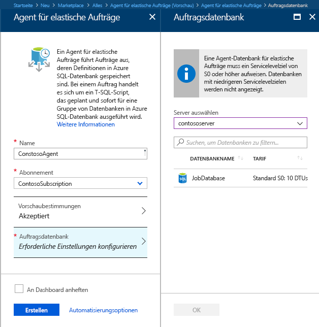
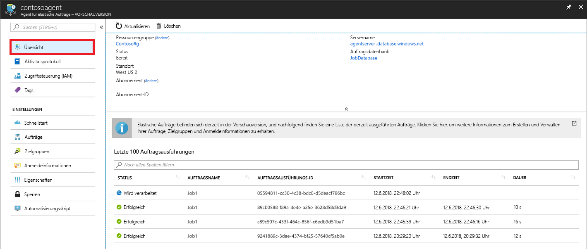
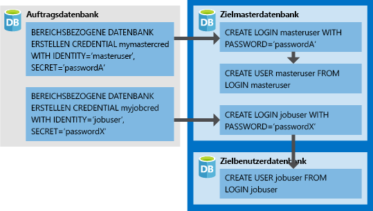

# <a name="create-configure-and-manage-elastic-jobs"></a>Erstellen, Konfigurieren und Verwalten von Aufträgen für die elastische Datenbank

In diesem Artikel erfahren Sie, wie Sie Aufträge für die elastische Datenbank erstellen, konfigurieren und verwalten. Falls Sie noch keine Aufträge für die elastische Datenbank verwendet haben, finden Sie [hier](sql-database-job-automation-overview.md) weitere Informationen zu den Auftragsautomatisierungskonzepten in Azure SQL-Datenbank.

## <a name="create-and-configure-the-agent"></a>Erstellen und Konfigurieren des Agents

1. Erstellen Sie eine leere SQL-Datenbank (S0 oder höher), oder geben Sie eine entsprechende Datenbank an. Diese Datenbank wird bei der Erstellung des Agents für elastische Aufträge als *Auftragsdatenbank* verwendet.
2. Erstellen Sie einen Agent für elastische Aufträge (entweder über das [Portal](https://portal.azure.com/#create/Microsoft.SQLElasticJobAgent) oder mithilfe von [PowerShell](elastic-jobs-powershell.md#create-the-elastic-job-agent)).

   

## <a name="create-run-and-manage-jobs"></a>Erstellen, Ausführen und Verwalten von Aufträgen

1. Erstellen Sie mithilfe von [PowerShell](elastic-jobs-powershell.md#create-job-credentials-so-that-jobs-can-execute-scripts-on-its-targets) oder [T-SQL](elastic-jobs-tsql.md#create-a-credential-for-job-execution) Anmeldeinformationen für die Auftragsausführung in der *Auftragsdatenbank*.
2. Definieren Sie mithilfe von [PowerShell](elastic-jobs-powershell.md#define-the-target-databases-you-want-to-run-the-job-against) oder [T-SQL](elastic-jobs-tsql.md#create-a-target-group-servers) die Zielgruppe (also die Datenbanken, für die der Auftrag ausgeführt werden soll).
3. Erstellen Sie in jeder Datenbank, für die der Auftrag ausgeführt wird, Anmeldeinformationen für den Auftrags-Agent, indem Sie [jeder Datenbank in der Gruppe den Benutzer (oder die Rolle) hinzufügen](sql-database-control-access.md). Ein Beispiel finden Sie im [PowerShell-Tutorial](elastic-jobs-powershell.md#create-job-credentials-so-that-jobs-can-execute-scripts-on-its-targets).
4. Erstellen Sie mithilfe von [PowerShell](elastic-jobs-powershell.md#create-a-job) oder [T-SQL](elastic-jobs-tsql.md#deploy-new-schema-to-many-databases) einen Auftrag.
5. Fügen Sie mithilfe von [PowerShell](elastic-jobs-powershell.md#create-a-job-step) oder [T-SQL](elastic-jobs-tsql.md#deploy-new-schema-to-many-databases) Auftragsschritte hinzu.
6. Führen Sie mithilfe von [PowerShell](elastic-jobs-powershell.md#run-the-job) oder [T-SQL](elastic-jobs-tsql.md#begin-ad-hoc-execution-of-a-job) einen Auftrag aus.
7. Überwachen Sie den Status der Auftragsausführung über das Portal oder mithilfe von [PowerShell](elastic-jobs-powershell.md#monitor-status-of-job-executions) oder [T-SQL](elastic-jobs-tsql.md#monitor-job-execution-status).

   

## <a name="credentials-for-running-jobs"></a>Anmeldeinformationen zum Ausführen von Aufträgen

Aufträge verwenden [datenbankweit gültige Anmeldeinformationen](/sql/t-sql/statements/create-database-scoped-credential-transact-sql), um bei der Ausführung eine Verbindung mit den in der Zielgruppe angegebenen Datenbanken herzustellen. Wenn eine Zielgruppe Server oder Pools enthält, wird unter Verwendung dieser datenbankweit gültigen Anmeldeinformationen eine Verbindung mit der Masterdatenbank hergestellt, um die verfügbaren Datenbanken aufzuzählen.

Die Einrichtung geeigneter Anmeldeinformationen für die Auftragsausführung kann etwas verwirrend sein. Berücksichtigen Sie daher folgende Punkte:

- Die datenbankweit gültigen Anmeldeinformationen müssen in der *Auftragsdatenbank* erstellt werden.
- **Für eine erfolgreiche Auftragsausführung müssen alle Zieldatenbanken über eine Anmeldung mit [ausreichenden Berechtigungen](https://docs.microsoft.com/sql/relational-databases/security/permissions-database-engine) verfügen** (`jobuser` im Diagramm weiter unten).
- Die Anmeldeinformationen können auftragsübergreifend verwendet werden. Die Kennwörter der Anmeldeinformationen sind außerdem verschlüsselt und vor Benutzern geschützt, die nur Lesezugriff auf Auftragsobjekte haben.

Die folgende Abbildung veranschaulicht das Konzept geeigneter Anmeldeinformationen und ist für die Einrichtung hilfreich. **Nicht vergessen: Der Benutzer muss in jeder Datenbank (alle Datenbanken vom Typ *target user db*) erstellt werden, für die der Auftrag ausgeführt werden soll.**



## <a name="security-best-practices"></a>Bewährte Methoden für die Sicherheit

Im Anschluss finden Sie einige Best Practices für die Verwendung von elastischen Aufträgen:

- Schränken Sie die Nutzung der APIs auf einen vertrauenswürdigen Personenkreis ein.
- Anmeldeinformationen sollten immer nur mit den für die Ausführung von Auftragsschritten erforderlichen Mindestberechtigungen ausgestattet sein. Weitere Informationen finden Sie unter [Autorisierung und Berechtigungen in SQL Server](https://docs.microsoft.com/dotnet/framework/data/adonet/sql/authorization-and-permissions-in-sql-server).
- Wenn der Zielgruppe ein Server und/oder Pool angehört, sollten Sie für die Masterdatenbank unbedingt separate Anmeldeinformationen mit Rechten zum Anzeigen/Auflisten der Datenbanken erstellen, um die Datenbanklisten der Server und/oder Pools vor der Auftragsausführung zu erweitern.

## <a name="agent-performance-capacity-and-limitations"></a>Leistung, Kapazität und Einschränkungen des Agents

Elastische Aufträge benötigen nur sehr wenig Computeressourcen, während sie auf den Abschluss von Aufträgen mit langer Ausführungszeit warten.

Die Compute- und Leistungsanforderungen, die der Agent an die *Auftragsdatenbank* stellt, hängen von der Größe der Zielgruppe mit den Datenbanken und der gewünschten Ausführungszeit für einen Auftrag (Anzahl gleichzeitiger Worker) ab: je mehr Ziele und je höher die Anzahl von Aufträgen, desto höher die Computeanforderungen.

Die Vorschauversion ist aktuell auf 100 gleichzeitige Aufträge beschränkt.

### <a name="prevent-jobs-from-reducing-target-database-performance"></a>Verhindern einer Leistungsbeeinträchtigung für die Zieldatenbank durch Aufträge

Die Anzahl von Datenbanken, für die ein Auftrag gleichzeitig ausgeführt werden kann, kann beschränkt werden, um sicherzustellen, dass es beim Ausführen von Aufträgen für Datenbanken in einem elastischen SQL-Pool nicht zu einer Überlastung der Ressourcen kommt.

## <a name="best-practices-for-creating-jobs"></a>Best Practices für die Auftragserstellung

### <a name="idempotent-scripts"></a>Idempotente Skripts
Die T-SQL-Skripts eines Auftrags müssen [idempotent](https://en.wikipedia.org/wiki/Idempotence) sein. **Idempotent** bedeutet, dass die erneute Ausführung eines bereits erfolgreich ausgeführten Skripts zum gleichen Ergebnis führt. Es kann vorkommen, dass ein Skript aufgrund von vorübergehenden Netzwerkproblemen nicht erfolgreich ausgeführt wird. In diesem Fall führt der Auftrag automatisch eine bestimmte Anzahl von Wiederholungsversuchen für das Skript aus. Ein idempotentes Skript führt auch bei mehrmaliger erfolgreicher Ausführung zum gleichen Ergebnis.

Vor dem Erstellen eines Objekts empfiehlt es sich, zu überprüfen, ob es bereits vorhanden ist.


```sql
IF NOT EXIST (some_object)
    -- Create the object
    -- If it exists, drop the object before recreating it.
```

Analog dazu muss auch ein Skript erfolgreich ausgeführt werden können, indem logische Tests durchgeführt werden und angemessen auf die vorgefundenen Bedingungen reagiert wird.


## <a name="next-steps"></a>Nächste Schritte

- [Erstellen und Verwalten von elastischen Aufträgen mithilfe von PowerShell](elastic-jobs-powershell.md)
- [Erstellen und Verwalten von Aufträgen für die elastische Datenbank mithilfe von Transact-SQL (T-SQL)](elastic-jobs-tsql.md)
