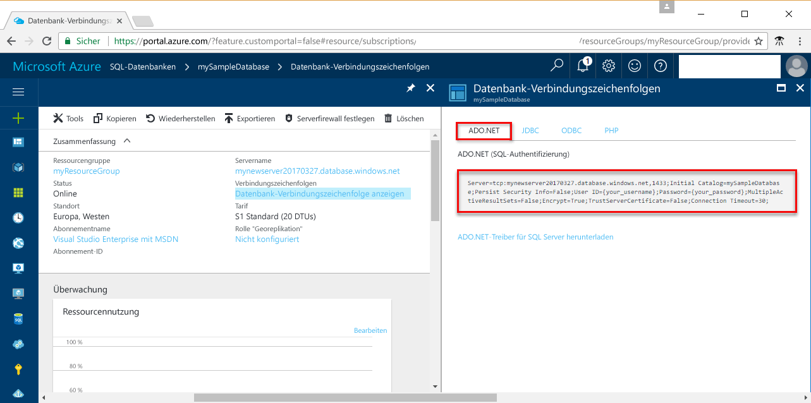

# <a name="use-net-core-c-to-query-an-azure-sql-database"></a>Abfragen einer Azure SQL-Datenbank mithilfe von .NET Core (C#)

In dieser Schnellstartanleitung erfahren Sie, wie Sie unter Verwendung von [.NET Core](https://www.microsoft.com/net/) unter Windows/Linux/macOS ein C#-Programm erstellen, das eine Verbindung mit einer Azure SQL-Datenbank herstellt, und mithilfe von Transact-SQL-Anweisungen Daten abfragen.

## <a name="prerequisites"></a>Voraussetzungen

Für diese Schnellstartanleitung benötigen Sie Folgendes:

[!INCLUDE [prerequisites-create-db](../../includes/sql-database-connect-query-prerequisites-create-db-includes.md)]

- Eine [Firewallregel auf Serverebene](sql-database-get-started-portal.md#create-a-server-level-firewall-rule) für die öffentliche IP-Adresse des Computers, den Sie für diese Schnellstartanleitung verwenden

- [.NET Core für Ihr Betriebssystem](https://www.microsoft.com/net/core) muss installiert sein. 

## <a name="sql-server-connection-information"></a>SQL Server-Verbindungsinformationen

[!INCLUDE [prerequisites-server-connection-info](../../includes/sql-database-connect-query-prerequisites-server-connection-info-includes.md)]

#### <a name="for-adonet"></a>Für ADO.NET

1. Fahren Sie fort, indem Sie auf **Datenbank-Verbindungszeichenfolgen anzeigen** klicken.

2. Überprüfen Sie die vollständige **ADO.NET**-Verbindungszeichenfolge.

    

> [!IMPORTANT]
> Sie benötigen eine Firewallregel für die öffentliche IP-Adresse des Computers, auf dem Sie dieses Tutorial ausführen. Wenn Sie an einem anderen Computer arbeiten oder eine andere öffentliche IP-Adresse verwenden, [erstellen Sie über das Azure-Portal eine Firewallregel auf Serverebene](sql-database-get-started-portal.md#create-a-server-level-firewall-rule). 
>
  
## <a name="create-a-new-net-project"></a>Erstellen eines neuen .NET-Projekts

1. Öffnen Sie eine Eingabeaufforderung, und erstellen Sie einen Ordner namens *sqltest*. Navigieren Sie zu dem erstellten Ordner, und führen Sie den folgenden Befehl aus:

    ```
    dotnet new console
    ```

2. Öffnen Sie ***sqltest.csproj*** mit Ihrem bevorzugten Text-Editor, und fügen Sie mithilfe des folgenden Codes „System.Data.SqlClient“ als Abhängigkeit hinzu:

    ```xml
    <ItemGroup>
        <PackageReference Include="System.Data.SqlClient" Version="4.4.0" />
    </ItemGroup>
    ```

## <a name="insert-code-to-query-sql-database"></a>Einfügen von Code zum Abfragen der SQL-Datenbank

1. Öffnen Sie **Program.cs** in Ihrer Entwicklungsumgebung oder in Ihrem bevorzugten Text-Editor.

2. Ersetzen Sie den Inhalt durch den folgenden Code, und fügen Sie die entsprechenden Werte für Server, Datenbank, Benutzer und Kennwort hinzu.

```csharp
using System;
using System.Data.SqlClient;
using System.Text;

namespace sqltest
{
    class Program
    {
        static void Main(string[] args)
        {
            try 
            { 
                SqlConnectionStringBuilder builder = new SqlConnectionStringBuilder();
                builder.DataSource = "your_server.database.windows.net"; 
                builder.UserID = "your_user";            
                builder.Password = "your_password";     
                builder.InitialCatalog = "your_database";

                using (SqlConnection connection = new SqlConnection(builder.ConnectionString))
                {
                    Console.WriteLine("\nQuery data example:");
                    Console.WriteLine("=========================================\n");
                    
                    connection.Open();       
                    StringBuilder sb = new StringBuilder();
                    sb.Append("SELECT TOP 20 pc.Name as CategoryName, p.name as ProductName ");
                    sb.Append("FROM [SalesLT].[ProductCategory] pc ");
                    sb.Append("JOIN [SalesLT].[Product] p ");
                    sb.Append("ON pc.productcategoryid = p.productcategoryid;");
                    String sql = sb.ToString();

                    using (SqlCommand command = new SqlCommand(sql, connection))
                    {
                        using (SqlDataReader reader = command.ExecuteReader())
                        {
                            while (reader.Read())
                            {
                                Console.WriteLine("{0} {1}", reader.GetString(0), reader.GetString(1));
                            }
                        }
                    }                    
                }
            }
            catch (SqlException e)
            {
                Console.WriteLine(e.ToString());
            }
            Console.ReadLine();
        }
    }
}
```

## <a name="run-the-code"></a>Ausführen des Codes

1. Führen Sie an der Eingabeaufforderung die folgenden Befehle aus:

   ```csharp
   dotnet restore
   dotnet run
   ```

2. Vergewissern Sie sich, dass die ersten 20 Zeilen zurückgegeben werden, und schließen Sie dann das Anwendungsfenster.


## <a name="next-steps"></a>Nächste Schritte

- [Getting started with .NET Core on Windows/Linux/macOS using the command line](/dotnet/core/tutorials/using-with-xplat-cli) (Erste Schritte mit .NET Core unter Windows/Linux/macOS bei Verwendung der Befehlszeile)
- Informieren Sie sich darüber, wie Sie [unter Verwendung von .NET Framework und Visual Studio eine Verbindung mit einer Azure SQL-Datenbank herstellen und die Datenbank abfragen](sql-database-connect-query-dotnet-visual-studio.md).  
- Erfahren Sie, wie Sie [Ihre erste Azure SQL-Datenbank mithilfe von SSMS entwerfen](sql-database-design-first-database.md) oder wie Sie [Ihre erste Azure SQL-Datenbank mithilfe von .NET entwerfen](sql-database-design-first-database-csharp.md).
- Weitere Informationen zu .NET finden Sie in der [.NET-Dokumentation](https://docs.microsoft.com/dotnet/).
