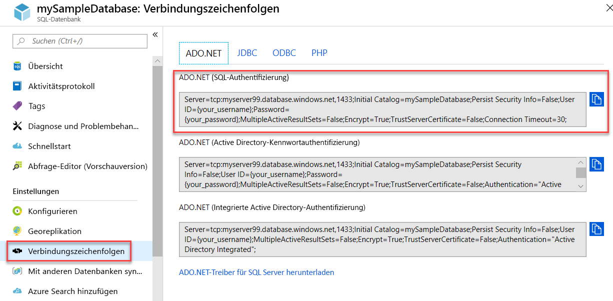

# <a name="quickstart-use-net-core-c-to-query-an-azure-sql-database"></a>Schnellstart: Abfragen einer Azure SQL-Datenbank mithilfe von .NET Core (C#)

In dieser Schnellstartanleitung verwenden Sie [.NET Core](https://www.microsoft.com/net/) und C#-Code, um eine Verbindung mit einer Azure SQL-Datenbank herzustellen. Anschließend führen Sie eine Transact-SQL-Anweisung zum Abfragen von Daten aus.

## <a name="prerequisites"></a>Voraussetzungen

Für dieses Tutorial benötigen Sie Folgendes:

- Eine Azure SQL-Datenbank. In den folgenden Schnellstartanleitungen erfahren Sie jeweils, wie Sie eine Datenbank in Azure SQL-Datenbank erstellen und anschließend konfigurieren:

  || Einzeldatenbank | Verwaltete Instanz |
  |:--- |:--- |:---|
  | Erstellen| [Portal](sql-database-single-database-get-started.md) | [Portal](sql-database-managed-instance-get-started.md) |
  || [BEFEHLSZEILENSCHNITTSTELLE (CLI)](scripts/sql-database-create-and-configure-database-cli.md) | [BEFEHLSZEILENSCHNITTSTELLE (CLI)](https://medium.com/azure-sqldb-managed-instance/working-with-sql-managed-instance-using-azure-cli-611795fe0b44) |
  || [PowerShell](scripts/sql-database-create-and-configure-database-powershell.md) | [PowerShell](scripts/sql-database-create-configure-managed-instance-powershell.md) |
  | Konfigurieren | [IP-Firewallregel auf Serverebene](sql-database-server-level-firewall-rule.md)| [Verbindung von einem virtuellen Computer](sql-database-managed-instance-configure-vm.md)|
  |||[Verbindung von einer lokalen Ressource](sql-database-managed-instance-configure-p2s.md)
  |Laden von Daten|Laden von Adventure Works gemäß Schnellstartanleitung|[Wiederherstellen von Wide World Importers](sql-database-managed-instance-get-started-restore.md)
  |||Wiederherstellen oder Importieren von Adventure Works über eine [BACPAC-Datei](sql-database-import.md) von [GitHub](https://github.com/Microsoft/sql-server-samples/tree/master/samples/databases/adventure-works)|
  |||

  > [!IMPORTANT]
  > Die Skripts in diesem Artikel sind für die Adventure Works-Datenbank geschrieben. Bei einer verwalteten Instanz müssen Sie entweder die Adventure Works-Datenbank in eine Instanzdatenbank importieren oder die Skripts in diesem Artikel zur Verwendung der Wide World Importers-Datenbank anpassen.

- [.NET Core für Ihr Betriebssystem](https://www.microsoft.com/net/core) ist installiert.

> [!NOTE]
> Dieser Schnellstart verwendet die *mySampleDatabase*-Datenbank. Wenn Sie eine andere Datenbank verwenden möchten, müssen Sie die Datenbankverweise ändern und die `SELECT`-Abfrage im C# Code ändern.

## <a name="get-sql-server-connection-information"></a>Abrufen von SQL Server-Verbindungsinformationen

Rufen Sie die Verbindungsinformationen ab, die Sie zum Herstellen einer Verbindung mit der Azure SQL-Datenbank benötigen. In den weiteren Verfahren benötigen Sie den vollqualifizierten Server- oder Hostnamen, den Datenbanknamen und die Anmeldeinformationen.

1. Melden Sie sich beim [Azure-Portal](https://portal.azure.com/) an.

2. Navigieren Sie zur Seite **SQL-Datenbanken** oder **Verwaltete SQL-Instanzen**.

3. Sehen Sie sich auf der Seite **Übersicht** bei einer Einzeldatenbank den vollqualifizierten Servernamen neben **Servername** und bei einer verwalteten Instanz den vollqualifizierten Servernamen neben **Host** an. Um den Namen des Servers oder Hosts zu kopieren, zeigen Sie darauf, und wählen Sie das Symbol **Kopieren** aus.

## <a name="get-adonet-connection-information-optional"></a>Abrufen von ADO.NET-Verbindungsinformationen (optional)

1. Navigieren Sie zur Seite **mySampleDatabase**, und wählen Sie unter **Einstellungen** die Option **Verbindungszeichenfolgen**.

2. Überprüfen Sie die vollständige **ADO.NET**-Verbindungszeichenfolge.

    

3. Kopieren Sie die **ADO.NET**-Verbindungszeichenfolge, wenn Sie sie verwenden möchten.
  
## <a name="create-a-new-net-core-project"></a>Erstellen eines neuen .NET Core-Projekts

1. Öffnen Sie eine Eingabeaufforderung, und erstellen Sie einen Ordner namens **sqltest**. Navigieren Sie zu diesem Ordner, und führen Sie den folgenden Befehl aus:

    ```cmd
    dotnet new console
    ```
    Mit diesem Befehl werden neue App-Projektdateien erstellt, darunter eine erste C#-Codedatei (**Program.cs**), eine XML-Konfigurationsdatei (**sqltest.csproj**) und erforderliche Binärdateien.

2. Öffnen Sie in einem Editor **sqltest.csproj**, und fügen Sie den nachstehenden XML-Code zwischen den `<Project>`-Tags ein. Mit diesem XML wird `System.Data.SqlClient` als Abhängigkeit hinzugefügt.

    ```xml
    <ItemGroup>
        <PackageReference Include="System.Data.SqlClient" Version="4.6.0" />
    </ItemGroup>
    ```

## <a name="insert-code-to-query-sql-database"></a>Einfügen von Code zum Abfragen der SQL-Datenbank

1. Öffnen Sie in einem Editor die Datei **Program.cs**.

2. Ersetzen Sie den Inhalt durch den folgenden Code, und fügen Sie die entsprechenden Werte für Server, Datenbank, Benutzername und Kennwort hinzu.

> [!NOTE]
> Um eine ADO.NET-Verbindungszeichenfolge zu verwenden, ersetzen Sie die 4 Zeilen in der Codeeinstellung von Server, Datenbank, Benutzername und Kennwort durch die folgende Zeile. Geben Sie in der Zeichenfolge Ihren Benutzernamen und Ihr Kennwort ein.
>
>    `builder.ConnectionString="<your_ado_net_connection_string>";`

```csharp
using System;
using System.Data.SqlClient;
using System.Text;

namespace sqltest
{
    class Program
    {
        static void Main(string[] args)
        {
            try 
            { 
                SqlConnectionStringBuilder builder = new SqlConnectionStringBuilder();

                builder.DataSource = "<your_server.database.windows.net>"; 
                builder.UserID = "<your_username>";            
                builder.Password = "<your_password>";     
                builder.InitialCatalog = "<your_database>";
         
                using (SqlConnection connection = new SqlConnection(builder.ConnectionString))
                {
                    Console.WriteLine("\nQuery data example:");
                    Console.WriteLine("=========================================\n");
                    
                    connection.Open();       
                    StringBuilder sb = new StringBuilder();
                    sb.Append("SELECT TOP 20 pc.Name as CategoryName, p.name as ProductName ");
                    sb.Append("FROM [SalesLT].[ProductCategory] pc ");
                    sb.Append("JOIN [SalesLT].[Product] p ");
                    sb.Append("ON pc.productcategoryid = p.productcategoryid;");
                    String sql = sb.ToString();

                    using (SqlCommand command = new SqlCommand(sql, connection))
                    {
                        using (SqlDataReader reader = command.ExecuteReader())
                        {
                            while (reader.Read())
                            {
                                Console.WriteLine("{0} {1}", reader.GetString(0), reader.GetString(1));
                            }
                        }
                    }                    
                }
            }
            catch (SqlException e)
            {
                Console.WriteLine(e.ToString());
            }
            Console.WriteLine("\nDone. Press enter.");
            Console.ReadLine(); 
        }
    }
}
```

## <a name="run-the-code"></a>Ausführen des Codes

1. Führen Sie an der Eingabeaufforderung die folgenden Befehle aus:

   ```cmd
   dotnet restore
   dotnet run
   ```

2. Stellen Sie sicher, dass die ersten 20 Zeilen zurückgegeben werden.

   ```text
   Query data example:
   =========================================

   Road Frames HL Road Frame - Black, 58
   Road Frames HL Road Frame - Red, 58
   Helmets Sport-100 Helmet, Red
   Helmets Sport-100 Helmet, Black
   Socks Mountain Bike Socks, M
   Socks Mountain Bike Socks, L
   Helmets Sport-100 Helmet, Blue
   Caps AWC Logo Cap
   Jerseys Long-Sleeve Logo Jersey, S
   Jerseys Long-Sleeve Logo Jersey, M
   Jerseys Long-Sleeve Logo Jersey, L
   Jerseys Long-Sleeve Logo Jersey, XL
   Road Frames HL Road Frame - Red, 62
   Road Frames HL Road Frame - Red, 44
   Road Frames HL Road Frame - Red, 48
   Road Frames HL Road Frame - Red, 52
   Road Frames HL Road Frame - Red, 56
   Road Frames LL Road Frame - Black, 58
   Road Frames LL Road Frame - Black, 60
   Road Frames LL Road Frame - Black, 62

   Done. Press enter.
   ```
3. Drücken Sie die **EINGABETASTE**, um das Anwendungsfenster zu schließen.

## <a name="next-steps"></a>Nächste Schritte

- [Getting started with .NET Core on Windows/Linux/macOS using the command line](/dotnet/core/tutorials/using-with-xplat-cli) (Erste Schritte mit .NET Core unter Windows/Linux/macOS bei Verwendung der Befehlszeile)
- Informieren Sie sich darüber, wie Sie [unter Verwendung von .NET Framework und Visual Studio eine Verbindung mit einer Azure SQL-Datenbank herstellen und die Datenbank abfragen](sql-database-connect-query-dotnet-visual-studio.md).  
- Erfahren Sie, wie Sie [Ihre erste Azure SQL-Datenbank mithilfe von SSMS entwerfen](sql-database-design-first-database.md), oder wie Sie [eine Azure SQL-Datenbank entwerfen und mit C# und ADO.NET verbinden](sql-database-design-first-database-csharp.md).
- Weitere Informationen zu .NET finden Sie in der [.NET-Dokumentation](https://docs.microsoft.com/dotnet/).
