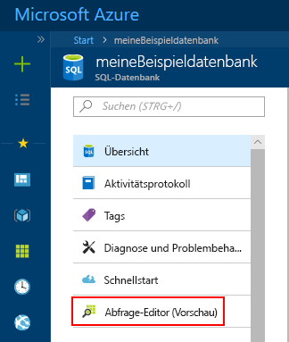

# <a name="azure-portal-use-the-sql-query-editor-to-connect-and-query-data"></a>Azure-Portal: Verwenden des SQL-Abfrage-Editors zum Verbinden und Abfragen von Daten

Der SQL-Abfrage-Editor ist ein Abfragetool im Browser und eine effiziente und einfache Möglichkeit, SQL-Abfragen in Ihrer Azure SQL-Datenbank oder in Azure SQL Data Warehouse auszuführen, ohne das Azure-Portal zu verlassen. In diesem Schnellstart wird veranschaulicht, wie Sie den Abfrage-Editor zum Herstellen einer Verbindung mit einer SQL-Datenbank verwenden und anschließend Transact-SQL-Anweisungen nutzen, um Daten in der Datenbank abzufragen, einzufügen, zu aktualisieren und zu löschen.

## <a name="prerequisites"></a>Voraussetzungen

In diesem Schnellstart werden als Ausgangspunkt die Ressourcen verwendet, die in einem der folgenden Schnellstarts erstellt wurden:

[!INCLUDE [prerequisites-create-db](../../includes/sql-database-connect-query-prerequisites-create-db-includes.md)]

> [!NOTE]
> Stellen Sie sicher, dass die Option „Zugriff auf Azure-Dienste erlauben“ in den SQL Server-Firewalleinstellungen auf „EIN“ festgelegt ist. Mit dieser Option erhält der SQL-Abfrage-Editor Zugriff auf Ihre Datenbanken und Data Warehouses.

## <a name="log-in-to-the-azure-portal"></a>Anmelden beim Azure-Portal

Melden Sie sich beim [Azure-Portal](https://portal.azure.com/)an.


## <a name="connect-using-sql-authentication"></a>Herstellen einer Verbindung per SQL-Authentifizierung

1. Klicken Sie im Menü auf der linken Seite auf **SQL-Datenbanken** und dann auf die Datenbank, die Sie abfragen möchten.

2. Suchen Sie auf der SQL-Datenbankseite für Ihre Datenbank im linken Menü nach **Abfrage-Editor (Vorschau)**, und klicken Sie darauf.

    

3. Klicken Sie auf **Anmelden**, und wählen Sie dann die Option **SQL Server-Authentifizierung**, wenn die Aufforderung angezeigt wird. Geben Sie anschließend den Benutzernamen und das Kennwort des Serveradministrators an, die Sie beim Erstellen der Datenbank angegeben haben.

    

4. Klicken Sie auf **OK**, um sich anzumelden.


## <a name="connect-using-azure-ad"></a>Herstellen einer Verbindung mithilfe von Azure AD

Wenn Sie einen Active Directory-Administrator konfigurieren, können Sie eine einzelne Identität verwenden, um sich am Azure-Portal und Ihrer SQL-Datenbank anzumelden. Führen Sie die unten angegebenen Schritte aus, um einen Active Directory-Administrator für den von Ihnen erstellten SQL Server zu konfigurieren.

> [!NOTE]
> E-Mail-Konten (z.B. outlook.com, hotmail.com, live.com, gmail.com, yahoo.com) werden noch nicht als Active Directory-Administratoren unterstützt. Stellen Sie sicher, dass Sie einen Benutzer auswählen, der entweder nativ im Azure Active Directory erstellt oder in einen Azure Active Directory-Verbund eingefügt wurde.

1. Wählen Sie im Menü auf der linken Seite die Option **Server mit SQL Server** und in der Serverliste dann Ihre SQL Server-Instanz aus.

2. Wählen Sie im Einstellungsmenü Ihrer SQL Server-Instanz die Einstellung **Active Directory-Administrator**.

3. Klicken Sie auf dem Blatt „Active Directory-Administrator“ auf den Befehl **Administrator festlegen**, und wählen Sie den Benutzer oder die Gruppe aus, der bzw. die als Active Directory-Administrator fungieren soll.

    

4. Klicken Sie oben auf dem Blatt „Active Directory-Administrator“ auf den Befehl **Speichern**, um Ihren Active Directory-Administrator festzulegen.

Navigieren Sie zu der SQL-Datenbank, die Sie abfragen möchten, und klicken Sie im linken Menü auf **Daten-Explorer (Vorschau)**. Die Seite mit dem Daten-Explorer wird geöffnet, und es wird automatisch eine Verbindung mit der Datenbank hergestellt.


## <a name="run-query-using-query-editor"></a>Ausführen einer Abfrage mit dem Abfrage-Editor

Geben Sie nach der Authentifizierung im Bereich für den Abfrage-Editor die folgende Abfrage ein, um eine Abfrage nach den Top 20 der Produkte nach Kategorie durchzuführen.

```sql
 SELECT TOP 20 pc.Name as CategoryName, p.name as ProductName
 FROM SalesLT.ProductCategory pc
 JOIN SalesLT.Product p
 ON pc.productcategoryid = p.productcategoryid;
```

Klicken Sie auf **Ausführen**, und sehen Sie sich die Abfrageergebnisse im Bereich **Ergebnisse** an.


## <a name="insert-data-using-query-editor"></a>Einfügen von Daten mit dem Abfrage-Editor

Verwenden Sie den folgenden Code, um mit der [INSERT](https://msdn.microsoft.com/library/ms174335.aspx)-Transact-SQL-Anweisung ein neues Produkt in die Tabelle „SalesLT.Product“ einzufügen.

1. Ersetzen Sie im Abfragefenster die vorherige Abfrage durch die folgende Abfrage:

   ```sql
   INSERT INTO [SalesLT].[Product]
           ( [Name]
           , [ProductNumber]
           , [Color]
           , [ProductCategoryID]
           , [StandardCost]
           , [ListPrice]
           , [SellStartDate]
           )
     VALUES
           ('myNewProduct'
           ,123456789
           ,'NewColor'
           ,1
           ,100
           ,100
           ,GETDATE() );
   ```

2. Klicken Sie in der Symbolleiste auf **Ausführen**, um eine neue Zeile in die Tabelle „Product“ einzufügen.

## <a name="update-data-using-query-editor"></a>Aktualisieren von Daten mit dem Abfrage-Editor

Verwenden Sie den folgenden Code, um das neue zuvor hinzugefügte Produkt mit der [UPDATE](https://msdn.microsoft.com/library/ms177523.aspx)-Transact-SQL-Anweisung zu aktualisieren.

1. Ersetzen Sie im Abfragefenster die vorherige Abfrage durch die folgende Abfrage:

   ```sql
   UPDATE [SalesLT].[Product]
   SET [ListPrice] = 125
   WHERE Name = 'myNewProduct';
   ```

2. Klicken Sie in der Symbolleiste auf **Ausführen**, um die angegebene Zeile in der Tabelle „Product“ zu aktualisieren.

## <a name="delete-data-using-query-editor"></a>Löschen von Daten mit dem Abfrage-Editor

Verwenden Sie den folgenden Code, um das neue zuvor hinzugefügte Produkt mit der [DELETE](https://msdn.microsoft.com/library/ms189835.aspx)-Transact-SQL-Anweisung zu löschen.

1. Ersetzen Sie im Abfragefenster die vorherige Abfrage durch die folgende Abfrage:

   ```sql
   DELETE FROM [SalesLT].[Product]
   WHERE Name = 'myNewProduct';
   ```

2. Klicken Sie in der Symbolleiste auf **Ausführen**, um die angegebene Zeile in der Tabelle „Product“ zu löschen.


## <a name="query-editor-considerations"></a>Aspekte des Abfrage-Editors

Bei der Verwendung des Abfrage-Editors sind ein paar Dinge zu beachten:

1. Stellen Sie sicher, dass Sie die Option „Zugriff auf Azure-Dienste erlauben“ in den Azure SQL Server-Firewalleinstellungen auf „EIN“ festgelegt haben. Mit dieser Option erhält der SQL-Abfrage-Editor Zugriff auf Ihre SQL-Datenbanken und Data Warehouses.

2. Befindet sich der SQL-Server in einem virtuellen Netzwerk, kann der Abfrage-Editor nicht zum Abfragen von Datenbanken dieses Servers verwendet werden.

3. Durch das Drücken der Taste F5 wird die Seite mit dem Abfrage-Editor aktualisiert, und die derzeit aktive Abfrage geht verloren. Verwenden Sie in der Symbolleiste die Schaltfläche „Ausführen“, um Abfragen auszuführen.

4. Das Herstellen einer Verbindung mit der Masterdatenbank wird vom Abfrage-Editor nicht unterstützt.

5. Bei der Abfrageausführung gilt ein Timeout von fünf Minuten.

6. Die Anmeldung per Azure Active Directory-Administrator funktioniert nicht für Konten, für die die zweistufige Authentifizierung aktiviert ist.

7. E-Mail-Konten (z.B. outlook.com, hotmail.com, live.com, gmail.com, yahoo.com) werden noch nicht als Active Directory-Administratoren unterstützt. Stellen Sie sicher, dass Sie einen Benutzer auswählen, der entweder nativ im Azure Active Directory erstellt oder in einen Azure Active Directory-Verbund eingefügt wurde.

8. Der Abfrage-Editor unterstützt für geografische Datentypen nur die zylindrische Projektion.

9. Für Datenbanktabellen und -sichten ist keine IntelliSense-Unterstützung vorhanden. Der Editor unterstützt aber das automatische Vervollständigen von Namen, die bereits eingegeben wurden.


## <a name="next-steps"></a>Nächste Schritte

- Informationen zur Unterstützung von Transact-SQL in Azure SQL-Datenbanken finden Sie unter [Auflösen von Transact-SQL-Unterschieden während der Migration zur SQL-Datenbank](sql-database-transact-sql-information.md).
