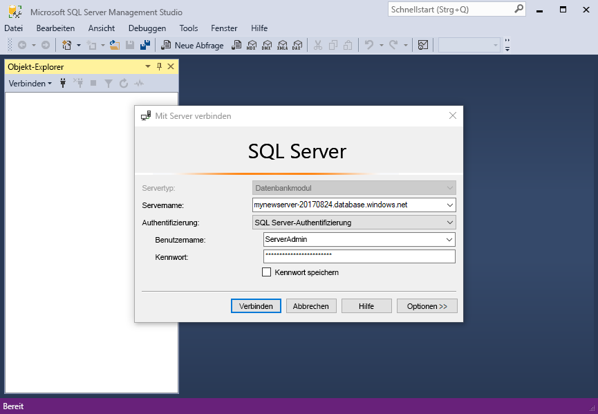
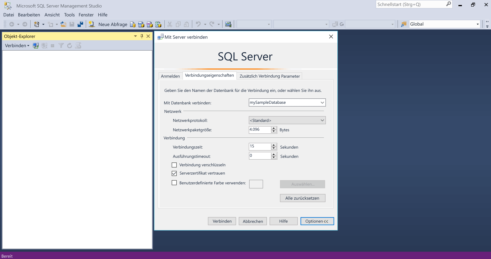
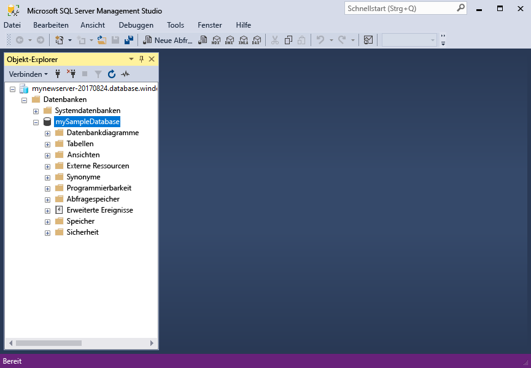
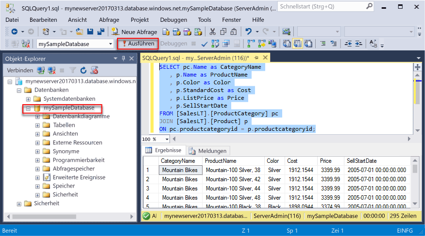
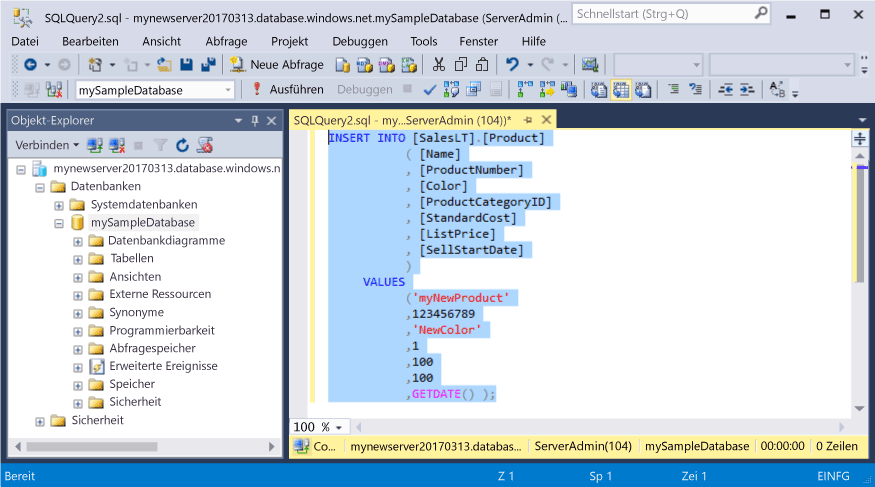
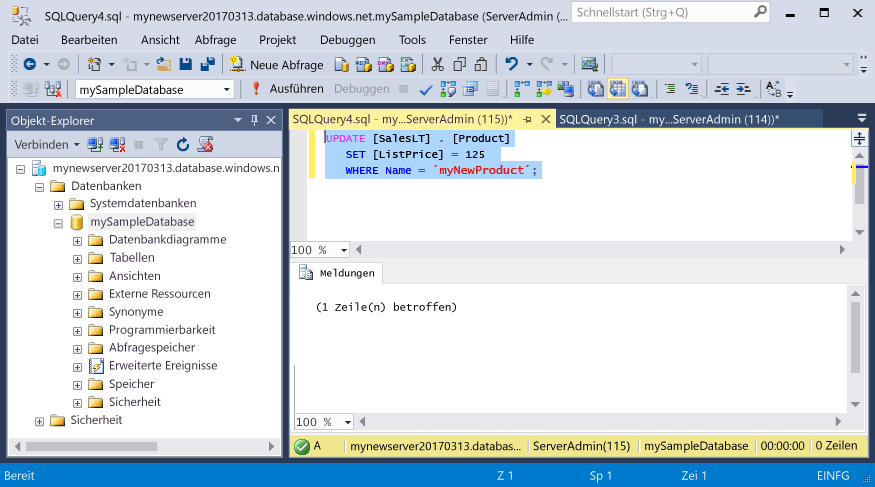

# <a name="azure-sql-database-use-sql-server-management-studio-to-connect-and-query-data"></a>Azure SQL-Datenbank: Verwenden von SQL Server Management Studio zum Herstellen der Verbindung und Abfragen von Daten

[SQL Server Management Studio][ssms-install-latest-84g] (SSMS) ist eine integrierte Umgebung für die Verwaltung beliebiger SQL-Infrastrukturen – von SQL Server bis SQL-Datenbank für Microsoft Windows. In diesem Schnellstart wird veranschaulicht, wie Sie SSMS zum Herstellen einer Verbindung mit einer Azure SQL-Datenbank verwenden und anschließend mithilfe von Transact-SQL-Anweisungen Daten in der Datenbank abfragen, aktualisieren oder löschen bzw. in diese einfügen. 

## <a name="prerequisites"></a>Voraussetzungen

In diesem Schnellstart werden als Ausgangspunkt die Ressourcen verwendet, die in einem der folgenden Schnellstarts erstellt wurden:

[!INCLUDE [prerequisites-create-db](../../includes/sql-database-connect-query-prerequisites-create-db-includes.md)]

#### <a name="install-the-latest-ssms"></a>Installieren der neuesten Version von SSMS

Stellen Sie zunächst sicher, dass Sie die neueste Version von [SSMS][ssms-install-latest-84g] installiert haben. 

## <a name="sql-server-connection-information"></a>SQL Server-Verbindungsinformationen

[!INCLUDE [prerequisites-server-connection-info](../../includes/sql-database-connect-query-prerequisites-server-connection-info-includes.md)]

## <a name="connect-to-your-database"></a>Verbinden mit der Datenbank

Verwenden Sie SQL Server Management Studio, um eine Verbindung mit Ihrem Azure SQL-Datenbankserver einzurichten. 

> [!IMPORTANT]
> Ein logischer Azure SQL-Datenbankserver lauscht über Port 1433. Wenn Sie versuchen, durch eine Unternehmensfirewall eine Verbindung mit einem logischen Azure SQL-Datenbankserver herzustellen, muss dieser Port in der Unternehmensfirewall geöffnet sein, damit der Vorgang erfolgreich ist.
>

1. Öffnen Sie SQL Server Management Studio.

2. Geben Sie im Dialogfeld **Mit Server verbinden** die folgenden Informationen ein:

   | Einstellung      | Empfohlener Wert    | Beschreibung | 
   | ------------ | ------------------ | ----------- | 
   | **Servertyp** | Datenbankmodul | Dieser Wert ist erforderlich. |
   | **Servername** | Der vollqualifizierte Servername | Der Name sollte etwa wie folgt lauten: **mynewserver20170313.database.windows.net**. |
   | **Authentifizierung** | SQL Server-Authentifizierung | In diesem Tutorial haben wir als einzigen Authentifizierungstyp die SQL-Authentifizierung konfiguriert. |
   | **Anmeldung** | Das Serveradministratorkonto | Hierbei handelt es sich um das Konto, das Sie beim Erstellen des Servers angegeben haben. |
   | **Kennwort** | Das Kennwort für das Serveradministratorkonto | Hierbei handelt es sich um das Kennwort, das Sie beim Erstellen des Servers angegeben haben. |
   ||||

     

3. Klicken Sie im Dialogfeld **Mit Server verbinden** auf **Optionen**. Geben Sie im Abschnitt **Verbindung mit Datenbank herstellen** den Text **mySampleDatabase** ein, um eine Verbindung mit dieser Datenbank herzustellen.

     

4. Klicken Sie auf **Verbinden**. Die Objekt-Explorer-Fenster wird in SSMS geöffnet. 

     

5. Erweitern Sie im Objekt-Explorer die Option **Datenbanken** und anschließend die Option **mySampleDatabase**, um die Objekte in der Beispieldatenbank anzuzeigen.

## <a name="query-data"></a>Abfragen von Daten

Verwenden Sie den folgenden Code, um mit der [SELECT](https://msdn.microsoft.com/library/ms189499.aspx)-Transact-SQL-Anweisung die 20 wichtigsten Produkte nach Kategorie abzufragen.

1. Klicken Sie im Objekt-Explorer mit der rechten Maustaste auf **mySampleDatabase**, und wählen Sie **Neue Abfrage**. Ein leeres Abfragefenster mit einer Verbindung mit Ihrer Datenbank wird geöffnet.
2. Geben Sie im Abfragefenster die folgende Abfrage ein:

   ```sql
   SELECT pc.Name as CategoryName, p.name as ProductName
   FROM [SalesLT].[ProductCategory] pc
   JOIN [SalesLT].[Product] p
   ON pc.productcategoryid = p.productcategoryid;
   ```

3. Klicken Sie in der Symbolleiste auf **Ausführen**, um Daten aus den Tabellen „Product“ und „ProductCategory“ abzurufen.

    

## <a name="insert-data"></a>Einfügen von Daten

Verwenden Sie den folgenden Code, um mit der [INSERT](https://msdn.microsoft.com/library/ms174335.aspx)-Transact-SQL-Anweisung ein neues Produkt in die Tabelle „SalesLT.Product“ einzufügen.

1. Ersetzen Sie im Abfragefenster die vorherige Abfrage durch die folgende Abfrage:

   ```sql
   INSERT INTO [SalesLT].[Product]
           ( [Name]
           , [ProductNumber]
           , [Color]
           , [ProductCategoryID]
           , [StandardCost]
           , [ListPrice]
           , [SellStartDate]
           )
     VALUES
           ('myNewProduct'
           ,123456789
           ,'NewColor'
           ,1
           ,100
           ,100
           ,GETDATE() );
   ```

2. Klicken Sie in der Symbolleiste auf **Ausführen**, um eine neue Zeile in die Tabelle „Product“ einzufügen.

    

## <a name="update-data"></a>Aktualisieren von Daten

Verwenden Sie den folgenden Code, um das neue zuvor hinzugefügte Produkt mit der [UPDATE](https://msdn.microsoft.com/library/ms177523.aspx)-Transact-SQL-Anweisung zu aktualisieren.

1. Ersetzen Sie im Abfragefenster die vorherige Abfrage durch die folgende Abfrage:

   ```sql
   UPDATE [SalesLT].[Product]
   SET [ListPrice] = 125
   WHERE Name = 'myNewProduct';
   ```

2. Klicken Sie in der Symbolleiste auf **Ausführen**, um die angegebene Zeile in der Tabelle „Product“ zu aktualisieren.

    

## <a name="delete-data"></a>Löschen von Daten

Verwenden Sie den folgenden Code, um das neue zuvor hinzugefügte Produkt mit der [DELETE](https://msdn.microsoft.com/library/ms189835.aspx)-Transact-SQL-Anweisung zu löschen.

1. Ersetzen Sie im Abfragefenster die vorherige Abfrage durch die folgende Abfrage:

   ```sql
   DELETE FROM [SalesLT].[Product]
   WHERE Name = 'myNewProduct';
   ```

2. Klicken Sie in der Symbolleiste auf **Ausführen**, um die angegebene Zeile in der Tabelle „Product“ zu löschen.

    

## <a name="next-steps"></a>Nächste Schritte

- Informationen zum Erstellen und Verwalten von Servern und Datenbanken mit Transact-SQL finden Sie unter [Learn about Azure SQL Database servers and databases](sql-database-servers-databases.md) (Informationen zu Servern und Datenbanken mit Azure SQL-Datenbank).
- Informationen zu SSMS finden Sie unter [Verwenden von SQL Server Management Studio](https://msdn.microsoft.com/library/ms174173.aspx).
- Informationen zum Herstellen einer Verbindung sowie zum Abfragen mithilfe des Azure-Portals finden Sie unter [Verbinden und Abfragen mit dem SQL-Abfrage-Editor des Azure-Portals](sql-database-connect-query-portal.md).
- Informationen zum Herstellen einer Verbindung mit Visual Studio finden Sie unter [Verbinden und Abfragen mit Visual Studio Code](sql-database-connect-query-vscode.md).
- Informationen zum Herstellen einer Verbindung und Senden von Abfragen mit .NET finden Sie unter [Verbinden und Abfragen mit .NET](sql-database-connect-query-dotnet.md).
- Informationen zum Herstellen einer Verbindung und Senden von Abfragen mit PHP finden Sie unter [Verbinden und Abfragen mit PHP](sql-database-connect-query-php.md).
- Informationen zum Herstellen einer Verbindung und Senden von Abfragen mit Node.js finden Sie unter [Verbinden und Abfragen mit Node.js](sql-database-connect-query-nodejs.md).
- Informationen zum Herstellen einer Verbindung und Senden von Abfragen mit Java finden Sie unter [Verbinden und Abfragen mit Java](sql-database-connect-query-java.md).
- Informationen zum Herstellen einer Verbindung und Senden von Abfragen mit Python finden Sie unter [Verbinden und Abfragen mit Python](sql-database-connect-query-python.md).
- Informationen zum Herstellen einer Verbindung und Senden von Abfragen mit Ruby finden Sie unter [Verbinden und Abfragen mit Ruby](sql-database-connect-query-ruby.md).


<!-- Article link references. -->

[ssms-install-latest-84g]: https://docs.microsoft.com/sql/ssms/sql-server-management-studio-ssms

