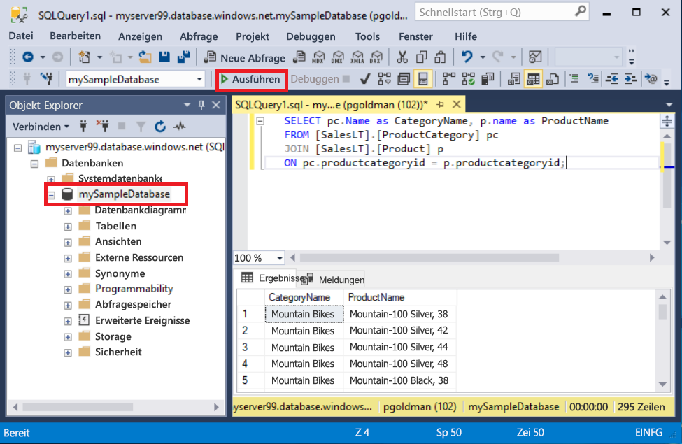
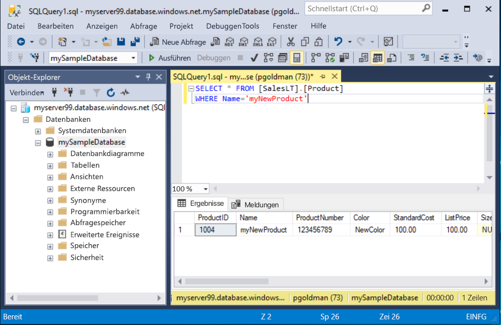

# <a name="quickstart-use-sql-server-management-studio-to-connect-and-query-an-azure-sql-database"></a>Schnellstart: Verwenden von SQL Server Management Studio zum Herstellen der Verbindung mit einer Instanz von Azure SQL-Datenbank und deren Abfrage

In dieser Schnellstartanleitung verwenden Sie [SQL Server Management Studio][ssms-install-latest-84g] (SSMS), um eine Verbindung mit einer Azure SQL-Datenbank herzustellen. Anschließend führen Sie Transact-SQL-Anweisungen aus, um Daten abzufragen, einzufügen, zu aktualisieren und zu löschen. Sie können SSMS für die Verwaltung beliebiger SQL-Infrastrukturen verwenden – von SQL Server bis SQL-Datenbank für Microsoft Windows.  

## <a name="prerequisites"></a>Voraussetzungen

- Eine Azure SQL-Datenbank. In den folgenden Schnellstartanleitungen erfahren Sie jeweils, wie Sie eine Datenbank in Azure SQL-Datenbank erstellen und anschließend konfigurieren:

  || Einzeldatenbank | Verwaltete Instanz |
  |:--- |:--- |:---|
  | Erstellen| [Portal](sql-database-single-database-get-started.md) | [Portal](sql-database-managed-instance-get-started.md) |
  || [BEFEHLSZEILENSCHNITTSTELLE (CLI)](scripts/sql-database-create-and-configure-database-cli.md) | [BEFEHLSZEILENSCHNITTSTELLE (CLI)](https://medium.com/azure-sqldb-managed-instance/working-with-sql-managed-instance-using-azure-cli-611795fe0b44) |
  || [PowerShell](scripts/sql-database-create-and-configure-database-powershell.md) | [PowerShell](https://blogs.msdn.microsoft.com/sqlserverstorageengine/2018/06/27/quick-start-script-create-azure-sql-managed-instance-using-powershell/) |
  | Konfigurieren | [IP-Firewallregel auf Serverebene](sql-database-server-level-firewall-rule.md)| [Verbindung von einem virtuellen Computer](sql-database-managed-instance-configure-vm.md)|
  |||[Verbindung von einer lokalen Ressource](sql-database-managed-instance-configure-p2s.md)
  |Laden von Daten|Laden von Adventure Works gemäß Schnellstartanleitung|[Wiederherstellen von Wide World Importers](sql-database-managed-instance-get-started-restore.md)
  |||Wiederherstellen oder Importieren von Adventure Works über eine [BACPAC-Datei](sql-database-import.md) von [GitHub](https://github.com/Microsoft/sql-server-samples/tree/master/samples/databases/adventure-works)|
  |||

  > [!IMPORTANT]
  > Die Skripts in diesem Artikel sind für die Adventure Works-Datenbank geschrieben. Bei einer verwalteten Instanz müssen Sie entweder die Adventure Works-Datenbank in eine Instanzdatenbank importieren oder die Skripts in diesem Artikel zur Verwendung der Wide World Importers-Datenbank anpassen.

## <a name="install-the-latest-ssms"></a>Installieren der neuesten Version von SSMS

Bevor Sie beginnen, stellen Sie sicher, dass Sie die neueste Version von [SSMS][ssms-install-latest-84g] installiert haben. 

## <a name="get-sql-server-connection-information"></a>Abrufen von SQL Server-Verbindungsinformationen

Rufen Sie die Verbindungsinformationen ab, die Sie zum Herstellen einer Verbindung mit der Azure SQL-Datenbank benötigen. In den weiteren Verfahren benötigen Sie den vollqualifizierten Server- oder Hostnamen, den Datenbanknamen und die Anmeldeinformationen.

1. Melden Sie sich beim [Azure-Portal](https://portal.azure.com/) an.

2. Navigieren Sie zur Seite **SQL-Datenbanken** oder **Verwaltete SQL-Instanzen**.

3. Sehen Sie sich auf der Seite **Übersicht** bei einer Einzeldatenbank den vollqualifizierten Servernamen neben **Servername** und bei einer verwalteten Instanz den vollqualifizierten Servernamen neben **Host** an. Um den Namen des Servers oder Hosts zu kopieren, zeigen Sie darauf, und wählen Sie das Symbol **Kopieren** aus.

## <a name="connect-to-your-database"></a>Verbinden mit der Datenbank

Stellen Sie in SMSS eine Verbindung mit Ihrer Azure SQL-Datenbankserverinstanz her. 

> [!IMPORTANT]
> Ein Azure SQL-Datenbankserver lauscht am Port 1433. Um hinter einer Unternehmensfirewall eine Verbindung mit einem SQL-Datenbankserver herzustellen, muss dieser Port in der Firewall geöffnet sein.
>

1. Öffnen Sie SSMS. Das Dialogfeld **Mit Server verbinden** wird angezeigt.

2. Geben Sie Folgendes ein:

   | Einstellung      | Empfohlener Wert    | BESCHREIBUNG | 
   | ------------ | ------------------ | ----------- | 
   | **Servertyp** | Datenbank-Engine | Erforderlicher Wert. |
   | **Servername** | Der vollqualifizierte Servername | Der Name sollte etwa wie folgt lauten: **mynewserver20170313.database.windows.net**. |
   | **Authentifizierung** | SQL Server-Authentifizierung | In diesem Tutorial wird SQL-Authentifizierung verwendet. |
   | **Anmeldung** | Benutzer-ID des Serveradministratorkontos | Die Benutzer-ID des Serveradministratorkontos, das zum Erstellen des Servers verwendet wird. |
   | **Kennwort** | Kennwort des Serveradministratorkontos | Das zum Erstellen des Servers verwendete Kennwort des Serveradministratorkontos. |
   ||||

     

3. Wählen Sie im Dialogfeld **Mit Server verbinden** **Optionen** aus. Wählen Sie im Dropdownmenü **Mit Datenbank verbinden** **mySampleDatabase** aus.

     

4. Wählen Sie **Verbinden**aus. Die Objekt-Explorer-Fenster wird geöffnet. 

5. Erweitern Sie zum Anzeigen der Objekte der Datenbank **Datenbanken** und dann **mySampleDatabase**.

     

## <a name="query-data"></a>Abfragen von Daten

Führen Sie diesen [SELECT](https://msdn.microsoft.com/library/ms189499.aspx)-Transact-SQL-Code aus, um die 20 wichtigsten Produkte nach Kategorie abzufragen.

1. Klicken Sie im Objekt-Explorer mit der rechten Maustaste auf **mySampleDatabase**, und wählen Sie **Neue Abfrage** aus. Ein neues Abfragefenster mit einer Verbindung mit Ihrer Datenbank wird geöffnet.

2. Fügen Sie diese SQL-Abfrage in das Abfragefenster ein.

   ```sql
   SELECT pc.Name as CategoryName, p.name as ProductName
   FROM [SalesLT].[ProductCategory] pc
   JOIN [SalesLT].[Product] p
   ON pc.productcategoryid = p.productcategoryid;
   ```

3. Wählen Sie auf der Symbolleiste **Ausführen** aus, um Daten aus den Tabellen `Product` und `ProductCategory` abzurufen.

    

## <a name="insert-data"></a>Einfügen von Daten

Führen Sie diesen [INSERT](https://msdn.microsoft.com/library/ms174335.aspx)-Transact-SQL-Code aus, um in der Tabelle `SalesLT.Product` ein neues Produkt zu erstellen.

1. Ersetzen Sie die vorherige Abfrage durch diese.

   ```sql
   INSERT INTO [SalesLT].[Product]
           ( [Name]
           , [ProductNumber]
           , [Color]
           , [ProductCategoryID]
           , [StandardCost]
           , [ListPrice]
           , [SellStartDate] )
     VALUES
           ('myNewProduct'
           ,123456789
           ,'NewColor'
           ,1
           ,100
           ,100
           ,GETDATE() );
   ```

2. Wählen Sie die Option **Ausführen**, um in der Tabelle `Product` eine neue Zeile einzufügen. Im Bereich **Nachrichten** wird **(1 Zeile betroffen)** angezeigt.

## <a name="view-the-result"></a>Anzeigen des Ergebnisses

1. Ersetzen Sie die vorherige Abfrage durch diese.

   ```sql
   SELECT * FROM [SalesLT].[Product] 
   WHERE Name='myNewProduct' 

2. Select **Execute**. The following result appears. 

   

 
## Update data

Run this [UPDATE](https://msdn.microsoft.com/library/ms177523.aspx) Transact-SQL code to modify your new product.

1. Replace the previous query with this one.

   ```sql
   UPDATE [SalesLT].[Product]
   SET [ListPrice] = 125
   WHERE Name = 'myNewProduct';
   ```

2. Wählen Sie **Ausführen**, um die angegebene Zeile in der Tabelle `Product` zu aktualisieren. Im Bereich **Nachrichten** wird **(1 Zeile betroffen)** angezeigt.

## <a name="delete-data"></a>Löschen von Daten

Führen Sie diesen [DELETE](https://msdn.microsoft.com/library/ms189835.aspx)-Transact-SQL-Code aus, um Ihr neues Produkt zu entfernen.

1. Ersetzen Sie die vorherige Abfrage durch diese.

   ```sql
   DELETE FROM [SalesLT].[Product]
   WHERE Name = 'myNewProduct';
   ```

2. Wählen Sie **Ausführen**, um die angegebene Zeile in der Tabelle `Product` zu löschen. Im Bereich **Nachrichten** wird **(1 Zeile betroffen)** angezeigt.

## <a name="next-steps"></a>Nächste Schritte

- Informationen zu SSMS finden Sie unter [SQL Server Management Studio](https://msdn.microsoft.com/library/ms174173.aspx).
- Informationen zum Herstellen einer Verbindung sowie zum Abfragen mithilfe des Azure-Portals finden Sie unter [Verbinden und Abfragen mit dem SQL-Abfrage-Editor des Azure-Portals](sql-database-connect-query-portal.md).
- Informationen zum Herstellen einer Verbindung mit Visual Studio finden Sie unter [Verbinden und Abfragen mit Visual Studio Code](sql-database-connect-query-vscode.md).
- Informationen zum Herstellen einer Verbindung und Senden von Abfragen mit .NET finden Sie unter [Verbinden und Abfragen mit .NET](sql-database-connect-query-dotnet.md).
- Informationen zum Herstellen einer Verbindung und Senden von Abfragen mit PHP finden Sie unter [Verbinden und Abfragen mit PHP](sql-database-connect-query-php.md).
- Informationen zum Herstellen einer Verbindung und Senden von Abfragen mit Node.js finden Sie unter [Verbinden und Abfragen mit Node.js](sql-database-connect-query-nodejs.md).
- Informationen zum Herstellen einer Verbindung und Senden von Abfragen mit Java finden Sie unter [Verbinden und Abfragen mit Java](sql-database-connect-query-java.md).
- Informationen zum Herstellen einer Verbindung und Senden von Abfragen mit Python finden Sie unter [Verbinden und Abfragen mit Python](sql-database-connect-query-python.md).
- Informationen zum Herstellen einer Verbindung und Senden von Abfragen mit Ruby finden Sie unter [Verbinden und Abfragen mit Ruby](sql-database-connect-query-ruby.md).


<!-- Article link references. -->

[ssms-install-latest-84g]: https://docs.microsoft.com/sql/ssms/sql-server-management-studio-ssms

