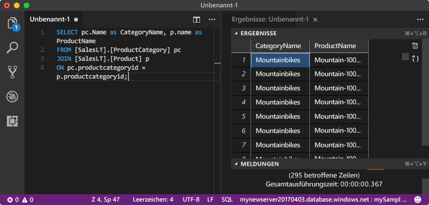

# <a name="quickstart-use-visual-studio-code-to-connect-and-query-an-azure-sql-database"></a>Schnellstart: Verwenden von Visual Studio Code zum Herstellen einer Verbindung mit und Abfragen einer Instanz von Azure SQL-Datenbank

[Visual Studio Code](https://code.visualstudio.com/docs) ist ein grafischer Code-Editor für Linux, MacOS und Windows. Er unterstützt Erweiterungen – etwa die [mssql-Erweiterung](https://aka.ms/mssql-marketplace) zum Abfragen von Microsoft SQL Server, Azure SQL-Datenbank und SQL Data Warehouse. In dieser Schnellstartanleitung verwenden Sie Visual Studio Code zum Herstellen einer Verbindung mit einer Azure SQL-Datenbank und führen anschließend Transact-SQL-Anweisungen aus, um Daten abzufragen, einzufügen, zu aktualisieren und zu löschen.

## <a name="prerequisites"></a>Voraussetzungen

Für dieses Tutorial benötigen Sie Folgendes:

[!INCLUDE [prerequisites-create-db](../../includes/sql-database-connect-query-prerequisites-create-db-includes.md)]

#### <a name="install-visual-studio-code"></a>Installieren von Visual Studio Code

Stellen Sie sicher, dass Sie die neueste Version von [Visual Studio Code](https://code.visualstudio.com/Download) installiert und die [mssql-Erweiterung](https://aka.ms/mssql-marketplace) geladen haben. Eine Installationsanleitung für die mssql-Erweiterung finden Sie unter [Installieren von VS Code](https://docs.microsoft.com/sql/linux/sql-server-linux-develop-use-vscode#install-and-start-visual-studio-code) und [mssql for Visual Studio Code (mssql für Visual Studio Code)](https://marketplace.visualstudio.com/items?itemName=ms-mssql.mssql).

## <a name="configure-visual-studio-code"></a>Konfigurieren von Visual Studio Code 

### <a name="mac-os"></a>**Mac OS**
Für macOS müssen Sie OpenSSL installieren, da dies eine Voraussetzung für .NET Core ist. .NET Core wird von der mssql-Erweiterung verwendet. Öffnen Sie Ihr Terminal, und geben Sie die folgenden Befehle ein, um **brew** und **OpenSSL** zu installieren. 

```bash
ruby -e "$(curl -fsSL https://raw.githubusercontent.com/Homebrew/install/master/install)"
brew update
brew install openssl
mkdir -p /usr/local/lib
ln -s /usr/local/opt/openssl/lib/libcrypto.1.0.0.dylib /usr/local/lib/
ln -s /usr/local/opt/openssl/lib/libssl.1.0.0.dylib /usr/local/lib/
```

### <a name="linux-ubuntu"></a>**Linux (Ubuntu)**

Keine besondere Konfiguration erforderlich.

### <a name="windows"></a>**Windows**

Keine besondere Konfiguration erforderlich.

## <a name="sql-server-connection-information"></a>SQL Server-Verbindungsinformationen

[!INCLUDE [prerequisites-server-connection-info](../../includes/sql-database-connect-query-prerequisites-server-connection-info-includes.md)]

## <a name="set-language-mode-to-sql"></a>Festlegen des Sprachmodus auf SQL

Legen Sie den Sprachmodus in Visual Studio Code auf **SQL** fest, um die Verwendung von mssql-Befehlen und T-SQL IntelliSense zu ermöglichen.

1. Öffnen Sie ein neues Visual Studio Code-Fenster. 

2. Drücken Sie **STRG**+**N**. Eine neue Nur-Text-Datei wird geöffnet. 

3. Wählen Sie in der unteren rechten Ecke der Statusleiste **Nur Text** aus.

4. Wählen Sie im dann geöffneten Dropdownmenü **Sprachmodus auswählen** **SQL** aus. 

## <a name="connect-to-your-database"></a>Verbinden mit der Datenbank

Verwenden Sie Visual Studio Code, um eine Verbindung mit Ihrem Azure SQL-Datenbankserver herzustellen.

> [!IMPORTANT]
> Stellen Sie vor dem Fortfahren sicher, dass Sie über alle Informationen zu Server und Anmeldung verfügen. Wenn Sie mit dem Eingeben der Informationen für das Verbindungsprofil begonnen haben und zu Visual Studio Code wechseln, müssen Sie mit dem Erstellen des Profils neu beginnen.
>

1. Drücken Sie in Visual Studio Code die Tastenkombination **STRG+UMSCHALT+P** (oder **F1**), um die Befehlspalette zu öffnen.

2. Wählen Sie **MS SQL:Connect** aus, und drücken Sie die **EINGABETASTE**.

3. Wählen Sie **Verbindungsprofil erstellen** aus.

4. Befolgen Sie die Eingabeaufforderungen, um die Verbindungseigenschaften für das neue Verbindungsprofil anzugeben. Drücken Sie nach dem Angeben der einzelnen Werte die **EINGABETASTE**, um fortzufahren. 

   | Eigenschaft       | Empfohlener Wert | BESCHREIBUNG |
   | ------------ | ------------------ | ------------------------------------------------- | 
   | **Servername** | Der vollqualifizierte Servername | Der Name sollte etwa wie folgt lauten: **mynewserver20170313.database.windows.net**. |
   | **Datenbankname** | mySampleDatabase | Die Datenbank für die Verbindung. |
   | **Authentifizierung** | SQL-Anmeldung| In diesem Tutorial wird SQL-Authentifizierung verwendet. |
   | **Benutzername** | Benutzername | Der Benutzername des Serveradministratorkontos, das zum Erstellen des Servers verwendet wird. |
   | **Kennwort (SQL-Anmeldung)** | Kennwort | Das Kennwort des Serveradministratorkontos, das zum Erstellen des Servers verwendet wird. |
   | **Kennwort speichern?** | Ja oder nein | Wählen Sie **Ja** aus, wenn Sie das Kennwort nicht jedes Mal erneut eingeben möchten. |
   | **Geben Sie einen Namen für dieses Profil ein.** | Ein Profilname, z.B. **mySampleProfile** | Ein gespeichertes Profil beschleunigt die Verbindungsherstellung bei nachfolgenden Anmeldungen. | 

   Bei erfolgreicher Ausführung wird eine Benachrichtigung angezeigt, dass Ihr Profil erstellt und verbunden ist.

## <a name="query-data"></a>Abfragen von Daten

Führen Sie die folgende [SELECT](https://msdn.microsoft.com/library/ms189499.aspx)-Transact-SQL-Anweisung aus, um die 20 wichtigsten Produkte nach Kategorie abzufragen.

1. Fügen Sie im Editor-Fenster die folgende SQL-Abfrage ein.

   ```sql
   SELECT pc.Name as CategoryName, p.name as ProductName
   FROM [SalesLT].[ProductCategory] pc
   JOIN [SalesLT].[Product] p
   ON pc.productcategoryid = p.productcategoryid;
   ```

2. Drücken Sie **STRG**+**UMSCHALT**+**E**, um die Abfrage auszuführen und Ergebnisse aus den Tabellen `Product` und `ProductCategory` anzuzeigen.

    

## <a name="insert-data"></a>Einfügen von Daten

Führen Sie die folgende [INSERT](https://msdn.microsoft.com/library/ms174335.aspx)-Transact-SQL-Anweisung aus, um ein neues Produkt in der Tabelle `SalesLT.Product` hinzuzufügen.

1. Ersetzen Sie die vorherige Abfrage durch diese.

   ```sql
   INSERT INTO [SalesLT].[Product]
           ( [Name]
           , [ProductNumber]
           , [Color]
           , [ProductCategoryID]
           , [StandardCost]
           , [ListPrice]
           , [SellStartDate]
           )
     VALUES
           ('myNewProduct'
           ,123456789
           ,'NewColor'
           ,1
           ,100
           ,100
           ,GETDATE() );
   ```

2. Drücken Sie **STRG**+**UMSCHALT**+**E** zum Einfügen einer neuen Zeile in Tabelle `Product`.

## <a name="update-data"></a>Aktualisieren von Daten

Führen Sie die folgende [UPDATE](https://msdn.microsoft.com/library/ms177523.aspx)-Transact-SQL-Anweisung aus, um das hinzugefügte Produkt zu aktualisieren.

1. Ersetzen Sie die vorherige Abfrage durch diese:

   ```sql
   UPDATE [SalesLT].[Product]
   SET [ListPrice] = 125
   WHERE Name = 'myNewProduct';
   ```

2. Drücken Sie **STRG**+**UMSCHALT**+**E**, um die angegebene Zeile in der Tabelle `Product` zu aktualisieren.

## <a name="delete-data"></a>Löschen von Daten

Führen Sie die folgende [DELETE](https://docs.microsoft.com/sql/t-sql/statements/delete-transact-sql)-Transact-SQL-Anweisung aus, um das neue Produkt zu entfernen.

1. Ersetzen Sie die vorherige Abfrage durch diese:

   ```sql
   DELETE FROM [SalesLT].[Product]
   WHERE Name = 'myNewProduct';
   ```

2. Drücken Sie **STRG**+**UMSCHALT**+**E**, um die angegebene Zeile in der Tabelle `Product` zu löschen.

## <a name="next-steps"></a>Nächste Schritte

- Informationen zum Verbinden und Abfragen mit SQL Server Management Studio (SSMS) finden Sie unter [Schnellstart: Azure SQL-Datenbank: Verwenden von SQL Server Management Studio zum Herstellen einer Verbindung und zum Abfragen von Daten](sql-database-connect-query-ssms.md).
- Informationen zum Verbinden und Abfragen mit dem Azure-Portal finden Sie unter [Schnellstart: Azure-Portal: Verwenden des SQL-Abfrage-Editors zum Verbinden und Abfragen von Daten](sql-database-connect-query-portal.md).
- Im [Blogpost zum Erstellen einer Datenbank-IDE mit der MSSQL-Erweiterung](https://msdn.microsoft.com/magazine/mt809115) finden Sie einen MSDN Magazine-Artikel zum Verwenden von Visual Studio Code.
