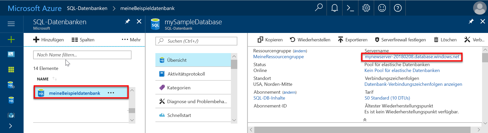

# Erstellen einer SQL-Datenbank-Firewallregel auf Serverebene mithilfe des Azure-Portals

In dieser Schnellstartanleitung wird gezeigt, die Sie eine Firewallregel auf Serverebene für eine Azure SQL-Datenbank erstellen, um eine Verbindung von einer lokalen Ressource herstellen zu können.

## Voraussetzungen

Diese Schnellstartanleitung verwendet als Ausgangspunkt die Ressourcen, die in der Schnellstartanleitung [Erstellen einer Azure SQL-Datenbank im Azure-Portal](sql-database-get-started-portal.md) erstellt werden.

## Anmelden beim Azure-Portal

Melden Sie sich beim [Azure-Portal](https://portal.azure.com/) an.

## Erstellen einer Firewallregel auf Serverebene

Der SQL-Datenbankdienst erstellt eine Firewall auf Serverebene, um zu verhindern, dass Anwendungen und Tools eine Verbindung mit dem Server oder Datenbanken auf dem Server herstellen, sofern keine Firewallregel erstellt wird, um die Firewall zu öffnen. Für eine Verbindung von einer IP-Adresse, die sich außerhalb von Azure befindet, müssen Sie eine Firewallregel für eine bestimmte IP-Adresse oder einen IP-Adressbereich erstellen. Führen Sie die hier angegebenen Schritte zum Erstellen einer [SQL-Datenbank-Firewallregel auf Serverebene](sql-database-firewall-configure.md) für die IP-Adresse Ihres Clients und Zulassen der externen Konnektivität durch die SQL-Datenbankfirewall nur für Ihre IP-Adresse aus.

> [!NOTE]
> SQL-Datenbank kommuniziert über Port 1433. Wenn Sie versuchen, eine Verbindung aus einem Unternehmensnetzwerk heraus herzustellen, wird der ausgehende Datenverkehr über Port 1433 von der Firewall Ihres Netzwerks unter Umständen nicht zugelassen. In diesem Fall können Sie nur dann eine Verbindung mit Ihrem Azure SQL-Datenbankserver herstellen, wenn Ihre IT-Abteilung Port 1433 öffnet.
>

1. Klicken Sie nach Abschluss der Bereitstellung im Menü auf der linken Seite auf **SQL-Datenbanken**, und klicken Sie dann auf der Seite **SQL-Datenbanken** auf **mySampleDatabase**. Die Übersichtsseite für Ihre Datenbank wird geöffnet, die den vollqualifizierten Servernamen (z.B. **mynewserver20170824.database.windows.net**) und Optionen für die weitere Konfiguration enthält.

2. Kopieren Sie diesen vollqualifizierten Servernamen, um in den nachfolgenden Schnellstartanleitungen eine Verbindung mit Ihrem Server und den Datenbanken herzustellen.

   

3. Klicken Sie auf der Symbolleiste wie in der obigen Abbildung dargestellt auf **Serverfirewall festlegen**. Die Seite **Firewalleinstellungen** für den SQL-Datenbankserver wird geöffnet.

   

4. Klicken Sie in der Symbolleiste auf **Client-IP-Adresse hinzufügen**, um Ihre aktuelle IP-Adresse einer neuen Firewallregel hinzuzufügen. Eine Firewallregel kann Port 1433 für eine einzelne IP-Adresse oder einen Bereich von IP-Adressen öffnen.

5. Klicken Sie auf **Speichern**. Für Ihre aktuelle IP-Adresse wird eine Firewallregel auf Serverebene erstellt, und auf dem logischen Server wird Port 1433 geöffnet.

6. Klicken Sie auf **OK**, und schließen Sie anschließend die Seite **Firewalleinstellungen**.

Sie können für diese IP-Adresse jetzt eine Verbindung mit dem SQL-Datenbankserver und den dazugehörigen Datenbanken herstellen. Verwenden Sie hierfür SQL Server Management Studio oder ein anderes Tool Ihrer Wahl sowie das zuvor erstellte Serveradministratorkonto.

> [!IMPORTANT]
> Standardmäßig ist der Zugriff über die SQL-Datenbank-Firewall für alle Azure-Dienste aktiviert. Klicken Sie auf dieser Seite auf **AUS**, um dies für alle Azure-Dienste zu deaktivieren.
>

## Bereinigen von Ressourcen

Speichern Sie diese Ressourcen, um unter [Nächste Schritte](#next-steps) zu erfahren, wie Sie eine Verbindung herstellen und Ihre Datenbank mit verschiedenen Methoden abfragen. Sie können die Ressourcen, die Sie im Rahmen dieser Schnellstartanleitung erstellt haben, aber auch wieder löschen. Gehen Sie hierzu wie folgt vor:

1. Klicken Sie im Azure-Portal im Menü auf der linken Seite auf **Ressourcengruppen** und dann auf **myResourceGroup**.
2. Klicken Sie auf der Seite mit Ihrer Ressourcengruppe auf **Löschen**, geben Sie im Textfeld **myResourceGroup** ein, und klicken Sie dann auf **Löschen**.

## Nächste Schritte

- Nachdem Sie nun über eine Datenbank verfügen, können Sie mit Ihren bevorzugten Tools oder Sprachen [eine Verbindung herstellen und Abfragen ausführen](sql-database-connect-query.md). Dazu zählen auch:
  - [Verbinden und Abfragen mit SQL Server Management Studio (SSMS)](sql-database-connect-query-ssms.md)
  - [Verbinden und Abfragen mit Azure Data Studio](https://docs.microsoft.com/sql/azure-data-studio/quickstart-sql-database?toc=/azure/sql-database/toc.json)
- Informationen zum Entwerfen Ihrer ersten Datenbank, zum Erstellen von Tabellen und zum Einfügen von Daten finden Sie in diesen Tutorials:
 - [Entwurf Ihrer ersten Azure SQL-Datenbank](sql-database-design-first-database.md)
 - [Entwerfen einer Azure SQL-Datenbank und Herstellen einer Verbindung mit C# und ADO.NET](sql-database-design-first-database-csharp.md)
