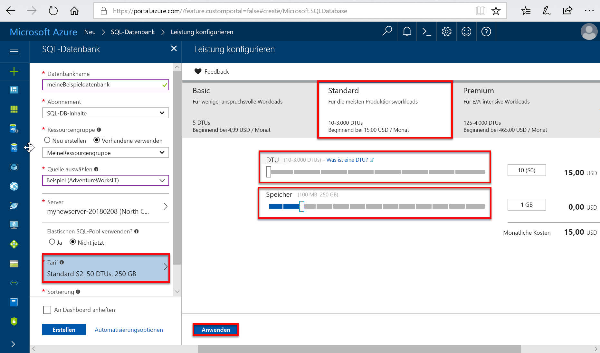
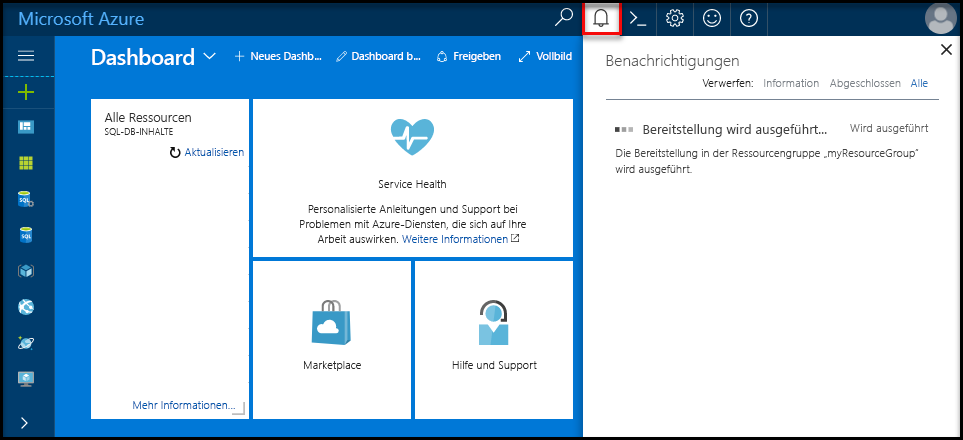
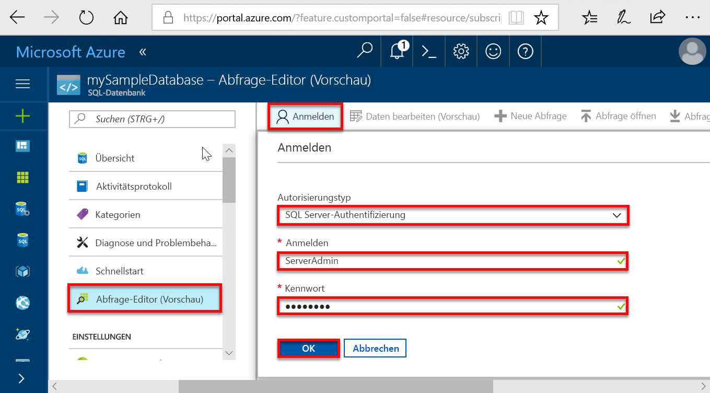
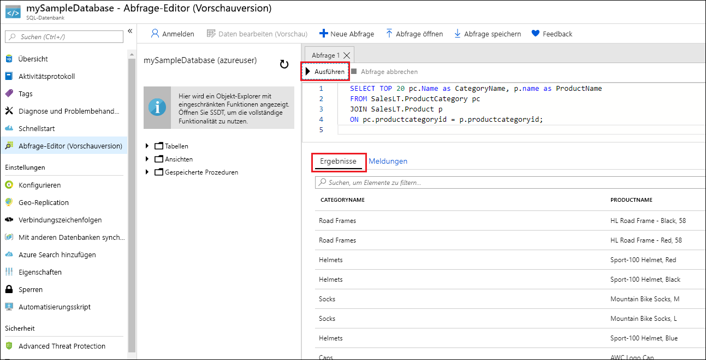

# <a name="quickstart-create-an-azure-sql-database-in-the-azure-portal"></a>Schnellstart: Erstellen einer Azure SQL-Datenbank im Azure-Portal

In dieser Schnellstartanleitung erfahren Sie Schritt für Schritt, wie Sie unter Verwendung des [DTU-basierten Kaufmodells](sql-database-service-tiers-dtu.md) eine SQL-Datenbank in Azure erstellen. Azure SQL-Datenbank ist ein „Database as a Service“-Angebot, bei dem Sie hoch verfügbare SQL Server-Datenbanken in der Cloud ausführen und skalieren können. In dieser Schnellstartanleitung wird gezeigt, wie Sie zum Einstieg im Azure-Portal eine SQL-Datenbank und anschließend Abfragen erstellen.

Wenn Sie kein Azure-Abonnement besitzen, können Sie ein [kostenloses Konto](https://azure.microsoft.com/free/) erstellen, bevor Sie beginnen.

  >[!NOTE]
  >In diesem Tutorial wird das DTU-basierte Kaufmodell verwendet. Das [V-Kern-basierte Kaufmodell](sql-database-service-tiers-vcore.md) ist jedoch ebenfalls verfügbar.

## <a name="log-in-to-the-azure-portal"></a>Anmelden beim Azure-Portal

Melden Sie sich beim [Azure-Portal](https://portal.azure.com/) an.

## <a name="create-a-sql-database"></a>Erstellen einer SQL-Datenbank

Eine Azure SQL-Datenbank wird mit einer definierten Gruppe von [Compute- und Speicherressourcen](sql-database-service-tiers-dtu.md) erstellt. Die Datenbank wird in einer [Azure-Ressourcengruppe](../azure-resource-manager/resource-group-overview.md) und auf einem [logischen Azure SQL-Datenbankserver](sql-database-features.md) erstellt.

Führen Sie diese Schritte aus, um eine SQL-Datenbank mit den Adventure Works LT-Beispieldaten zu erstellen.

1. Klicken Sie im Azure-Portal links oben auf **Ressource erstellen**.

2. Wählen Sie auf der Seite **Neu** die Option **Datenbanken** und dann auf der Seite **Neu** unter **SQL-Datenbank** die Option **Erstellen** aus.

   

3. Geben Sie die folgenden Informationen in das SQL-Datenbank-Formular ein, wie in der obigen Abbildung dargestellt:   

   | Einstellung       | Empfohlener Wert | BESCHREIBUNG |
   | ------------ | ------------------ | ------------------------------------------------- |
   | **Datenbankname** | mySampleDatabase | Gültige Datenbanknamen finden Sie unter [Database Identifiers](https://docs.microsoft.com/sql/relational-databases/databases/database-identifiers) (Datenbankbezeichner). |
   | **Abonnement** | Ihr Abonnement  | Ausführliche Informationen zu Ihren Abonnements finden Sie unter [Abonnements](https://account.windowsazure.com/Subscriptions). |
   | **Ressourcengruppe**  | myResourceGroup | Gültige Ressourcengruppennamen finden Sie unter [Naming rules and restrictions](https://docs.microsoft.com/azure/architecture/best-practices/naming-conventions) (Benennungsregeln und Einschränkungen). |
   | **Quelle auswählen** | Sample (AdventureWorksLT) | Lädt das AdventureWorksLT-Schema und die Daten in Ihre neue Datenbank. |

   > [!IMPORTANT]
   > Wählen Sie in diesem Formular die Beispieldatenbank aus. Sie wird im weiteren Verlauf dieser Schnellstartanleitung verwendet.
   >

4. Klicken Sie unter **Server** auf **Erforderliche Einstellungen konfigurieren**, und geben Sie im Formular für den (logischen) SQL-Server die folgenden Informationen an, wie in der folgenden Abbildung zu sehen:   

   | Einstellung       | Empfohlener Wert | BESCHREIBUNG |
   | ------------ | ------------------ | ------------------------------------------------- |
   | **Servername** | Ein global eindeutiger Name | Gültige Servernamen finden Sie unter [Naming rules and restrictions](https://docs.microsoft.com/azure/architecture/best-practices/naming-conventions) (Benennungsregeln und Einschränkungen). |
   | **Serveradministratoranmeldung** | Ein gültiger Name | Gültige Anmeldenamen finden Sie unter [Database Identifiers](https://docs.microsoft.com/sql/relational-databases/databases/database-identifiers) (Datenbankbezeichner). |
   | **Kennwort** | Ein gültiges Kennwort | Ihr Kennwort muss mindestens acht Zeichen umfassen und Zeichen aus drei der folgenden Kategorien enthalten: Großbuchstaben, Kleinbuchstaben, Zahlen und nicht alphanumerische Zeichen. |
   | **Abonnement** | Ihr Abonnement | Ausführliche Informationen zu Ihren Abonnements finden Sie unter [Abonnements](https://account.windowsazure.com/Subscriptions). |
   | **Ressourcengruppe** | myResourceGroup | Gültige Ressourcengruppennamen finden Sie unter [Naming rules and restrictions](https://docs.microsoft.com/azure/architecture/best-practices/naming-conventions) (Benennungsregeln und Einschränkungen). |
   | **Location** | Gültiger Standort | Informationen zu Regionen finden Sie unter [Azure-Regionen](https://azure.microsoft.com/regions/). |

   > [!IMPORTANT]
   > Der hier angegebene Benutzername und das Kennwort für den Serveradministrator sind erforderlich, um später in diesem Schnellstart die Anmeldung am Server und bei den zugehörigen Datenbanken auszuführen. Behalten Sie diese Angaben im Kopf, oder notieren Sie sie zur späteren Verwendung.
   >  

   

5. Klicken Sie nach dem Ausfüllen des Formulars auf **Auswählen**.

6. Klicken Sie auf **Tarif**, um die Dienstebene, die Anzahl von DTUs und die Menge an Speicher anzugeben. Entdecken Sie die Optionen für die Menge an DTUs und Speicher, die für jede Dienstebene verfügbar ist.

   > [!IMPORTANT]
   > Mehr als 1 TB Speicher im Premium-Tarif ist derzeit in allen Regionen verfügbar, mit Ausnahme von: „Vereinigtes Königreich, Norden“, „USA, Westen-Mitte“, „Vereinigtes Königreich, Süden2“, „China, Osten“, „US DoD, Mitte“, „Deutschland, Mitte“, „US DoD, Osten“, „US Gov, Südwesten“, „US Gov, Süden-Mitte“, „Deutschland, Nordosten“, „China, Norden“, „US Gov, Osten“. In anderen Regionen ist der Speicher im Premium-Tarif auf 1 TB begrenzt. Siehe [Aktuelle Einschränkungen für P11–P15]( sql-database-dtu-resource-limits-single-databases.md#single-database-limitations-of-p11-and-p15-when-the-maximum-size-greater-than-1-tb).  

7. Wählen Sie in dieser Schnellstartanleitung die Dienstebene **Standard** und anschließend mithilfe des Schiebereglers **10 DTUs (S0)** und **1** GB Speicher aus.

   

8. Akzeptieren Sie die Nutzungsbedingungen für die Vorschauversion, um die Option **Add-On-Speicher** zu verwenden.

   > [!IMPORTANT]
   > Mehr als 1 TB Speicher im Premium-Tarif ist derzeit in allen Regionen verfügbar, mit Ausnahme von: „USA, Westen-Mitte“, „China, Osten“, „US DoD, Mitte“, „USGov Iowa“, „Deutschland, Mitte“, „US DoD, Osten“, „US Gov, Südwesten“, „Deutschland, Nordosten“, „China, Norden“. In anderen Regionen ist der Speicher im Premium-Tarif auf 1 TB begrenzt. Siehe [Aktuelle Einschränkungen für P11–P15]( sql-database-dtu-resource-limits-single-databases.md#single-database-limitations-of-p11-and-p15-when-the-maximum-size-greater-than-1-tb).  

9. Klicken Sie auf **Übernehmen**, wenn Sie die Dienstebene, die Anzahl von DTUs und die Menge an Speicherplatz ausgewählt haben.  

10. Nachdem Sie das SQL-Datenbank-Formular ausgefüllt haben, können Sie auf **Erstellen** klicken, um die Datenbank bereitzustellen. Die Bereitstellung dauert einige Minuten.

11. Klicken Sie in der Symbolleiste auf **Benachrichtigungen**, um den Bereitstellungsprozess zu überwachen.

     

## <a name="query-the-sql-database"></a>Abfragen der SQL-Datenbank

Nachdem Sie nun eine Beispieldatenbank in Azure erstellt haben, können Sie das integrierte Abfragetool im Azure-Portal verwenden, um sich zu vergewissern, dass Sie eine Verbindung mit der Datenbank herstellen und die Daten abfragen können.

1. Klicken Sie auf der Seite „SQL-Datenbank“ für Ihre Datenbank im Menü auf der linken Seite auf **Abfrage-Editor (Vorschau)** und dann auf **Anmelden**.

   

2. Wählen Sie die SQL Server-Authentifizierung aus, geben Sie die erforderlichen Anmeldeinformationen an, und klicken Sie dann auf **OK**, um sich anzumelden.

3. Geben Sie nach der Authentifizierung als **Serveradministrator** im Bereich für den Abfrage-Editor die folgende Abfrage ein:

   ```sql
   SELECT TOP 20 pc.Name as CategoryName, p.name as ProductName
   FROM SalesLT.ProductCategory pc
   JOIN SalesLT.Product p
   ON pc.productcategoryid = p.productcategoryid;
   ```

4. Klicken Sie auf **Ausführen**, und sehen Sie sich die Abfrageergebnisse im Bereich **Ergebnisse** an.

   

5. Schließen Sie die Seite **Abfrage-Editor**, und klicken Sie auf **OK**, um Ihre nicht gespeicherten Änderungen zu verwerfen.

## <a name="clean-up-resources"></a>Bereinigen von Ressourcen

Speichern Sie diese Ressourcen, um unter [Nächste Schritte](#next-steps) zu erfahren, wie Sie eine Verbindung herstellen und Ihre Datenbank mit verschiedenen Methoden abfragen. Sie können die Ressourcen, die Sie im Rahmen dieser Schnellstartanleitung erstellt haben, aber auch wieder löschen. Gehen Sie hierzu wie folgt vor:


1. Klicken Sie im Azure-Portal im Menü auf der linken Seite auf **Ressourcengruppen** und dann auf **myResourceGroup**.
2. Klicken Sie auf der Seite mit Ihrer Ressourcengruppe auf **Löschen**, geben Sie im Textfeld **myResourceGroup** ein, und klicken Sie dann auf **Löschen**.

## <a name="next-steps"></a>Nächste Schritte

- Sie haben nun eine Datenbank. Jetzt müssen Sie eine Firewallregel auf Serverebene erstellen, um von Ihren lokalen Tools eine Verbindung herzustellen. Siehe [Erstellen einer Firewallregel auf Serverebene](sql-database-get-started-portal-firewall.md).
- Wenn Sie eine Firewallregel auf Serverebene erstellen, können Sie [eine Verbindung herstellen und Abfragen ausführen](sql-database-connect-query.md) und dazu eines Ihrer bevorzugten Tools (oder eine bevorzugte Sprache) verwenden. Dazu zählen:
  - [Verbinden und Abfragen mit SQL Server Management Studio (SSMS)](sql-database-connect-query-ssms.md)
  - [Verbinden und Abfragen mit Azure Data Studio](https://docs.microsoft.com/sql/azure-data-studio/quickstart-sql-database?toc=/azure/sql-database/toc.json)
- Informationen zum Erstellen von Datenbanken mit der Azure-Befehlszeilenschnittstelle finden Sie unter [Azure CLI-Beispiele](sql-database-cli-samples.md).
- Informationen zum Erstellen von Datenbanken mit Azure PowerShell finden Sie unter [Azure PowerShell-Beispiele](sql-database-powershell-samples.md).