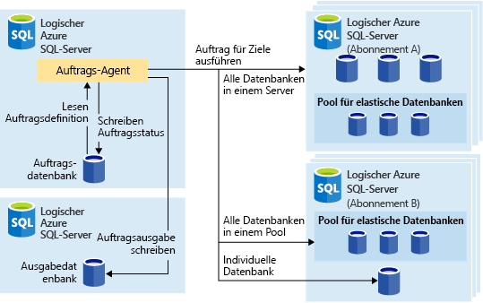
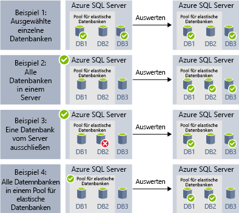
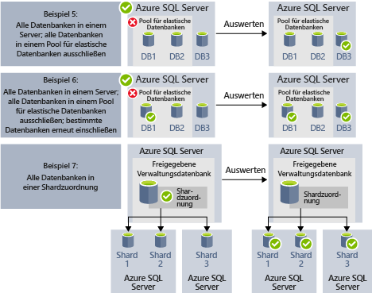

# <a name="automate-management-tasks-using-database-jobs"></a>Automatisieren von Verwaltungsaufgaben mithilfe von Datenbankaufträgen

Azure SQL-Datenbank ermöglicht die Erstellung und Planung von Aufträgen, die in regelmäßigen Abständen für einzelne oder mehrere Datenbanken ausgeführt werden können, um T-SQL-Abfragen und Wartungsaufgaben auszuführen. Jeder Auftrag protokolliert den Ausführungsstatus und wiederholt die Vorgänge im Falle eines Fehlers automatisch.
Sie können die Zieldatenbank oder Gruppen von Azure SQL-Datenbanken sowie Zeitpläne für die Auftragsausführung definieren.
Ein Auftrag nimmt Ihnen die Anmeldung bei der Zieldatenbank ab. Zudem können Sie Transact-SQL-Skripts zur Ausführung für eine Gruppe von Azure SQL-Datenbanken definieren, verwalten und speichern.

## <a name="when-to-use-automated-jobs"></a>Verwendung der automatisierten Aufträge

Die Auftragsautomatisierung kann in verschiedenen Szenarien hilfreich sein:

- Automatisierung von Verwaltungsaufgaben, die beispielsweise an jedem Werktag oder nach Geschäftsschluss ausgeführt werden sollen.
  - Bereitstellung von Schemaänderungen, Anmeldeinformationsverwaltung, Leistungsdatensammlung oder Telemetrieerfassung für Mandanten (Kunden).
  - Aktualisierung von Referenzdaten (datenbankübergreifende Informationen), Laden von Daten aus Azure Blob Storage.
  - Neuerstellung von Indizes zum Verbessern der Abfrageleistung. Konfiguration von Aufträgen, sodass diese für eine gesamte Sammlung von Datenbanken auf wiederkehrender Basis ausgeführt werden (etwa in Zeiten mit geringer Auslastung).
  - Sammlung von Abfrageergebnissen aus einer Menge von Datenbanken in einer zentralen Tabelle auf fortlaufender Grundlage. Leistungsabfragen können fortlaufend ausgeführt werden und für die Auslösung der Ausführung weiterer Aufgaben konfiguriert werden.
- Sammeln von Berichtsdaten
  - Aggregation von Daten aus einer Sammlung von Azure SQL-Datenbanken in einer einzelnen Zieltabelle.
  - Ausführung von Abfragen zur Datenverarbeitung mit längerer Laufzeit für eine große Anzahl von Datenbanken, z.B. bei der Sammlung von Kundentelemetrie. Die Ergebnisse werden zur weiteren Analyse in einer einzelnen Zieltabelle gesammelt.
- Datenverschiebungen
  - Erstellung von Aufträgen, die Änderungen an Ihren Datenbanken in anderen Datenbanken replizieren oder Aktualisierungen aus Remotedatenbanken erfassen und die Änderungen auf die Datenbank anwenden.
  - Erstellung von Aufträgen, die Daten mithilfe von SQL Server Integration Services (SSIS) aus Ihren oder in Ihre Datenbanken laden.

## <a name="overview"></a>Übersicht

In Azure SQL-Datenbank stehen folgende Auftragsplanungstechnologien zur Verfügung:

- **SQL-Agent-Aufträge** sind eine klassische und bewährte SQL Server-Auftragsplanungskomponente, die in verwalteten Instanzen verfügbar ist. In Einzeldatenbanken stehen SQL-Agent-Aufträge nicht zur Verfügung.
- **Elastische Datenbankaufträge** sind ein Auftragsplanungsdienst, der benutzerdefinierte Aufträge für einzelne oder mehrere Azure SQL-Datenbanken ausführt.

Zwischen dem SQL-Agent (lokal und als Komponente einer verwalteten SQL-Datenbank-Instanz verfügbar) und dem Datenbank-Agent für elastische Aufträge (für Einzeldatenbanken in Azure SQL-Datenbank und Datenbanken in SQL Data Warehouse verfügbar) gibt es einige Unterschiede.

|  |Elastische Aufträge  |SQL-Agent |
|---------|---------|---------|
|Bereich     |  Beliebige Anzahl von Azure SQL-Datenbanken und/oder Data Warehouses in der gleichen Azure-Cloud wie der Auftrags-Agent. Ziele können sich auf unterschiedlichen SQL-Datenbank-Servern, in unterschiedlichen Abonnements und/oder in unterschiedlichen Regionen befinden. <br><br>Zielgruppen können einzelne Datenbanken/Data Warehouses oder alle Datenbanken auf einem Server, in einem Pool oder in einer Shardzuordnung (dynamisch zur Auftragslaufzeit aufgezählt) enthalten. | Beliebige einzelne Datenbank in der gleichen SQL Server-Instanz wie der SQL-Agent. |
|Unterstützte APIs und Tools     |  Portal, PowerShell, T-SQL, Azure Resource Manager      |   T-SQL, SQL Server Management Studio (SSMS)     |

## <a name="sql-agent-jobs"></a>SQL-Agent-Aufträge

Bei SQL-Agent-Aufträgen handelt es sich um eine angegebene Reihe von T-SQL-Skripts für Ihre Datenbank. Verwenden Sie Aufträge, um eine Verwaltungsaufgabe zu definieren, die einmalig oder mehrmals ausgeführt und deren Erfolgsstatus überwacht werden kann.
Ein Auftrag kann auf einem einzelnen lokalen Server oder auf mehreren Remoteservern ausgeführt werden. Ein SQL-Agent-Auftrag ist eine interne Komponente der Datenbank-Engine, die innerhalb des Diensts für die verwaltete Instanz ausgeführt wird.
Im Zusammenhang mit SQL-Agent-Aufträgen gibt es mehrere wichtige Konzepte:

- **Auftragsschritte:** Eine Gruppe von einzelnen oder mehreren Schritten, die im Rahmen des Auftrags ausgeführt werden sollen. Für jeden Auftragsschritt können Sie eine Wiederholungsstrategie und die Aktion definieren, die ausgeführt werden soll, wenn der Auftragsschritt erfolgreich oder nicht erfolgreich war.
- **Zeitpläne:** Definieren, wann der Auftrag ausgeführt werden soll.
- **Benachrichtigungen:** Ermöglichen es, Regeln zu definieren, auf deren Grundlage Bediener nach Abschluss des Auftrags per E-Mail benachrichtigt werden.

### <a name="job-steps"></a>Auftragsschritte

SQL-Agent-Auftragsschritte sind Aktionssequenzen, die der SQL-Agent ausführen soll. Jeder Schritt verfügt über den nächsten Schritt, der ausgeführt werden soll, wenn der Schritt erfolgreich oder nicht erfolgreich war, sowie die Anzahl von Wiederholungsversuchen, falls der Schritt nicht erfolgreich war.
Der SQL-Agent ermöglicht die Erstellung verschiedener Arten von Auftragsschritten. Hierzu zählen etwa Transact-SQL-Auftragsschritte zum Ausführen eines einzelnen Transact-SQL-Batchs für die Datenbank, Betriebssystembefehl-/PowerShell-Schritte zum Ausführen eines benutzerdefinierten Betriebssystemskripts, SSIS-Auftragsschritte zum Laden von Daten unter Verwendung der SSIS-Runtime sowie [Replikationsschritte](sql-database-managed-instance-transactional-replication.md) zum Veröffentlichen von Änderungen aus Ihrer Datenbank in anderen Datenbanken.

[Transaktionsreplikation](sql-database-managed-instance-transactional-replication.md) ist ein Datenbank-Engine-Feature, mit dem Sie die Änderungen an einzelnen oder mehreren Tabellen in einer einzelnen Datenbank veröffentlichen und an eine Gruppe von Abonnentendatenbank verteilen bzw. darin veröffentlichen können. Die Veröffentlichung der Änderungen wird mithilfe folgender SQL-Agent-Auftragsschritttypen implementiert:

- Transaktionsprotokollleser
- Momentaufnahme
- Verteiler

Andere Arten von Auftragsschritten werden derzeit nicht unterstützt, einschließlich:

- Der Auftragsschritt Mergereplikation wird nicht unterstützt.
- Der Warteschlangenleser wird nicht unterstützt.
- Analysis Services wird nicht unterstützt.

### <a name="job-schedules"></a>Auftragszeitpläne

Ein Zeitplan gibt an, wann ein Auftrag ausgeführt wird. Mehrere Aufträge können auf dem gleichen Zeitplan basieren, und für einen Auftrag können mehrere Zeitpläne gelten.
Ein Zeitplan kann folgende Bedingungen für die Ausführungszeit eines Auftrags definieren:

- Beim Neustart der Instanz (oder beim Start des SQL Server-Agents). Der Auftrag wird nach jedem Failover aktiviert.
- Einmalig zum angegebenen Zeitpunkt (Datum und Uhrzeit). Hilfreich für die verzögerte Ausführung eines Auftrags.
- Auf der Grundlage einer Zeitplanserie.

> [!Note]
> Für die verwaltete Instanz können derzeit keine Aufträge gestartet werden, wenn sich die Instanz im Leerlauf befindet.

### <a name="job-notifications"></a>Auftragsbenachrichtigungen

SQL-Agent-Aufträge ermöglichen es, Benachrichtigungen zu erhalten, wenn der Auftrag erfolgreich abgeschlossen wurde oder ein Fehler aufgetreten ist. Sie können Benachrichtigungen per E-Mail erhalten.

Dazu müssen Sie zunächst das E-Mail-Konto für den Versand der E-Mail-Benachrichtigungen einrichten und das Konto dem E-Mail-Profil `AzureManagedInstance_dbmail_profile` zuweisen, wie im folgenden Beispiel zu sehen:

```sql
-- Create a Database Mail account
EXECUTE msdb.dbo.sysmail_add_account_sp
    @account_name = 'SQL Agent Account',
    @description = 'Mail account for Azure SQL Managed Instance SQL Agent system.',
    @email_address = '$(loginEmail)',
    @display_name = 'SQL Agent Account',
    @mailserver_name = '$(mailserver)' ,
    @username = '$(loginEmail)' ,  
    @password = '$(password)' 

-- Create a Database Mail profile
EXECUTE msdb.dbo.sysmail_add_profile_sp
    @profile_name = 'AzureManagedInstance_dbmail_profile',
    @description = 'E-mail profile used for messages sent by Managed Instance SQL Agent.' ;

-- Add the account to the profile
EXECUTE msdb.dbo.sysmail_add_profileaccount_sp
    @profile_name = 'AzureManagedInstance_dbmail_profile',
    @account_name = 'SQL Agent Account',
    @sequence_number = 1;
```

Darüber hinaus müssen Sie für die verwaltete Instanz die Option „Datenbank-E-Mail“ einrichten:

```sql
GO
EXEC sp_configure 'show advanced options', 1;  
GO  
RECONFIGURE;  
GO  
EXEC sp_configure 'Database Mail XPs', 1;  
GO  
RECONFIGURE 
```

Sie können Bediener über Vorkommnisse im Zusammenhang mit Ihren SQL-Agent-Aufträgen informieren. Ein Bediener definiert Kontaktinformationen für eine Person, die für die Wartung einzelner oder mehrerer verwalteter Instanzen zuständig ist. Manchmal sind die Aufgaben eines Bedieners einer einzelnen Person zugewiesen.
In Systemen mit mehreren verwalteten Instanzen oder SQL Server-Instanzen können die Bedieneraufgaben auf zahlreiche Personen verteilt sein. Ein Bediener verfügt über keine Sicherheitsinformationen und definiert keinen Sicherheitsprinzipal.

Bediener können mithilfe von SSMS oder per Transact-SQL-Skript erstellt werden, wie im folgenden Beispiel gezeigt:

```sql
EXEC msdb.dbo.sp_add_operator 
    @name=N'Mihajlo Pupun', 
        @enabled=1, 
        @email_address=N'mihajlo.pupin@contoso.com'
```

Sie können beliebige Aufträge ändern und Bediener zuweisen, die per E-Mail benachrichtigt werden sollen, wenn ein Auftrag abgeschlossen wird, nicht erfolgreich war oder erfolgreich war. Hierzu können Sie entweder SSMS oder das folgende Transact-SQL-Skript verwenden:

```sql
EXEC msdb.dbo.sp_update_job @job_name=N'Load data using SSIS', 
        @notify_level_email=3,                        -- Options are: 1 on succeed, 2 on failure, 3 on complete
        @notify_email_operator_name=N'Mihajlo Pupun'
```

### <a name="sql-agent-job-limitations"></a>Einschränkungen für SQL-Agent-Aufträge

Einige der in SQL Server verfügbaren SQL-Agent-Features werden in verwalteten Instanzen nicht unterstützt:
- SQL-Agent-Einstellungen sind schreibgeschützt. Die Prozedur `sp_set_agent_properties` wird in einer verwalteten Instanz nicht unterstützt.
- Das Aktivieren/Deaktivieren des Agents wird derzeit in verwalteten Instanzen nicht unterstützt. Der SQL-Agent wird kontinuierlich ausgeführt.
- Benachrichtigungen werden teilweise unterstützt.
  - Der Pager wird nicht unterstützt.
  - NetSend wird nicht unterstützt.
  - Warnungen werden noch nicht unterstützt.
- Proxys werden nicht unterstützt.
- EventLog wird nicht unterstützt.

Weitere Informationen zum SQL Server-Agent finden Sie unter [SQL Server-Agent](https://docs.microsoft.com/sql/ssms/agent/sql-server-agent).

## <a name="elastic-database-jobs"></a>Aufträge für die elastische Datenbank

Mit **Aufträgen für die elastische Datenbank** können Sie einzelne oder mehrere T-SQL-Skripts parallel für eine große Anzahl von Datenbanken ausführen – entweder gemäß einem Zeitplan oder nach Bedarf.

**Führen Sie Aufträge für eine beliebige Kombination von Datenbanken aus:** für einzelne oder mehrere individuelle Datenbanken, für alle Datenbanken auf einem Server, für alle Datenbanken in einem Pool für elastische Datenbanken oder für eine Shardzuordnung – und zusätzlich mit der Flexibilität, spezifische Datenbanken ein- oder ausschließen zu können. **Aufträge können für mehrere Server, für mehrere Pools und sogar für Datenbanken aus anderen Abonnements ausgeführt werden.** Server und Pools werden zur Laufzeit dynamisch aufgezählt, sodass Aufträge für alle Datenbanken ausgeführt werden, die zum Zeitpunkt der Ausführung in der Zielgruppe vorhanden sind.

Die folgende Abbildung zeigt einen Auftrags-Agent, der Aufträge für die verschiedenen Arten von Zielgruppen ausführt:



### <a name="elastic-job-components"></a>Komponenten für elastische Aufträge

|Komponente  | Beschreibung (Weitere Details finden Sie im Anschluss an die Tabelle.) |
|---------|---------|
|[**Agent für elastische Aufträge**](#elastic-job-agent) |  Der Azure-Ressource, die Sie zum Ausführen und Verwalten von Aufträgen erstellen.   |
|[**Auftragsdatenbank**](#job-database)    |    Eine Azure SQL-Datenbank, in der der Auftrags-Agent auftragsbezogene Daten, Auftragsdefinitionen und Ähnliches speichert.      |
|[**Zielgruppe**](#target-group)      |  Die Gruppe von Servern, Pools, Datenbanken und Shardzuordnungen, für die ein Auftrag ausgeführt werden soll.       |
|[**Auftrag**](#job)  |  Ein Auftrag ist eine Arbeitseinheit mit mindestens einem [Auftragsschritt](#job-step). Auftragsschritte geben das auszuführende T-SQL-Skript sowie andere für die Skriptausführung erforderliche Details an.  |


#### <a name="elastic-job-agent"></a>Agent für elastische Aufträge

Bei einem Agent für elastische Aufträge handelt es sich um die Azure-Ressource zum Erstellen, Ausführen und Verwalten von Aufträgen. Der Agent für elastische Aufträge ist eine Azure-Ressource, die über das Portal erstellt wird. ([PowerShell](elastic-jobs-powershell.md) und REST werden ebenfalls unterstützt.) 

Zum Erstellen eines **Agents für elastische Aufträge** muss eine SQL­-Datenbank vorhanden sein. Der Agent konfiguriert die vorhandene Datenbank als [*Auftragsdatenbank*](#job-database).

Der Agent für elastische Aufträge ist kostenlos. Die Auftragsdatenbank wird zum Tarif für SQL-Datenbanken abgerechnet.

#### <a name="job-database"></a>Auftragsdatenbank

Die *Auftragsdatenbank* dient zum Definieren von Aufträgen sowie zum Nachverfolgen des Status und Verlaufs von Auftragsausführungen. Darüber hinaus wird die *Auftragsdatenbank* auch zum Speichern von Agent-Metadaten, Protokollen, Ergebnissen und Auftragsdefinitionen verwendet und enthält außerdem zahlreiche praktische gespeicherte Prozeduren sowie andere Datenbankobjekte zum Erstellen, Ausführen und Verwalten von Aufträgen mit T-SQL.

Für die aktuelle Vorschauversion muss eine Azure SQL-Datenbank (S0 oder höher) vorhanden sein, um einen Agent für elastische Aufträge erstellen zu können.

Die *Auftragsdatenbank* muss nicht neu, aber eine bereinigte, leere Datenbank der Dienstebene S0 oder höher sein. Für die *Auftragsdatenbank* wird zwar die Dienstebene S1 oder höher empfohlen, ausschlaggebend sind jedoch die Leistungsanforderungen Ihrer Aufträge (sprich: die Anzahl von Auftragsschritten sowie Anzahl und Intervall der Auftragswiederholungen). Ein Beispiel: Für einen Auftrags-Agent, der nur wenige Aufträge pro Stunde ausführt, ist eine S0-Datenbank ggf. ausreichend. Für einen Auftrag, der im Minutentakt ausgeführt wird, empfiehlt sich dagegen unter Umständen eine höhere Dienstebene.


##### <a name="job-database-permissions"></a>Berechtigungen für die Auftragsdatenbank

Im Zuge der Erstellung des Auftrags-Agents werden in der *Auftragsdatenbank* ein Schema, Tabellen und eine Rolle namens *jobs_reader* erstellt. Die Rolle wird mit folgenden Berechtigung erstellt und soll Administratoren eine präzisere Zugriffssteuerung für die Auftragsüberwachung ermöglichen:


|Rollenname  |Berechtigungen des Schemas „jobs“  |Berechtigungen des Schemas „jobs_internal“  |
|---------|---------|---------|
|**jobs_reader**     |    SELECT     |    Keine     |

> [!IMPORTANT]
> Bedenken Sie die Auswirkungen auf die Sicherheit, bevor Sie Datenbankadministratorzugriff auf die *Auftragsdatenbank* gewähren. Ein böswilliger Benutzer mit Berechtigungen zum Erstellen oder Bearbeiten von Aufträgen kann theoretisch einen Auftrag erstellen oder bearbeiten, der unter Verwendung gespeicherter Anmeldeinformationen eine Verbindung mit einer Datenbank herstellt, die der Kontrolle des böswilligen Benutzers unterliegt. Auf diese Weise kann der böswillige Benutzer dann das Kennwort der Anmeldeinformationen ermitteln.


#### <a name="target-group"></a>Zielgruppe

Eine *Zielgruppe* definiert die Gruppe von Datenbanken, für die ein Auftragsschritt ausgeführt wird. Eine Zielgruppe kann eine beliebige Anzahl und Kombination der folgenden Optionen enthalten:

- **SQL-Datenbankserver:** Bei Angabe eines Servers werden alle Datenbanken, die sich zum Zeitpunkt der Auftragsausführung auf dem Server befinden, in die Gruppe einbezogen. Damit die Gruppe vor der Auftragsausführung aufgezählt und aktualisiert werden kann, müssen die Anmeldeinformationen für die Masterdatenbank angegeben werden.
- **Pool für elastische Datenbanken:** Bei Angabe eines Pools für elastische Datenbanken werden alle Datenbanken, die sich zum Zeitpunkt der Auftragsausführung in dem Pool für elastische Datenbanken befinden, in die Gruppe einbezogen. Genau wie bei einem Server müssen die Anmeldeinformationen für die Masterdatenbank angegeben werden, damit die Gruppe vor der Auftragsausführung aktualisiert werden kann.
- **Einzelne Datenbank:** Geben Sie eine oder mehrere einzelne Datenbanken an, die in die Gruppe einbezogen werden sollen.
- **Shardzuordnung:** Datenbanken einer Shardzuordnung.

> [!TIP]
> Die Gruppe von Datenbanken in Zielgruppen mit Servern oder Pools wird dank *dynamischer Enumeration* zum Zeitpunkt der Auftragsausführung neu ausgewertet. Die dynamische Enumeration stellt sicher, dass **Aufträge für alle Datenbanken ausgeführt werden, die zum Zeitpunkt der Auftragsausführung auf dem Server oder im Pool vorhanden sind**. Das erneute Auswerten der Datenbankliste zur Laufzeit ist besonders hilfreich in Szenarios mit häufig wechselnder Pool- oder Servermitgliedschaft.

Pools und einzelne Datenbanken können in die Gruppe eingeschlossen oder aus der Gruppe ausgeschlossen werden. Dadurch können Sie eine Zielgruppe mit einer beliebigen Kombination von Datenbanken erstellen. So können Sie beispielsweise einer Zielgruppe einen Server hinzufügen, aber bestimmte Datenbanken aus einem Pool für elastische Datenbanken (oder den gesamten Pool) ausschließen.

Eine Zielgruppe kann Datenbanken aus mehreren Abonnements und aus mehreren Regionen enthalten. Im Vergleich zu Ausführungen in der gleichen Region ist bei regionsübergreifenden Ausführungen mit höheren Wartezeiten zu rechnen.

Die folgenden Beispiele zeigen, wie verschiedene Zielgruppendefinitionen zum Zeitpunkt der Auftragsausführung dynamisch aufgelistet werden, um zu bestimmen, welche Datenbanken vom Auftrag ausgeführt werden:



**Beispiel 1** zeigt eine Zielgruppe, die aus einer Liste einzelner Datenbanken besteht. Wenn ein Auftragsschritt mithilfe dieser Zielgruppe ausgeführt wird, wird die Aktion des Auftragsschritts in jeder dieser Datenbanken ausgeführt.<br>
**Beispiel 2** zeigt eine Zielgruppe, die einen Azure SQL Server als Ziel enthält. Wenn ein Auftragsschritt mit dieser Zielgruppe ausgeführt wird, wird der Server dynamisch aufgezählt, um die Liste der Datenbanken zu bestimmen, die sich aktuell auf dem Server befinden. Die Aktion des Auftragsschritts wird in jeder dieser Datenbanken ausgeführt.<br>
**Beispiel 3** zeigt eine ähnliche Zielgruppe wie *Beispiel 2*, eine einzelne Datenbank wird jedoch ausdrücklich ausgeschlossen. Die Aktion des Auftragsschritts wird in der ausgeschlossenen Datenbank *nicht* ausgeführt.<br>
**Beispiel 4** zeigt eine Zielgruppe, die einen Pool für elastische Datenbanken als Ziel enthält. So ähnlich wie in *Beispiel 2* wird der Pool zum Zeitpunkt der Auftragsausführung dynamisch aufgezählt, um die Liste der Datenbanken im Pool zu bestimmen.
<br><br>




**Beispiel 5** und **Beispiel 6** zeigen erweiterte Szenarien, bei denen Azure SQL-Server, Datenbanken und Pools für elastische Datenbanken mithilfe von Ein- und Ausschlussregeln kombiniert werden können.<br>
**Beispiel 7** zeigt, dass die Shards in einer Shard-Zuordnung zum Zeitpunkt der Auftragsausführung ebenfalls ausgewertet werden können.

#### <a name="job"></a>Auftrag

Ein *Auftrag* ist eine Arbeitseinheit, die gemäß einem Zeitplan oder als einmaliger Auftrag ausgeführt wird. Ein Auftrag enthält mindestens einen *Auftragsschritt*.

##### <a name="job-step"></a>Auftragsschritt

Jeder Auftragsschritt gibt ein auszuführendes T-SQL-Skript, mindestens eine Zielgruppe für die T-SQL-Skriptausführung sowie die Anmeldeinformationen an, die der Auftrags-Agent für die Verbindungsherstellung mit der Zieldatenbank benötigt. Jeder Auftragsschritt verfügt über anpassbare Timeout- und Wiederholungsrichtlinien und kann optional mit Ausgabeparametern versehen werden.

#### <a name="job-output"></a>Auftragsausgabe

Das Ergebnis der Auftragsschritte wird für jede Zieldatenbank detailliert erfasst, und als Ziel für die Skriptausgabe kann eine Tabelle angegeben werden. Sie können eine Datenbank angeben, in der alle von einem Auftrag zurückgegebenen Daten gespeichert werden.

#### <a name="job-history"></a>Auftragsverlauf

Der Auftragsausführungsverlauf wird in der *Auftragsdatenbank* gespeichert. Daten des Ausführungsverlaufs, die älter als 45 Tage sind, werden durch einen Systembereinigungsauftrag bereinigt. Wenn Sie Verlaufsdaten löschen möchten, die noch keine 45 Tage alt sind, rufen Sie die gespeicherte Prozedur **sp_purge_history** in der *Auftragsdatenbank* auf.

### <a name="agent-performance-capacity-and-limitations"></a>Leistung, Kapazität und Einschränkungen des Agents

Elastische Aufträge benötigen nur sehr wenig Computeressourcen, während sie auf den Abschluss von Aufträgen mit langer Ausführungszeit warten.

Die Compute- und Leistungsanforderungen, die der Agent an die *Auftragsdatenbank* stellt, hängen von der Größe der Zielgruppe mit den Datenbanken und der gewünschten Ausführungszeit für einen Auftrag (Anzahl gleichzeitiger Worker) ab: je mehr Ziele und je höher die Anzahl von Aufträgen, desto höher die Computeanforderungen.

Die Vorschauversion ist aktuell auf 100 gleichzeitige Aufträge beschränkt.

#### <a name="prevent-jobs-from-reducing-target-database-performance"></a>Verhindern einer Leistungsbeeinträchtigung für die Zieldatenbank durch Aufträge

Die Anzahl von Datenbanken, für die ein Auftrag gleichzeitig ausgeführt werden kann, kann beschränkt werden, um sicherzustellen, dass es beim Ausführen von Aufträgen für Datenbanken in einem elastischen SQL-Pool nicht zu einer Überlastung der Ressourcen kommt.

## <a name="next-steps"></a>Nächste Schritte

- [SQL Server-Agent](https://docs.microsoft.com/sql/ssms/agent/sql-server-agent) 
- [Verwalten von Datenbankgruppen mithilfe von Aufträgen für die elastische Datenbank](elastic-jobs-overview.md) 
- [Erstellen und Verwalten von elastischen Aufträgen mithilfe von PowerShell](elastic-jobs-powershell.md) 
- [Erstellen und Verwalten von Aufträgen für die elastische Datenbank mithilfe von Transact-SQL (T-SQL)](elastic-jobs-tsql.md) 
