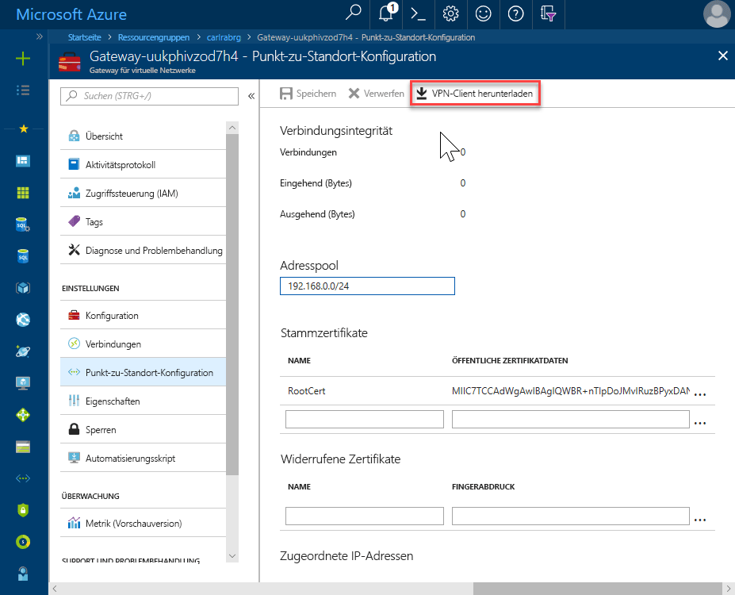
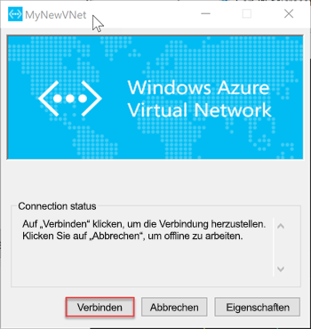

# <a name="quickstart-configure-a-point-to-site-connection-to-an-azure-sql-database-managed-instance-from-on-premises"></a>Schnellstart: Konfigurieren einer Point-to-Site-Verbindung von einem lokalen Computer mit einer verwalteten Azure SQL-Datenbank-Instanz

In dieser Schnellstartanleitung wird gezeigt, wie Sie von einem lokalen Clientcomputer eine Verbindung zu einer verwalteten Azure SQL-Datenbank-Instanz herstellen und dazu [SQL Server Management Studio](https://docs.microsoft.com/sql/ssms/sql-server-management-studio-ssms) (SSMS) und eine Point-to-Site-Verbindung verwenden. Weitere Informationen zu Point-to-Site-Verbindungen finden Sie unter [Informationen zu P2S-VPN](../vpn-gateway/point-to-site-about.md).

## <a name="prerequisites"></a>Voraussetzungen

In dieser Schnellstartanleitung gilt Folgendes:

- Als Ausgangspunkt werden die Ressourcen verwendet, die in der Schnellstartanleitung [Erstellen einer verwalteten Instanz](sql-database-managed-instance-get-started.md) erstellt wurden.
- Erforderlich sind PowerShell 5.1 und Azure PowerShell 5.4.2 oder höher auf Ihrem lokalen Clientcomputer.
- Erforderlich ist die neueste Version von [SQL Server Management Studio](https://docs.microsoft.com/sql/ssms/sql-server-management-studio-ssms) (SSMS) auf Ihrem lokalen Clientcomputer.

## <a name="attach-a-vpn-gateway-to-your-managed-instance-virtual-network"></a>Anfügen eines VPN-Gateways an Ihr virtuelles Netzwerk mit einer verwalteten Instanz

1. Öffnen Sie Powershell auf Ihrem lokalen Clientcomputer.
2. Kopieren Sie das folgende PowerShell-Skript, und fügen Sie es ein. Mit diesem Skript wird ein VPN Gateway an das virtuelle Netzwerk mit der verwalteten Instanz, die Sie in der Schnellstartanleitung [Erstellen einer verwalteten Instanz](sql-database-managed-instance-get-started.md) erstellt haben, angefügt. Mit diesem Skript werden die folgenden Schritte ausgeführt:

   - Erstellen und Installieren von Zertifikaten auf dem Clientcomputer
   - Berechnen des Subnetz-IP-Adressbereichs für den zukünftigen VPN Gateway
   - Erstellen von „GatewaySubnet“
   - Bereitstellen der Azure Resource Manager-Vorlage zum Anfügen des VPN Gateway an das VPN-Subnetz

     ```powershell
     $scriptUrlBase = 'https://raw.githubusercontent.com/Microsoft/sql-server-samples/master/samples/manage/azure-sql-db-managed-instance/attach-vpn-gateway'

     $parameters = @{
       subscriptionId = '<subscriptionId>'
       resourceGroupName = '<resourceGroupName>'
       virtualNetworkName = '<virtualNetworkName>'
       certificateNamePrefix  = '<certificateNamePrefix>'
       }

     Invoke-Command -ScriptBlock ([Scriptblock]::Create((iwr ($scriptUrlBase+'/attachVPNGateway.ps1?t='+ [DateTime]::Now.Ticks)).Content)) -ArgumentList $parameters, $scriptUrlBase
     ```

3. Stellen Sie die angeforderten Parameter im PowerShell-Skript bereit. Die Werte für `<subscriptionId>`, `<resourceGroup>` und `<virtualNetworkName>` sollten den Werten entsprechen, die in der Schnellstartanleitung [Erstellen einer verwalteten Instanz](sql-database-managed-instance-get-started.md) verwendet wurden. Der Wert für `<certificateNamePrefix>` kann eine Zeichenfolge Ihrer Wahl sein.

4. Führen Sie das PowerShell-Skript aus.

## <a name="create-a-vpn-connection-to-your-managed-instance"></a>Erstellen einer VPN-Verbindung zu Ihrer verwalteten Instanz

1. Melden Sie sich beim [Azure-Portal](https://portal.azure.com/) an.
2. Öffnen Sie die Ressourcengruppe, in der Sie den Gateway für das virtuelle Netzwerk erstellt haben, und öffnen Sie die Gateway-Ressource für das virtuelle Netzwerk.

      

3. Klicken Sie auf **Point-to-Site-Konfiguration** und dann auf **VPN-Client herunterladen**.

      
4. Extrahieren Sie die Dateien aus der ZIP-Datei, und öffnen Sie dann den extrahierten Ordner.
5. Navigieren Sie zum Ordner „WindowsAmd64“, und öffnen Sie die Datei **VpnClientSetupAmd64.exe**.
6. Wenn Sie die Nachricht **Windows hat Ihren PC geschützt** erhalten, klicken Sie auf **Weitere Informationen** und dann auf **Trotzdem ausführen**.

    \
7. Klicken Sie im Dialogfeld für die Benutzerkontensteuerung auf **Ja**, um den Vorgang fortzusetzen.
8. Klicken Sie im Dialogfeld „MyNewVNet“ auf **Ja**, um einen VPN-Client für „MyNewVNet“ zu installieren.

## <a name="connect-to-the-vpn-connection"></a>Verbinden mit der VPN-Verbindung

1. Wechseln Sie zu den VPN-Verbindungen auf Ihrem Clientcomputer, und klicken Sie auf **MyNewVNet**, um eine Verbindung zu diesem VNet herzustellen.

      
2. Klicken Sie auf **Verbinden**.
3. Klicken Sie im Dialogfeld „MyNewVNet“ auf **Verbinden**.

      
4. Klicken Sie in der Eingabeaufforderung, die besagt, dass der Verbindungs-Manager zum Aktualisieren Ihrer Routingtabelle erhöhte Rechte benötigt, auf **Weiter**.
5. Klicken Sie im Dialogfeld für die Benutzerkontensteuerung auf **Ja**, um den Vorgang fortzusetzen.

      

   Sie haben eine VPN-Verbindung zum VNet mit Ihrer verwalteten Instanz hergestellt.

## <a name="use-ssms-to-connect-to-the-managed-instance"></a>Verwenden von SSMS und Verbinden mit der verwalteten Instanz

1. Öffnen Sie auf dem lokalen Clientcomputer SQL Server Management Studio (SSMS).
2. Geben Sie im Dialogfeld **Mit Server verbinden** im Feld **Servername** den vollqualifizierten **Hostnamen** für Ihre verwaltete Instanz ein, wählen Sie **SQL Server-Authentifizierung** aus, geben Sie Benutzername und Kennwort ein, und klicken Sie dann auf **Verbinden**.

      

Nach der Verbindungsherstellung können Sie Ihre System- und Benutzerdatenbanken auf dem Knoten „Datenbanken“ und verschiedene Objekte auf den Knoten „Sicherheit“, „Serverobjekte, „Replikation“, „Verwaltung“, „SQL Server-Agent“ und „XEvent Profiler“ anzeigen.

## <a name="next-steps"></a>Nächste Schritte

- Eine Schnellstartanleitung, die zeigt, wie Sie eine Verbindung von einem virtuellen Azure-Computer herstellen, finden Sie unter [Konfigurieren einer Point-to-Site-Verbindung](sql-database-managed-instance-configure-p2s.md).
- Eine Übersicht über die Verbindungsoptionen für Anwendungen finden Sie unter [Verbinden Sie Ihre Anwendungen mit der verwalteten Instanz](sql-database-managed-instance-connect-app.md).
- Zur Wiederherstellung einer vorhandenen SQL Server-Datenbank von einer lokalen in eine verwaltete Instanz können Sie entweder [Azure Database Migration Service (DMS) für die Migration](../dms/tutorial-sql-server-to-managed-instance.md) oder den [T-SQL-Befehl „RESTORE“](sql-database-managed-instance-get-started-restore.md) verwenden, um die Wiederherstellung von einer Datenbanksicherungsdatei durchzuführen.
