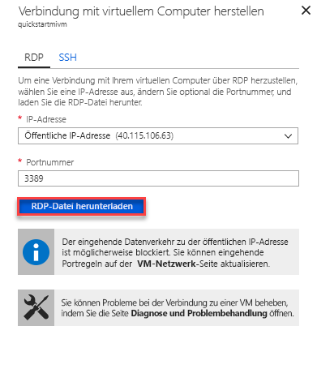

# Schnellstart: Konfigurieren einer Azure-VM für das Herstellen einer Verbindung mit einer verwalteten Azure SQL-Datenbank-Instanz

In dieser Schnellstartanleitung erfahren Sie, wie Sie einen virtuellen Azure-Computer konfigurieren, um über SQL Server Management Studio (SSMS) eine Verbindung mit einer verwalteten Azure SQL-Datenbank-Instanz herzustellen. Eine Schnellstartanleitung, die zeigt, wie Sie von einem lokalen Clientcomputer über eine Point-to-Site-Verbindung eine Verbindung herstellen, finden Sie unter [Konfigurieren einer Point-to-Site-Verbindung](sql-database-managed-instance-configure-p2s.md). 

## Voraussetzungen

Diese Schnellstartanleitung basiert auf den Ressourcen, die in der Schnellstartanleitung [Erstellen einer verwalteten Instanz](sql-database-managed-instance-get-started.md) erstellt wurden.

## Melden Sie sich auf dem Azure-Portal an.

Melden Sie sich beim [Azure-Portal](https://portal.azure.com/) an.

## Erstellen eines neuen Subnetzes im VNET der verwalteten Instanz

In den folgenden Schritten wird im VNET der verwalteten Instanz ein neues Subnetz erstellt, sodass ein virtueller Azure-Computer eine Verbindung mit der verwalteten Instanz herstellen kann. Das Subnetz der verwalteten Instanz ist für verwaltete Instanzen reserviert. In diesem Subnetz können keine anderen Ressourcen (beispielsweise virtuelle Azure-Computer) erstellt werden. 

1. Öffnen Sie die Ressourcengruppe für die verwaltete Instanz, die Sie in der Schnellstartanleitung [Erstellen einer verwalteten Instanz](sql-database-managed-instance-get-started.md) erstellt haben. Wählen Sie das virtuelle Netzwerk für Ihre verwaltete Instanz aus.

   

2. Wählen Sie **Subnetze** und anschließend **+ Subnetz** aus, um ein neues Subnetz zu erstellen.

   

3. Füllen Sie das Formular mit den Angaben aus der folgenden Tabelle aus:

   | Einstellung| Empfohlener Wert | Beschreibung |
   | ---------------- | ----------------- | ----------- | 
   | **Name** | Ein gültiger Name|Gültige Namen finden Sie unter [Benennungskonventionen](https://docs.microsoft.com/azure/architecture/best-practices/naming-conventions).|
   | **Adressbereich (CIDR-Block)** | Ein gültiger Bereich | Der Standardwert reicht für diesen Schnellstart aus.|
   | **Netzwerksicherheitsgruppe** | Keine | Der Standardwert reicht für diesen Schnellstart aus.|
   | **Routingtabelle** | Keine | Der Standardwert reicht für diesen Schnellstart aus.|
   | **Dienstendpunkte** | 0 ausgewählt | Der Standardwert reicht für diesen Schnellstart aus.|
   | **Subnetzdelegierung** | Keine | Der Standardwert reicht für diesen Schnellstart aus.|
 
   

4. Wählen Sie **OK** aus, um dieses zusätzliche Subnetz im VNET der verwalteten Instanz zu erstellen.

## Erstellen eines virtuellen Computers im neuen Subnetz im VNET

In den folgenden Schritten wird veranschaulicht, wie Sie einen virtuellen Computer im neuen Subnetz erstellen, um eine Verbindung mit der verwalteten Instanz herzustellen. 

## Vorbereiten des virtuellen Azure-Computers

Da sich die verwaltete SQL-Instanz in Ihrem privaten virtuellen Netzwerk befindet, müssen Sie einen virtuellen Azure-Computer erstellen, auf dem ein SQL-Clienttool wie SQL Server Management Studio oder Azure Data Studio installiert ist. Mithilfe dieses Tools können Sie eine Verbindung mit der verwalteten Instanz herstellen und Abfragen ausführen. In diesem Schnellstart wird SQL Server Management Studio verwendet.

Die einfachste Möglichkeit zum Erstellen eines virtuellen Clientcomputers mit allen erforderlichen Tools ist die Verwendung von Azure Resource Manager-Vorlagen.

1. Vergewissern Sie sich auf einer anderen Browserregisterkarte, dass Sie beim Azure-Portal angemeldet sind. Wählen Sie anschließend die folgende Schaltfläche aus, um einen virtuellen Clientcomputer zu erstellen und SQL Server Management Studio zu installieren:

    

2. Füllen Sie das Formular mit den Angaben aus der folgenden Tabelle aus:

   | Einstellung| Empfohlener Wert | BESCHREIBUNG |
   | ---------------- | ----------------- | ----------- |
   | **Abonnement** | Ein gültiges Abonnement | Hierbei muss es sich um ein Abonnement mit der Berechtigung zum Erstellen neuer Ressourcen handeln. |
   | **Ressourcengruppe** |Die Ressourcengruppe, die Sie im Schnellstart [Erstellen einer verwalteten Instanz](sql-database-managed-instance-get-started.md) angegeben haben.|In dieser Ressourcengruppe muss das VNET enthalten sein.|
   | **Location** | Der Standort für die Ressourcengruppe | Dieser Wert wird basierend auf der ausgewählten Ressourcengruppe ausgefüllt. | 
   | **Name des virtuellen Computers**  | Ein gültiger Name | Gültige Namen finden Sie unter [Benennungskonventionen](https://docs.microsoft.com/azure/architecture/best-practices/naming-conventions).|
   |**Benutzername des Administrators**|Ein beliebiger gültiger Benutzername|Gültige Namen finden Sie unter [Benennungskonventionen](https://docs.microsoft.com/azure/architecture/best-practices/naming-conventions). Verwenden Sie nicht „serveradmin“. Hierbei handelt es sich um eine reservierte Rolle auf Serverebene. Dieser Benutzername wird beim [Herstellen einer Verbindung mit dem virtuellen Computer](#connect-to-virtual-machine) verwendet.| 
   |**Kennwort**|Ein gültiges Kennwort|Das Kennwort muss mindestens zwölf Zeichen lang sein und die [definierten Anforderungen an die Komplexität](../virtual-machines/windows/faq.md#what-are-the-password-requirements-when-creating-a-vm) erfüllen. Dieses Kennwort wird beim [Herstellen einer Verbindung mit dem virtuellen Computer](#connect-to-virtual-machine) verwendet.|
   | **Größe des virtuellen Computers** | Eine beliebige gültige Größe | Für diese Schnellstartanleitung ist der Standardwert der Vorlage (**Standard_B2s**) ausreichend. |
   | **Location**|[resourceGroup().location].| Ändern Sie diesen Wert nicht. |
   | **Name des virtuellen Netzwerks**|Das virtuelle Netzwerk, in dem Sie die verwaltete Instanz erstellt haben.|
   | **Subnetzname**|Der Name des Subnetzes, das Sie im vorherigen Verfahren erstellt haben| Wählen Sie nicht das Subnetz aus, in dem Sie die verwaltete Instanz erstellt haben.|
   | **Artefaktspeicherort** | [deployment().properties.templateLink.uri] | Ändern Sie diesen Wert nicht. |
   | **SAS-Token des Artefaktspeicherorts** | Lassen Sie dieses Feld leer. | Ändern Sie diesen Wert nicht. |

   

   Wenn Sie unter [Erstellen einer verwalteten Instanz](sql-database-managed-instance-get-started.md) den vorgeschlagenen VNET-Namen und das Standardsubnetz verwendet haben, müssen Sie die beiden letzten Parameter nicht ändern. Andernfalls müssen Sie diese Werte in die Werte ändern, die Sie beim Einrichten der Netzwerkumgebung eingegeben haben.

3. Aktivieren Sie das Kontrollkästchen **Ich stimme den oben genannten Geschäftsbedingungen zu**.
4. Wählen Sie **Kaufen** aus, um den virtuellen Azure-Computer in Ihrem Netzwerk bereitzustellen.
5. Wählen Sie das Symbol **Benachrichtigungen**, um den Status der Bereitstellung anzuzeigen.

> [!IMPORTANT]
> Warten Sie nach dem Erstellen des virtuellen Computers etwa 15 Minuten, damit die Skripts nach der Erstellung Zeit für die Installation von SQL Server Management Studio haben.

## Herstellen der Verbindung mit dem virtuellen Computer

In den folgenden Schritten wird veranschaulicht, wie Sie für Ihren neu erstellten virtuellen Computer eine Remotedesktopverbindung herstellen.

1. Navigieren Sie zur VM-Ressource, nachdem die Bereitstellung abgeschlossen wurde.

      

2. Wählen Sie **Verbinden**aus. 
   
   Eine Formular für eine RDP-Datei (Remotedesktopprotokoll) wird mit der öffentlichen IP-Adresse und der Portnummer für den virtuellen Computer angezeigt. 

     

3. Wählen Sie **RDP-Datei herunterladen** aus.
 
   > [!NOTE]
   > Sie können für die Verbindung mit Ihrem virtuellen Computer auch SSH verwenden.

4. Schließen Sie das Formular **Mit virtuellem Computer verbinden**.
5. Öffnen Sie die heruntergeladene RDP-Datei, um eine Verbindung mit Ihrem virtuellen Computer herzustellen. 
6. Wenn Sie dazu aufgefordert werden, wählen Sie **Connect** aus. Auf einem Macintosh benötigen Sie einen RDP-Client, z.B. diesen [Remotedesktopclient](https://itunes.apple.com/us/app/microsoft-remote-desktop/id715768417?mt=12) aus dem Mac App Store.

6. Geben Sie den Benutzernamen und das Kennwort ein, den bzw. das Sie beim Erstellen des virtuellen Computers festgelegt haben, und wählen Sie anschließend **OK** aus.

7. Während des Anmeldevorgangs wird unter Umständen eine Zertifikatwarnung angezeigt. Wählen Sie **Ja** bzw. **Weiter** aus, um mit dem Herstellen der Verbindung fortzufahren.

Auf dem Server-Manager-Dashboard wird eine Verbindung mit Ihrem virtuellen Computer hergestellt.

## Verwenden von SSMS zum Verbinden mit der verwalteten Instanz

1. Öffnen Sie SQL Server Management Studio (SSMS) auf dem virtuellen Computer.
 
   Das Öffnen dauert einen Moment, da die Konfiguration bei diesem ersten Start von SSMS abgeschlossen wird.
2. Geben Sie im Dialogfeld **Mit Server verbinden** den vollqualifizierten **Hostnamen** für Ihre verwaltete Instanz in das Feld **Servername** ein. Wählen Sie **SQL Server-Authentifizierung** aus, geben Sie Ihren Benutzernamen und Ihr Kennwort ein, und wählen Sie anschließend **Verbinden** aus.

      

Nach der Verbindungsherstellung können Sie Ihre System- und Benutzerdatenbanken auf dem Knoten „Datenbanken“ und verschiedene Objekte auf den Knoten „Sicherheit“, „Serverobjekte, „Replikation“, „Verwaltung“, „SQL Server-Agent“ und „XEvent Profiler“ anzeigen.

## Nächste Schritte

- Eine Schnellstartanleitung, die zeigt, wie Sie von einem lokalen Clientcomputer über eine Point-to-Site-Verbindung eine Verbindung herstellen, finden Sie unter [Konfigurieren einer Point-to-Site-Verbindung](sql-database-managed-instance-configure-p2s.md).
- Eine Übersicht über die Verbindungsoptionen für Anwendungen finden Sie unter [Herstellen einer Verbindung zwischen einer Anwendung und einer verwalteten Azure SQL-Datenbank-Instanz](sql-database-managed-instance-connect-app.md).
- Zur Wiederherstellung einer vorhandenen SQL Server-Datenbank aus einer lokalen Instanz in eine verwaltete Instanz können Sie entweder [Azure Database Migration Service (DMS) für die Migration](../dms/tutorial-sql-server-to-managed-instance.md) oder den [T-SQL-Befehl „RESTORE“](sql-database-managed-instance-get-started-restore.md) mit einer Datenbanksicherungsdatei verwenden.
