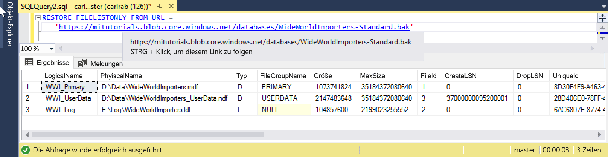

# <a name="quickstart-restore-a-database-to-a-managed-instance"></a>Schnellstart: Wiederherstellen einer Datenbank in einer verwalteten Instanz

In diesem Schnellstart verwenden Sie SQL Server Management Studio (SSMS), um eine Datenbank (die Sicherungsdatei „Wide World Importers – Standard“) aus Azure Blob Storage in einer [verwalteten Instanz](sql-database-managed-instance.md) von Azure SQL-Datenbank wiederherzustellen.

> [!VIDEO https://www.youtube.com/embed/RxWYojo_Y3Q]

> [!NOTE]
> Weitere Informationen zur Migration unter Verwendung von Azure Database Migration Service (DMS) finden Sie unter [Migrieren von SQL Server zu einer verwalteten Azure SQL-Datenbank-Instanz](../dms/tutorial-sql-server-to-managed-instance.md).
> Weitere Informationen zu verschiedenen Migrationsmethoden finden Sie unter [Migration einer SQL Server-Instanz zu einer verwalteten Azure SQL-Datenbank-Instanz](sql-database-managed-instance-migrate.md).

## <a name="prerequisites"></a>Voraussetzungen

In dieser Schnellstartanleitung gilt Folgendes:

- Es werden Ressourcen aus der Schnellstartanleitung [Erstellen einer verwalteten Azure SQL-Datenbank-Instanz](sql-database-managed-instance-get-started.md) verwendet.
- Auf Ihrem Computer muss die neueste Version von [SQL Server Management Studio](https://docs.microsoft.com/sql/ssms/sql-server-management-studio-ssms) installiert sein.
- Die Verbindungsherstellung mit Ihrer verwalteten Instanz muss über SSMS erfolgen. Informationen zum Herstellen einer Verbindung finden Sie in den folgenden Schnellstartanleitungen:
  - [Verbinden mit einer verwalteten Azure SQL-Datenbank-Instanz von einem virtuellen Azure-Computer](sql-database-managed-instance-configure-vm.md)
  - [Konfigurieren einer Point-to-Site-Verbindung von einem lokalen Computer mit einer verwalteten Azure SQL-Datenbank-Instanz](sql-database-managed-instance-configure-p2s.md)

> [!NOTE]
> Weitere Informationen zum Sichern und Wiederherstellen einer SQL Server-Datenbank mithilfe von Azure Blob Storage und einem [SAS-Schlüssel (Shared Access Signature)](https://docs.microsoft.com/azure/storage/common/storage-dotnet-shared-access-signature-part-1) finden Sie unter [SQL Server-Sicherung über URLs](sql-database-managed-instance-get-started-restore.md).

## <a name="restore-the-database-from-a-backup-file"></a>Wiederherstellen der Datenbank aus einer Sicherungsdatei

Führen Sie in SSMS die folgenden Schritte aus, um die Wide World Importers-Datenbank in Ihrer verwalteten Instanz wiederherzustellen. Die Datenbanksicherungsdatei ist in einem vorkonfigurierten Azure Blob Storage-Konto gespeichert.

1. Öffnen Sie SMSS, und stellen Sie eine Verbindung mit Ihrer verwalteten Instanz her.
2. Klicken Sie im linken Menü mit der rechten Maustaste auf Ihre verwaltete Instanz, und wählen Sie **Neue Abfrage** aus, um ein neues Abfragefenster zu öffnen.
3. Führen Sie das folgende SQL-Skript aus. Dieses Skript verwendet ein vorkonfiguriertes Speicherkonto und einen SAS-Schlüssel zum [Erstellen von Anmeldeinformationen](https://docs.microsoft.com/sql/t-sql/statements/create-credential-transact-sql) in Ihrer verwalteten Instanz.

   ```sql
   CREATE CREDENTIAL [https://mitutorials.blob.core.windows.net/databases]
   WITH IDENTITY = 'SHARED ACCESS SIGNATURE'
   , SECRET = 'sv=2017-11-09&ss=bfqt&srt=sco&sp=rwdlacup&se=2028-09-06T02:52:55Z&st=2018-09-04T18:52:55Z&spr=https&sig=WOTiM%2FS4GVF%2FEEs9DGQR9Im0W%2BwndxW2CQ7%2B5fHd7Is%3D'
   ```

    

4. Führen Sie zum Überprüfen Ihrer Anmeldeinformationen das folgende Skript aus. Dieses Skript verwendet eine [Container](https://azure.microsoft.com/services/container-instances/)-URL, um eine Sicherungsdateiliste abzurufen.

   ```sql
   RESTORE FILELISTONLY FROM URL =
      'https://mitutorials.blob.core.windows.net/databases/WideWorldImporters-Standard.bak'
   ```

    

5. Führen Sie das folgende Skript aus, um die Wide World Importers-Datenbank wiederherzustellen.

   ```sql
   RESTORE DATABASE [Wide World Importers] FROM URL =
     'https://mitutorials.blob.core.windows.net/databases/WideWorldImporters-Standard.bak'
   ```

    

6. Führen Sie das folgende Skript aus, um den Status der Wiederherstellung nachzuverfolgen.

   ```sql
   SELECT session_id as SPID, command, a.text AS Query, start_time, percent_complete
      , dateadd(second,estimated_completion_time/1000, getdate()) as estimated_completion_time
   FROM sys.dm_exec_requests r
   CROSS APPLY sys.dm_exec_sql_text(r.sql_handle) a
   WHERE r.command in ('BACKUP DATABASE','RESTORE DATABASE')
   ```

7. Nachdem die Wiederherstellung abgeschlossen wurde, können Sie sie im Objekt-Explorer anzeigen.

## <a name="next-steps"></a>Nächste Schritte

- Informationen zum Beheben von Problemen bei URL-basierten Sicherungen finden Sie unter [SQL Server-Sicherung über URLs – bewährte Methoden und Problembehandlung](https://docs.microsoft.com/sql/relational-databases/backup-restore/sql-server-backup-to-url-best-practices-and-troubleshooting).
- Eine Übersicht über App-Verbindungsoptionen finden Sie unter [Herstellen einer Verbindung zwischen einer Anwendung und einer verwalteten Azure SQL-Datenbank-Instanz](sql-database-managed-instance-connect-app.md).
- Informationen zu Abfragen mit Ihren bevorzugten Tools oder Sprachen finden Sie unter [Schnellstarts: Azure SQL-Datenbank – Verbindungsherstellung und Abfragen](sql-database-connect-query.md).
