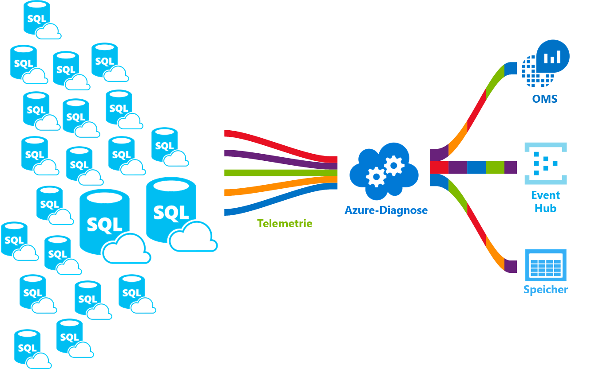

# <a name="azure-sql-database-metrics-and-diagnostics-logging"></a>Protokollierung von Metriken und Diagnosen für Azure SQL-Datenbank 
Azure SQL-Datenbank kann Metrik- und Diagnoseprotokolle ausgeben, um die Überwachung zu erleichtern. Sie können Azure SQL-Datenbank zum Speichern von Ressourcenverbrauch, Workern und Sitzungen sowie Verbindungen in einer der folgenden Azure-Ressourcen konfigurieren:
- **Azure Storage:** für die Archivierung großer Mengen von Telemetriedaten zu einem kleinen Preis
- **Azure Event Hub**: Für die Integration von Telemetriedaten von Azure SQL-Datenbank in Ihrer benutzerdefinierten Überwachungslösung oder Hotpipelines
- **Azure Log Analytics**: Für eine einsatzbereite Überwachungslösung mit Funktionen für Berichterstellung, Warnungen und Problemlösung 

    

## <a name="enable-logging"></a>Aktivieren der Protokollierung

Die Protokollierung von Metriken und Diagnosen ist standardmäßig nicht aktiviert. Sie können die Protokollierung von Metriken und Diagnosen mit einer der folgenden Methoden aktivieren und verwalten:
- Azure-Portal
- PowerShell
- Azure-Befehlszeilenschnittstelle
- REST-API 
- Resource Manager-Vorlage

Wenn Sie die Protokollierung von Metriken und Diagnosen aktivieren, müssen Sie die Azure-Ressource angeben, in der die ausgewählten Daten erfasst werden. Verfügbare Optionen:
- Log Analytics
- Event Hub
- Azure Storage 

Sie können eine neue Azure-Ressource bereitstellen oder eine vorhandene Ressource auswählen. Nachdem Sie die Speicherressource ausgewählt haben, müssen Sie angeben, welche Daten erfasst werden sollen. Verfügbare Optionen:

- **[1-minute metrics](sql-database-metrics-diag-logging.md#1-minute-metrics)** (Minutenmetriken) – Enthält DTU-Prozentsatz, DTU-Limit, CPU-Prozentsatz, Prozentsatz der gelesenen physischen Daten, Prozentsatz für Protokollschreibvorgang, Verbindungen mit Status Erfolgreich/Fehlgeschlagen/Durch Firewall blockiert, Sitzungen in Prozent, Worker in Prozent, Speicher, Speicher in Prozent, XTP-Speicher in Prozent
- **[QueryStoreRuntimeStatistics](sql-database-metrics-diag-logging.md#query-store-runtime-statistics)**: Enthält Informationen zu den Laufzeitstatistiken der Abfrage, z.B. CPU-Nutzung, Abfragedauer usw.
- **[QueryStoreWaitStatistics](sql-database-metrics-diag-logging.md#query-store-wait-statistics)**: Enthält Informationen zu den Wartestatistiken der Abfrage, die angibt, worauf Ihre Abfragen warten, z.B. CPU, Protokolle, Sperrungen usw.
- **[Errors](sql-database-metrics-diag-logging.md#errors-dataset)**: Enthält Informationen zu den SQL-Fehlern, die auf dieser Datenbank aufgetreten sind.
- **[DatabaseWaitStatistics](sql-database-metrics-diag-logging.md#database-waits-dataset)**: Enthält Informationen dazu, wie lange eine Datenbank jeweils auf die verschiedenen Wartezeittypen gewartet hat.
- **[Timeouts](sql-database-metrics-diag-logging.md#timeouts-dataset)**: Enthält Informationen dazu, wie lange eine Datenbank jeweils auf die verschiedenen Wartezeittypen gewartet hat.
- **[Blockings](sql-database-metrics-diag-logging.md#blockings-dataset)**: Enthält Informationen zu blockierenden Ereignissen, die auf einer Datenbank aufgetreten sind.
- **[SQLInsights](sql-database-metrics-diag-logging.md#intelligent-insights-dataset)**: Enthält Intelligent Insights. [Learn more about Intelligent Insights (Weitere Informationen zu Intelligent Insights)](sql-database-intelligent-insights.md)

Wenn Sie Event Hub oder ein AzureStorage-Konto angeben, können Sie eine Aufbewahrungsrichtlinie einrichten, um anzugeben, dass Daten ab einem bestimmten ausgewählten Alter gelöscht werden sollen. Wenn Sie Log Analytics angeben, hängt die Aufbewahrungsrichtlinie vom ausgewählten Tarif ab. Weitere Informationen erhalten Sie unter [Log Analytics – Preise](https://azure.microsoft.com/pricing/details/log-analytics/). 

Es wird empfohlen, sowohl den Artikel [Überblick über Metriken in Microsoft Azure](../monitoring-and-diagnostics/monitoring-overview-metrics.md) als auch den Artikel [Übersicht über Azure-Diagnoseprotokolle](../monitoring-and-diagnostics/monitoring-overview-of-diagnostic-logs.md) durchzulesen, um sich mit dem Aktivieren der Protokollierung vertraut zu machen und ein Verständnis der von den verschiedenen Azure-Diensten unterstützten Metriken und Protokollkategorien zu erlangen.

### <a name="azure-portal"></a>Azure-Portal

Um die Sammlung von Metrik- und Diagnoseprotokollen im Azure-Portal zu aktivieren, navigieren Sie zur Seite der Azure SQL-Datenbank oder des Pools für elastische Datenbanken, und klicken Sie auf **Diagnoseeinstellungen**.

   

Erstellen Sie Diagnoseeinstellungen oder bearbeiten Sie vorhandene, indem Sie das Ziel und die Telemetrie auswählen.

   

### <a name="powershell"></a>PowerShell

Verwenden Sie die folgenden Befehle, um die Metrik- und Diagnoseprotokollierung mit PowerShell zu aktivieren:

- Verwenden Sie den folgenden Befehl, um das Speichern von Diagnoseprotokollen in einem Speicherkonto zu aktivieren:

   ```powershell
   Set-AzureRmDiagnosticSetting -ResourceId [your resource id] -StorageAccountId [your storage account id] -Enabled $true
   ```

   Die Speicherkonto-ID (StorageAccountId) ist die Ressourcen-ID für das Speicherkonto, an das die Protokolle gesendet werden sollen.

- Verwenden Sie den folgenden Befehl, um das Streamen von Diagnoseprotokollen an eine Event Hub-Instanz zu aktivieren:

   ```powershell
   Set-AzureRmDiagnosticSetting -ResourceId [your resource id] -ServiceBusRuleId [your service bus rule id] -Enabled $true
   ```

   Die Service Bus-Regel-ID (ServiceBusRuleId) ist eine Zeichenfolge im folgenden Format:

   ```powershell
   {service bus resource ID}/authorizationrules/{key name}
   ``` 

- Verwenden Sie den folgenden Befehl, um das Senden von Diagnoseprotokollen an einen Log Analytics-Arbeitsbereich zu aktivieren:

   ```powershell
   Set-AzureRmDiagnosticSetting -ResourceId [your resource id] -WorkspaceId [resource id of the log analytics workspace] -Enabled $true
   ```

- Sie können die Ressourcen-ID mit folgendem Befehl aus Ihrem Log Analytics-Arbeitsbereich abrufen:

   ```powershell
   (Get-AzureRmOperationalInsightsWorkspace).ResourceId
   ```

Sie können diese Parameter miteinander kombinieren, um mehrere Ausgabeoptionen zu aktivieren.

### <a name="azure-cli"></a>Azure-Befehlszeilenschnittstelle

Verwenden Sie die folgenden Befehle, um die Metrik- und Diagnoseprotokollierung mit der Azure-CLI zu aktivieren:

- Verwenden Sie den folgenden Befehl, um das Speichern von Diagnoseprotokollen in einem Speicherkonto zu aktivieren:

   ```azurecli-interactive
   azure insights diagnostic set --resourceId <resourceId> --storageId <storageAccountId> --enabled true
   ```

   Die Speicherkonto-ID (StorageAccountId) ist die Ressourcen-ID für das Speicherkonto, an das die Protokolle gesendet werden sollen.

- Verwenden Sie den folgenden Befehl, um das Streamen von Diagnoseprotokollen an eine Event Hub-Instanz zu aktivieren:

   ```azurecli-interactive
   azure insights diagnostic set --resourceId <resourceId> --serviceBusRuleId <serviceBusRuleId> --enabled true
   ```

   Die Service Bus-Regel-ID (ServiceBusRuleId) ist eine Zeichenfolge im folgenden Format:

   ```azurecli-interactive
   {service bus resource ID}/authorizationrules/{key name}
   ```

- Verwenden Sie den folgenden Befehl, um das Senden von Diagnoseprotokollen an einen Log Analytics-Arbeitsbereich zu aktivieren:

   ```azurecli-interactive
   azure insights diagnostic set --resourceId <resourceId> --workspaceId <resource id of the log analytics workspace> --enabled true
   ```

Sie können diese Parameter miteinander kombinieren, um mehrere Ausgabeoptionen zu aktivieren.

### <a name="rest-api"></a>REST-API

Informieren Sie sich darüber, wie Sie [Diagnoseeinstellungen mithilfe der Azure Monitor-REST-API ändern](https://msdn.microsoft.com/library/azure/dn931931.aspx). 

### <a name="resource-manager-template"></a>Resource Manager-Vorlage

Informieren Sie sich darüber, wie Sie [Diagnoseeinstellungen beim Erstellen von Ressourcen mithilfe der Resource Manager-Vorlage aktivieren](../monitoring-and-diagnostics/monitoring-enable-diagnostic-logs-using-template.md). 

## <a name="stream-into-log-analytics"></a>Streamen nach Log Analytics 
Metrik- und Diagnoseprotokolle für Azure SQL-Datenbank können mithilfe der integrierten Option „An Log Analytics senden“ im Portal in Log Analytics gestreamt werden, oder durch Aktivieren von Log Analytics in einer Diagnoseeinstellung über Azure PowerShell-Cmdlets, die Azure-CLI oder die Azure Monitor-REST-API.

### <a name="installation-overview"></a>Übersicht über die Installation

Das Überwachen der Azure SQL-Datenbankflotte mit Log Analytics ist einfach. Es sind drei Schritte erforderlich:

1. Erstellen von Log Analytics-Ressourcen
2. Konfigurieren von Datenbanken zum Aufzeichnen von Metrik- und Diagnoseprotokollen in der erstellten Log Analytics-Instanz
3. Installieren Sie die **Azure SQL-Analyse**-Lösung aus dem Katalog in Log Analytics

### <a name="create-log-analytics-resource"></a>Erstellen von Log Analytics-Ressourcen

1. Klicken Sie im linken Menü auf **Neu**.
2. Klicken Sie auf **Überwachung und Verwaltung**.
3. Klicken Sie auf **Log Analytics**.
4. Füllen Sie das Log Analytics-Formular mit den erforderlichen zusätzlichen Informationen: Name des Arbeitsbereichs, Abonnement, Ressourcengruppe, Ort und Tarif.

   

### <a name="configure-databases-to-record-metrics-and-diagnostic-logs"></a>Konfigurieren von Datenbanken zum Aufzeichnen von Metrik- und Diagnoseprotokollen

Das Azure-Portal stellt die einfachste Möglichkeit dar, das Verzeichnis zu konfigurieren, in dem Datenbanken ihre Metriken aufzeichnen. Navigieren Sie im Azure-Portal zu Ihrer Azure SQL-Datenbankressource, und klicken Sie auf **Diagnoseeinstellungen**. 

### <a name="install-the-azure-sql-analytics-solution-from-gallery"></a>Installieren der Azure SQL-Analyselösung aus dem Katalog  

1. Installieren Sie die Azure SQL-Analyse-Lösung, sobald die Log Analytics-Ressource erstellt wurde und die Daten in diese fließen. Dieser Vorgang kann über den **Lösungskatalog** ausgeführt werden. Dieser findet sich auf der OMS-Startseite und im seitlichen Menü. Suchen Sie im Katalog nach dem Eintrag **Azure SQL-Analyse**, klicken Sie darauf, und klicken Sie dann auf **Hinzufügen**.

   

2. Auf der OMS-Startseite wird eine neue Kachel mit dem Namen **Azure SQL-Analyse** angezeigt. Wenn Sie diese Kachel auswählen, wird das Azure SQL-Analyse-Dashboard geöffnet.

### <a name="using-azure-sql-analytics-solution"></a>Verwenden der Azure SQL-Analyselösung

Azure SQL-Analyse stellt ein hierarchisches Dashboard dar, in dem Sie die Hierarchie der Azure SQL-Datenbankressourcen durchsuchen können. [Click here to learn how to use Azure SQL Analytics solution (Klicken Sie hier, um mehr über die Verwendung von Azure SQL-Analyse zu erfahren)](../log-analytics/log-analytics-azure-sql.md).

## <a name="stream-into-azure-event-hub"></a>Streamen nach Azure Event Hub

Metrik- und Diagnoseprotokolle für Azure SQL-Datenbank können mithilfe der integrierten Option „An einen Event Hub streamen“ im Portal in Event Hub gestreamt werden, oder durch Aktivieren der Service Bus-Regel-ID in einer Diagnoseeinstellung über Azure PowerShell-Cmdlets, die Azure-CLI oder die Azure Monitor-REST-API. 

### <a name="what-to-do-with-metrics-and-diagnostic-logs-in-event-hub"></a>Welche Vorgänge können mit Metrik- und Diagnoseprotokollen in Event Hub ausgeführt werden?
Wenn die ausgewählten Daten nach Event Hub gestreamt werden, sind Sie der Einrichtung fortgeschrittener Überwachungsszenarien ein ganzes Stück näher gekommen. Event Hubs fungiert als „Eingangstür“ für eine Ereignispipeline. Nach der Erfassung in Event Hubs können Sie Daten mit einem beliebigen Echtzeit-Analyseanbieter oder mit Batchverarbeitungs-/Speicheradaptern umwandeln und speichern. Event Hubs entkoppelt die Erzeugung eines Datenstroms von Ereignissen von der Nutzung dieser Ereignisse, sodass  Ereignisconsumer nach einem eigenen Zeitplan auf Ereignisse zugreifen können. Weitere Informationen zu Event Hub finden Sie unter:

- [Was sind Azure Event Hubs?](../event-hubs/event-hubs-what-is-event-hubs.md)
- [Erste Schritte mit Event Hubs](../event-hubs/event-hubs-csharp-ephcs-getstarted.md)


Im Anschluss finden Sie eine kleine Auswahl von Verwendungsmöglichkeiten für das Streamen:

-             Anzeigen der Dienstintegrität durch Streamen von Daten zum langsamsten Pfad an PowerBI: Mithilfe von Event Hubs, Stream Analytics und PowerBI können Sie sich anhand Ihrer Metrik- und Diagnosedaten problemlos und nahezu in Echtzeit einen Einblick in Ihre Azure-Dienste verschaffen. [Stream Analytics und Power BI](../stream-analytics/stream-analytics-power-bi-dashboard.md) bietet eine gute Übersicht über die Einrichtung von Event Hubs, die Verarbeitung von Daten mit Stream Analytics und die Verwendung von PowerBI als Ausgabe.
-             Streamen von Protokollen in Protokollierungs- und Telemetrie-Streams von Drittanbietern: Mithilfe des Event Hubs-Streamings können Sie Ihre Metrik- und Diagnoseprotokolle in verschiedene Überwachungs- und Protokollanalyselösungen von Drittanbietern übertragen. 
-             Erstellen einer benutzerdefinierten Telemetrie- und Protokollierungsplattform: Event Hubs ermöglicht dank des hochgradig skalierbaren Veröffentlichen/Abonnieren-Konzepts eine flexible Erfassung von Diagnoseprotokollen. Dies ist interessant, wenn Sie bereits über eine benutzerdefinierte Telemetrieplattform verfügen oder eine solche Plattform erstellen möchten. Informationen zur Verwendung von Event Hubs für eine globale Telemetrieplattform finden Sie in der [Anleitung von Dan Rosanova](https://azure.microsoft.com/documentation/videos/build-2015-designing-and-sizing-a-global-scale-telemetry-platform-on-azure-event-Hubs/).

## <a name="stream-into-azure-storage"></a>Streamen nach Azure Storage

Azure SQL-Datenbank-Metrik- und Diagnoseprotokolle können mithilfe der integrierten Option „In ein Speicherkonto archivieren“ im Azure-Portal in Azure Storage gespeichert werden, oder durch Aktivieren von Azure Storage in einer Diagnoseeinstellung über Azure PowerShell-Cmdlets, die Azure-CLI oder die Azure Monitor-REST-API.

### <a name="schema-of-metrics-and-diagnostic-logs-in-the-storage-account"></a>Schema der Metrik- und Diagnoseprotokolle im Speicherkonto

Wenn Sie die Sammlung von Metrik- und Diagnoseprotokollen eingerichtet haben, wird ein Speichercontainer im ausgewählten Speicherkonto erstellt, wenn die ersten Datenzeilen verfügbar sind. Die Struktur dieser Blobs sieht wie folgt aus:

```powershell
insights-{metrics|logs}-{category name}/resourceId=/SUBSCRIPTIONS/{subscription ID}/ RESOURCEGROUPS/{resource group name}/PROVIDERS/Microsoft.SQL/servers/{resource_server}/ databases/{database_name}/y={four-digit numeric year}/m={two-digit numeric month}/d={two-digit numeric day}/h={two-digit 24-hour clock hour}/m=00/PT1H.json
```
    
Einfacher ausgedrückt:

```powershell
insights-{metrics|logs}-{category name}/resourceId=/{resource Id}/y={four-digit numeric year}/m={two-digit numeric month}/d={two-digit numeric day}/h={two-digit 24-hour clock hour}/m=00/PT1H.json
```

Ein Blob-Name für Minutenmetriken kann beispielsweise wie folgt lauten:

```powershell
insights-metrics-minute/resourceId=/SUBSCRIPTIONS/s1id1234-5679-0123-4567-890123456789/RESOURCEGROUPS/TESTRESOURCEGROUP/PROVIDERS/MICROSOFT.SQL/ servers/Server1/databases/database1/y=2016/m=08/d=22/h=18/m=00/PT1H.json
```

Wenn Sie die Daten aus dem Pool für elastische Datenbanken aufzeichnen möchten, weicht der Blob-Name etwas ab:

```powershell
insights-{metrics|logs}-{category name}/resourceId=/SUBSCRIPTIONS/{subscription ID}/ RESOURCEGROUPS/{resource group name}/PROVIDERS/Microsoft.SQL/servers/{resource_server}/ elasticPools/{elastic_pool_name}/y={four-digit numeric year}/m={two-digit numeric month}/d={two-digit numeric day}/h={two-digit 24-hour clock hour}/m=00/PT1H.json
```

### <a name="download-metrics-and-logs-from-azure-storage"></a>Herunterladen von Metriken und Protokollen aus Azure Storage

Siehe [Herunterladen von Metrik- und Diagnoseprotokollen aus Azure Storage](../storage/blobs/storage-dotnet-how-to-use-blobs.md#download-blobs)

## <a name="metrics-and-logs-available"></a>Verfügbare Metriken und Protokolle

### <a name="1-minute-metrics"></a>Minutenmetriken

|**Ressource**|**Metriken**|
|---|---|
|Datenbank|DTU-Prozentsatz, DTU-Verwendung, DTU-Limit, CPU-Prozentsatz, Prozentsatz der gelesen physischen Daten, Prozentsatz für Protokollschreibvorgang, Verbindungen mit Status Erfolgreich/Fehlgeschlagen/Durch Firewall blockiert, Sitzungen in Prozent, Worker in Prozent, Speicher, Speicher in Prozent, XTP-Speicher in Prozent, Deadlocks |
|Elastischer Pool|eDTU-Prozentsatz, eDTU-Verwendung, eDTU-Limit, CPU-Prozentsatz, Prozentsatz der gelesen physischen Daten, Prozentsatz für Protokollschreibvorgang, Sitzungen in Prozent, Worker in Prozent, Speicher, Speicher in Prozent, Speicherbegrenzung, XTP-Speicher in Prozent |
|||

### <a name="query-store-runtime-statistics"></a>Laufzeitstatistiken für den Abfragespeicher

|Eigenschaft|Beschreibung|
|---|---|
|TenantId|Ihre Mandanten-ID|
|SourceSystem|Immer: Azure|
|TimeGenerated [UTC]|Zeitstempel für den Aufzeichnungsbeginn des Protokolls|
|Typ|Immer: AzureDiagnostics|
|ResourceProvider|Name des Ressourcenanbieters Immer: MICROSOFT.SQL|
|Kategorie|Name der Kategorie Immer: QueryStoreRuntimeStatistics|
|NameVorgang|Name des Vorgangs. Immer: QueryStoreRuntimeStatisticsEvent|
|Ressource|Name der Ressource|
|ResourceType|Name des Ressourcentyps Immer: SERVERS/DATABASES|
|SubscriptionId|GUID des Abonnements, zu der die Datenbank gehört.|
|ResourceGroup|Name der Ressourcengruppe, zu der die Datenbank gehört.|
|LogicalServerName_s|Name des Servers, zu dem die Datenbank gehört.|
|ElasticPoolName_s|Name des elastischen Pools, zu dem die Datenbank gehört (falls vorhanden)|
|DatabaseName_s|Name der Datenbank|
|ResourceId|Ressourcen-URI|
|query_hash_s|Abfragehash|
|query_plan_hash_s|Hash des Abfrageplans|
|statement_sql_handle_s|SQL-Anweisungshandle|
|interval_start_time_d|Beginn des DateTimeOffsets des Intervalls in Anzahl von Takten von 1900-1-1.|
|interval_end_time_d|Ende des DateTimeOffsets des Intervalls in Anzahl von Takten von 1900-1-1.|
|logical_io_writes_d|Gesamtzahl von logischen E/A-Schreibvorgängen|
|max_logical_io_writes_d|Maximale Anzahl von logischen E/A-Schreibvorgängen pro Ausführung|
|physical_io_reads_d|Gesamtzahl von physischen E/A-Lesevorgängen|
|max_physical_io_reads_d|Maximale Anzahl von logischen E/A-Lesevorgängen pro Ausführung|
|logical_io_reads_d|Gesamtzahl von logischen E/A-Lesevorgängen|
|max_logical_io_reads_d|Maximale Anzahl von logischen E/A-Lesevorgängen pro Ausführung|
|execution_type_d|Ausführungstyp|
|count_executions_d|Anzahl von Ausführungen der Abfrage|
|cpu_time_d|Verwendete CPU-Gesamtzeit der Abfrage in Mikrosekunden|
|max_cpu_time_d|Maximal verwendete CPU-Zeit durch eine einzelne Ausführung in Mikrosekunden|
|dop_d|Summe des Grads an Parallelität|
|max_dop_d|Maximal verwendeter Grad an Parallelität für eine einzelne Ausführung|
|rowcount_d|Gesamtzahl von zurückgegebenen Zeilen|
|max_rowcount_d|Maximale Anzahl von Zeilen, die in einer einzelnen Ausführung zurückgegeben werden|
|query_max_used_memory_d|Gesamtmenge des verwendeten Arbeitsspeichers in KB|
|max_query_max_used_memory_d|Maximal verwendete Menge an Arbeitsspeicher durch eine einzelne Ausführung in KB|
|duration_d|Gesamtausführungszeit in Mikrosekunden|
|max_duration_d|Maximale Ausführungszeit einer einzelnen Ausführung|
|num_physical_io_reads_d|Gesamtzahl von physischen Lesevorgängen|
|max_num_physical_io_reads_d|Maximale Anzahl von physischen Lesevorgängen pro Ausführung|
|log_bytes_used_d|Gesamtmenge der verwendeten Protokollbytes|
|max_log_bytes_used_d|Maximale Menge der verwendeten Protokollbytes pro Ausführung|
|query_id_d|ID der Abfrage im Abfragespeicher|
|plan_id_d|ID des Plans im Abfragespeicher|

[Learn more about Query Store runtime statistics data (Weitere Informationen zu Laufzeitstatistikdaten für den Abfragespeicher)](https://docs.microsoft.com/en-us/sql/relational-databases/system-catalog-views/sys-query-store-runtime-stats-transact-sql)

### <a name="query-store-wait-statistics"></a>Wartestatistiken des Abfragespeichers

|Eigenschaft|Beschreibung|
|---|---|
|TenantId|Ihre Mandanten-ID|
|SourceSystem|Immer: Azure|
|TimeGenerated [UTC]|Zeitstempel für den Aufzeichnungsbeginn des Protokolls|
|Typ|Immer: AzureDiagnostics|
|ResourceProvider|Name des Ressourcenanbieters Immer: MICROSOFT.SQL|
|Kategorie|Name der Kategorie Immer: QueryStoreRuntimeStatistics|
|NameVorgang|Name des Vorgangs. Immer: QueryStoreRuntimeStatisticsEvent|
|Ressource|Name der Ressource|
|ResourceType|Name des Ressourcentyps Immer: SERVERS/DATABASES|
|SubscriptionId|GUID des Abonnements, zu der die Datenbank gehört.|
|ResourceGroup|Name der Ressourcengruppe, zu der die Datenbank gehört.|
|LogicalServerName_s|Name des Servers, zu dem die Datenbank gehört.|
|ElasticPoolName_s|Name des elastischen Pools, zu dem die Datenbank gehört (falls vorhanden)|
|DatabaseName_s|Name der Datenbank|
|ResourceId|Ressourcen-URI|
|wait_category_s|Kategorie des Wartevorgangs|
|is_parameterizable_s|Parametrisierbarkeit der Abfrage|
|statement_type_s|Anweisungstyp|
|statement_key_hash_s|Schlüsselhash der Anweisung|
|exec_type_d|Ausführungstyp|
|total_query_wait_time_ms_d|Gesamtwartezeit der Abfrage für die bestimmte Wartekategorie|
|max_query_wait_time_ms_d|Maximale Wartezeit der Abfrage in einer einzelnen Ausführung der bestimmten Wartekategorie|
|query_param_type_d|0|
|query_hash_s|Abfragehash im Abfragespeicher|
|query_plan_hash_s|Hash des Abfrageplans im Abfragespeicher|
|statement_sql_handle_s|Anweisungshandle im Abfragespeicher|
|interval_start_time_d|Beginn des DateTimeOffsets des Intervalls in Anzahl von Takten von 1900-1-1.|
|interval_end_time_d|Ende des DateTimeOffsets des Intervalls in Anzahl von Takten von 1900-1-1.|
|count_executions_d|Anzahl von Ausführungen der Abfrage|
|query_id_d|ID der Abfrage im Abfragespeicher|
|plan_id_d|ID des Plans im Abfragespeicher|

[Klicken Sie hier, um weitere Informationen zu Wartestatistikdaten des Abfragespeichers zu erhalten.](https://docs.microsoft.com/en-us/sql/relational-databases/system-catalog-views/sys-query-store-wait-stats-transact-sql)

### <a name="errors-dataset"></a>Fehlerdataset

|Eigenschaft|Beschreibung|
|---|---|
|TenantId|Ihre Mandanten-ID|
|SourceSystem|Immer: Azure|
|TimeGenerated [UTC]|Zeitstempel für den Aufzeichnungsbeginn des Protokolls|
|Typ|Immer: AzureDiagnostics|
|ResourceProvider|Name des Ressourcenanbieters Immer: MICROSOFT.SQL|
|Kategorie|Name der Kategorie Immer: QueryStoreRuntimeStatistics|
|NameVorgang|Name des Vorgangs. Immer: QueryStoreRuntimeStatisticsEvent|
|Ressource|Name der Ressource|
|ResourceType|Name des Ressourcentyps Immer: SERVERS/DATABASES|
|SubscriptionId|GUID des Abonnements, zu der die Datenbank gehört.|
|ResourceGroup|Name der Ressourcengruppe, zu der die Datenbank gehört.|
|LogicalServerName_s|Name des Servers, zu dem die Datenbank gehört.|
|ElasticPoolName_s|Name des elastischen Pools, zu dem die Datenbank gehört (falls vorhanden)|
|DatabaseName_s|Name der Datenbank|
|ResourceId|Ressourcen-URI|
|Nachricht|Fehlermeldungen in Nur-Text|
|user_defined_b|Benutzerdefiniertes Fehlerbit|
|error_number_d|Fehlercode|
|Severity|Schweregrad des Fehlers|
|state_d|Status des Fehlers|
|query_hash_s|Abfragehash der fehlgeschlagenen Abfrage (falls vorhanden)|
|query_plan_hash_s|Hash des Abfrageplans der fehlgeschlagenen Abfrage (falls vorhanden)|

[SQL Server error messages (Fehlermeldungen von SQL Server)](https://msdn.microsoft.com/en-us/library/cc645603.aspx)

### <a name="database-waits-dataset"></a>Wartedataset der Datenbank

|Eigenschaft|Beschreibung|
|---|---|
|TenantId|Ihre Mandanten-ID|
|SourceSystem|Immer: Azure|
|TimeGenerated [UTC]|Zeitstempel für den Aufzeichnungsbeginn des Protokolls|
|Typ|Immer: AzureDiagnostics|
|ResourceProvider|Name des Ressourcenanbieters Immer: MICROSOFT.SQL|
|Kategorie|Name der Kategorie Immer: QueryStoreRuntimeStatistics|
|NameVorgang|Name des Vorgangs. Immer: QueryStoreRuntimeStatisticsEvent|
|Ressource|Name der Ressource|
|ResourceType|Name des Ressourcentyps Immer: SERVERS/DATABASES|
|SubscriptionId|GUID des Abonnements, zu der die Datenbank gehört.|
|ResourceGroup|Name der Ressourcengruppe, zu der die Datenbank gehört.|
|LogicalServerName_s|Name des Servers, zu dem die Datenbank gehört.|
|ElasticPoolName_s|Name des elastischen Pools, zu dem die Datenbank gehört (falls vorhanden)|
|DatabaseName_s|Name der Datenbank|
|ResourceId|Ressourcen-URI|
|wait_type_s|Name des Wartetyps|
|start_utc_date_t [UTC]|Gemessener Zeitraum der Startzeit|
|end_utc_date_t [UTC]|Gemessener Zeitraum der Endzeit|
|delta_max_wait_time_ms_d|Maximale Wartezeit pro Ausführung|
|delta_signal_wait_time_ms_d|Gesamte Signalwartezeit|
|delta_wait_time_ms_d|Gesamtwartezeit im Zeitraum|
|delta_waiting_tasks_count_d|Anzahl von wartenden Aufgaben|

[Klicken Sie hier, um mehr über Datenbankwartestatistiken zu erfahren.](https://docs.microsoft.com/en-us/sql/relational-databases/system-dynamic-management-views/sys-dm-os-wait-stats-transact-sql)

### <a name="timeouts-dataset"></a>Dataset der Timeouts

|Eigenschaft|Beschreibung|
|---|---|
|TenantId|Ihre Mandanten-ID|
|SourceSystem|Immer: Azure|
|TimeGenerated [UTC]|Zeitstempel für den Aufzeichnungsbeginn des Protokolls|
|Typ|Immer: AzureDiagnostics|
|ResourceProvider|Name des Ressourcenanbieters Immer: MICROSOFT.SQL|
|Kategorie|Name der Kategorie Immer: QueryStoreRuntimeStatistics|
|NameVorgang|Name des Vorgangs. Immer: QueryStoreRuntimeStatisticsEvent|
|Ressource|Name der Ressource|
|ResourceType|Name des Ressourcentyps Immer: SERVERS/DATABASES|
|SubscriptionId|GUID des Abonnements, zu der die Datenbank gehört.|
|ResourceGroup|Name der Ressourcengruppe, zu der die Datenbank gehört.|
|LogicalServerName_s|Name des Servers, zu dem die Datenbank gehört.|
|ElasticPoolName_s|Name des elastischen Pools, zu dem die Datenbank gehört (falls vorhanden)|
|DatabaseName_s|Name der Datenbank|
|ResourceId|Ressourcen-URI|
|error_state_d|Fehlerstatuscode|
|query_hash_s|Abfragehash (falls verfügbar)|
|query_plan_hash_s|Hash des Abfrageplans (falls verfügbar)|

### <a name="blockings-dataset"></a>Dataset der Blockierungen

|Eigenschaft|Beschreibung|
|---|---|
|TenantId|Ihre Mandanten-ID|
|SourceSystem|Immer: Azure|
|TimeGenerated [UTC]|Zeitstempel für den Aufzeichnungsbeginn des Protokolls|
|Typ|Immer: AzureDiagnostics|
|ResourceProvider|Name des Ressourcenanbieters Immer: MICROSOFT.SQL|
|Kategorie|Name der Kategorie Immer: QueryStoreRuntimeStatistics|
|NameVorgang|Name des Vorgangs. Immer: QueryStoreRuntimeStatisticsEvent|
|Ressource|Name der Ressource|
|ResourceType|Name des Ressourcentyps Immer: SERVERS/DATABASES|
|SubscriptionId|GUID des Abonnements, zu der die Datenbank gehört.|
|ResourceGroup|Name der Ressourcengruppe, zu der die Datenbank gehört.|
|LogicalServerName_s|Name des Servers, zu dem die Datenbank gehört.|
|ElasticPoolName_s|Name des elastischen Pools, zu dem die Datenbank gehört (falls vorhanden)|
|DatabaseName_s|Name der Datenbank|
|ResourceId|Ressourcen-URI|
|lock_mode_s|Von der Abfrage verwendeter Sperrmodus|
|resource_owner_type_s|Besitzer der Sperre|
|blocked_process_filtered_s|Blockierter XML-Prozessbericht|
|duration_d|Dauer der Sperre in Millisekunden|

### <a name="intelligent-insights-dataset"></a>Dataset von Intelligent Insights
[Klicken Sie hier, um mehr über das Protokollformat von Intelligent Insights zu erfahren.](sql-database-intelligent-insights-use-diagnostics-log.md)

## <a name="next-steps"></a>Nächste Schritte

- Lesen Sie sowohl den Artikel [Überblick über Metriken in Microsoft Azure](../monitoring-and-diagnostics/monitoring-overview-metrics.md) als auch den Artikel [Übersicht über Azure-Diagnoseprotokolle](../monitoring-and-diagnostics/monitoring-overview-of-diagnostic-logs.md) durch, um sich mit dem Aktivieren der Protokollierung vertraut zu machen und ein Verständnis der von den verschiedenen Azure-Diensten unterstützten Metriken und Protokollkategorien zu erlangen.
- Lesen Sie diese Artikel durch, um sich über Event Hubs zu informieren:
   - [Was sind Azure Event Hubs?](../event-hubs/event-hubs-what-is-event-hubs.md)
   - [Erste Schritte mit Event Hubs](../event-hubs/event-hubs-csharp-ephcs-getstarted.md)
- Siehe [Herunterladen von Metrik- und Diagnoseprotokollen aus Azure Storage](../storage/blobs/storage-dotnet-how-to-use-blobs.md#download-blobs)

