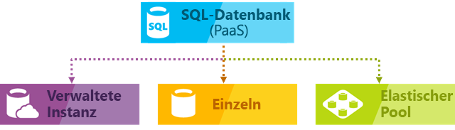

# Wählen Sie eine SQL Server-Cloudoption: Azure SQL-Datenbank (PaaS) oder SQL Server auf Azure-VMs (IaaS)

In Azure können Sie Ihre SQL Server-Workloads in einer gehosteten Infrastruktur (IaaS) oder als gehosteten Dienst ([PaaS](https://azure.microsoft.com/overview/what-is-paas/)) ausführen lassen:

- [Azure SQL-Datenbank](https://azure.microsoft.com/services/sql-database/): Eine SQL-Datenbank-Engine, die auf der Enterprise-Edition von SQL Server basiert und für die moderne Anwendungsentwicklung optimiert ist. Azure SQL-Datenbank bietet mehrere Bereitstellungsoptionen:

  - Sie können eine einzelne Datenbank in einem [logischen Server](sql-database-logical-servers.md) bereitstellen.
  - Eine Bereitstellung ist auch in einen [Pool für elastische Datenbanken](sql-database-elastic-pool.md) auf einem [logischen Server](sql-database-logical-servers.md) möglich, um Ressourcen freizugeben und Kosten zu reduzieren.
  - Sie können auch in einer [verwalteten Azure SQL-Datenbank-Instanz](sql-database-managed-instance.md) bereitstellen.

   Die folgende Abbildung stellt diese Bereitstellungsoptionen dar:

     

     > [!NOTE]
     > Mit diesen drei Versionen erhält Azure SQL-Datenbank zusätzliche Funktionen, die in SQL Server nicht verfügbar sind, z.B. integrierte Intelligenz und Verwaltung. Ein logischer Server, der Einzeldatenbanken und in einem Pool zusammengefasste Datenbanken enthält, bietet die meisten Funktionen von SQL Server im Datenbankbereich. Mit einer verwalteten Azure SQL-Datenbank-Instanz bietet Azure SQL-Datenbank gemeinsam genutzte Ressourcen für Datenbanken sowie weitere instanzbezogene Funktionen. Die verwaltete Azure SQL-Datenbank-Instanz unterstützt die Datenbankmigration mit minimalen oder sogar keinen Datenbankänderungen.

- [SQL Server auf Azure Virtual Machines](https://azure.microsoft.com/services/virtual-machines/sql-server/): SQL Server wird in der Cloud auf virtuellen Windows Server- oder Linux-Computern (VMs) in Azure installiert und gehostet, und ist auch bekannt als Infrastructure-as-a-Service (IaaS). SQL Server auf Azure-VMs ist eine gute Möglichkeit, um lokale SQL Server-Datenbanken und -Anwendungen ohne jegliche Datenbankänderung zu migrieren. Alle aktuellen Versionen und Editionen von SQL Server sind für die Installation in einem virtuellen IaaS-Computer verfügbar. Der wichtigste Unterschied zu SQL-Datenbank besteht darin, dass SQL Server-VMs eine vollständige Steuerung der Datenbank-Engine ermöglichen. Sie können wählen, wann die Wartung bzw. das Patchen beginnt, um das Wiederherstellungsmodell in ein einfaches oder massenprotokolliertes Modell umzuwandeln. Dadurch wird ein schnelleres Laden mit weniger Protokollen ermöglicht, lässt sich die Engine bei Bedarf anhalten oder starten und kann die SQL Server-Datenbank-Engine vollständig angepasst werden. Mit diesen zusätzlichen Steuerungsmöglichkeiten steigt auch die Verantwortung bei der Verwaltung der virtuellen Computer.

Erfahren Sie, welchen Platz diese Bereitstellungsoptionen in der Microsoft-Datenplattform einnehmen und für welche geschäftlichen Anforderungen sie sich am besten eignen. Ob bei Ihnen Kosteneinsparungen oder minimaler Verwaltungsaufwand Priorität haben – dieser Artikel kann Ihnen dabei helfen, zu entscheiden, welcher Ansatz der richtige ist, um Ihre wichtigsten geschäftlichen Anforderungen zu erfüllen.

## Microsoft-SQL-Datenplattform

Eines der ersten Dinge, die in jeder Diskussion von Azure im Vergleich zu lokalen SQL Server-Datenbanken verstanden werden müssen, ist, dass Sie alles verwenden können. Die Microsoft-Datenplattform nutzt SQL Server-Technologie und stellt sie auf unterschiedlichen lokalen physischen Computern, in privaten Cloudumgebungen, in von Drittanbietern gehosteten privaten Cloudumgebungen und in öffentlichen Clouds zur Verfügung. Mit SQL Server auf virtuellen Azure-Computern können Sie dank einer Kombination aus lokalen und cloudbasierten Bereitstellungen verschiedene individuelle Geschäftsanforderungen erfüllen und dabei umgebungsübergreifend auf die gleichen Serverprodukte, Entwicklungstools und Kenntnisse zurückgreifen.

   

Wie Sie im Diagramm sehen können, kann jedes dieser Angebote durch die Administrationsebene in Bezug auf die Infrastruktur (auf der x-Achse) und den Grad der erreichten Kosteneffizienz durch Datenbankkonsolidierung und Automatisierung (auf der y-Achse) beschrieben werden.

Beim Entwurf einer Anwendung stehen vier grundlegende Optionen für das Hosten des SQL Server-Teils der Anwendung zur Verfügung:

- SQL Server auf nicht virtualisierten physischen Computern
- SQL Server auf lokalen virtualisierten Computern (private Cloud)
- SQL Server in Azure Virtual Machine (öffentliche Cloud von Microsoft)
- Azure SQL-Datenbank (öffentliche Cloud von Microsoft)

In den folgenden Abschnitten erfahren Sie mehr über SQL Server in der öffentlichen Cloud von Microsoft: Azure SQL-Datenbank und SQL Server auf Azure-VMs. Darüber hinaus finden Sie hier Informationen zu allgemeinen betriebswirtschaftlichen Faktoren, die bestimmen, welche Option für Ihre Anwendung am besten geeignet ist.

## Genauere Betrachtung von Azure SQL-Datenbank und SQL Server auf Azure Virtual Machines

- **Azure SQL-Datenbank**

Eine relationale DBaaS-Datenbank (Database-as-a-Service), die in der Azure-Cloud gehostet wird und in die Branchenkategorie *Platform-as-a-Service (PaaS)* fällt. [SQL-Datenbank](sql-database-technical-overview.md) basiert auf standardisierter Hardware und Software, die Microsoft gehört und von Microsoft gehostet und verwaltet wird. Mit SQL-Datenbank können Sie integrierte Features und Funktionen nutzen, die eine umfangreiche Konfiguration in SQL Server erfordern. Wenn Sie mit SQL-Datenbank arbeiten, bezahlen Sie für das, was Sie nutzen, und haben die Möglichkeit, horizontal oder zentral hochzuskalieren oder ohne Unterbrechung mehr Leistung hinzuzufügen. Azure SQL-Datenbank ist eine ideale Umgebung für die Entwicklung neuer Anwendungen in der Cloud. Und mit einer [verwalteten Azure SQL-Datenbank-Instanz](sql-database-managed-instance.md) können Sie Ihre eigene Lizenz verwenden. Zusätzlich bietet diese Option alle PaaS-Vorteile von Azure SQL-Datenbank, fügt aber Funktionen hinzu, die bisher nur in SQL-VMs verfügbar waren. Dies beinhaltet ein natives virtuelles Netzwerk (VNET) und nahezu 100%ige Kompatibilität mit der lokalen SQL Server-Instanz. Eine [verwaltete Instanz](sql-database-managed-instance.md) eignet sich ideal für lokale Datenbankmigrationen zu Azure, für die nur minimale Änderungen erforderlich sind.

- **SQL Server auf Azure Virtual Machines (VMs)**

Fällt in die Branchenkategorie *Infrastructure-as-a-Service (IaaS)* und ermöglicht es Ihnen, SQL Server auf einem virtuellen Computer in der Cloud auszuführen. [Virtuelle SQL Server-Computer](../virtual-machines/windows/sql/virtual-machines-windows-sql-server-iaas-overview.md) werden auch auf standardisierter Hardware ausgeführt, die Microsoft gehört und von Microsoft gehostet und verwaltet wird. Bei Verwendung von SQL Server auf einem virtuellen Computer können Sie entweder ein nutzungsbasiertes Zahlungsmodell für eine bereits in einem SQL Server-Image enthaltene SQL Server-Lizenz oder einfach eine vorhandene Lizenz verwenden. Zudem können Sie die VM bei Bedarf beenden oder fortsetzen.

Im Allgemeinen sind diese beiden SQL-Optionen für unterschiedliche Zwecke optimiert:

- **Azure SQL-Datenbank**

Wurde zur Senkung der Gesamtverwaltungskosten für die Bereitstellung und Verwaltung vieler Datenbanken auf ein absolutes Mindestmaß optimiert. Die laufenden Administrationskosten werden reduziert, weil Sie keine virtuellen Computer, Betriebssysteme oder Datenbanksoftware verwalten müssen. Sie müssen sich nicht um Upgrades, Hochverfügbarkeit oder [Sicherungen](sql-database-automated-backups.md)kümmern. Im Allgemeinen lässt sich mit Azure SQL-Datenbank sich die Anzahl der Datenbanken, die von einer einzelnen IT- oder Entwicklungsressource verwaltet werden können, drastisch steigern. [Pools für elastische Datenbanken](sql-database-elastic-pool.md) unterstützen auch SaaS-Anwendungsarchitekturen mit mehreren Mandanten durch Funktionen wie Mandantenisolation und die Skalierbarkeit zur Kostensenkung durch datenbankübergreifende Ressourcennutzung. [Verwaltete Azure SQL-Datenbank-Instanzen](sql-database-managed-instance.md) bieten Unterstützung für instanzbezogene Funktionen, die eine einfache Migration bestehender Anwendungen sowie eine datenbankübergreifende Ressourcennutzung ermöglichen.

- **SQL Server auf virtuellen Azure-Computern**

Für die Migration vorhandener Anwendungen zu Azure bzw. für die Erweiterung vorhandener lokaler Anwendungen auf die Cloud (in Hybridbereitstellungen) optimiert. Darüber hinaus können Sie SQL Server auf einem virtuellen Computer zum Entwickeln und Testen herkömmlicher SQL Server-Anwendungen verwenden. Mit SQL Server auf Azure Virtual Machines verfügen Sie über eine dedizierte Instanz von SQL Server und einen cloudbasierten virtuellen Computer (VM, Virtual Machine) mit vollständigen Administratorrechten. Dies ist die perfekte Lösung, wenn ein Unternehmen bereits IT-Ressourcen verfügbar hat, um die virtuellen Computer zu verwalten. Mithilfe dieser Funktionen können Sie ein maßgeschneidertes System einrichten, das die spezifischen Leistungs- und Verfügbarkeitsanforderungen Ihrer Anwendung erfüllt.

In der folgenden Tabelle sind die wesentlichen Merkmale von SQL-Datenbank und SQL Server auf Azure Virtual Machines zusammengefasst:

| | Azure SQL-Datenbank Logische Server, Pools für elastische Datenbanken und Einzeldatenbanken | Azure SQL-Datenbank Verwaltete Instanz |Virtueller Azure-Computer SQL Server |
| --- | --- | --- |---|
| **Am besten geeignet für:** |Neue cloudbasierte Anwendungen, für die Sie die neuesten stabilen SQL Server-Funktionen nutzen möchten und zeitliche Einschränkungen in der Entwicklung und im Marketing haben. | Neue Anwendungen oder vorhandene lokale Anwendungen, für die Sie die neuesten stabilen SQL Server-Funktionen nutzen möchten und die mit minimalen Änderungen zur Cloud migriert werden.  | Vorhandene Anwendungen, die eine schnelle Migration zur Cloud mit minimalen oder gar keinen Änderungen erfordern. Schnelle Entwicklungs- und Testszenarien, wenn Sie keine lokale SQL Server-Hardware für andere Zwecke als für den Produktivbetrieb erwerben möchten. |
|  | Teams, die integrierte Hochverfügbarkeit, Notfallwiederherstellung und Upgrades für die Datenbank benötigen. | Wie Datenbanken auf einem logischem Azure SQL-Datenbank-Server. | Teams, die Hochverfügbarkeit, Notfallwiederherstellung und Patches für SQL Server konfigurieren, optimieren und verwalten können. Dies wird durch einige bereitgestellte Automatisierungsfeatures erheblich vereinfacht. | |
|  | Teams, die das zugrunde liegende Betriebssystem und Konfigurationseinstellungen nicht selbst verwalten möchten. | Wie Datenbanken auf einem logischem Azure SQL-Datenbank-Server. | Sie benötigen eine angepasste Umgebung mit uneingeschränkten Administratorrechten. | |
|  | Datenbanken von bis zu 100 TB. | Wie Datenbanken auf einem logischem Azure SQL-Datenbank-Server. | SQL Server-Instanzen mit bis zu 64 TB Speicherplatz. Die Instanz unterstützt beliebig viele Datenbanken. |
| **Kompatibilität** | Unterstützt die meisten lokalen Funktionen auf Datenbankebene. | Unterstützt fast alle Funktionen auf Instanz- und Datenbankebene. | Unterstützt alle lokalen Funktionen. |
| **Ressourcen:** | Sie möchten keine IT-Ressourcen für die Konfiguration und Verwaltung der zugrunde liegenden Infrastruktur aufwenden, sondern sich auf die Anwendungsebene konzentrieren. | Wie Datenbanken auf einem logischem Azure SQL-Datenbank-Server. | Sie verfügen über einige IT-Ressourcen für die Konfiguration und Verwaltung. Dies wird durch einige bereitgestellte Automatisierungsfeatures erheblich vereinfacht. |
| **Gesamtbetriebskosten:** | Beseitigt Hardwarekosten und reduziert die Verwaltungskosten. | Wie Datenbanken auf einem logischem Azure SQL-Datenbank-Server. | Eliminiert Hardwarekosten. |
| **Geschäftskontinuität:** |Zusätzlich zu den [integrierten Fehlertoleranz-Infrastrukturfunktionen](sql-database-high-availability.md) stellt Azure SQL-Datenbank Features wie [automatische Sicherungen](sql-database-automated-backups.md), [Point-in-Time-Wiederherstellung](sql-database-recovery-using-backups.md#point-in-time-restore), [geografische Wiederherstellung](sql-database-recovery-using-backups.md#geo-restore), [aktive Georeplikation](sql-database-active-geo-replication.md) und [Autofailover-Gruppen](sql-database-auto-failover-group.md)
 zur Verbesserung der Geschäftskontinuität bereit. Weitere Informationen finden Sie unter [Übersicht über die Geschäftskontinuität in SQL-Datenbank](sql-database-business-continuity.md). | Wie Datenbanken auf einem logischen Azure SQL-Datenbank-Server, wobei zusätzlich benutzerinitiierte, ausschließlich kopierbare Sicherungen verfügbar sind. | Mit SQL Server auf virtuellen Azure-Computern können Sie eine Hochverfügbarkeits- und Notfallwiederherstellungslösung für die spezifischen Anforderungen Ihrer Datenbank einrichten. Aus diesem Grund haben Sie ein System, das genau für Ihre Anwendung optimiert ist. Sie können bei Bedarf Failovers selbst testen und ausführen. Weitere Informationen finden Sie unter [Hochverfügbarkeit und Notfallwiederherstellung für SQL Server auf virtuellen Azure-Computern](../virtual-machines/windows/sql/virtual-machines-windows-sql-high-availability-dr.md). |
| **Hybrid Cloud:** |Die lokale Anwendung kann auf Daten in der Azure SQL-Datenbank zugreifen. | [Native Implementierung von und Konnektivität mit virtuellen Netzwerken](https://docs.microsoft.com/azure/sql-database/sql-database-managed-instance-vnet-configuration) in der lokalen Umgebung unter Verwendung von Azure ExpressRoute oder VPN Gateway. | Mit SQL Server auf Azure Virtual Machines können Sie Anwendungen betreiben, die teilweise in der Cloud und teilweise lokal ausgeführt werden. Beispielsweise können Sie Ihr lokales Netzwerk und Ihre Active Directory-Domäne mit [Azure Virtual Network](../virtual-network/virtual-networks-overview.md)in die Cloud ausdehnen. Darüber hinaus können Sie lokale Datendateien in Azure Storage mit [SQL Server-Datendateien in Azure](https://msdn.microsoft.com/library/dn385720.aspx)speichern. Weitere Informationen finden Sie unter [Einführung in SQL Server 2014 Hybrid Cloud](https://msdn.microsoft.com/library/dn606154.aspx). |
|  | Unterstützt die [SQL Server-Transaktionsreplikation](https://msdn.microsoft.com/library/mt589530.aspx) als Abonnent für die Datenreplikation. | Replikation wird für die verwaltete Azure SQL-Datenbank-Instanz nicht unterstützt. | Unterstützt uneingeschränkt [SQL Server-Transaktionsreplikation](https://msdn.microsoft.com/library/mt589530.aspx), [AlwaysOn-Verfügbarkeitsgruppen](../virtual-machines/windows/sql/virtual-machines-windows-sql-high-availability-dr.md), Integrationsdienste und Protokollversand für die Datenreplikation. Auch herkömmliche SQL Server-Sicherungen werden uneingeschränkt unterstützt. | |
|  | | |

## Entscheidungskriterien für die Wahl zwischen Azure SQL-Datenbank und SQL Server auf Azure Virtual Machines

### Kosten

Ob Sie ein Startup-Unternehmen mit wenig liquiden Mitteln oder ein Team in einem etablierten Unternehmen sind, das unter engen Budgetbeschränkungen arbeitet: häufig sind begrenzte Mittel die primäre Motivation bei der Entscheidung, wie Sie Ihre Datenbanken hosten. Dieser Abschnitt enthält grundlegende Informationen zur Abrechnung und Lizenzierung in Azure in Verbindung mit den folgenden Optionen für relationale Datenbanken: SQL-Datenbank und SQL Server auf Azure-VMs. Außerdem erfahren Sie hier, wie Sie die Gesamtkosten der Anwendung berechnen.

#### Abrechnungs- und Lizenzierungsgrundlagen

Derzeit sind für den Dienst **SQL-Datenbank** verschiedene Tarife mit unterschiedlichen Preisen für Ressourcen verfügbar, die nach einem festen Stundensatz je nach ausgewähltem Tarif und ausgewählter Computegröße berechnet werden. Mit einer verwalteten SQL-Datenbank-Instanz können Sie zudem Ihre eigene Lizenz verwenden. Weitere Informationen über das Einbringen eigener Lizenzen finden Sie unter [Lizenzmobilität durch Software Assurance für Azure](https://azure.microsoft.com/pricing/license-mobility/). Außerdem wird Ihnen der ausgehende Internetdatenverkehr basierend auf den üblichen [Datenübertragungsraten](https://azure.microsoft.com/pricing/details/data-transfers/)berechnet. Sie können Tarif und Computegröße entsprechend den unterschiedlichen Durchsatzanforderungen Ihrer Anwendung dynamisch anpassen. Die neuesten Informationen zu aktuell unterstützten Dienstebenen finden Sie unter [DTU-basiertes Kaufmodell für Azure SQL-Datenbank](sql-database-service-tiers-dtu.md) und [V-Kern-basiertes Kaufmodell](sql-database-service-tiers-vcore.md). Darüber hinaus können Sie [Pools für elastische Datenbanken](sql-database-elastic-pool.md) erstellen, um Ressourcen zwischen Datenbankinstanzen freizugeben, um Kosten zu senken und die Auslastung anzupassen.

Bei **SQL-Datenbank** wird die Datenbanksoftware automatisch von Microsoft konfiguriert, gepatcht und aktualisiert. Dadurch sinken Ihre Verwaltungskosten. Darüber hinaus helfen Ihnen die [integrierten Datensicherungsfunktionen](sql-database-automated-backups.md) dabei, erhebliche Kosteneinsparungen zu erzielen, vor allem bei einer großen Anzahl von Datenbanken.

Mit **SQL Server auf virtuellen Azure-Computern** können Sie entweder eines der über die Plattform bereitgestellten SQL Server-Images (mit enthaltener Lizenz) oder aber Ihre eigene SQL Server-Lizenz verwenden. Alle unterstützten SQL Server-Versionen (2008R2, 2012, 2014, 2016) und Editionen (Developer, Express, Web, Standard, Enterprise) stehen zur Verfügung. Darüber hinaus sind BYOL-Versionen (Bring Your Own License) der Images verfügbar. Bei Verwendung der von Azure bereitgestellten Images hängen die Betriebskosten von der Größe des virtuellen Computers und von der gewählten SQL Server-Edition ab. Unabhängig von der Größe des virtuellen Computers und der SQL Server-Edition bezahlen Sie einen minutenbezogenen Lizenzpreis für SQL Server sowie für den Windows- oder Linux-Server. Hinzu kommt noch der Azure Storage-Preis für die VM-Datenträger. Mit der minutenbezogenen Abrechnungsoption können Sie SQL Server solange wie nötig verwenden, ohne zusätzliche SQL Server-Lizenzen zu erwerben. Wenn Sie eine eigene SQL Server-Lizenz in Azure einbringen, werden Ihnen nur Server- und Speicherkosten in Rechnung gestellt. Weitere Informationen über das Einbringen eigener Lizenzen finden Sie unter [Lizenzmobilität durch Software Assurance für Azure](https://azure.microsoft.com/pricing/license-mobility/). Außerdem wird Ihnen der ausgehende Internetdatenverkehr basierend auf den üblichen [Datenübertragungsraten](https://azure.microsoft.com/pricing/details/data-transfers/)berechnet.

#### Berechnen der gesamten Anwendungskosten

Wenn Sie erstmals eine Cloud-Plattform verwenden, enthalten die Kosten der Anwendungsausführung die Kosten für Neuentwicklung und fortlaufende Verwaltung sowie die Dienstkosten für die öffentliche Cloud-Plattform.

**Bei Verwendung von Azure SQL-Datenbank:**

- Minimalste Verwaltungskosten
- Begrenzte Entwicklungskosten für migrierte Anwendungen
- Kosten für SQL-Datenbank-Dienst
- Keine Anschaffungskosten für Hardware

**Bei Verwendung von SQL Server auf Azure Virtual Machines:**

- Höhere Verwaltungskosten
- Begrenzte oder sogar keine Entwicklungskosten für migrierte Anwendungen
- Kosten für den Dienst „Virtueller Computer“
- Kosten für SQL Server-Lizenz
- Keine Anschaffungskosten für Hardware

Weitere Informationen zur Preisberechnung finden Sie in den folgenden Ressourcen:

- [SQL-Datenbank – Preisübersicht](https://azure.microsoft.com/pricing/details/sql-database/)
- [Virtual Machines – Preisübersicht](https://azure.microsoft.com/pricing/details/virtual-machines/) für [SQL](https://azure.microsoft.com/pricing/details/virtual-machines/#sql) und für [Windows](https://azure.microsoft.com/pricing/details/virtual-machines/#windows)
- [Azure-Preisrechner](https://azure.microsoft.com/pricing/calculator/)

### Verwaltung

Bei vielen Unternehmen wird die Entscheidung zum Wechsel auf einen Clouddienst genauso stark vom Bestreben um eine Vereinfachung der Verwaltung wie von den erhofften Kostenvorteilen getrieben. Mit IaaS und PaaS verwaltet Microsoft die zugrunde liegende Infrastruktur und repliziert automatisch alle Daten für eine Notfallwiederherstellung, konfiguriert und aktualisiert die Datenbanksoftware, verwaltet den Lastenausgleich und führt bei einem Serverausfall ein transparentes Failover innerhalb eines Rechenzentrums durch.

- Mit **Azure SQL-Datenbank** können Sie sich weiterhin um die Verwaltung Ihrer Datenbank kümmern, müssen aber die Datenbank-Engine, das Serverbetriebssystem und die Hardware nicht mehr verwalten.  Weiterhin verwalten können Sie z. B. die Datenbanken und Anmeldungen, die Index- und Abfrageoptimierung, die Überwachung und die Sicherheit. Darüber hinaus erfordert die Konfiguration der Hochverfügbarkeit für ein anderes Rechenzentrum einen minimalen Konfigurations- und Verwaltungsaufwand.
- Bei **SQL Server auf virtuellen Azure-Computern**haben Sie die uneingeschränkte Kontrolle über das Betriebssystem und die Konfiguration der SQL Server-Instanzen. Bei einem virtuellen Computer können Sie entscheiden, wann das Betriebssystem und die Datenbanksoftware aktualisiert und wann zusätzliche Programme wie etwa Antivirentools installiert werden sollen. Durch einige bereitgestellte Automatisierungsfeatures lassen sich Patching, Sicherungen und Hochverfügbarkeit erheblich vereinfachen. Darüber hinaus können Sie die Größe des virtuellen Computers, die Anzahl der Laufwerke und deren Speicherkonfigurationen steuern. Mit Azure lässt sich die Größe eines virtuellen Computers nach Bedarf anpassen. Weitere Informationen finden Sie unter [Größen von virtuellen Computern und Clouddiensten für Azure](../virtual-machines/windows/sizes.md).

### Vereinbarung zum Servicelevel (SLA)

Für viele IT-Abteilungen hat die Einhaltung vereinbarter Betriebszeiten und Servicelevels höchste Priorität. In diesem Abschnitt wird erläutert, welche Vereinbarung zum Servicelevel (SLA) für die jeweilige Datenbank-Hostingoption gilt.

Für **SQL-Datenbank** bietet Microsoft eine Verfügbarkeits-SLA von 99,99%. Aktuelle Informationen finden Sie unter [Vereinbarung zum Servicelevel](https://azure.microsoft.com/support/legal/sla/sql-database/).

Für **SQL Server auf Azure Virtual Machines** bietet Microsoft eine Verfügbarkeits-SLA von 99,95%, die nur den virtuellen Computer abdeckt. Diese SLA deckt nicht die Prozesse ab, die auf dem virtuellen Computer ausgeführt werden (z. B. SQL Server). Außerdem erfordert sie, dass mindestens zwei VM-Instanzen in einer Verfügbarkeitsgruppe gehostet werden. Aktuelle Informationen finden Sie unter [SLA für Virtual Machines](https://azure.microsoft.com/support/legal/sla/virtual-machines/). Für eine besonders hohe Datenbankverfügbarkeit auf den virtuellen Computern sollten Sie eine der unterstützten Hochverfügbarkeitsoptionen in SQL Server konfigurieren, wie z.B. [AlwaysOn-Verfügbarkeitsgruppen](https://docs.microsoft.com/sql/database-engine/availability-groups/windows/always-on-availability-groups-sql-server). Durch die Verwendung einer Hochverfügbarkeitsoption erhalten Sie zwar keine zusätzliche SLA, können aber eine Datenbankverfügbarkeit von >99,99 Prozent erreichen.

### Zeit für einen Wechsel nach Azure

**Logische Server, Pools für elastische Datenbanken und Einzeldatenbanken von SQL-Datenbank** sind die richtige Lösung für cloudbasierte Anwendungen, wenn Entwicklerproduktivität und eine schnelle Markteinführung für neue Lösungen entscheidend sind. Durch programmgesteuerte DBA-ähnliche Funktionen ist sie perfekt für Cloud-Architekten und Entwickler, da sie den Verwaltungsaufwand für das zugrunde liegende Betriebssystem und die Datenbank verringert.

**Verwaltete SQL-Datenbank-Instanzen** vereinfachen die Migration bestehender Anwendungen auf Azure SQL-Datenbank erheblich, sodass Sie eine migrierte Datenbankanwendung in Azure schnell auf den Markt bringen können.

**SQL Server auf virtuellen Azure-Computern** eignet sich hervorragend, wenn Ihre bereits vorhandenen oder neuen Anwendungen große Datenbanken oder Zugriff auf sämtliche Features in SQL Server oder Windows/Linux benötigen und Sie Zeit und Kosten für den Erwerb neuer lokaler Hardware sparen möchten. Diese Option ist auch eine gute Wahl, wenn Sie vorhandene lokale Anwendungen und Datenbanken unverändert zu Azure migrieren möchten – in Fällen, in denen sich die verwaltete Azure SQL-Datenbank-Instanz nicht gut eignet. Da Sie keine Änderungen an der Präsentations-, Anwendungs- und Datenschicht vornehmen müssen, sparen Sie sich die Zeit und das Geld, die sonst für den Neuentwurf der vorhandenen Lösung nötig wären. Sie können in diesem Fall alle Lösungen sofort zu Azure migrieren und müssen lediglich einige Leistungsoptimierungen durchführen, die möglicherweise von der Azure-Plattform verlangt werden. Weitere Informationen finden Sie unter [Optimale Verfahren für die Leistung für SQL Server auf virtuellen Computern in Azure](../virtual-machines/windows/sql/virtual-machines-windows-sql-performance.md).

## Nächste Schritte

- Informationen zu den ersten Schritten für SQL-Datenbank finden Sie unter [Erstellen einer ersten Azure SQL-Datenbank](sql-database-get-started-portal.md).
- Informationen finden Sie unter [Preise für SQL-Datenbank](https://azure.microsoft.com/pricing/details/sql-database/).
- Informationen zu den ersten Schritten mit SQL Server auf virtuellen Azure-Computern finden Sie unter [Bereitstellen eines virtuellen Computers mit SQL Server in Azure](../virtual-machines/windows/sql/virtual-machines-windows-portal-sql-server-provision.md) .
