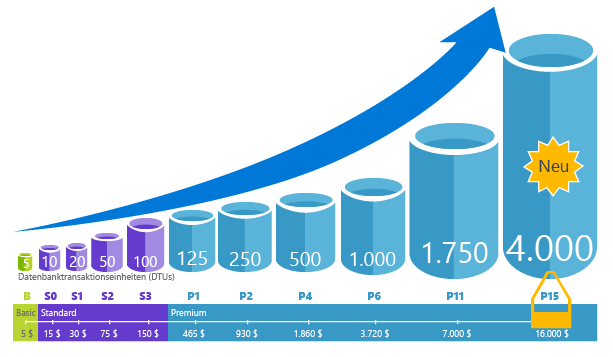
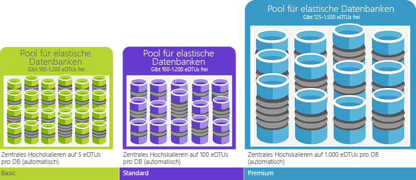

# Kaufmodelle für Azure SQL-Datenbank und Ressourcen 

„Logische Server“ in [Azure SQL-Datenbank](sql-database-technical-overview.md) verfügt über zwei Kaufmodelle für Compute-, Speicher- und E/A-Ressourcen: ein DTU-basiertes Kaufmodell und ein V-Kern-basiertes Kaufmodel. 

> [!NOTE]
> [Verwaltete Instanzen](sql-database-managed-instance.md) in Azure SQL-Datenbank bieten nur das auf virtuellen Kernen basierende Kaufmodell.

In der folgenden Tabelle und im Diagramm werden diese Kaufmodelle verglichen und gegenübergestellt.

> [!IMPORTANT]
> Informationen zum V-Kern-basierten Kaufmodell finden Sie unter [V-Kern-basiertes Kaufmodell](sql-database-service-tiers-vcore.md).

|**Kaufmodell**|**Beschreibung**|**Am besten geeignet für**|
|---|---|---|
|DTU-basiertes Modell|Dieses Modell basiert auf einem Paket mit Compute-, Speicher- und E/A-Ressourcen. Leistungsstufen werden für Einzeldatenbanken als Datenbanktransaktionseinheiten (Database Transaction Units, DTUs) und für Pools für elastische Datenbanken als elastische Datenbanktransaktionseinheiten (elastic Database Transaction Units, eDTUs) bezeichnet. Weitere Informationen zu DTUs und eDTUs finden Sie unter [Was sind DTUs und eDTUs?](sql-database-service-tiers.md#what-are-database-transaction-units-dtus).|Eignet sich am besten für Kunden, die einfache, vorkonfigurierte Ressourcenoptionen benötigen.| 
|V-Kern-basiertes Modell|Mit diesem Modell können Sie Compute- und Speicherressourcen einzeln skalieren. Außerdem können Sie den Azure-Hybridvorteil für SQL Server verwenden, um Kosten zu sparen.|Eignet sich am besten für Kunden, für die Flexibilität, Kontrolle und Transparenz im Vordergrund stehen.|
||||  

## Auf virtuellen Kernen basierendes Erwerbsmodell 

Ein virtueller Kern repräsentiert die logische CPU. Virtuelle Kerne werden für verschiedene Hardwaregenerationen angeboten. Beim V-Kern-basierten Kaufmodell erhalten Sie Flexibilität, Kontrolle und Transparenz in Bezug auf den individuellen Ressourcenverbrauch. Außerdem können Sie die lokalen Workloadanforderungen leicht auf die Cloud übertragen. Mit diesem Modell können Sie Computeressourcen, Arbeitsspeicher und Speicher entsprechend den jeweiligen Workloadanforderungen skalieren. Beim V-Kern-basierten Kaufmodell können Kunden für [Einzeldatenbanken](sql-database-single-database-scale.md) und [Pools für elastische Datenbanken](sql-database-elastic-pool.md) zwischen den Dienstebenen „Universell“ und „Unternehmenskritisch“ wählen. 

Mit dem V-Kern-basierten Kaufmodell können Sie Compute- und Speicherressourcen einzeln skalieren, eine Leistung wie in Ihrer lokalen Umgebung erzielen und den Preis optimieren. Wenn Ihre Datenbank oder der Pool für elastische Datenbanken mehr als 300 DTUs verbraucht, können Sie mit der Umstellung auf V-Kerne unter Umständen Ihre Kosten senken. Sie können für die Umstellung die API Ihrer Wahl oder das Azure-Portal verwenden, ohne dass es zu Ausfallzeit kommt. Die Umstellung ist aber nicht zwingend erforderlich. Wenn das DTU-Kaufmodell Ihre Leistungs- und Geschäftsanforderungen erfüllt, sollten Sie es weiter nutzen. Falls Sie sich für die Umstellung vom DTU-Modell auf das Modell mit virtuellen Kernen entscheiden, sollten Sie zum Auswählen der Leistungsstufe die folgende Faustregel anwenden: Für 100 DTUs im Standard-Tarif ist jeweils mindestens ein virtueller Kern im Tarif „Universell“ erforderlich, und für 125 DTUs im Premium-Tarif ist jeweils mindestens ein virtueller Kern im Tarif „Unternehmenskritisch“ erforderlich.

Beim V-Kern-basierten Kaufmodell zahlen Kunden für Folgendes:
- Compute (Diensttarif + Anzahl von V-Kernen + Hardwaregeneration)*
- Typ und Menge von Daten und Protokollspeicher 
- E/A-Anzahl**
- Sicherungsspeicher (RA-GRS)** 

\* In der ersten öffentlichen Vorschauversion basieren die logischen CPUs der Generation 4 auf Prozessoren vom Typ Intel E5-2673 v3 (Haswell) mit 2,4 GHz.

\*\* Während der Vorschauphase sind Sicherungen und E/A-Vorgänge für einen Zeitraum von sieben Tagen kostenlos.

> [!IMPORTANT]
> Compute, E/A-Vorgänge, Daten und Protokollspeicher werden pro Datenbank oder Pool für elastische Datenbanken berechnet. Sicherungsspeicher wird pro Datenbank berechnet. Ausführlichere Informationen zur verwalteten SQL-Datenbank-Instanz finden Sie unter [Was ist eine verwaltete Instanz (Vorschauversion)?](sql-database-managed-instance.md).
> **Regionale Einschränkungen:** Das V-Kern-basierte Kaufmodell ist in folgenden Regionen noch nicht verfügbar: „Europa, Westen“, „Frankreich, Mitte“, „Vereinigtes Königreich, Süden“, „Vereinigtes Königreich, Westen“ und „Australien, Südosten“.

## DTU-basiertes Kaufmodell

Mit einer Datenbanktransaktionseinheit (Database Transaction Unit, DTU) wird eine Mischung aus den Werten von CPU, Arbeitsspeicher, Lesevorgängen und Schreibvorgängen dargestellt. Das DTU-basierte Kaufmodell verfügt über einen Satz mit vorkonfigurierten Paketen mit Computeressourcen und integriertem Speicher, um die Anwendungsleistung auf verschiedenen Ebenen zu erhöhen. Wenn Kunden die Einfachheit eines vorkonfigurierten Pakets und von festen Monatszahlungen bevorzugen, ist das DTU-basierte Modell unter Umständen besser für ihre Anforderungen geeignet. Beim DTU-basierten Kaufmodell können Kunden zwischen den Diensttarifen **Basic**, **Standard** und **Premium** für [Einzeldatenbanken](sql-database-single-database-scale.md) und [Pools für elastische Datenbanken](sql-database-elastic-pool.md) wählen. 

### Was sind Datenbanktransaktionseinheiten (DTUs)?
Für eine einzelne Azure SQL-Datenbank auf einer bestimmten Leistungsebene innerhalb einer [Dienstebene](sql-database-single-database-scale.md) garantiert Microsoft einen bestimmten Ressourcenumfang für diese Datenbank (unabhängig von jeder anderen Datenbank in der Azure-Cloud), wobei eine vorhersagbare Leistungsebene geboten wird. Der Ressourcenumfang wird als Anzahl von Datenbanktransaktionseinheiten (Database Transaction Units, DTUs) berechnet. Es handelt sich dabei um ein Paket aus Compute-, Speicher- und E/A-Ressourcen. Das Verhältnis zwischen diesen Ressourcen wurde ursprünglich anhand einer [OLTP-Benchmark-Workload](sql-database-benchmark-overview.md) ermittelt, die für realistische OLTP-Workloads typisch ist. Wenn Ihre Workload den Umfang einer dieser Ressourcen überschreitet, wird der Durchsatz gedrosselt, wodurch eine niedrigere Leistung und Timeouts verursacht werden. Die Ressourcen, die von Ihrer Workload verwendet werden, wirken sich nicht auf die Ressourcen aus, die für andere SQL-Datenbanken in der Azure-Cloud verfügbar sind, und die von anderen Workloads verwendeten Ressourcen wirken sich nicht auf die Ressourcen aus, die für Ihre SQL-Datenbank verfügbar sind.

DTUs sind besonders nützlich, um den relativen Umfang von Ressourcen zu verstehen, den es zwischen Azure SQL-Datenbank-Instanzen auf unterschiedlichen Leistungsebenen und Dienstebenen gibt. Beispielsweise entspricht eine Verdoppelung der DTUs durch Erhöhen der Leistungsebene einer Datenbank der Verdoppelung der Ressourcen, die dieser Datenbank zur Verfügung stehen. Beispiel: Eine Premium P11-Datenbank mit 1.750 DTUs bietet eine 350 Mal höhere DTU-Computeleistung als eine Basic-Datenbank mit fünf DTUs.  

Um einen tieferen Einblick in den Ressourcenverbrauch (DTU) Ihrer Workload zu erhalten, verwenden Sie [Query Performance Insight für Azure SQL-Datenbank](sql-database-query-performance.md) für Folgendes:

- Ermitteln der häufigsten Abfragen nach den Werten von CPU-Nutzung/Dauer/Ausführungshäufigkeit, bei denen unter Umständen eine Leistungssteigerung erzielt werden kann. Beispielsweise könnte eine E/A-intensive Abfrage davon profitieren, dass [In-Memory-Optimierungstechniken](sql-database-in-memory.md) verwendet werden, um den verfügbaren Arbeitsspeicher auf einer bestimmte Dienst- und Leistungsebene besser zu nutzen.
- Analysieren der Details einer Abfrage sowie Anzeigen von deren Text und deren Verlauf der Ressourcenverwendung.
- Zugreifen auf Empfehlungen zur Leistungsoptimierung, die Aktionen erläutern, die vom [SQL Database Advisor](sql-database-advisor.md) ausgeführt werden.

Sie können [DTU-Dienstebenen](sql-database-service-tiers-dtu.md) jederzeit ändern und die Ausfallzeiten für Ihre Anwendung dabei gering halten (im Durchschnitt meist unter vier Sekunden). Für viele Unternehmen und Apps genügt es, wenn Datenbanken erstellt werden können und sich die Leistung nach oben oder unten anpassen lässt – insbesondere, wenn die Nutzungsmuster relativ gut vorhersagbar sind. Bei unvorhersagbaren Nutzungsmustern kann es jedoch schwer sein, die Kosten und Ihr Geschäftsmodell zu verwalten. In diesem Szenario verwenden Sie einen Pool für elastische Datenbanken mit einer bestimmten Anzahl von eDTUs, die von mehreren Datenbanken im Pool gemeinsam genutzt werden.

### Was sind elastische Datenbanktransaktionseinheiten (eDTUs)?
Statt einen dedizierten Satz von Ressourcen (DTUs) bereitzustellen, die möglicherweise nicht immer für eine immer verfügbare SQL-Datenbank benötigt werden, können Sie Datenbanken in einem [Pool für elastische Datenbanken](sql-database-elastic-pool.md) auf einem SQL-Datenbankserver platzieren, der für diese Datenbanken einen gemeinsam Pool von Ressourcen freigibt. Die freigegebenen Ressourcen in einem Pool für elastische Datenbanken werden als elastische Datenbanktransaktionseinheiten (elastic Database Transaction Units, eDTUs) gemessen. Pools für elastische Datenbanken stellen eine einfache und kostengünstige Lösung zum Verwalten der Leistungsziele für mehrere Datenbanken mit unterschiedlichsten und unvorhersehbaren Nutzungsmustern dar. Durch einen Pool für elastische Datenbanken wird sichergestellt, dass Ressourcen nicht von einer einzigen Datenbank im Pool genutzt werden können, wobei jeder Datenbank im Pool immer eine Mindestmenge an erforderlichen Ressourcen zur Verfügung steht. 

Ein Pool erhält eine festgelegte Anzahl von eDTUs zu einem festen Preis. Im elastischen Pool können einzelne Datenbanken die automatische Skalierung innerhalb der konfigurierten Grenzen flexibel ausführen. Eine Datenbank mit hoher Auslastung nutzt mehr eDTUs, um die Anforderungen zu erfüllen. Datenbanken mit geringerer Auslastung verwenden weniger eDTUs. Datenbanken ohne Auslastung verwenden keine eDTUs. Durch die Bereitstellung von Ressourcen für den gesamten Pool statt pro Datenbank werden Verwaltungsaufgaben vereinfacht, und Sie verfügen über ein vorhersagbares Budget für den Pool.

Einem vorhandenen Pool können zusätzliche eDTUs hinzugefügt werden, ohne dass es zu Datenbankausfällen und Auswirkungen auf die Datenbanken im Pool kommt. Ebenso können zusätzliche eDTUs, die nicht mehr benötigt werden, zu jedem beliebigen Zeitpunkt aus einem vorhandenen Pool entfernt werden. Sie können Datenbanken zum Pool hinzufügen oder daraus entfernen oder die Anzahl von eDTUs beschränken, die eine Datenbank mit hoher Auslastung verwenden kann, um eDTUs für andere Datenbanken zu reservieren. Wenn eine Datenbank die Ressourcen voraussichtlich nicht hinreichend nutzt, können Sie sie aus dem Pool entfernen und als einzelne Datenbank mit der voraussichtlichen Menge an erforderlichen Ressourcen konfigurieren.

### Wie kann ich die Anzahl von DTUs bestimmen, die für meine Workload erforderlich sind?
Wenn Sie die vorhandene Workload eines lokalen oder virtuellen SQL Server-Computers zu Azure SQL-Datenbank migrieren möchten, können Sie den [DTU Calculator](http://dtucalculator.azurewebsites.net/) (DTU-Rechner) nutzen, um die ungefähre Anzahl von benötigten DTUs zu berechnen. Für eine vorhandene Azure SQL-Datenbank-Workload können Sie [Query Performance Insight für SQL-Datenbank](sql-database-query-performance.md) verwenden, um den Ressourcenverbrauch (DTUs) der Datenbank zu verstehen und einen tieferen Einblick zur Optimierung Ihrer Workload zu gewinnen. Sie können auch die DMV [sys.dm_db_ resource_stats](https://msdn.microsoft.com/library/dn800981.aspx) verwenden, um den Ressourcenverbrauch der letzten Stunde anzuzeigen. Alternativ dazu wird in der Katalogansicht [sys.resource_stats](http://msdn.microsoft.com/library/dn269979.aspx) der Ressourcenverbrauch der letzten 14 Tage angezeigt. Da hierfür Durchschnittswerte für jeweils fünf Minuten genutzt werden, ist jedoch die Genauigkeit geringer.

### Wie kann ermittelt werden, ob sich durch einen elastischen Ressourcenpool Vorteile für mich ergeben?
Pools eignen sich gut für eine große Anzahl von Datenbanken mit spezifischen Nutzungsmustern. Im Hinblick auf eine bestimmte Datenbank ist dieses Muster durch eine geringe durchschnittliche Auslastung mit relativ wenigen Nutzungslastspitzen gekennzeichnet. SQL-Datenbank ermittelt automatisch den Verlauf der Ressourcennutzung von Datenbanken auf einem vorhandenen SQL-Datenbank-Server und empfiehlt eine geeignete Poolkonfiguration im Azure-Portal. Weitere Informationen finden Sie unter [Wo sollte ein Pool für elastische Datenbanken verwendet werden?](sql-database-elastic-pool.md).

### Was passiert, wenn die Obergrenze der DTUs erreicht ist?
Leistungsebenen werden kalibriert und gesteuert, um die erforderlichen Ressourcen zum Ausführen der Workload Ihrer Datenbank bis zu den maximalen Grenzwerten bereitzustellen, die für die ausgewählte Dienstebene/Leistungsebene zulässig sind. Wenn Ihre Workload einen der CPU-/Daten-E/A/Protokoll-E/A-Grenzwerte erreicht, erhalten Sie weiterhin die maximal zulässigen Ressourcen, aber es kommt wahrscheinlich auch zu höheren Abfragelatenzen. Diese Höchstgrenzen führen nicht zu Fehlern, sondern nur zu einer Verlangsamung Ihrer Workload. Wenn die Verlangsamung aber zu schwerwiegend ist, tritt ein Timeout für die Abfragen auf. Wenn Sie die maximal zulässigen gleichzeitigen Benutzersitzungen/-anforderungen (Arbeitsthreads) erreichen, erhalten Sie explizite Fehler. Informationen zu Ressourcengrenzwerten, die sich nicht auf CPU, Arbeitsspeicher, Daten-E/A oder Transaktionsprotokoll-E/A beziehen, finden Sie unter [Ressourceneinschränkungen für Azure SQL-Datenbank]( sql-database-resource-limits.md#what-happens-when-database-resource-limits-are-reached).

### Korrelieren von Vergleichstestergebnissen mit realer Datenbankleistung
Wichtig ist der Hinweis, dass alle Vergleichstests nur repräsentativen und informativen Charakter haben. Die mit der Vergleichstestanwendung erzielten Transaktionsraten entsprechen nicht denjenigen, die mit anderen Anwendungen erzielt werden. Der Vergleichstest umfasst eine Zusammenstellung verschiedener Typen von Transaktionen, die auf ein Schema angewendet werden, das einen Bereich von Tabellen und Datentypen enthält. Während für den Vergleichstest dieselben grundlegenden Vorgänge ausgeführt werden, die für alle OLTP-Workloads üblich sind, wird keine spezifische Klasse von Datenbank oder Anwendung abgebildet. Ziel des Vergleichstests ist das Bereitstellen eines vernünftigen Richtwerts für die relative Leistung einer Datenbank, der bei einer Skalierung nach oben und unten zwischen Leistungsstufen erwartet werden kann. In der Praxis haben Datenbanken eine unterschiedliche Größe und Komplexität, müssen verschiedene Kombinationen von Workloads bewältigen und reagieren auf unterschiedliche Weise. Beispielsweise kann eine E/A-intensive Anwendung E/A-Schwellenwerte früher erreichen, oder eine CPU-intensive Anwendung kann CPU-Grenzwerte früher erreichen. Es gibt keine Garantie, dass eine bestimmte Datenbank bei steigender Last auf die gleiche Weise wie im Vergleichstest skaliert wird.

Der Vergleichstest und seine Methoden werden nachstehend ausführlich beschrieben.

### Übersicht über den Vergleichstest
ASDB misst die Leistung einer Kombination grundlegender Datenbankvorgänge, die bei OLTP-Workloads (Online Transaction Processing, Onlinetransaktionsverarbeitung) am häufigsten vorkommen. Obwohl der Vergleichstest speziell für das Cloud Computing konzipiert ist, wurden das Datenbankschema, der Datenbestand und Transaktionen so gestaltet, dass sie für die grundlegenden Elemente der am häufigsten vorkommenden OLTP-Workloads repräsentativ sind.

### Schema
Das Schema zeichnet sich durch ausreichende Vielfalt und Komplexität aus, um eine Vielzahl von Vorgängen zu unterstützen. Der Vergleichstest wird auf eine Datenbank angewendet, die aus sechs Tabellen besteht. Die Tabellen gehören zu drei Kategorien: feste Größe, Skalierung und anwachsend. Es gibt zwei Tabellen mit fester Größe, drei Skalierungstabellen und eine anwachsende Tabelle. Die Tabellen mit fester Größe haben eine konstante Anzahl von Zeilen. Die Skalierungstabellen haben eine Kardinalität, die proportional zur Datenbankleistung ist, sich jedoch während des Vergleichstests nicht ändert. Die anwachsende Tabelle hat anfänglich dieselbe Größe wie eine Skalierungstabelle, doch ihre Kardinalität ändert sich im Verlauf des Vergleichstests, da Zeilen eingefügt und gelöscht werden.

Das Schema enthält eine Kombination von Datentypen, wie z. B. ganze Zahl, numerisch, Zeichen und Datum/Uhrzeit. Das Schema enthält primäre und sekundäre Schlüssel, aber keine Fremdschlüssel, was bedeutet, dass es keine Einschränkungen der referentiellen Integrität zwischen Tabellen gibt.

Ein Datengenerierungsprogramm erzeugt die Daten für die ursprüngliche Datenbank. Ganzzahl- und numerische Daten werden anhand verschiedener Strategien generiert. Mitunter werden Werte zufällig über einen Bereich verteilt. In anderen Fällen wird eine Gruppe von Werten nach dem Zufallsprinzip permutiert, um sicherzustellen, dass eine bestimmte Verteilung beibehalten wird. Textfelder werden anhand einer gewichteten Liste von Wörtern generiert, um realistisch wirkende Daten zu erstellen.

Die Datenbankgröße basiert auf einem "Skalierungsfaktor". Der Skalierungsfaktor (abgekürzt SF) bestimmt die Kardinalität der Skalierungs- und anwachsenden Tabellen. Wie im folgenden Abschnitt "Benutzer und Geschwindigkeit" beschrieben, werden die Datenbankgröße, Anzahl der Benutzer und maximale Leistung allesamt proportional zueinander skaliert.

### Transaktionen
Die Workload besteht aus neun Transaktionstypen, wie in der folgenden Tabelle dargestellt. Jede Transaktion ist darauf ausgelegt, eine bestimmte Gruppe von Systemmerkmalen in der Datenbank-Engine und in der Systemhardware in starker Abgrenzung zu den anderen Transaktionen hervorzuheben. Dieser Ansatz erleichtert das Bewerten der Auswirkung verschiedener Komponenten auf die Gesamtleistung. Beispielsweise erzeugt die Transaktion "Leseintensiv" eine hohe Anzahl von Lesevorgängen auf dem Datenträger.

| Transaktionstyp | BESCHREIBUNG |
| --- | --- |
| Nicht leseintensiv |SELECT, speicherintern, schreibgeschützt |
| Mittel leseintensiv |SELECT, zumeist speicherintern, schreibgeschützt |
| Leseintensiv |SELECT, zumeist nicht speicherintern, schreibgeschützt |
| Nicht aktualisierungsintensiv |UPDATE; speicherintern, lesen/schreiben |
| Aktualisierungsintensiv |UPDATE, zumeist nicht speicherintern, lesen/schreiben |
| Nicht einfügungsintensiv |INSERT, speicherintern; lesen/schreiben |
| Einfügungsintensiv |INSERT, zumeist nicht speicherintern, lesen/schreiben |
| Löschen |DELETE, Kombination aus speicherintern und nicht speicherintern, lesen/schreiben |
| CPU-intensiv |SELECT, speicherintern, relativ hohe CPU-Last, schreibgeschützt |

### Kombination von Workloads
Transaktionen werden zufällig aus einer gewichteten Verteilung in der folgenden Kombination ausgewählt. Die Kombination weist ein Verhältnis von Lese- zu Schreibvorgängen von ca. 2:1 auf.

| Transaktionstyp | % der Kombination |
| --- | --- |
| Nicht leseintensiv |35 |
| Mittel leseintensiv |20 |
| Leseintensiv |5 |
| Nicht aktualisierungsintensiv |20 |
| Aktualisierungsintensiv |3 |
| Nicht einfügungsintensiv |3 |
| Einfügungsintensiv |2 |
| Löschen |2 |
| CPU-intensiv |10 |

### Benutzer und Geschwindigkeit
Die Workload des Vergleichstests stammt von einem Tool, das Transaktionen über verschiedene Verbindungen übermittelt, um das Verhalten vieler gleichzeitiger Benutzer zu simulieren. Obwohl alle Verbindungen und Transaktionen computergeneriert sind, bezeichnen wir diese Verbindungen der Einfachheit halber als "Benutzer". Obwohl jeder Benutzer unabhängig von allen anderen Benutzern operiert, führen alle Benutzer denselben Zyklus der unten aufgeführten Schritte aus:

1. Herstellen einer Datenbankverbindung.
2. Wiederholen bis zur Aufforderung zum Beenden:
   * Auswählen einer Transaktion nach dem Zufallsprinzip (aus gewichteter Verteilung)
   * Ausführen der ausgewählten Transaktion und Messen der Antwortzeit
   * Warten auf eine Geschwindigkeitsverzögerung
3. Schließen der Datenbankverbindung
4. Beenden

Die Geschwindigkeitsverzögerung (in Schritt 2c) wird nach dem Zufallsprinzip ausgewählt, hat aber eine Verteilung mit durchschnittlich 1,0 Sekunden. Daher kann jeder Benutzer durchschnittlich höchstens eine Transaktion pro Sekunde generieren.

### Skalierungsregeln
Die Anzahl der Benutzer wird von der Größe der Datenbank (in Skalierungsfaktoreinheiten) bestimmt. Für alle fünf Skalierungsfaktoreinheiten gibt es einen Benutzer. Aufgrund der Geschwindigkeitsverzögerung kann ein Benutzer durchschnittlich höchstens eine Transaktion pro Sekunde generieren.

Beim Skalierungsfaktor 500 (SF=500) hat die Datenbank 100 Benutzer und kann eine maximale Rate von 100 Transaktionen pro Sekunde (TPS) erreichen. Zum Erreichen einer höheren TPS-Rate sind mehr Benutzer und eine größere Datenbank erforderlich.

Die folgenden Tabelle enthält die tatsächliche Anzahl von Benutzern für alle Tarife und Leistungsstufen.

| Tarif (Leistungsstufe) | Benutzer | Datenbankgröße |
| --- | --- | --- |
| Basic |5 |720 MB |
| Standard (S0) |10 |1 GB |
| Standard (S1) |20 |2,1 GB |
| Standard (S2) |50 |7,1 GB |
| Premium (P1) |100 |14 GB |
| Premium (P2) |200 |28 GB |
| Premium (P6) |800 |114 GB |

### Messdauer
Ein gültiger Vergleichstestlauf erfordert eine stabile Messdauer von mindestens einer Stunde.

### Metriken
Die Hauptmetriken im Vergleichstest sind Durchsatz und Antwortzeit.

* Der Durchsatz ist die wesentliche Messgröße im Vergleichstest. Der Durchsatz wird als Transaktionen pro Zeiteinheit gemeldet, wobei alle Transaktionstypen gezählt werden.
* Die Antwortzeit ist ein Maß für die Vorhersagbarkeit von Leistung. Die Einschränkung der Antwortzeit variiert je nach Dienstklasse, wobei höhere Dienstklassen strengere Anforderungen an die Antwortzeit haben (siehe unten).

| Dienstklasse | Durchsatzmaß | Anforderung an die Antwortzeit |
| --- | --- | --- |
| Premium |Transaktionen pro Sekunde |95. Perzentil bei 0,5 Sekunden |
| Standard |Transaktionen pro Minute |90. Perzentil bei 1,0 Sekunden |
| Basic |Transaktionen pro Stunde |80. Perzentil bei 2,0 Sekunden |

## Nächste Schritte

- Informationen zum V-Kern-basierten Kaufmodell finden Sie unter [V-Kern-basiertes Kaufmodell](sql-database-service-tiers-vcore.md).
- Das auf DTUs basierende Kaufmodell finden Sie unter [Auf DTUs basiertes Kaufmodell](sql-database-service-tiers-dtu.md).
