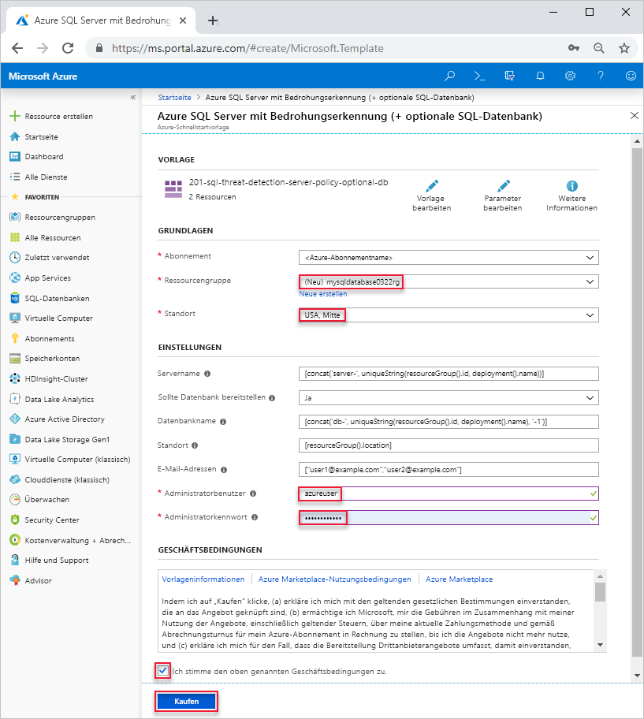

# <a name="quickstart-create-a-single-database-in-azure-sql-database-using-the-azure-resource-manager-template"></a>Schnellstart: Erstellen einer Einzeldatenbank in Azure SQL-Datenbank mithilfe der Azure Resource Manager-Vorlage

Die Erstellung einer [Einzeldatenbank](sql-database-single-database.md) ist die schnellste und einfachste Bereitstellungsoption zum Erstellen einer Datenbank in Azure SQL-Datenbank. In dieser Schnellstartanleitung wird gezeigt, wie Sie mit der Azure Resource Manager-Vorlage eine Einzeldatenbank erstellen. Weitere Informationen finden Sie in der [Dokumentation zu Azure Resource Manager](/azure/azure-resource-manager/).

Wenn Sie kein Azure-Abonnement besitzen, können Sie ein [kostenloses Konto erstellen](https://azure.microsoft.com/free/).

## <a name="create-a-single-database"></a>Erstellen einer Einzeldatenbank

Eine Einzeldatenbank enthält einen definierten Satz von Compute-, Arbeitsspeicher-, EA- und Speicherressourcen und verwendet eins von zwei möglichen [Kaufmodellen](sql-database-purchase-models.md). Wenn Sie eine Einzeldatenbank erstellen, legen Sie auch einen [SQL-Datenbank-Server](sql-database-servers.md) für ihre Verwaltung fest und platzieren ihn in einer [Azure-Ressourcengruppe](../azure-resource-manager/resource-group-overview.md) in einer bestimmten Region.

Die folgende JSON-Datei ist die Vorlage, die in diesem Artikel verwendet wird. Die Vorlage wird in einem Azure Storage-Konto gespeichert. Weitere Vorlagenbeispiele für Azure SQL-Datenbank finden Sie [hier](https://azure.microsoft.com/resources/templates/?resourceType=Microsoft.Sql&pageNumber=1&sort=Popular).

```json
{
  "$schema": "https://schema.management.azure.com/schemas/2015-01-01/deploymentTemplate.json#",
  "contentVersion": "1.0.0.0",
  "parameters": {
    "serverName": {
      "type": "string",
      "defaultValue": "[concat('server-', uniqueString(resourceGroup().id, deployment().name))]",
      "metadata": {
        "description": "Name for the SQL server"
      }
    },
    "shouldDeployDb": {
      "type": "string",
      "allowedValues": [
        "Yes",
        "No"
      ],
      "defaultValue": "Yes",
      "metadata": {
        "description": "Whether an Azure SQL Database should be deployed under the server"
      }
    },
    "databaseName": {
      "type": "string",
      "defaultValue": "[concat('db-', uniqueString(resourceGroup().id, deployment().name), '-1')]",
      "metadata": {
        "description": "Name for the SQL database under the SQL server"
      }
    },
    "location": {
      "type": "string",
      "defaultValue": "[resourceGroup().location]",
      "metadata": {
        "description": "Location for server and optional DB"
      }
    },
    "emailAddresses": {
      "type": "array",
      "defaultValue": [
        "user1@example.com",
        "user2@example.com"
      ],
      "metadata": {
        "description": "Email addresses for receiving alerts"
      }
    },
    "adminUser": {
      "type": "string",
      "metadata": {
        "description": "Username for admin"
      }
    },
    "adminPassword": {
      "type": "securestring",
      "metadata": {
        "description": "Password for admin"
      }
    }
  },
  "variables": {
    "databaseServerName": "[toLower(parameters('serverName'))]",
    "databaseName": "[parameters('databaseName')]",
    "shouldDeployDb": "[parameters('shouldDeployDb')]",
    "databaseServerLocation": "[parameters('location')]",
    "databaseServerAdminLogin": "[parameters('adminUser')]",
    "databaseServerAdminLoginPassword": "[parameters('adminPassword')]",
    "emailAddresses": "[parameters('emailAddresses')]"
  },
  "resources": [
    {
      "type": "Microsoft.Sql/servers",
      "name": "[variables('databaseServerName')]",
      "location": "[variables('databaseServerLocation')]",
      "apiVersion": "2015-05-01-preview",
      "properties": {
        "administratorLogin": "[variables('databaseServerAdminLogin')]",
        "administratorLoginPassword": "[variables('databaseServerAdminLoginPassword')]",
        "version": "12.0"
      },
      "tags": {
        "DisplayName": "[variables('databaseServerName')]"
      },
      "resources": [
        {
          "type": "securityAlertPolicies",
          "name": "DefaultSecurityAlert",
          "apiVersion": "2017-03-01-preview",
          "dependsOn": [
            "[variables('databaseServerName')]"
          ],
          "properties": {
            "state": "Enabled",
            "emailAddresses": "[variables('emailAddresses')]",
            "emailAccountAdmins": true
          }
        }
      ]
    },
    {
      "condition": "[equals(variables('shouldDeployDb'), 'Yes')]",
      "type": "Microsoft.Sql/servers/databases",
      "name": "[concat(string(variables('databaseServerName')), '/', string(variables('databaseName')))]",
      "location": "[variables('databaseServerLocation')]",
      "apiVersion": "2017-10-01-preview",
      "dependsOn": [
        "[concat('Microsoft.Sql/servers/', variables('databaseServerName'))]"
      ],
      "properties": {},
      "tags": {
        "DisplayName": "[variables('databaseServerName')]"
      }
    }
  ]
}
```

1. Klicken Sie auf das folgende Bild, um sich bei Azure anzumelden und eine Vorlage zu öffnen.

    <a href="https://portal.azure.com/#create/Microsoft.Template/uri/https%3A%2F%2Farmtutorials.blob.core.windows.net%2Fcreatesql%2Fazuredeploy.json"></a>

2. Wählen Sie die folgenden Werte aus, bzw. geben Sie sie ein.  

    

    Verwenden Sie die Standardwerte, sofern nichts anderes angegeben ist.

    * **Abonnement**: Wählen Sie ein Azure-Abonnement aus.
    * **Ressourcengruppe**: Wählen Sie die Option **Neu erstellen** aus, geben Sie einen eindeutigen Namen für die Ressourcengruppe ein, und klicken Sie dann auf **OK**. 
    * **Standort**: Wählen Sie einen Standort aus.  Beispiel: **USA, Mitte**.
    * **Administratorbenutzer**: Geben Sie den Benutzernamen des Serveradministrators für SQL-Datenbank an.
    * **Administratorkennwort**: Geben Sie ein Administratorkennwort ein. 
    * **Ich stimme den oben genannten Geschäftsbedingungen zu**: Aktivieren Sie dieses Kontrollkästchen.
3. Wählen Sie die Option **Kaufen**.

## <a name="query-the-database"></a>Abfragen der Datenbank

Informationen zum Abfragen der Datenbank finden Sie unter [Abfragen der Datenbank](./sql-database-single-database-get-started.md#query-the-database).

## <a name="clean-up-resources"></a>Bereinigen von Ressourcen

Behalten Sie die Ressourcengruppe, den Datenbankserver und die Einzeldatenbank, wenn Sie mit [Nächste Schritte](#next-steps) fortfahren möchten. Die nächsten Schritte zeigen, wie Sie mithilfe verschiedener Methoden eine Verbindung mit Ihrer Datenbank herstellen und die Datenbank abfragen.

Löschen Sie die Ressourcengruppe wie folgt mit der Azure CLI oder mit Azure Powershell:

```azurecli-interactive
echo "Enter the Resource Group name:" &&
read resourceGroupName &&
az group delete --name $resourceGroupName 
```

```azurepowershell-interactive
$resourceGroupName = Read-Host -Prompt "Enter the Resource Group name"
Remove-AzResourceGroup -Name $resourceGroupName 
```

## <a name="next-steps"></a>Nächste Schritte

- Erstellen Sie eine Firewallregel auf Serverebene, um über lokale Tools oder Remotetools eine Verbindung mit der Einzeldatenbank herstellen zu können. Weitere Informationen finden Sie unter [Erstellen einer Firewallregel auf Serverebene](sql-database-server-level-firewall-rule.md).
- Nachdem Sie eine Firewallregel auf Serverebene erstellt haben, können Sie mit verschiedenen Tools und Programmiersprachen eine [Verbindung mit Ihrer Datenbank herstellen und Abfragen ausführen](sql-database-connect-query.md).
  - [Verbinden und Abfragen mit SQL Server Management Studio (SSMS)](sql-database-connect-query-ssms.md)
  - [Verbinden und Abfragen mit Azure Data Studio](https://docs.microsoft.com/sql/azure-data-studio/quickstart-sql-database?toc=/azure/sql-database/toc.json)
- Informationen zum Erstellen von Einzeldatenbanken mit der Azure-Befehlszeilenschnittstelle finden Sie unter [Azure CLI-Beispiele für Azure SQL-Datenbank](sql-database-cli-samples.md).
- Informationen zum Erstellen von Einzeldatenbanken mit Azure PowerShell finden Sie unter [Azure PowerShell-Beispiele für Azure SQL-Datenbank](sql-database-powershell-samples.md).
