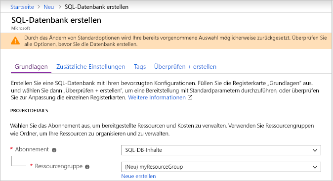
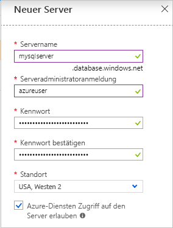
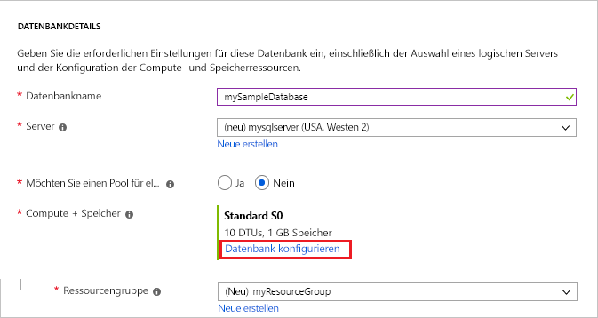
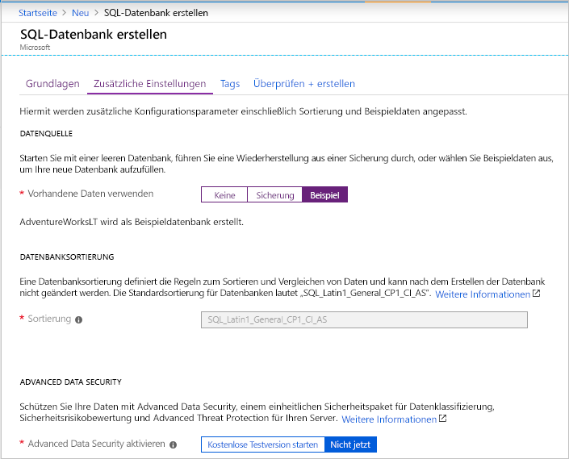

# <a name="quickstart-create-a-single-database-in-azure-sql-database-using-the-azure-portal"></a>Schnellstart: Erstellen einer Einzeldatenbank in Azure SQL-Datenbank über das Azure-Portal

Die Erstellung einer [Einzeldatenbank](sql-database-single-database.md) ist die schnellste und einfachste Bereitstellungsoption zum Erstellen einer Datenbank in Azure SQL-Datenbank. In dieser Schnellstartanleitung wird gezeigt, wie Sie im Azure-Portal eine Einzeldatenbank erstellen und anschließend abfragen.

Wenn Sie kein Azure-Abonnement besitzen, können Sie ein [kostenloses Konto erstellen](https://azure.microsoft.com/free/).

Melden Sie sich zum Durchführen aller Schritte in diesem Schnellstart beim [Azure-Portal](https://portal.azure.com/) an.

## <a name="create-a-single-database"></a>Erstellen einer Einzeldatenbank

Eine Einzeldatenbank kann entweder auf der bereitgestellten Computeebene oder der serverlosen Computeebene (Vorschauversion) erstellt werden.

- Eine Einzeldatenbank auf der bereitgestellten Computeebene verfügt über eine festgelegte Menge an vorab zugeordneten Computeressourcen sowie eine Reihe von Arbeitsspeicher- und Speicherressourcen unter Verwendung eines von zwei [Kaufmodellen](sql-database-purchase-models.md).
- Eine Einzeldatenbank auf der serverlosen Computeebene verfügt über einen Bereich von Computeressourcen, die automatisch skaliert werden, sowie eine angegebene Menge an Arbeitsspeicher pro Kern und eine angegebenen Menge an Speicherressourcen und ist nur in [vCore-basierten Kaufmodellen](sql-database-service-tiers-vcore.md) verfügbar.

Wenn Sie eine Einzeldatenbank erstellen, legen Sie auch einen [SQL-Datenbank-Server](sql-database-servers.md) für ihre Verwaltung fest und platzieren ihn in einer [Azure-Ressourcengruppe](../azure-resource-manager/resource-group-overview.md) in einer bestimmten Region.

> [!NOTE]
> In diesem Schnellstart wird das [vCore-basierte Kaufmodell](sql-database-service-tiers-vcore.md) und die [serverlose](sql-database-serverless.md) Computeebene verwendet, das [DTU-basierte Kaufmodell](sql-database-service-tiers-DTU.md) ist jedoch ebenfalls verfügbar.

So erstellen Sie eine Einzeldatenbank mit den AdventureWorksLT-Beispieldaten:

1. Klicken Sie im Azure-Portal links oben auf **Ressource erstellen**.
2. Wählen Sie die Option **Datenbanken** und dann **SQL-Datenbank**, um die Seite **SQL-Datenbank erstellen** zu öffnen.

   

3. Geben Sie auf der Registerkarte **Grundlagen** im Abschnitt **Projektdetails** die folgenden Werte ein, bzw. wählen Sie sie aus:

   - **Abonnement**: Wählen Sie in der Dropdownliste das richtige Abonnement aus, falls es nicht angezeigt wird.
   - **Ressourcengruppe**: Wählen Sie **Neu erstellen**, geben Sie `myResourceGroup` ein, und wählen Sie **OK**.

     

4. Geben Sie im Abschnitt **Datenbankdetails** die folgenden Werte ein, bzw. wählen Sie sie aus:

   - **Datenbankname**: Geben Sie `mySampleDatabase` ein.
   - **Server**: Wählen Sie **Neu erstellen**, und geben Sie die folgenden Werte ein. Wählen Sie anschließend die Option **Auswählen**.
       - **Servername**: Geben Sie `mysqlserver` mit einigen Zahlen ein, um die Eindeutigkeit sicherzustellen.
       - **Serveradministratoranmeldung**: Geben Sie `azureuser`ein.
       - **Kennwort**: Geben Sie ein komplexes Kennwort ein, das die Anforderungen für Kennwörter erfüllt.
       - **Standort**: Wählen Sie in der Dropdownliste einen Standort aus, z. B. `West US 2`.

         

      > [!IMPORTANT]
      > Notieren Sie sich die Serveradministratoranmeldung (Anmelde-ID) und das Kennwort, damit Sie sich für diesen und andere Schnellstarts beim Server und bei den Datenbanken anmelden können. Falls Sie die Anmeldeinformationen vergessen, können Sie auf der Seite **SQL Server** die Anmelde-ID abrufen oder das Kennwort zurücksetzen. Um die Seite **SQL Server** zu öffnen, wählen Sie nach dem Erstellen der Datenbank auf der Seite **Übersicht** für die Datenbank den Servernamen aus.

        

   - **Möchten Sie einen Pool für elastische SQL-Datenbanken verwenden?** Wählen Sie die Option **Nein**.
   - **Compute und Speicher**: Wählen Sie **Datenbank konfigurieren** und dann für diesen Schnellstart **Kaufoptionen basierend auf virtuellen Kernen**.

     

   - Wählen Sie **Serverlos**.

     

   - Überprüfen Sie die Einstellungen für **Max. virtuelle Kerne**, **Min. virtuelle Kerne**, **Verzögerung für automatisches Anhalten** und **Maximale Datengröße**. Ändern Sie diese wie gewünscht.
   - Akzeptieren Sie die Nutzungsbedingungen für die Vorschau, und klicken Sie auf **OK**.
   - Wählen Sie **Übernehmen**.

5. Wählen Sie die Registerkarte **Zusätzliche Einstellungen**. 
6. Wählen Sie im Abschnitt **Datenquelle** unter **Vorhandene Daten verwenden** die Option `Sample`. 

   

   > [!IMPORTANT]
   > Sie müssen die Daten **Sample (AdventureWorksLT)** auswählen, um diesen Schnellstart und andere Schnellstarts für Azure SQL-Datenbank, in denen diese Daten verwendet werden, einfach ausführen zu können.

7. Behalten Sie die restlichen Standardwerte bei, und wählen Sie unten im Formular die Option **Bewerten + erstellen**.
8. Überprüfen Sie die endgültigen Einstellungen, und wählen Sie **Erstellen**.

9. Klicken Sie im Formular **SQL-Datenbank** auf **Erstellen**, um die Ressourcengruppe, den Server und die Datenbank bereitzustellen.

## <a name="query-the-database"></a>Abfragen der Datenbank

Nachdem Sie die Datenbank erstellt haben, verwenden Sie das integrierte Abfragetool im Azure-Portal, um eine Verbindung mit der Datenbank herzustellen und die Daten abzufragen.

1. Wählen Sie auf der Seite **SQL-Datenbank** für Ihre Datenbank im Menü auf der linken Seite die Option **Abfrage-Editor (Vorschau)** aus.

   

2. Geben Sie Ihre Anmeldeinformationen ein, und wählen Sie **OK**.
3. Geben Sie die folgende Abfrage im Bereich **Abfrage-Editor** ein.

   ```sql
   SELECT TOP 20 pc.Name as CategoryName, p.name as ProductName
   FROM SalesLT.ProductCategory pc
   JOIN SalesLT.Product p
   ON pc.productcategoryid = p.productcategoryid;
   ```

4. Klicken Sie auf **Ausführen**, und sehen Sie sich dann die Abfrageergebnisse im Bereich **Ergebnisse** an.

   

5. Schließen Sie die Seite **Abfrage-Editor**, und klicken Sie auf **OK**, um Ihre nicht gespeicherten Änderungen zu verwerfen, wenn Sie dazu aufgefordert werden.

## <a name="clean-up-resources"></a>Bereinigen von Ressourcen

Behalten Sie die Ressourcengruppe, den Datenbankserver und die Einzeldatenbank, wenn Sie mit [Nächste Schritte](#next-steps) fortfahren möchten. Die nächsten Schritte zeigen, wie Sie mithilfe verschiedener Methoden eine Verbindung mit Ihrer Datenbank herstellen und die Datenbank abfragen.

Wenn Sie diese Ressourcen nicht mehr benötigen, können Sie sie wie folgt löschen:

1. Wählen Sie im Azure-Portal im Menü auf der linken Seite die Option **Ressourcengruppen** und dann **myResourceGroup** aus.
2. Wählen Sie auf der Seite für die Ressourcengruppe die Option **Ressourcengruppe löschen** aus.
3. Geben Sie *myResourceGroup* in das Feld ein, und wählen Sie dann **Löschen** aus.

## <a name="next-steps"></a>Nächste Schritte

- Erstellen Sie eine Firewallregel auf Serverebene, um über lokale Tools oder Remotetools eine Verbindung mit der Einzeldatenbank herstellen zu können. Weitere Informationen finden Sie unter [Erstellen einer Firewallregel auf Serverebene](sql-database-server-level-firewall-rule.md).
- Nachdem Sie eine Firewallregel auf Serverebene erstellt haben, können Sie mit verschiedenen Tools und Programmiersprachen eine [Verbindung mit Ihrer Datenbank herstellen und Abfragen ausführen](sql-database-connect-query.md).
  - [Verbinden und Abfragen mit SQL Server Management Studio (SSMS)](sql-database-connect-query-ssms.md)
  - [Verbinden und Abfragen mit Azure Data Studio](https://docs.microsoft.com/sql/azure-data-studio/quickstart-sql-database?toc=/azure/sql-database/toc.json)
- Informationen zum Erstellen einer Einzeldatenbank auf der bereitgestellten Computeebene mit der Azure CLI finden Sie unter [Azure CLI-Beispiele für Azure SQL-Datenbank](sql-database-cli-samples.md).
- Informationen zum Erstellen einer Einzeldatenbank auf der bereitgestellten Computeebene mit Azure PowerShell finden Sie unter [Azure PowerShell-Beispiele für Azure SQL-Datenbank](sql-database-powershell-samples.md).
- Informationen zum Erstellen einer Einzeldatenbank auf der serverlosen Computeebene mit Azure PowerShell finden Sie unter [Erstellen einer serverlosen Datenbank mit PowerShell](sql-database-serverless.md#create-new-database-using-powershell).
