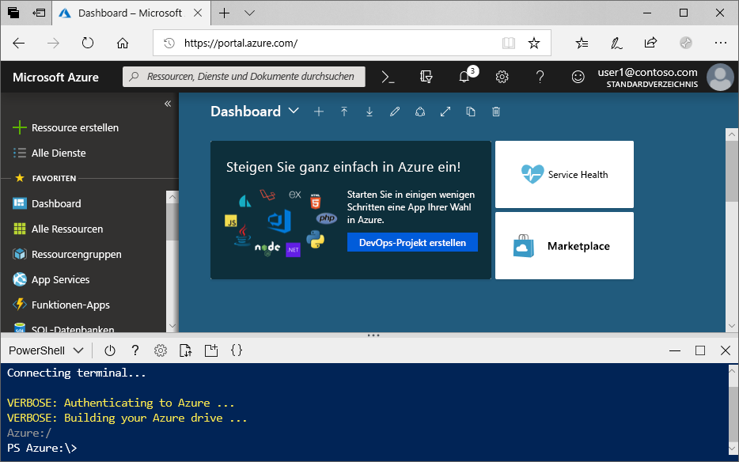
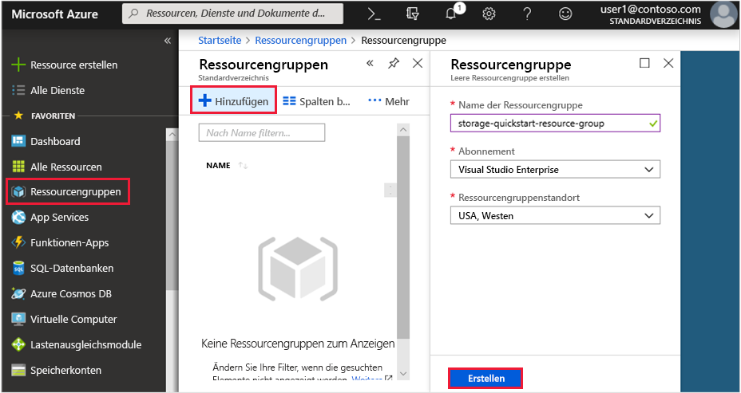
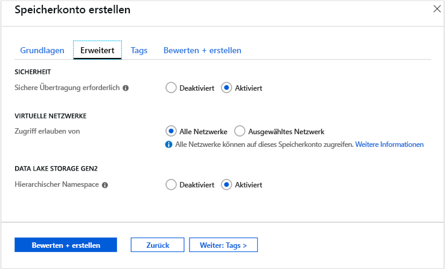

# <a name="quickstart-create-an-azure-data-lake-storage-gen2-storage-account"></a>Schnellstart: Erstellen eines Azure Data Lake Storage Gen2-Speicherkontos

Azure Data Lake Storage Gen2 [unterstützt einen hierarchischen Namespace](data-lake-storage-introduction.md), der ein natives verzeichnisbasiertes Dateisystem für die Verwendung mit dem Hadoop Distributed File System (HDFS) bereitstellt. Wenn Sie über Hadoop Distributed File System auf Data Lake Storage Gen2-Daten zugreifen möchten, ist dies über den [ABFS-Treiber](data-lake-storage-abfs-driver.md) möglich.

In dieser Schnellstartanleitung wird gezeigt, wie Sie ein Konto mit dem [Azure-Portal](https://portal.azure.com/), mit [Azure PowerShell](https://docs.microsoft.com/powershell/azure/overview) oder mit der [Azure CLI](https://docs.microsoft.com/cli/azure?view=azure-cli-latest) erstellen.

## <a name="prerequisites"></a>Voraussetzungen

Wenn Sie kein Azure-Abonnement besitzen, können Sie ein [kostenloses Konto](https://azure.microsoft.com/free/) erstellen, bevor Sie beginnen. 

|           | Voraussetzung |
|-----------|--------------|
|Portal     | Keine         |
|PowerShell | Für diesen Schnellstart ist Version **0.7** oder höher des PowerShell-Moduls „Az.Storage“ erforderlich. Führen Sie den Befehl `Get-Module -ListAvailable Az.Storage` aus, um Ihre aktuelle Version zu ermitteln. Wenn nach dem Ausführen dieses Befehls keine Ergebnisse angezeigt werden oder eine andere Version als **0.7** angezeigt wird, müssen Sie Ihr PowerShell-Modul aktualisieren. Informationen dazu finden Sie im Abschnitt [Aktualisieren Ihres PowerShell-Moduls](#upgrade-your-powershell-module) dieser Anleitung.
|Befehlszeilenschnittstelle (CLI)        | Sie können sich bei Azure anmelden und Azure-CLI-Befehle ausführen. Dazu haben Sie zwei Möglichkeiten: <ul><li>Sie können CLI-Befehle innerhalb des Azure-Portals in Azure Cloud Shell ausführen. </li><li>Sie können die Befehlszeilenschnittstelle installieren und CLI-Befehle lokal ausführen.</li></ul>|

Bei Verwendung der Befehlszeile können Sie Azure Cloud Shell ausführen oder die Befehlszeilenschnittstelle lokal installieren.

### <a name="use-azure-cloud-shell"></a>Verwenden von Azure Cloud Shell

Azure Cloud Shell ist eine kostenlose Bash-Shell, die Sie direkt im Azure-Portal ausführen können. Die Azure CLI ist vorinstalliert und für die Verwendung mit Ihrem Konto konfiguriert. Klicken Sie im Azure-Portal rechts oben im Menü auf die Schaltfläche **Cloud Shell**:

[](https://portal.azure.com)

Die Schaltfläche öffnet eine interaktive Shell, mit der Sie die Schritte in dieser Schnellstartanleitung ausführen können:

[](https://portal.azure.com)

### <a name="install-the-cli-locally"></a>Lokales Installieren der Befehlszeilenschnittstelle

Sie können die Azure-Befehlszeilenschnittstelle auch lokal installieren und verwenden. Für diese Schnellstartanleitung müssen Sie mindestens Version 2.0.38 der Azure-Befehlszeilenschnittstelle (Azure CLI) ausführen. Führen Sie `az --version` aus, um die Version zu finden. Installations- und Upgradeinformationen finden Sie bei Bedarf unter [Installieren von Azure CLI](/cli/azure/install-azure-cli).

## <a name="create-a-storage-account-with-azure-data-lake-storage-gen2-enabled"></a>Erstellen eines Speicherkontos mit aktivierter Azure Data Lake Storage Gen2-SKU

Erstellen Sie vor der Erstellung des Kontos zunächst eine Ressourcengruppe, die als logischer Container für Speicherkonten oder andere von Ihnen erstellte Azure-Ressourcen fungiert. Um die Ressourcen zu bereinigen, die im Rahmen dieser Schnellstartanleitung erstellt wurden, können Sie einfach die Ressourcengruppe löschen. Wenn Sie die Ressourcengruppe löschen, werden sowohl das zugeordnete Speicherkonto als auch alle anderen Ressourcen gelöscht, die der Ressourcengruppe zugeordnet sind. Weitere Informationen zu Ressourcengruppen finden Sie unter [Übersicht über Azure Resource Manager](../../azure-resource-manager/resource-group-overview.md).

> [!NOTE]
> Die neuen Speicherkonten müssen vom Typ **StorageV2 (Allgemein v2 (GPv2))** sein, damit Sie die Funktionen von Data Lake Storage Gen2 nutzen können.  

Weitere Informationen zu Speicherkonten finden Sie unter [Azure-Speicherkonto – Übersicht](../common/storage-account-overview.md).

Beachten Sie bei der Benennung Ihres Speicherkontos folgende Regeln:

- Speicherkontonamen müssen zwischen 3 und 24 Zeichen lang sein und dürfen nur Zahlen und Kleinbuchstaben enthalten.
- Der Name Ihres Speicherkontos muss innerhalb von Azure eindeutig sein. Zwei Speicherkonten können nicht denselben Namen haben.

## <a name="create-an-account-using-the-azure-portal"></a>Erstellen eines Kontos im Azure-Portal

Melden Sie sich beim [Azure-Portal](https://portal.azure.com) an.

### <a name="create-a-resource-group"></a>Erstellen einer Ressourcengruppe

Führen Sie die folgenden Schritte aus, um über das Azure-Portal eine Ressourcengruppe zu erstellen:

1. Erweitern Sie im Azure-Portal das Menü auf der linken Seite, um das Menü mit den Diensten zu öffnen, und klicken Sie auf **Ressourcengruppen**.
2. Klicken Sie auf **Hinzufügen**, um eine neue Ressourcengruppe hinzuzufügen.
3. Geben Sie einen Namen für die neue Ressourcengruppe ein.
4. Wählen Sie das Abonnement aus, in dem die neue Ressourcengruppe erstellt werden soll.
5. Wählen Sie den Standort für die Ressourcengruppe aus.
6. Klicken Sie auf die Schaltfläche **Erstellen** .  

   

### <a name="create-a-general-purpose-v2-storage-account"></a>Erstellen eines Speicherkontos vom Typ „Allgemein v2 (GPv2)“

Führen Sie diese Schritte aus, wenn Sie ein allgemeines Speicherkonto vom Typ „General Purpose v2“ über das Azure-Portal erstellen möchten:

> [!NOTE]
> Der hierarchische Namespace steht derzeit in allen öffentlichen Regionen zur Verfügung.

1. Erweitern Sie im Azure-Portal das Menü auf der linken Seite, um das Menü mit den Diensten zu öffnen, und klicken Sie auf **Alle Dienste**. Scrollen Sie anschließend nach unten zu **Speicher** und klicken Sie auf **Speicherkonten**. Klicken Sie im angezeigten Fenster **Speicherkonten** auf **Hinzufügen**.
2. Wählen Sie das **Abonnement** und die **Ressourcengruppe** aus, die Sie zuvor erstellt haben.
3. Geben Sie einen Namen für Ihr Speicherkonto ein.
4. Legen Sie für **Standort** die Option **USA, Westen 2** fest.
5. Übernehmen Sie für die folgenden Felder die Standardwerte: **Leistung**, **Kontoart**, **Replikation** und **Zugriffsebene**.
6. Wählen Sie das Abonnement aus, in dem Sie das Speicherkonto erstellen möchten.
7. Klicken Sie auf **Weiter: Erweitert >** .
8. Übernehmen Sie unter **SICHERHEIT** und **VIRTUELLE NETZWERKE** die Standardwerte.
9. Legen Sie im Abschnitt **Data Lake Storage Gen2** die Option **Hierarchischer Namespace** auf **Aktiviert** fest.
10. Klicken Sie auf **Bewerten + erstellen**, um das Speicherkonto zu erstellen.

    

Das Speicherkonto wird jetzt über das Portal erstellt.

### <a name="clean-up-resources"></a>Bereinigen von Ressourcen

So entfernen Sie eine Ressourcengruppe über das Azure-Portal:

1. Erweitern Sie im Azure-Portal das Menü auf der linken Seite, um das Menü mit den Diensten zu öffnen, und klicken Sie auf **Ressourcengruppen**, um die Liste mit Ihren Ressourcengruppen anzuzeigen.
2. Suchen Sie die zu löschende Ressourcengruppe, und klicken Sie mit der rechten Maustaste rechts neben dem Eintrag auf die Schaltfläche **Mehr** ( **...** ).
3. Klicken Sie auf **Ressourcengruppe löschen**, und bestätigen Sie den Vorgang.

## <a name="create-an-account-using-powershell"></a>Erstellen eines Kontos mithilfe von PowerShell

Installieren Sie zunächst die aktuelle Version des [PowerShellGet](https://docs.microsoft.com/powershell/gallery/installing-psget)-Moduls.

Aktualisieren Sie anschließend Ihr PowerShell-Modul, melden Sie sich bei Ihrem Azure-Abonnement an, erstellen Sie eine Ressourcengruppe und dann ein Speicherkonto.

### <a name="upgrade-your-powershell-module"></a>Aktualisieren Ihres PowerShell-Moduls

[!INCLUDE [updated-for-az](../../../includes/updated-for-az.md)]

Um über PowerShell mit Data Lake Storage Gen2 interagieren zu können, müssen Sie Version **0.7** oder höher des Moduls „Az.Storage“ installieren.

Öffnen Sie zunächst eine PowerShell-Sitzung mit erhöhten Berechtigungen.

Installieren des Moduls „Az.Storage“

```powershell
Install-Module Az.Storage -Repository PSGallery -AllowPrerelease -AllowClobber -Force
```

### <a name="sign-in-to-your-azure-subscription"></a>Melden Sie sich bei Ihrem Azure-Abonnement an.

Verwenden Sie den Befehl `Login-AzAccount`, und folgen Sie den Anweisungen auf dem Bildschirm, um sich zu authentifizieren.

```powershell
Login-AzAccount
```

### <a name="create-a-resource-group"></a>Erstellen einer Ressourcengruppe

Wenn Sie eine neue Ressourcengruppe mithilfe von PowerShell erstellen möchten, verwenden Sie den Befehl [New-AzResourceGroup](/powershell/module/az.resources/new-azresourcegroup): 

> [!NOTE]
> Der hierarchische Namespace steht derzeit in allen öffentlichen Regionen zur Verfügung.

```powershell
# put resource group in a variable so you can use the same group name going forward,
# without hardcoding it repeatedly
$resourceGroup = "storage-quickstart-resource-group"
$location = "westus2"
New-AzResourceGroup -Name $resourceGroup -Location $location
```

### <a name="create-a-general-purpose-v2-storage-account"></a>Erstellen eines Speicherkontos vom Typ „Allgemein v2 (GPv2)“

Verwenden Sie zum Erstellen eines Speicherkontos vom Typ „Allgemein v2 (GPv2)“ über PowerShell mit lokal redundantem Speicher (LRS) den Befehl [New-AzStorageAccount](/powershell/module/az.storage/New-azStorageAccount):

```powershell
$location = "westus2"

New-AzStorageAccount -ResourceGroupName $resourceGroup `
  -Name "storagequickstart" `
  -Location $location `
  -SkuName Standard_LRS `
  -Kind StorageV2 `
  -EnableHierarchicalNamespace $True
```

### <a name="clean-up-resources"></a>Bereinigen von Ressourcen

Verwenden Sie den Befehl [Remove-AzResourceGroup](/powershell/module/az.resources/remove-azresourcegroup), um die Ressourcengruppe und die zugeordneten Ressourcen (einschließlich des neuen Speicherkontos) zu entfernen: 

```powershell
Remove-AzResourceGroup -Name $resourceGroup
```

## <a name="create-an-account-using-azure-cli"></a>Erstellen eines Kontos mithilfe der Azure-Befehlszeilenschnittstelle

Melden Sie sich zum Starten von Azure Cloud Shell beim [Azure-Portal](https://portal.azure.com) an.

Wenn Sie sich bei Ihrer lokalen Installation der Befehlszeilenschnittstelle anmelden möchten, führen Sie den folgenden Befehl aus:

```cli
az login
```

### <a name="add-the-cli-extension-for-azure-data-lake-gen-2"></a>Hinzufügen der CLI-Erweiterung für Azure Data Lake Gen2

Sie müssen Ihrer Shell eine Erweiterung hinzufügen, um über die Befehlszeilenschnittstelle mit Data Lake Storage Gen2 interagieren zu können.

Geben Sie dazu über Cloud Shell oder eine lokale Shell den folgenden Befehl ein: `az extension add --name storage-preview`

### <a name="create-a-resource-group"></a>Erstellen einer Ressourcengruppe

Wenn Sie eine neue Ressourcengruppe über die Azure-Befehlszeilenschnittstelle erstellen möchten, verwenden Sie den Befehl [az group create](/cli/azure/group).

```azurecli-interactive
az group create `
    --name storage-quickstart-resource-group `
    --location westus2
```

> [!NOTE]
> > Der hierarchische Namespace steht derzeit in allen öffentlichen Regionen zur Verfügung.

### <a name="create-a-general-purpose-v2-storage-account"></a>Erstellen eines Speicherkontos vom Typ „Allgemein v2 (GPv2)“

Verwenden Sie zum Erstellen eines Speicherkontos vom Typ „General Purpose v2“ über die Azure CLI mit lokal redundantem Speicher den Befehl [az storage account create](/cli/azure/storage/account).

```azurecli-interactive
az storage account create `
    --name storagequickstart `
    --resource-group storage-quickstart-resource-group `
    --location westus2 `
    --sku Standard_LRS `
    --kind StorageV2 `
    --hierarchical-namespace true
```

### <a name="clean-up-resources"></a>Bereinigen von Ressourcen

Verwenden Sie den Befehl [az group delete](/cli/azure/group), um die Ressourcengruppe und die zugeordneten Ressourcen (einschließlich des neuen Speicherkontos) zu entfernen.

```azurecli-interactive
az group delete --name myResourceGroup
```

## <a name="next-steps"></a>Nächste Schritte

In diesem Schnellstart haben Sie ein Speicherkonto mit Data Lake Storage Gen2-Funktionen erstellt. Informationen zum Hoch- und Herunterladen von Blobs in Ihr bzw. aus Ihrem Speicherkonto finden Sie im folgenden Thema.

* [AzCopy V10](https://docs.microsoft.com/azure/storage/common/storage-use-azcopy-v10?toc=%2fazure%2fstorage%2fblobs%2ftoc.json)
