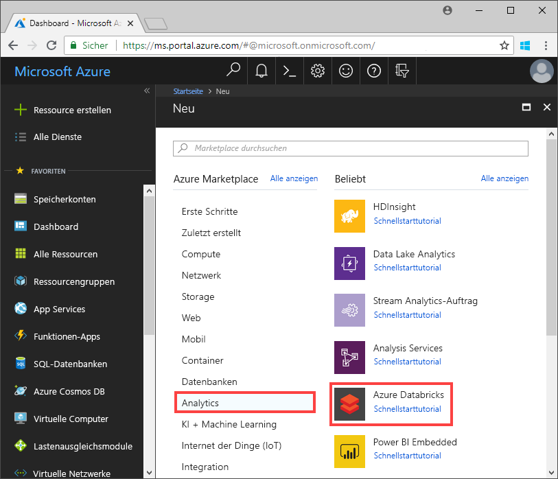
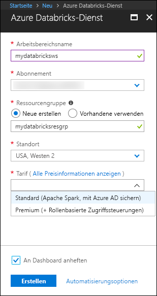
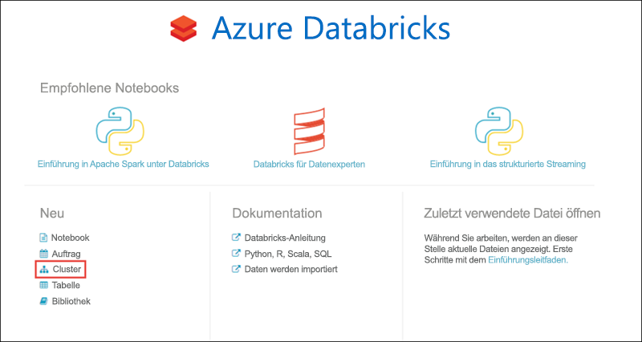
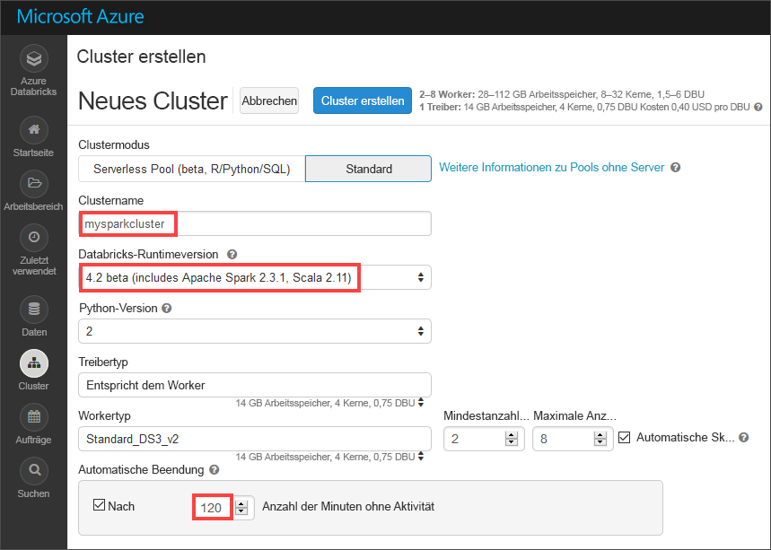
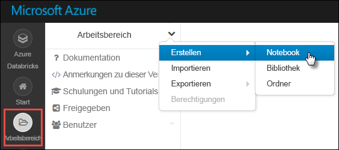
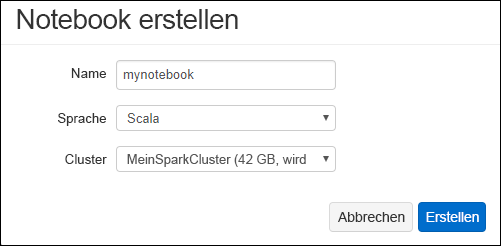
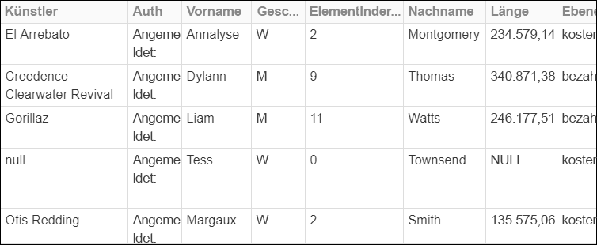
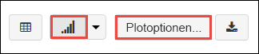
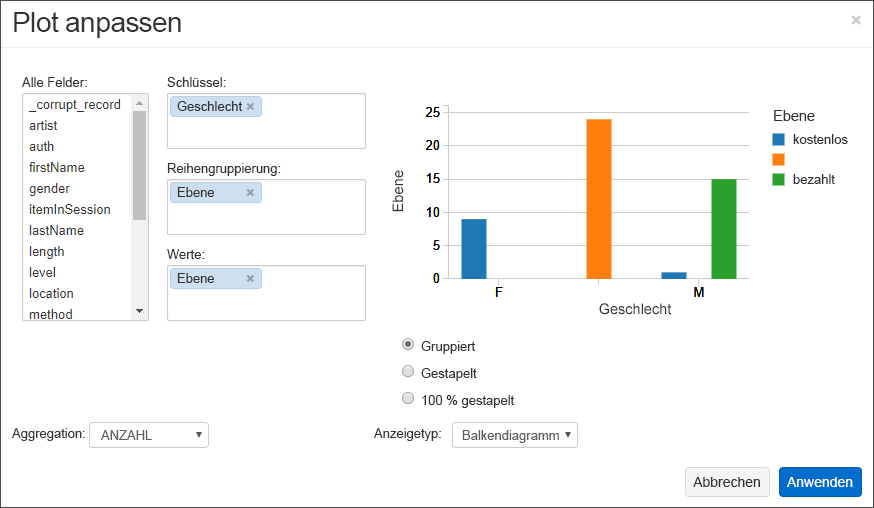
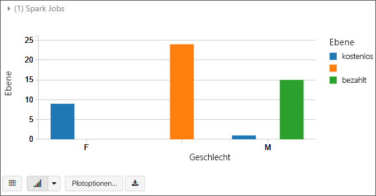

# <a name="quickstart-analyze-data-in-azure-data-lake-storage-gen2-by-using-azure-databricks"></a>Schnellstart: Analysieren von Daten in Azure Data Lake Storage Gen2 mit Azure Databricks

In diesem Schnellstart erfahren Sie, wie Sie unter Verwendung von Azure Databricks einen Apache Spark-Auftrag ausführen, um Daten zu analysieren, die in einem Speicherkonto mit Azure Data Lake Storage Gen2 gespeichert sind.

Im Rahmen des Spark-Auftrags werden die Abonnementdaten eines Radiosenders analysiert, um Einblicke in die Nutzung kostenloser/kostenpflichtiger Angebote auf der Grundlage demografischer Daten zu gewinnen.

Wenn Sie kein Azure-Abonnement besitzen, können Sie ein [kostenloses Konto](https://azure.microsoft.com/free/) erstellen, bevor Sie beginnen.

## <a name="prerequisites"></a>Voraussetzungen

* Erstellen eines Data Lake Gen2-Speicherkontos. Weitere Informationen finden Sie unter [Schnellstart: Erstellen eines Azure Data Lake Storage Gen2-Speicherkontos](data-lake-storage-quickstart-create-account.md)

  Fügen Sie den Namen des Speicherkontos in eine Textdatei ein. Sie benötigen ihn in Kürze.

* Erstellen eines Dienstprinzipals Informationen finden Sie unter [Gewusst wie: Erstellen einer Azure AD-Anwendung und eines Dienstprinzipals mit Ressourcenzugriff über das Portal](https://docs.microsoft.com/azure/active-directory/develop/howto-create-service-principal-portal).

  Bei den Schritten in diesem Artikel müssen einige bestimmte Aktionen ausgeführt werden.

  :heavy_check_mark: Achten Sie beim Ausführen der Schritte im Abschnitt [Zuweisen der Anwendung zu einer Rolle](https://docs.microsoft.com/azure/active-directory/develop/howto-create-service-principal-portal#assign-the-application-to-a-role) des Artikels darauf, dem Dienstprinzipal die Rolle **Mitwirkender an Storage-Blobdaten** zuzuweisen.

  > [!IMPORTANT]
  > Achten Sie darauf, die Rolle im Kontext des Data Lake Storage Gen2-Kontos zuzuweisen. Sie können eine Rolle der übergeordneten Ressourcengruppe oder dem übergeordneten Abonnement zuweisen. In diesem Fall tritt jedoch ein Berechtigungsfehler auf, bis die Rollenzuweisungen an das Speicherkonto weitergegeben wurden.

  :heavy_check_mark: Fügen Sie beim Ausführen der Schritte im Abschnitt [Abrufen von Werten für die Anmeldung](https://docs.microsoft.com/azure/active-directory/develop/howto-create-service-principal-portal#get-values-for-signing-in) des Artikels die Werte für Mandanten-ID, App-ID und Kennwort in eine Textdatei ein. Sie benötigen sie in Kürze.

## <a name="create-an-azure-databricks-workspace"></a>Erstellen eines Azure Databricks-Arbeitsbereichs

In diesem Abschnitt erstellen Sie einen Azure Databricks-Arbeitsbereich über das Azure-Portal.

1. Klicken Sie im Azure-Portal auf **Ressource erstellen** > **Analysen** > **Azure Databricks**.

    

2. Geben Sie unter **Azure Databricks-Dienst** die Werte für die Erstellung eines Databricks-Arbeitsbereichs an.

    

    Geben Sie außerdem die folgenden Werte an:

    |Eigenschaft  |BESCHREIBUNG  |
    |---------|---------|
    |**Arbeitsbereichsname**     | Geben Sie einen Namen für Ihren Databricks-Arbeitsbereich an.        |
    |**Abonnement**     | Wählen Sie in der Dropdownliste Ihr Azure-Abonnement aus.        |
    |**Ressourcengruppe**     | Geben Sie an, ob Sie eine neue Ressourcengruppe erstellen oder eine vorhandene Ressourcengruppe verwenden möchten. Eine Ressourcengruppe ist ein Container, der verwandte Ressourcen für eine Azure-Lösung enthält. Weitere Informationen finden Sie in der [Übersicht über den Azure Resource Manager](../../azure-resource-manager/resource-group-overview.md). |
    |**Location**     | Wählen Sie **USA, Westen 2** aus. Sie können auch eine andere öffentliche Region auswählen.        |
    |**Tarif**     |  Wählen Sie zwischen **Standard** und **Premium**. Weitere Informationen zu diesen Tarifen, finden Sie unter [Azure Databricks – Preise](https://azure.microsoft.com/pricing/details/databricks/).       |

3. Die Kontoerstellung dauert einige Minuten. Den Status des Vorgangs können Sie anhand der Statusanzeige im oberen Bereich verfolgen.

4. Aktivieren Sie das Kontrollkästchen **An Dashboard anheften**, und klicken Sie anschließend auf **Erstellen**.

## <a name="create-a-spark-cluster-in-databricks"></a>Erstellen eines Spark-Clusters in Databricks

1. Navigieren Sie im Azure-Portal zum erstellten Databricks-Arbeitsbereich, und klicken Sie auf **Launch Workspace** (Arbeitsbereich starten).

2. Sie werden zum Azure Databricks-Portal weitergeleitet. Klicken Sie im Portal auf **Neu** > **Cluster**.

    

3. Geben Sie auf der Seite **Neuer Cluster** die erforderlichen Werte an, um einen Cluster zu erstellen.

    

    Übernehmen Sie alle anderen Standardwerte bis auf Folgendes:

    * Geben Sie einen Namen für den Cluster ein.
    * Erstellen Sie einen Cluster mit der Runtime **5.1**.
    * Aktivieren Sie das Kontrollkästchen **Terminate after 120 minutes of inactivity** (Nach 120 Minuten Inaktivität beenden). Geben Sie an, nach wie vielen Minuten der Cluster beendet werden soll, wenn er nicht verwendet wird.

4. Klicken Sie auf **Cluster erstellen**. Sobald der Cluster ausgeführt wird, können Sie Notizbücher an den Cluster anfügen und Spark-Aufträge ausführen.

Weitere Informationen zum Erstellen von Clustern in Azure Databricks finden Sie unter [Creating Clusters](https://docs.azuredatabricks.net/user-guide/clusters/create.html) (Erstellen von Clustern).

## <a name="create-storage-account-file-system"></a>Erstellen des Dateisystems für das Speicherkonto

In diesem Abschnitt erstellen Sie ein Notizbuch im Azure Databricks-Arbeitsbereich und führen anschließend Codeausschnitte aus, um das Speicherkonto zu konfigurieren.

1. Navigieren Sie im [Azure-Portal](https://portal.azure.com) zum erstellten Azure Databricks-Arbeitsbereich, und klicken Sie auf **Launch Workspace** (Arbeitsbereich starten).

2. Klicken Sie im linken Bereich auf **Arbeitsbereich**. Wählen Sie in der Dropdownliste **Arbeitsbereich** die Option **Erstellen** > **Notebook** aus.

    

3. Geben Sie im Dialogfeld **Notizbuch erstellen** einen Namen für das Notebook ein. Wählen Sie **Scala** als Sprache und anschließend den zuvor erstellten Spark-Cluster aus.

    

    Klicken Sie auf **Erstellen**.

4. Kopieren Sie den folgenden Codeblock, und fügen Sie ihn in die erste Zelle ein, führen Sie den Code jedoch noch nicht aus.

   ```scala
   spark.conf.set("fs.azure.account.auth.type.<storage-account-name>.dfs.core.windows.net", "OAuth")
   spark.conf.set("fs.azure.account.oauth.provider.type.<storage-account-name>.dfs.core.windows.net", "org.apache.hadoop.fs.azurebfs.oauth2.ClientCredsTokenProvider")
   spark.conf.set("fs.azure.account.oauth2.client.id.<storage-account-name>.dfs.core.windows.net", "<appID>")
   spark.conf.set("fs.azure.account.oauth2.client.secret.<storage-account-name>.dfs.core.windows.net", "<password>")
   spark.conf.set("fs.azure.account.oauth2.client.endpoint.<storage-account-name>.dfs.core.windows.net", "https://login.microsoftonline.com/<tenant-id>/oauth2/token")
   spark.conf.set("fs.azure.createRemoteFileSystemDuringInitialization", "true")
   dbutils.fs.ls("abfss://<file-system-name>@<storage-account-name>.dfs.core.windows.net/")
   spark.conf.set("fs.azure.createRemoteFileSystemDuringInitialization", "false")

   ```

    > [!NOTE]
    > Dieser Codeblock greift direkt über OAuth auf den Data Lake Gen2-Endpunkt zu. Es gibt jedoch noch andere Methoden zum Verknüpfen des Databricks-Arbeitsbereichs mit Ihrem Data Lake Storage Gen2-Konto. Beispielsweise können Sie das Dateisystem mithilfe von OAuth einbinden oder den Direktzugriff mit gemeinsam verwendetem Schlüssel nutzen. <br>Beispiele für diese Ansätze finden Sie auf der Azure Databricks-Website im Artikel zu [Azure Data Lake Storage Gen2](https://docs.azuredatabricks.net/spark/latest/data-sources/azure/azure-datalake-gen2.html).

5. Ersetzen Sie in diesem Codeblock die Platzhalterwerte `storage-account-name`, `appID`, `password` und `tenant-id` durch die Werte, die Sie beim Erstellen des Dienstprinzipals gesammelt haben. Legen Sie für den Platzhalterwert `file-system-name` den gewünschten Namen für das Dateisystem fest.

    > [!NOTE]
    > In einer Produktionsumgebung empfiehlt es sich, Ihren Authentifizierungsschlüssel in Azure Databricks zu speichern. Fügen Sie dem Codeblock dann einen Suchschlüssel anstelle des Authentifizierungsschlüssels hinzu. Sehen Sie sich nach Abschluss dieses Schnellstarts die Beispiele für diesen Ansatz im Artikel [Azure Data Lake Storage Gen2](https://docs.azuredatabricks.net/spark/latest/data-sources/azure/azure-datalake-gen2.html) auf der Azure Databricks-Website an.

6. Drücken Sie **UMSCHALT+EINGABE**, um den Code in diesem Block auszuführen.

## <a name="ingest-sample-data"></a>Erfassen von Beispieldaten

Bevor Sie mit diesem Abschnitt beginnen, müssen folgende Schritte ausgeführt werden:

Geben Sie den folgenden Code in eine Zelle des Notebooks ein:

    %sh wget -P /tmp https://raw.githubusercontent.com/Azure/usql/master/Examples/Samples/Data/json/radiowebsite/small_radio_json.json

Drücken Sie in der Zelle**UMSCHALT+EINGABE**, um den Code auszuführen.

Geben Sie als Nächstes in einer darunterliegenden Zelle den folgenden Code ein, und ersetzen Sie dabei die in Klammern angegebenen Werte durch die zuvor verwendeten Werte:

    dbutils.fs.cp("file:///tmp/small_radio_json.json", "abfss://<file-system>@<account-name>.dfs.core.windows.net/")

Drücken Sie in der Zelle**UMSCHALT+EINGABE**, um den Code auszuführen.

## <a name="run-a-spark-sql-job"></a>Ausführen eines Spark SQL-Auftrags

Führen Sie die folgenden Aufgaben aus, um einen Spark SQL-Auftrag für die Daten auszuführen.

1. Führen Sie eine SQL-Anweisung aus, um eine temporäre Tabelle mit Daten aus der JSON-Beispieldatendatei **small_radio_json.json** zu erstellen. Ersetzen Sie die Platzhalterwerte im folgenden Codeausschnitt durch den Namen Ihres Dateisystems bzw. Ihres Speicherkontos. Fügen Sie unter Verwendung des zuvor erstellten Notizbuchs den Codeausschnitt in eine Codezelle des Notizbuchs ein, und drücken Sie UMSCHALT+EINGABE.

    ```sql
    %sql
    DROP TABLE IF EXISTS radio_sample_data;
    CREATE TABLE radio_sample_data
    USING json
    OPTIONS (
     path  "abfss://<file-system-name>@<storage-account-name>.dfs.core.windows.net/<PATH>/small_radio_json.json"
    )
    ```

    Nach erfolgreicher Ausführung des Befehls liegen alle Daten aus der JSON-Datei als Tabelle im Databricks-Cluster vor.

    Der Befehl `%sql` ermöglicht die Ausführung von SQL-Code über das Notizbuch, auch wenn es sich um ein Notizbuch eines anderen Typs handelt. Weitere Informationen finden Sie unter [Mixing languages in a notebook](https://docs.azuredatabricks.net/user-guide/notebooks/index.html#mixing-languages-in-a-notebook) (Mischen von Sprachen in einem Notizbuch).

2. Zum besseren Verständnis der ausgeführten Abfrage sehen wir uns eine Momentaufnahme der JSON-Beispieldaten an. Fügen Sie den folgenden Codeausschnitt in die Codezelle ein, und drücken Sie **UMSCHALT+EINGABE**.

    ```sql
    %sql
    SELECT * from radio_sample_data
    ```

3. Sie erhalten eine tabellarische Ausgabe wie im folgenden Screenshot, der allerdings nur einen Teil der Spalten zeigt:

    

    Neben verschiedenen anderen Details enthalten die Beispieldaten das Geschlecht der Zielgruppe eines Radiokanals (Spalte **gender**) und die Information, ob die jeweilige Person ein kostenloses oder ein kostenpflichtiges Abonnement nutzt (Spalte **level**).

4. Sie können nun eine visuelle Darstellung dieser Daten erstellen, die zeigt, wie viele Benutzer des jeweiligen Geschlechts über kostenlose Konten verfügen und bei wie vielen es sich um zahlende Abonnenten handelt. Klicken Sie im unteren Bereich der tabellarischen Ausgabe auf das Symbol **Balkendiagramm** und anschließend auf **Zeichnungsoptionen**.

    

5. Platzieren Sie per Drag & Drop Werte in **Customize Plot** (Zeichnung anpassen), wie im folgenden Screenshot zu sehen.

    

    - Legen Sie **Schlüssel** auf **gender** fest.
    - Legen Sie **Series groupings** (Reihengruppierungen) auf **level** fest.
    - Legen Sie **Werte** auf **level** fest.
    - Legen Sie **Aggregation** auf **ANZAHL** fest.

6. Klicken Sie auf **Anwenden**.

7. Die Ausgabe zeigt die visuelle Darstellung wie im folgenden Screenshot dargestellt:

     

## <a name="clean-up-resources"></a>Bereinigen von Ressourcen

Am Ende dieses Artikels können Sie den Cluster beenden. Klicken Sie im Azure Databricks-Arbeitsbereich auf **Cluster**, und suchen Sie den Cluster, die Sie beenden möchten. Zeigen Sie mit dem Mauszeiger auf die Auslassungspunkte in der Spalte **Aktionen**, und klicken Sie auf das Symbol **Beenden**.


Wenn Sie den Cluster nicht manuell beenden, wird er automatisch beendet, sofern Sie bei der Erstellung des Clusters das Kontrollkästchen **Terminate after \_\_ minutes of inactivity** (Nach \_\_ Minuten Inaktivität beenden) aktiviert haben. Bei Verwendung dieser Option wird der Cluster beendet, wenn er für den angegebenen Zeitraum inaktiv war.

## <a name="next-steps"></a>Nächste Schritte

In diesem Artikel haben Sie einen Spark-Cluster in Azure Databricks erstellt und einen Spark-Auftrag mit Daten in einem Speicherkonto mit aktivierter Data Lake Storage Gen2-SKU ausgeführt. Unter [Spark Data Sources](https://docs.azuredatabricks.net/spark/latest/data-sources/index.html) (Spark-Datenquellen) erfahren Sie, wie Sie Daten aus anderen Datenquellen in Azure Databricks importieren. Im nächsten Artikel erfahren Sie, wie Sie unter Verwendung von Azure Databricks einen ETL-Vorgang zum Extrahieren, Transformieren und Laden von Daten ausführen.

> [!div class="nextstepaction"]
>[Extrahieren, Transformieren und Laden von Daten mithilfe von Azure Databricks](../../azure-databricks/databricks-extract-load-sql-data-warehouse.md)
