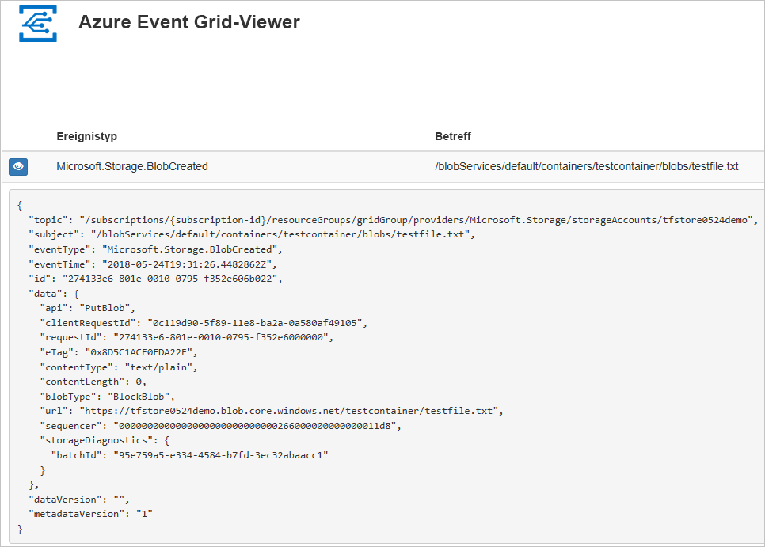
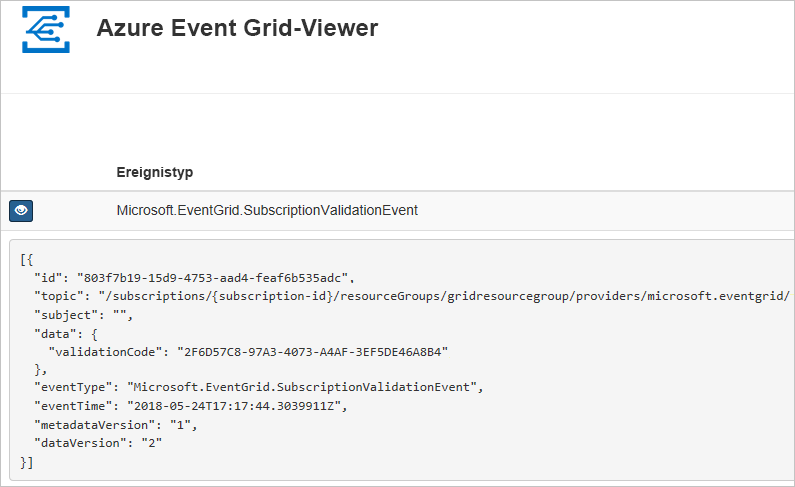

# <a name="route-blob-storage-events-to-a-custom-web-endpoint-with-azure-cli"></a>Weiterleiten von Blob Storage-Ereignissen an einen benutzerdefinierten Webendpunkt mit Azure CLI

Azure Event Grid ist ein Ereignisdienst für die Cloud. In diesem Artikel abonnieren Sie mithilfe der Azure-Befehlszeilenschnittstelle Blob Storage-Ereignisse und lösen das Ereignis aus, um das Ergebnis anzuzeigen.

Üblicherweise senden Sie Ereignisse an einen Endpunkt, der die Ereignisdaten verarbeitet und entsprechende Aktionen ausführt. Der Einfachheit halber senden Sie die Ereignisse in diesem Artikel allerdings an eine Web-App, die die Nachrichten sammelt und anzeigt.

Nach Abschluss der Schritte in diesem Artikel sehen Sie, dass die Ereignisdaten an die Web-App gesendet wurden.




[!INCLUDE [quickstarts-free-trial-note.md](../../../includes/quickstarts-free-trial-note.md)]

[!INCLUDE [cloud-shell-try-it.md](../../../includes/cloud-shell-try-it.md)]

Wenn Sie die Befehlszeilenschnittstelle lokal installieren und verwenden, müssen Sie für diesen Artikel mindestens die Version 2.0.24 der Azure-Befehlszeilenschnittstelle ausführen. Führen Sie `az --version` aus, um die Version zu finden. Informationen zum Durchführen einer Installation oder eines Upgrades finden Sei bei Bedarf unter [Installieren der Azure CLI](/cli/azure/install-azure-cli).

Falls Sie nicht Cloud Shell verwenden, müssen Sie sich erst mithilfe von `az login` anmelden.

## <a name="create-a-resource-group"></a>Erstellen einer Ressourcengruppe

Event Grid-Themen sind Azure-Ressourcen und müssen in einer Azure-Ressourcengruppe platziert werden. Die Azure-Ressourcengruppe ist eine logische Sammlung, in der Azure-Ressourcen bereitgestellt und verwaltet werden.

Erstellen Sie mit dem Befehl [az group create](/cli/azure/group#az_group_create) eine Ressourcengruppe. 

Im folgenden Beispiel wird am Standort *westcentralus* eine Ressourcengruppe namens `<resource_group_name>` erstellt.  Ersetzen Sie `<resource_group_name>` durch einen eindeutigen Namen für Ihre Ressourcengruppe.

```azurecli-interactive
az group create --name <resource_group_name> --location westcentralus
```

## <a name="create-a-storage-account"></a>Speicherkonto erstellen

Zur Verwendung von Blob Storage-Ereignissen benötigen Sie ein [Blob Storage-Konto](../common/storage-create-storage-account.md?toc=%2fazure%2fstorage%2fblobs%2ftoc.json#blob-storage-accounts) oder ein [Speicherkonto des Typs „General Purpose v2“](../common/storage-account-options.md#general-purpose-v2-accounts). Bei **General Purpose v2 (GPv2)** handelt es sich um Speicherkonten, die alle Features für alle Speicherdienste unterstützen, z.B. Blobs, Files, Queues und Tables. **Blob Storage-Konten** sind spezielle Speicherkonten und dienen dazu, unstrukturierte Daten als Blobs (Objekte) in Azure Storage zu speichern. BLOB-Speicherkonten sind wie allgemeine Speicherkonten und besitzen die gleichen Haltbarkeits-, Verfügbarkeits-, Skalierbarkeits- und Leistungseigenschaften, die Sie schon heute verwenden – einschließlich vollständiger API-Konsistenz für Blockblobs und Anfügeblobs. Bei Anwendungen, die nur Block- oder Anfügeblobspeicher benötigen, empfiehlt sich die Verwendung von BLOB-Speicherkonten. 

> [!NOTE]
> Die Verfügbarkeit von Storage-Ereignissen ist an die [Verfügbarkeit](../../event-grid/overview.md) von Event Grid gebunden und wird in anderen Regionen verfügbar, wenn dort Event Grid verfügbar ist.

Ersetzen Sie `<storage_account_name>` durch einen eindeutigen Namen für Ihr Speicherkonto und `<resource_group_name>` durch die zuvor erstellte Ressourcengruppe.

```azurecli-interactive
az storage account create \
  --name <storage_account_name> \
  --location westcentralus \
  --resource-group <resource_group_name> \
  --sku Standard_LRS \
  --kind BlobStorage \
  --access-tier Hot
```

## <a name="create-a-message-endpoint"></a>Erstellen eines Nachrichtenendpunkts

Vor dem Abonnieren des Themas erstellen wir zunächst den Endpunkt für die Ereignisnachricht. Der Endpunkt führt in der Regel Aktionen auf der Grundlage der Ereignisdaten aus. Der Einfachheit halber stellen Sie in dieser Schnellstartanleitung eine [vorgefertigte Web-App](https://github.com/dbarkol/azure-event-grid-viewer) bereit, die die Ereignisnachrichten anzeigt. Die bereitgestellte Lösung umfasst einen App Service-Plan, eine App Service-Web-App und Quellcode von GitHub.

Ersetzen Sie `<your-site-name>` durch einen eindeutigen Namen für Ihre Web-App. Der Name der Web-App muss eindeutig sein, da er Teil des DNS-Eintrags ist.

```azurecli-interactive
sitename=<your-site-name>

az group deployment create \
  --resource-group <resource_group_name> \
  --template-uri "https://raw.githubusercontent.com/dbarkol/azure-event-grid-viewer/master/azuredeploy.json" \
  --parameters siteName=$sitename hostingPlanName=viewerhost
```

Die Bereitstellung kann einige Minuten dauern. Nach erfolgreichem Abschluss der Bereitstellung können Sie Ihre Web-App anzeigen und sich vergewissern, dass sie ausgeführt wird. Navigieren Sie hierzu in einem Webbrowser zu `https://<your-site-name>.azurewebsites.net`.

Die Website sollte angezeigt werden, und es sollten momentan keine Nachrichten vorliegen.

[!INCLUDE [event-grid-register-provider-cli.md](../../../includes/event-grid-register-provider-cli.md)]

## <a name="subscribe-to-your-storage-account"></a>Abonnieren Ihres Speicherkontos

Sie abonnieren ein Thema, um Event Grid mitzuteilen, welche Ereignisse Sie nachverfolgen möchten und wohin sie gesendet werden sollen. Im folgenden Beispiel wird das von Ihnen erstellte Speicherkonto abonniert. Außerdem wird die URL Ihrer Web-App als Endpunkt für Ereignisbenachrichtigungen übergeben. Ersetzen Sie `<event_subscription_name>` durch einen Namen für Ihr Ereignisabonnement. Verwenden Sie für `<resource_group_name>` und `<storage_account_name>` jeweils den zuvor erstellten Wert.

Der Endpunkt für Ihre Web-App muss das Suffix `/api/updates/` enthalten.

```azurecli-interactive
storageid=$(az storage account show --name <storage_account_name> --resource-group <resource_group_name> --query id --output tsv)
endpoint=https://$sitename.azurewebsites.net/api/updates

az eventgrid event-subscription create \
  --resource-id $storageid \
  --name <event_subscription_name> \
  --endpoint $endpoint
```

Zeigen Sie wieder Ihre Web-App an. Wie Sie sehen, wurde ein Abonnementüberprüfungsereignis an sie gesendet. Klicken Sie auf das Augensymbol, um die Ereignisdaten zu erweitern. Event Grid sendet das Überprüfungsereignis, damit der Endpunkt bestätigen kann, dass er Ereignisdaten empfangen möchte. Die Web-App enthält Code zur Überprüfung des Abonnements.



## <a name="trigger-an-event-from-blob-storage"></a>Auslösen eines Ereignisses aus Blob Storage

Als Nächstes lösen wir ein Ereignis aus, um zu sehen, wie Event Grid die Nachricht an Ihren Endpunkt weiterleitet. Zunächst konfigurieren wir den Namen und den Schlüssel für das Speicherkonto. Danach erstellen wir einen Container. Und schließlich erstellen wir eine Datei und laden sie hoch. Verwenden Sie für `<storage_account_name>` und `<resource_group_name>` wieder die zuvor erstellten Werte.

```azurecli-interactive
export AZURE_STORAGE_ACCOUNT=<storage_account_name>
export AZURE_STORAGE_ACCESS_KEY="$(az storage account keys list --account-name <storage_account_name> --resource-group <resource_group_name> --query "[0].value" --output tsv)"

az storage container create --name testcontainer

touch testfile.txt
az storage blob upload --file testfile.txt --container-name testcontainer --name testfile.txt
```

Sie haben das Ereignis ausgelöst, und Event Grid hat die Nachricht an den Endpunkt gesendet, den Sie beim Abonnieren konfiguriert haben. Zeigen Sie Ihre Web-App an, um das soeben gesendete Ereignis anzuzeigen.


```json
[{
  "topic": "/subscriptions/xxxxxxxx-xxxx-xxxx-xxxx-xxxxxxxxxxxx/resourceGroups/myrg/providers/Microsoft.Storage/storageAccounts/myblobstorageaccount",
  "subject": "/blobServices/default/containers/testcontainer/blobs/testfile.txt",
  "eventType": "Microsoft.Storage.BlobCreated",
  "eventTime": "2017-08-16T20:33:51.0595757Z",
  "id": "4d96b1d4-0001-00b3-58ce-16568c064fab",
  "data": {
    "api": "PutBlockList",
    "clientRequestId": "d65ca2e2-a168-4155-b7a4-2c925c18902f",
    "requestId": "4d96b1d4-0001-00b3-58ce-16568c000000",
    "eTag": "0x8D4E4E61AE038AD",
    "contentType": "text/plain",
    "contentLength": 0,
    "blobType": "BlockBlob",
    "url": "https://myblobstorageaccount.blob.core.windows.net/testcontainer/testblob1.txt",
    "sequencer": "00000000000000EB0000000000046199",
    "storageDiagnostics": {
      "batchId": "dffea416-b46e-4613-ac19-0371c0c5e352"
    }
  },
  "dataVersion": "",
  "metadataVersion": "1"
}]

```

## <a name="clean-up-resources"></a>Bereinigen von Ressourcen
Wenn Sie das Speicherkonto und das Ereignisabonnement weiterverwenden möchten, überspringen Sie die Bereinigung der in diesem Artikel erstellten Ressourcen. Führen Sie andernfalls den folgenden Befehl aus, um die in diesem Artikel erstellten Ressourcen zu löschen.

Ersetzen Sie `<resource_group_name>` durch die weiter oben erstellte Ressourcengruppe.

```azurecli-interactive
az group delete --name <resource_group_name>
```

## <a name="next-steps"></a>Nächste Schritte

Sie haben gelernt, wie Sie Themen und Ereignisabonnements erstellen. Nun können Sie sich ausführlicher über Blob Storage-Ereignisse und die Möglichkeiten informieren, die Event Grid Ihnen bietet:

- [Reacting to Blob storage events (preview)](storage-blob-event-overview.md) (Reagieren auf Blob Storage-Ereignisse (Vorschauversion))
- [Einführung in Azure Event Grid](../../event-grid/overview.md)
