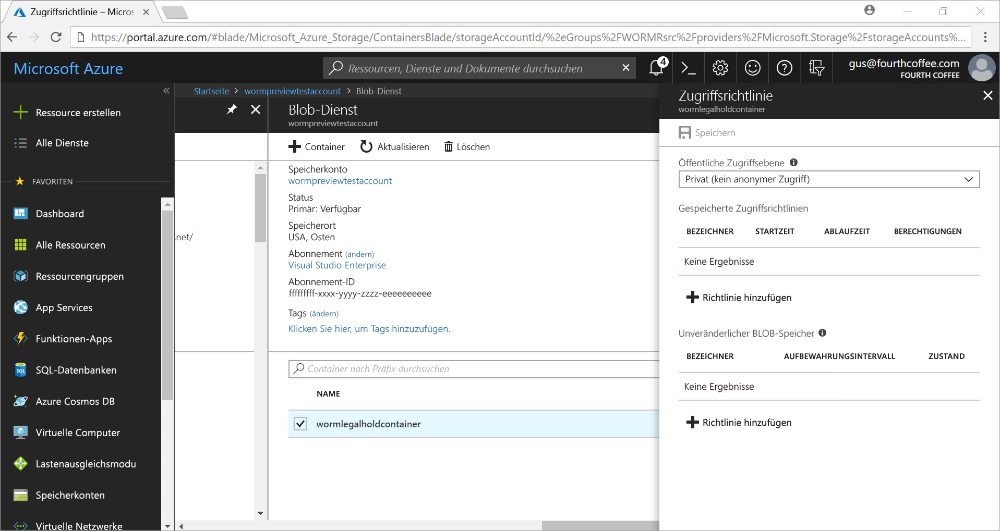
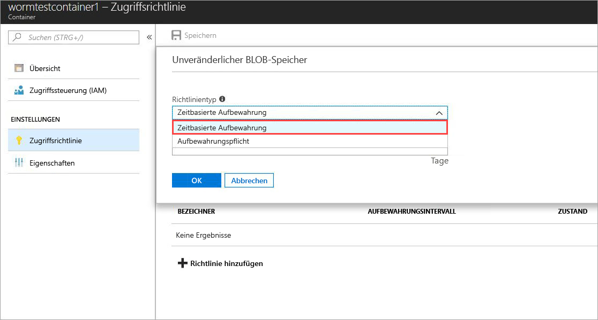
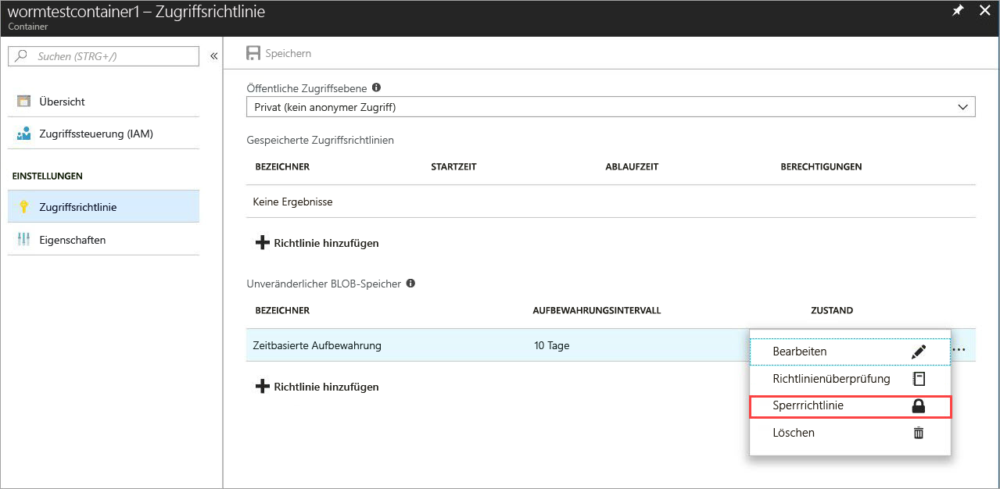
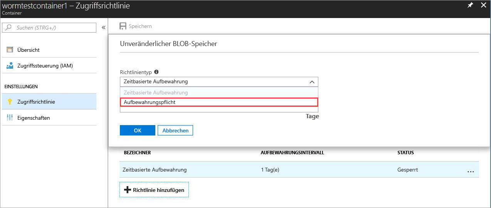
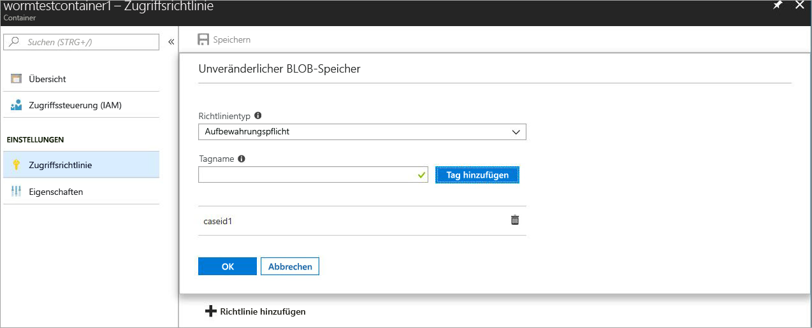

# <a name="store-business-critical-data-in-azure-blob-storage"></a>Speichern unternehmenskritischer Daten in Azure-Blobspeicher

Unveränderlicher Speicher für Azure-Blob(objekt)speicher ermöglicht Benutzern, unternehmenskritische Daten in einem WORM-Zustand zu speichern. In diesem Zustand sind die Daten für einen vom Benutzer angegebenen Zeitraum nicht löschbar und nicht änderbar. Blobs können erstellt und gelesen werden, aber das Ändern oder Löschen ist für den Aufbewahrungszeitraum nicht möglich.

## <a name="overview"></a>Übersicht

Unveränderlicher Speicher unterstützt Finanzinstitute und verwandte Branchen – insbesondere Broker-Organisationen – dabei, Daten sicher zu speichern. Er kann auch in jedem Szenario verwendet werden, um kritische Daten vor dem Löschen zu schützen.  

Beispiele für typische Anwendungen:

- **Einhaltung gesetzlicher Bestimmungen**: Unveränderlicher Speicher für Azure-Blobspeicher unterstützt Organisationen dabei, SEC 17a-4(f), CFTC 1.31(d), FINRA und andere Bestimmungen einzuhalten.

- **Sichere Dokumentaufbewahrung**: Blobspeicher stellt sicher, dass Daten nicht von Benutzern geändert oder gelöscht werden können, auch wenn diese über Berechtigungen für die Kontoverwaltung verfügen.

- **Gesetzliche Aufbewahrungspflicht**: Mit der Funktion „Unveränderlicher Speicher“ für Azure-Blobspeicher können Benutzer sensible Informationen, die für Beweissicherungsverfahren oder strafrechtliche Untersuchungen wichtig sind, für den gewünschten Zeitraum in einem vor Manipulationen geschützten Zustand speichern.

Unveränderlicher Speicher ermöglicht:

- **Unterstützung einer zeitbasierten Aufbewahrungsrichtlinie:** Benutzer legen Richtlinien für die Speicherung von Daten für einen bestimmten Zeitraum fest.

- **Unterstützung einer Richtlinie zur gesetzlichen Aufbewahrungspflicht:** Wenn der Aufbewahrungszeitraum nicht bekannt ist, können Benutzer Zeiträume für die gesetzliche Aufbewahrungspflicht festlegen, um Daten auf unveränderliche Weise zu speichern, bis die Aufbewahrungspflicht nicht mehr gilt.  Wenn ein Zeitraum für die gesetzliche Aufbewahrungspflicht festgelegt wird, können Blobs erstellt und gelesen, aber nicht geändert oder gelöscht werden. Jeder gesetzlichen Aufbewahrungspflicht ist ein benutzerdefiniertes alphanumerisches Tag zugeordnet, das als Bezeichnerzeichenfolge (z.B. eine Fall-ID) verwendet wird.

- **Unterstützung für alle Blobebenen**: WORM-Richtlinien sind unabhängig von der Azure-Blobspeicherebene und gelten für alle Ebenen: „Heiß“ (Hot), „Kalt“ (Cool) und „Archiv“. Benutzer können Daten in die Ebene überführen, für die die Workloadkosten bestmöglich optimiert sind, während gleichzeitig die Unveränderlichkeit der Daten sichergestellt ist.

- **Konfiguration auf Containerebene**: Benutzer können zeitbasierte Aufbewahrungsrichtlinien und Tags für gesetzliche Aufbewahrungspflichten auf Containerebene konfigurieren. Mit den Einstellungen auf Containerebene können Benutzer zeitbasierte Aufbewahrungsrichtlinien erstellen und sperren, Aufbewahrungszeiträume verlängern, Zeiträume für gesetzliche Aufbewahrungspflichten festlegen und aufheben usw. Diese Richtlinien gelten für alle Blobs im Container (vorhandene und neue).

- **Unterstützung der Überwachungsprotokollierung**: Jeder Container enthält ein Überwachungsprotokoll. Darin werden bis zu fünf zeitbasierte Aufbewahrungsbefehle für gesperrte zeitbasierte Aufbewahrungsrichtlinien mit maximal drei Protokollen zur Verlängerung von Aufbewahrungszeiträumen angezeigt. Für die zeitbasierte Aufbewahrung enthält das Protokoll Benutzer-ID, Befehlstyp, Zeitstempel und Aufbewahrungszeitraum. Für Zeiträume zur gesetzlichen Aufbewahrungspflicht enthält das Protokoll Benutzer-ID, Befehlstyp, Zeitstempel und die entsprechenden Tags. Dieses Protokoll wird für die Lebensdauer des Containers gemäß den SEC 17a-4(f)-Bestimmungsrichtlinien aufbewahrt. Das [Azure-Aktivitätsprotokoll](https://docs.microsoft.com/azure/monitoring-and-diagnostics/monitoring-overview-activity-logs) zeigt ein umfassenderes Protokoll mit allen Aktivitäten der Steuerebene an. Der Benutzer ist für die dauerhafte Speicherung dieser Protokolle verantwortlich, die aus gesetzlichen oder anderen Gründen ggf. erforderlich ist.

Unveränderlicher Speicher ist in allen öffentlichen Azure-Regionen aktiviert.

## <a name="how-it-works"></a>So funktioniert's

Unveränderlicher Speicher für Azure-Blobspeicher unterstützt zwei Arten von WORM-Richtlinien bzw. Richtlinien für die unveränderliche Speicherung: zeitbasierte Aufbewahrung und gesetzliche Aufbewahrungspflicht. Ausführliche Informationen zum Erstellen dieser Richtlinien für die unveränderliche Speicherung finden Sie im Abschnitt [Erste Schritte](#Getting-started).

Wenn eine zeitbasierte Aufbewahrungsrichtlinie oder ein Zeitraum für die gesetzliche Aufbewahrungspflicht auf einen Container angewendet wird, werden alle vorhandenen Blobs in den unveränderlichen Zustand versetzt (Schreib- und Löschschutz). Alle neuen Blobs, die in den Container hochgeladen werden, werden auch in den unveränderlichen Zustand versetzt.

> [!IMPORTANT]
> Eine zeitbasierte Aufbewahrungsrichtlinie muss *gesperrt* sein, damit das Blob für die Konformität mit SEC 17a-4(f) und anderen gesetzlichen Bestimmungen in einem unveränderlichen Zustand ist (Schreib- und Löschschutz). Sie sollten die Richtlinie in einem ausreichenden Zeitraum sperren, in der Regel innerhalb von 24 Stunden. Den *entsperrten* Zustand sollten Sie nur für kurzzeitige Funktionstests verwenden.

Wenn eine zeitbasierte Aufbewahrungsrichtlinie auf einen Container angewendet wird, bleiben alle Blobs im Container so lange im unveränderlichen Zustand, wie der Aufbewahrungszeitraum *gilt*. Die Gültigkeit des Aufbewahrungszeitraums für vorhandene Blobs entspricht der Differenz zwischen der Bloberstellung und dem vom Benutzer angegebenen Aufbewahrungszeitraum.

Für neue Blobs entspricht die Gültigkeit des Aufbewahrungszeitraums dem vom Benutzer angegebenen Aufbewahrungszeitraum. Da Benutzer den Aufbewahrungszeitraum verlängern können, nutzt unveränderlicher Speicher den letzten Wert des vom Benutzer angegebenen Aufbewahrungszeitraums, um den effektiven Aufbewahrungszeitraum zu berechnen.

> [!TIP]
> Beispiel:
>
> Ein Benutzer erstellt eine zeitbasierte Aufbewahrungsrichtlinie mit einem Aufbewahrungszeitraum von fünf Jahren.
>
> Das vorhandene Blob in diesem Container, „testblob1“, wurde vor einem Jahr erstellt. Der effektive Aufbewahrungszeitraum für „testblob1“ beträgt vier Jahre.
>
> Das neue Blob „testblob2“ wird jetzt in den Container hochgeladen. Der effektive Aufbewahrungszeitraum für dieses neue Blob beträgt fünf Jahre.

### <a name="legal-holds"></a>Gesetzliche Aufbewahrungspflichten

Wenn Sie einen Zeitraum für die gesetzliche Aufbewahrungspflicht festlegen, verbleiben alle vorhandenen und neuen Blobs im unveränderlichen Zustand, bis die gesetzliche Aufbewahrungspflicht aufgehoben wird. Ausführliche Informationen zum Festlegen und Aufheben von Zeiträumen für die gesetzliche Aufbewahrungspflicht finden Sie im Abschnitt [Erste Schritte](#Getting-started).

Für einen Container können gleichzeitig eine gesetzliche Aufbewahrungspflicht und eine zeitbasierte Aufbewahrungsrichtlinie gelten. Alle Blobs in diesem Container verbleiben so lange im unveränderlichen Zustand, bis alle gesetzlichen Aufbewahrungspflichten aufgehoben wurden. Dies gilt auch, wenn die effektive Aufbewahrungsdauer bereits abgelaufen ist. Dagegen verbleibt ein Blob auch dann so lange im unveränderlichen Zustand, bis der effektive Aufbewahrungszeitraum abgelaufen ist, wenn alle Zeiträume für die gesetzliche Aufbewahrungspflicht aufgehoben wurden.

In der folgenden Tabelle sind die Arten von Blobvorgängen angegeben, die für die unterschiedlichen Szenarien der unveränderlichen Speicherung deaktiviert sind. Weitere Informationen finden Sie in der Dokumentation [Blob-Dienst-REST-API](https://docs.microsoft.com/rest/api/storageservices/blob-service-rest-api).

|Szenario  |Blobzustand  |Blobvorgänge sind nicht zulässig  |
|---------|---------|---------|
|Effektiver Aufbewahrungszeitraum für das Blob ist noch nicht abgelaufen bzw. ein Zeitraum für die gesetzliche Aufbewahrungspflicht wurde festgelegt     |Unveränderlich: Lösch- und Schreibschutz         |Delete Container, Delete Blob, Put Blob<sup>1</sup>, Put Block<sup>1</sup>, Put Block List<sup>1</sup>, Set Blob Metadata, Put Page, Set Blob Properties, Snapshot Blob, Incremental Copy Blob, Append Block         |
|Effektiver Aufbewahrungszeitraum für das Blob abgelaufen     |Nur Schreibschutz (Löschvorgänge sind zulässig)         |Put Blob<sup>1</sup>, Put Block<sup>1</sup>, Put Block List<sup>1</sup>, Set Blob Metadata, Put Page, Set Blob Properties, Snapshot Blob, Incremental Copy Blob, Append Block         |
|Alle Zeiträume zur gesetzlichen Aufbewahrungspflicht wurden aufgehoben, und für den Container wurde keine zeitbasierte Aufbewahrungsrichtlinie festgelegt.     |Veränderlich         |Keine         |
|Keine WORM-Richtlinie erstellt (zeitbasierte Aufbewahrung oder gesetzliche Aufbewahrungspflicht)     |Veränderlich         |Keine         |

<sup>1</sup> Die Anwendung kann diesen Vorgang aufrufen, um einmalig ein Blob zu erstellen. Alle nachfolgenden Vorgänge an dem Blob sind nicht zulässig.

> [!NOTE]
>
> Unveränderlicher Speicher steht nur in universellen V2- und Blobspeicherkonten zur Verfügung. Das Konto muss über den [Azure Resource Manager](https://docs.microsoft.com/azure/azure-resource-manager/resource-group-overview) erstellt werden.

## <a name="pricing"></a>Preise

Für die Nutzung dieses Features fallen keine zusätzlichen Gebühren an. Unveränderliche Daten werden auf die gleiche Weise wie reguläre, änderbare Daten abgerechnet. Ausführliche Informationen zu Preisen von Azure Blob Storage finden Sie auf der [Seite mit den Preisen für Azure Storage](https://azure.microsoft.com/pricing/details/storage/blobs/).


## <a name="getting-started"></a>Erste Schritte

Die aktuellsten Releases von [Azure-Portal](http://portal.azure.com) und [Azure CLI](https://docs.microsoft.com/cli/azure/install-azure-cli?view=azure-cli-latest) sowie die Preview-Version von [Azure PowerShell](https://github.com/Azure/azure-powershell/releases/tag/Azure.Storage.v4.4.0-preview-May2018) unterstützen unveränderlichen Speicher für Azure-Blobspeicher.

### <a name="azure-portal"></a>Azure-Portal

1. Erstellen Sie einen neuen Container, oder wählen Sie einen vorhandenen Container aus, um die Blobs zu speichern, die im unveränderlichen Zustand aufbewahrt werden müssen.
 Der Container muss sich in einem GPv2- oder Blob-Speicherkonto befinden.
2. Wählen Sie in den Containereinstellungen den Befehl **Zugriffsrichtlinie** aus. Wählen Sie dann **+ Richtlinie hinzufügen** unter **Unveränderlicher Blobspeicher** aus.

    

3. Wählen Sie im Dropdownmenü die Option **Zeitbasierte Aufbewahrung** aus, um die zeitbasierte Aufbewahrung zu aktivieren.

    

4. Geben Sie den Aufbewahrungszeitraum in Tagen ein (Minimum ist 1 Tag).

    

    Wie im Screenshot zu sehen ist, ist die Richtlinie im anfänglichen Zustand entsperrt. Sie können die Funktion mit einem kleineren Aufbewahrungszeitraum testen und vor dem Sperren Änderungen an der Richtlinie vornehmen. Sperren ist entscheidend für die Einhaltung von Vorschriften wie SEC 17a-4.

5. Sperren Sie die Richtlinie. Klicken Sie mit der rechten Maustaste auf die Auslassungspunkte (**...** ), und das folgende Menü wird angezeigt:

    

    Wählen Sie **Richtlinie sperren** aus, und der Zustand der Richtlinie wird jetzt als gesperrt aufgeführt. Nachdem die Richtlinie gesperrt ist, kann sie nicht mehr gelöscht werden, und es sind lediglich Verlängerungen des Aufbewahrungszeitraums zulässig.

6. Zum Aktivieren der gesetzlichen Aufbewahrungspflicht wählen Sie **+ Richtlinie hinzufügen**. Wählen Sie im Dropdownmenü die Option **Gesetzliche Aufbewahrungspflicht**.

    

7. Erstellen Sie einen Zeitraum für die gesetzliche Aufbewahrungspflicht mit mindestens einem Tag.

    

8. Um eine gesetzliche Aufbewahrungspflicht zu löschen, entfernen Sie einfach das Tag.

### <a name="azure-cli"></a>Azure-Befehlszeilenschnittstelle

Die Funktion ist in den folgenden Befehlsgruppen enthalten: `az storage container immutability-policy` und `az storage container legal-hold`. Führen Sie `-h` darauf aus, um die Befehle anzuzeigen.

### <a name="powershell"></a>PowerShell

[PowerShell Version 4.4.0-preview](https://github.com/Azure/azure-powershell/releases/tag/Azure.Storage.v4.4.0-preview-May20180) unterstützt unveränderlichen Speicher.
Gehen Sie folgendermaßen vor, um diese Funktion zu aktivieren:

1. Vergewissern Sie sich, dass die aktuelle Version von PowerShellGet installiert ist: `Install-Module PowerShellGet –Repository PSGallery –Force`.
2. Entfernen Sie alle vorherigen Installationen von Azure PowerShell.
3. Installieren Sie AzureRM: `Install-Module AzureRM –Repository PSGallery –AllowClobber`. Azure kann über dieses Repository auf ähnliche Weise installiert werden.
4. Installieren Sie die Vorschauversion der Cmdlets für die Speicherverwaltungsebene: `Install-Module -Name AzureRM.Storage -AllowPrerelease -Repository PSGallery -AllowClobber`.

Der Abschnitt [PowerShell-Beispielcode](#sample-powershell-code) weiter unten in diesem Artikel veranschaulicht die Verwendung der Funktion.

## <a name="client-libraries"></a>Clientbibliotheken

Die folgenden Clientbibliotheken unterstützen unveränderlichen Speicher für Azure-Blobspeicher:

- [.NET-Clientbibliothek Version 7.2.0-preview und höher](https://www.nuget.org/packages/Microsoft.Azure.Management.Storage/7.2.0-preview)
- [Node.js-Clientbibliothek Version 4.0.0 und höher](https://www.npmjs.com/package/azure-arm-storage)
- [Python-Clientbibliothek Version 2.0.0 Release Candidate 2 und höher](https://pypi.org/project/azure-mgmt-storage/2.0.0rc2/)
- [Java-Clientbibliothek](https://github.com/Azure/azure-rest-api-specs/tree/master/specification/storage/resource-manager/Microsoft.Storage/preview/2018-03-01-preview)

## <a name="supported-values"></a>Unterstützte Werte

- Der Mindestwert für den Aufbewahrungszeitraum beträgt einen Tag. Der Höchstwert beträgt 400 Jahre.
- Ein Speicherkonto kann über maximal 1.000 Container mit gesperrten Unveränderlichkeitsrichtlinien verfügen.
- Ein Speicherkonto kann über maximal 1.000 Container mit einer Einstellung der gesetzlichen Aufbewahrungspflicht verfügen.
- Ein Container kann über maximal 10 Tags für die gesetzliche Aufbewahrungspflicht verfügen.
- Die Höchstlänge eines Tags für die gesetzliche Aufbewahrungspflicht beträgt 23 alphanumerische Zeichen. Die Mindestlänge 3 Zeichen.
- Ein Container kann über maximal drei zulässige Verlängerungen des Aufbewahrungszeitraums für gesperrte Unveränderlichkeitsrichtlinien verfügen.
- Ein Container mit einer gesperrten Unveränderlichkeitsrichtlinie kann über maximal fünf Protokolle für zeitbasierte Aufbewahrungsrichtlinien verfügen, und maximal 10 Protokolle für Richtlinien zur gesetzlichen Aufbewahrungspflicht werden für die Lebensdauer des Containers aufbewahrt.

## <a name="faq"></a>Häufig gestellte Fragen

**Gilt die Funktion nur für Blockblobs oder auch für Seiten- und Anfügeblobs?**

Unveränderlicher Speicher kann mit jedem Blobtyp verwendet werden, doch Sie sollten ihn vor allem für Blockblobs verwenden. Im Gegensatz zu Blockblobs müssen Seiten- und Anfügeblobs außerhalb eines WORM-Containers erstellt und dann hineinkopiert werden. Nach dem Kopieren dieser Blobs in einen WORM-Container sind keine weiteren *Anfügevorgänge* an ein Anfügeblob oder Änderungen eines Seitenblobs zulässig.

**Muss ich immer ein neues Speicherkonto erstellen, um diese Funktion zu nutzen?**

Sie können unveränderlichen Speicher mit allen vorhandenen oder neu erstellen universellen V2- oder Blob-Speicherkonten verwenden. Dieses Feature ist nur für Blobspeicher verfügbar.

**Was passiert, wenn ich versuche, einen Container mit einer *gesperrten* zeitbasierten Aufbewahrungsrichtlinie oder gesetzlichen Aufbewahrungspflicht zu löschen?**

Beim Vorgang „Delete Container“ tritt ein Fehler auf, wenn mindestens ein Blob mit einer gesperrten zeitbasierten Aufbewahrungsrichtlinie oder einer gesetzlichen Aufbewahrungspflicht vorhanden ist. Der Vorgang „Delete Container“ ist erfolgreich, wenn kein Blob mit einem aktiven Aufbewahrungszeitraum vorhanden ist und keine gesetzlichen Aufbewahrungspflichten vorhanden sind. Sie müssen die Blobs löschen, bevor Sie den Container löschen können.

**Was passiert, wenn ich versuche, ein Speicherkonto mit einem WORM-Container zu löschen, das über eine *gesperrte* zeitbasierte Aufbewahrungsrichtlinie oder eine gesetzliche Aufbewahrungspflicht verfügt?**

Für das Löschen des Speicherkontos tritt ein Fehler auf, wenn mindestens ein WORM-Container mit einer gesetzlichen Aufbewahrungspflicht oder ein Blob mit einem aktiven Aufbewahrungszeitraum vorhanden ist.  Sie müssen alle WORM-Container löschen, bevor Sie das Speicherkonto löschen können. Informationen zum Löschen des Containers finden Sie unter der vorherigen Frage.

**Kann ich die Daten zwischen unterschiedlichen Blobebenen („Hot“, „Cool“, „Cold“) verschieben, wenn sich das Blob im unveränderlichen Zustand befindet?**

Ja. Sie können den Befehl „Set Blob Tier“ nutzen, um Daten zwischen den Blobebenen zu verschieben, während die Daten im unveränderlichen Zustand verbleiben. Unveränderlicher Speicher wird für die Blobebenen „Hot“, „Cool“ und „Archiv“ unterstützt.

**Was passiert, wenn ich nicht bezahle und mein Aufbewahrungszeitraum abgelaufen ist?**

Bei einer fehlenden Zahlung gelten die üblichen Richtlinien der Datenaufbewahrung gemäß den Bedingungen Ihres Vertrags mit Microsoft.

**Bieten Sie einen Test- oder Karenzzeitraum an, in dem die Funktion ausprobiert werden kann?**

Ja. Wenn eine zeitbasierte Aufbewahrungsrichtlinie erstellt wird, befindet sie sich zunächst im *entsperrten* Zustand. In diesem Zustand können Sie alle gewünschten Änderungen am Aufbewahrungszeitraum vornehmen, z.B. diesen verlängern oder verkürzen und auch die Richtlinie löschen. Nachdem die Richtlinie gesperrt wurde, bleibt die Sperrung für immer erhalten, um das Löschen zu verhindern. Außerdem kann der Aufbewahrungszeitraum nicht mehr verkürzt werden, nachdem die Richtlinie gesperrt wurde. Es wird dringend empfohlen, den *entsperrten* Zustand nur für Testzwecke zu nutzen und die Richtlinie innerhalb eines Zeitraums von 24 Stunden wieder zu sperren. Dieses Vorgehen erleichtert Ihnen, SEC 17a-4(f) und andere Bestimmungen einzuhalten.

**Ist die Funktion auch für nationale und behördliche Cloudumgebungen verfügbar?**

Unveränderlicher Speicher ist derzeit nur in öffentlichen Azure-Regionen verfügbar. Wenn Sie sich für eine bestimmte nationale Cloud interessieren, senden Sie eine E-Mail an azurestoragefeedback@microsoft.com.

## <a name="sample-powershell-code"></a>PowerShell-Beispielcode

Das folgende PowerShell-Beispielskript dient als Referenz. Dieses Skript erstellt ein neues Speicherkonto und einen Container. Anschließend wird veranschaulicht, wie Sie Zeiträume für gesetzliche Aufbewahrungspflichten festlegen und löschen und eine zeitbasierte Aufbewahrungsrichtlinie (auch als Unveränderlichkeitsrichtlinie bekannt) erstellen und sperren sowie den Aufbewahrungszeitraum verlängern.

Einrichten und Testen des Azure-Speicherkontos:

```powershell
$ResourceGroup = "<Enter your resource group>”
$StorageAccount = "<Enter your storage account name>"
$container = "<Enter your container name>"
$container2 = "<Enter another container name>”
$location = "<Enter the storage account location>"

# Log in to the Azure Resource Manager account
Login-AzureRMAccount
Register-AzureRmResourceProvider -ProviderNamespace "Microsoft.Storage"

# Create your Azure resource group
New-AzureRmResourceGroup -Name $ResourceGroup -Location $location

# Create your Azure storage account
New-AzureRmStorageAccount -ResourceGroupName $ResourceGroup -StorageAccountName `
    $StorageAccount -SkuName Standard_LRS -Location $location -Kind StorageV2

# Create a new container
New-AzureRmStorageContainer -ResourceGroupName $ResourceGroup `
    -StorageAccountName $StorageAccount -Name $container

# Create Container 2 with a storage account object
$accountObject = Get-AzureRmStorageAccount -ResourceGroupName $ResourceGroup `
    -StorageAccountName $StorageAccount
New-AzureRmStorageContainer -StorageAccount $accountObject -Name $container2

# Get a container
Get-AzureRmStorageContainer -ResourceGroupName $ResourceGroup `
    -StorageAccountName $StorageAccount -Name $container

# Get a container with an account object
$containerObject = Get-AzureRmStorageContainer -StorageAccount $accountObject -Name $container

# List containers
Get-AzureRmStorageContainer -ResourceGroupName $ResourceGroup `
    -StorageAccountName $StorageAccount

# Remove a container (add -Force to dismiss the prompt)
Remove-AzureRmStorageContainer -ResourceGroupName $ResourceGroup `
    -StorageAccountName $StorageAccount -Name $container2

# Remove a container with an account object
Remove-AzureRmStorageContainer -StorageAccount $accountObject -Name $container2

# Remove a container with a container object
$containerObject2 = Get-AzureRmStorageContainer -StorageAccount $accountObject -Name $container2
Remove-AzureRmStorageContainer -InputObject $containerObject2
```

Festlegen und Löschen gesetzlicher Aufbewahrungspflichten:

```powershell
# Set a legal hold
Add-AzureRmStorageContainerLegalHold -ResourceGroupName $ResourceGroup `
    -StorageAccountName $StorageAccount -Name $container -Tag <tag1>,<tag2>,...

# with an account object
Add-AzureRmStorageContainerLegalHold -StorageAccount $accountObject -Name $container -Tag <tag3>

# with a container object
Add-AzureRmStorageContainerLegalHold -Container $containerObject -Tag <tag4>,<tag5>,...

# Clear a legal hold
Remove-AzureRmStorageContainerLegalHold -ResourceGroupName $ResourceGroup `
    -StorageAccountName $StorageAccount -Name $container -Tag <tag2>

# with an account object
Remove-AzureRmStorageContainerLegalHold -StorageAccount $accountObject -Name $container -Tag <tag3>,<tag5>

# with a container object
Remove-AzureRmStorageContainerLegalHold -Container $containerObject -Tag <tag4>
```

Erstellen oder Aktualisieren von Unveränderlichkeitsrichtlinien:
```powershell
# with an account name or container name
Set-AzureRmStorageContainerImmutabilityPolicy -ResourceGroupName $ResourceGroup `
    -StorageAccountName $StorageAccount -ContainerName $container -ImmutabilityPeriod 10

# with an account object
Set-AzureRmStorageContainerImmutabilityPolicy -StorageAccount $accountObject `
    -ContainerName $container -ImmutabilityPeriod 1 -Etag $policy.Etag

# with a container object
$policy = Set-AzureRmStorageContainerImmutabilityPolicy -Container `
    $containerObject -ImmutabilityPeriod 7

# with an immutability policy object
Set-AzureRmStorageContainerImmutabilityPolicy -ImmutabilityPolicy $policy -ImmutabilityPeriod 5
```

Abrufen von Unveränderlichkeitsrichtlinien:
```powershell
# Get an immutability policy
Get-AzureRmStorageContainerImmutabilityPolicy -ResourceGroupName $ResourceGroup `
    -StorageAccountName $StorageAccount -ContainerName $container

# with an account object
Get-AzureRmStorageContainerImmutabilityPolicy -StorageAccount $accountObject `
    -ContainerName $container

# with a container object
Get-AzureRmStorageContainerImmutabilityPolicy -Container $containerObject
```

Sperren von Unveränderlichkeitsrichtlinien („-Force“ hinzufügen, um die Aufforderung zu schließen):
```powershell
# with an immutability policy object
$policy = Get-AzureRmStorageContainerImmutabilityPolicy -ResourceGroupName `
    $ResourceGroup -StorageAccountName $StorageAccount -ContainerName $container
$policy = Lock-AzureRmStorageContainerImmutabilityPolicy -ImmutabilityPolicy $policy -force

# with an account name or container name
$policy = Lock-AzureRmStorageContainerImmutabilityPolicy -ResourceGroupName `
    $ResourceGroup -StorageAccountName $StorageAccount -ContainerName $container `
    -Etag $policy.Etag

# with an account object
$policy = Lock-AzureRmStorageContainerImmutabilityPolicy -StorageAccount `
    $accountObject -ContainerName $container -Etag $policy.Etag

# with a container object
$policy = Lock-AzureRmStorageContainerImmutabilityPolicy -Container `
    $containerObject -Etag $policy.Etag -force
```

Erweitern von Unveränderlichkeitsrichtlinien:
```powershell

# with an immutability policy object
$policy = Get-AzureRmStorageContainerImmutabilityPolicy -ResourceGroupName `
    $ResourceGroup -StorageAccountName $StorageAccount -ContainerName $container

$policy = Set-AzureRmStorageContainerImmutabilityPolicy -ImmutabilityPolicy `
    $policy -ImmutabilityPeriod 11 -ExtendPolicy

# with an account name or container name
$policy = Set-AzureRmStorageContainerImmutabilityPolicy -ResourceGroupName `
    $ResourceGroup -StorageAccountName $StorageAccount -ContainerName $container `
    -ImmutabilityPeriod 11 -Etag $policy.Etag -ExtendPolicy

# with an account object
$policy = Set-AzureRmStorageContainerImmutabilityPolicy -StorageAccount `
    $accountObject -ContainerName $container -ImmutabilityPeriod 12 -Etag `
    $policy.Etag -ExtendPolicy

# with a container object
$policy = Set-AzureRmStorageContainerImmutabilityPolicy -Container `
    $containerObject -ImmutabilityPeriod 13 -Etag $policy.Etag -ExtendPolicy
```

Entfernen einer Unveränderlichkeitsrichtlinie („-Force“ hinzufügen, um die Aufforderung zu schließen):
```powershell
# with an immutability policy object
$policy = Get-AzureRmStorageContainerImmutabilityPolicy -ResourceGroupName `
    $ResourceGroup -StorageAccountName $StorageAccount -ContainerName $container
Remove-AzureRmStorageContainerImmutabilityPolicy -ImmutabilityPolicy $policy

# with an account name or container name
Remove-AzureRmStorageContainerImmutabilityPolicy -ResourceGroupName `
    $ResourceGroup -StorageAccountName $StorageAccount -ContainerName $container `
    -Etag $policy.Etag

# with an account object
Remove-AzureRmStorageContainerImmutabilityPolicy -StorageAccount $accountObject `
    -ContainerName $container -Etag $policy.Etag

# with a container object
Remove-AzureRmStorageContainerImmutabilityPolicy -Container $containerObject `
    -Etag $policy.Etag

```
