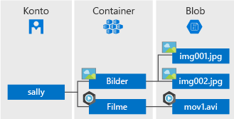

# <a name="introduction-to-azure-blob-storage"></a>Einführung in Azure Blob Storage

[!INCLUDE [storage-blob-concepts-include](../../../includes/storage-blob-concepts-include.md)]

## <a name="blob-storage-resources"></a>Blob Storage-Ressourcen

Blob Storage bietet drei Typen von Ressourcen:

- Das **Speicherkonto** 
- Einen **Container** im Speicherkonto
- Einen **Blob** in einem Container 

Im folgenden Diagramm ist die Beziehung zwischen diesen Ressourcen dargestellt.



### <a name="storage-accounts"></a>Speicherkonten

Ein Speicherkonto bietet einen eindeutigen Namespace für Ihre Daten in Azure. Jedes Objekt, das Sie in Azure speichern, besitzt eine Adresse, die den eindeutigen Namen Ihres Speicherkontos enthält. Die Kombination aus Kontoname und Azure Storage-Blobendpunkt bildet die Basisadresse für die Objekte in Ihrem Speicherkonto.

Wenn Ihr Speicherkonto beispielsweise *meinspeicherkonto* heißt, lautet der Standardendpunkt für Blob Storage wie folgt:

```
http://mystorageaccount.blob.core.windows.net 
```

Informationen zum Erstellen eines Speicherkontos finden Sie unter [Erstellen Sie ein Speicherkonto](../common/storage-quickstart-create-account.md). Weitere Informationen zu Speicherkonten finden Sie in der [Übersicht über Azure Storage-Konten](../common/storage-account-overview.md?toc=%2fazure%2fstorage%2fblobs%2ftoc.json).

### <a name="containers"></a>Container

Ein Container dient zum Organisieren einer Gruppe von Blobs (ähnlich wie ein Verzeichnis in einem Dateisystem). Ein Speicherkonto kann eine unbegrenzte Anzahl von Containern enthalten, und in einem Container kann eine unbegrenzte Anzahl von Blobs gespeichert werden. 

  > [!NOTE]
  > Der Containername darf ausschließlich Kleinbuchstaben enthalten. Weitere Informationen zur Benennung von Containern finden Sie unter [Naming and Referencing Containers, Blobs, and Metadata](https://docs.microsoft.com/rest/api/storageservices/Naming-and-Referencing-Containers--Blobs--and-Metadata) (Benennen und Referenzieren von Containern, Blobs und Metadaten).

### <a name="blobs"></a>Blobs (in englischer Sprache)
 
Azure Storage unterstützt drei Arten von Blobs:

* In **Blockblobs** werden Text- und Binärdaten bis zu einer Größe von ca. 4,7 TB gespeichert. Blockblobs bestehen aus Datenblöcken, die einzeln verwaltet werden können.
* **Anfügeblobs** bestehen wie Blockblobs aus Blöcken, sind aber für Anfügevorgänge optimiert. Anfügeblobs sind beispielsweise ideal für Szenarien, bei denen es um das Protokollieren von Daten virtueller Computer geht.
* In **Seitenblobs** werden Random-Access-Dateien mit einer Größe von bis zu 8 TB gespeichert. Seitenblobs speichern die VHD-Dateien (Virtual Hard Drive, virtuelle Festplatte), die als Datenträger für Azure-VMs fungieren. Weitere Informationen zu Seitenblobs finden Sie in der [Übersicht über Azure-Seitenblobs](storage-blob-pageblob-overview.md).

Weitere Informationen zu den verschiedenen Blobtypen finden Sie unter [Understanding Block Blobs, Append Blobs, and Page Blobs](https://docs.microsoft.com/rest/api/storageservices/understanding-block-blobs--append-blobs--and-page-blobs) (Grundlegendes zu Block-, Anfüge- und Seitenblobs).

## <a name="move-data-to-blob-storage"></a>Verschieben von Daten in Blob Storage

Für die Migration vorhandener Daten zu Blob Storage sind zahlreiche Lösungen verfügbar:

- **AzCopy** ist ein benutzerfreundliches Befehlszeilentool für Windows und Linux, das Daten zwischen Containern oder Speicherkonten nach und aus Blob Storage kopiert. Weitere Informationen zu AzCopy finden Sie unter [Übertragen von Daten mit AzCopy v10 (Vorschauversion)](../common/storage-use-azcopy-v10.md). 
- Die **Azure Storage-Datenverschiebungsbibliothek** ist eine .NET-Bibliothek für das Verschieben von Daten zwischen Azure Storage-Diensten. Das AzCopy-Hilfsprogramm wird mit der Datenverschiebungsbibliothek erstellt. Weitere Informationen finden Sie in der [Referenzdokumentation](/dotnet/api/microsoft.azure.storage.datamovement) für die Datenverschiebungsbibliothek. 
- **Azure Data Factory** unterstützt das Kopieren von Daten nach und aus Blob Storage mithilfe des Kontoschlüssels, der Shared Access Signature (SAS), des Dienstprinzipals oder verwalteter Identitäten für Azure-Ressourcenauthentifizierungen. Weitere Informationen finden Sie unter [Kopieren von Daten nach oder aus Azure Blob Storage mit Azure Data Factory](https://docs.microsoft.com/azure/data-factory/connector-azure-blob-storage?toc=%2fazure%2fstorage%2fblobs%2ftoc.json). 
- **blobfuse** ist ein virtueller Dateisystemtreiber für Azure Blob Storage. Sie können blobfuse verwenden, um über das Linux-Dateisystem auf die vorhandenen Blockblobdaten in Ihrem Speicherkonto zuzugreifen. Weitere Informationen finden Sie unter [Einbinden von Blob Storage als Dateisystem mit blobfuse](storage-how-to-mount-container-linux.md).
- **Azure Data Box Disk** ist ein Dienst zur Übertragung von lokalen Daten in Blob Storage, wenn der Upload von Daten über das Netzwerk aufgrund großer Datasets oder von Netzwerkeinschränkungen unrealistisch ist. Sie können [Azure Data Box Disk](../../databox/data-box-disk-overview.md) nutzen, um SSDs (Solid-State Disks) von Microsoft anzufordern. Anschließend können Sie Ihre Daten auf diese Datenträger kopieren und zurück an Microsoft senden, damit sie in den Blobspeicher hochgeladen werden können.
- Der **Azure Import/Export-Dienst** ist eine Möglichkeit, um große Datenmengen aus Ihrem Speicherkonto auf von Ihnen bereitgestellte Festplatten zu exportieren, die dann mit Ihren Daten von Microsoft an Sie zurückgesendet werden. Weitere Informationen finden Sie unter [Verwenden des Microsoft Azure Import/Export-Diensts zum Übertragen von Daten in Blob Storage](../common/storage-import-export-service.md).

## <a name="next-steps"></a>Nächste Schritte

* [Erstellen eines Speicherkontos](../common/storage-create-storage-account.md?toc=%2fazure%2fstorage%2fblobs%2ftoc.json)
* [Skalierbarkeits- und Leistungsziele für Azure-Speicher](../common/storage-scalability-targets.md)
