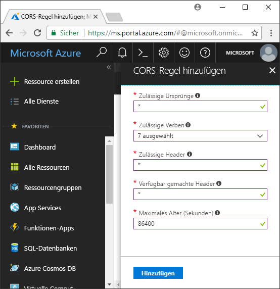

<!-- Customer intent: As a web application developer I want to interface with Azure Blob storage entirely on the client so that I can build a SPA application that is able to upload and delete files on blob storage. -->

# <a name="quickstart-upload-list-and-delete-blobs-with-azure-storage-using-javascripthtml-in-the-browser"></a>Schnellstart: Hochladen, Auflisten und Löschen von Blobs mit Azure Storage unter Verwendung von JavaScript/HTML im Browser
Diese Schnellstartanleitung zeigt die Verwaltung von Blobs über vollständig im Browser ausgeführten Code sowie die erforderlichen Sicherheitsmaßnahmen zum Schutz des Zugriffs auf Ihr Blob Storage-Konto. Für diese Schnellstartanleitung benötigen Sie ein [Azure-Abonnement](https://azure.microsoft.com/free/?WT.mc_id=A261C142F).

[!INCLUDE [storage-quickstart-tutorial-create-account-portal](../../../includes/storage-quickstart-tutorial-create-account-portal.md)]

### <a name="copy-security-settings"></a>Kopieren von Sicherheitseinstellungen
Im Rahmen dieser Schnellstartanleitung benötigen Sie einige sicherheitsspezifische Werte zur Erstellung eines Sicherheitstokens. Diese Werte können Sie zur späteren Verwendung aus dem Portal in einen Text-Editor kopieren. 

Wählen Sie im Portal das Speicherkonto aus, und navigieren Sie zum Abschnitt **Einstellungen**. Klicken Sie in den Einstellungen auf **Zugriffsschlüssel**, und kopieren Sie den Wert für **Speicherkontoname** sowie den **Schlüssel** unter der Überschrift **key1**. (Sie können die Schaltfläche „Kopieren“ rechts neben dem Eingabefeld verwenden, um den Wert in die Zwischenablage zu kopieren.)

## <a name="setting-up-storage-account-cors-rules"></a>Einrichten von CORS-Regeln für das Speicherkonto 
Damit Ihre Webanwendung auf einen Blob-Speicher aus dem Client zugreifen kann, muss für das Konto [Cross-Origin Resource Sharing (CORS)](https://docs.microsoft.com/rest/api/storageservices/cross-origin-resource-sharing--cors--support-for-the-azure-storage-services) aktiviert werden. 

Kehren Sie zum Azure-Portal zurück, und wählen Sie Ihr Speicherkonto aus. Navigieren Sie zum Definieren einer neuen CORS-Regel wieder zum Abschnitt **Einstellungen**, und klicken Sie auf den Link **CORS**. Klicken Sie anschließend auf die Schaltfläche **Hinzufügen**, um das Fenster **CORS-Regel hinzufügen** zu öffnen. Im Rahmen dieser Schnellstartanleitung erstellen Sie eine offene CORS-Regel:



In der folgenden Tabelle werden die einzelnen CORS-Einstellungen beschrieben und die Definitionswerte der Regel erläutert:

|Einstellung  |Wert  | Beschreibung |
|---------|---------|---------|
| Zulässige Ursprünge | * | Akzeptiert eine kommagetrennte Liste mit Domänen, die als zulässige Ursprünge festgelegt werden. Wenn Sie den Wert auf `*` festlegen, wird allen Domänen Zugriff auf das Speicherkonto gewährt. |
| Zulässige Verben     | „delete“, „get“, „head“, „merge“, „post“, „options“ und „put“ | Listet die zulässigen HTTP-Verben für das Speicherkonto auf. Wählen Sie für diese Schnellstartanleitung alle verfügbaren Optionen aus. |
| Zulässige Header | * | Definiert eine Liste mit Anforderungsheadern (einschließlich Header mit Präfix), die vom Speicherkonto zugelassen werden. Wenn Sie den Wert auf `*` festlegen, wird allen Headern Zugriff gewährt. |
| Verfügbar gemachte Header | * | Listet die zulässigen Antwortheader für das Konto auf. Wenn Sie den Wert auf `*` festlegen, kann das Konto einen beliebigen Header senden.  |
| Maximales Alter (Sekunden) | 86.400 | Die maximale Zeit, für die der Browser die OPTIONS-Preflight-Anforderung zwischenspeichert. Bei Verwendung des Werts *86.400* bleibt der Cache einen ganzen Tag erhalten. |

> [!IMPORTANT]
> Achten Sie in einer Produktionsumgebung darauf, dass alle verwendeten Einstellungen jeweils nur ein Mindestmaß an Zugriff auf Ihr Speicherkonto gewähren, um einen sicheren Zugriff zu gewährleisten. Die hier beschriebenen CORS-Einstellungen definieren eine gemäßigte Sicherheitsrichtlinie und sind für eine Schnellstartanleitung angemessen. Sie sollten allerdings nicht in der Praxis verwendet werden.

Erstellen Sie als Nächstes mithilfe von Azure Cloud Shell ein Sicherheitstoken.

[!INCLUDE [Open the Azure cloud shell](../../../includes/cloud-shell-try-it.md)]

## <a name="create-a-shared-access-signature"></a>Erstellen einer SAS (Shared Access Signature)
Die SAS (Shared Access Signature) wird von dem im Browser ausgeführten Code verwendet, um Anforderungen an den Blob-Speicher zu authentifizieren. Mithilfe der SAS kann sich der Client authentifizieren, ohne über den Kontozugriffsschlüssel oder die Verbindungszeichenfolge zu verfügen. Weitere Informationen zur SAS finden Sie unter [Verwenden von Shared Access Signatures (SAS)](../common/storage-dotnet-shared-access-signature-part-1.md).

Sie können eine SAS mithilfe der Azure-Befehlszeilenschnittstelle über Azure Cloud Shell erstellen. In der folgenden Tabelle werden die Parameter beschrieben, für die Sie Werte angeben müssen, um eine SAS zu generieren:

| Parameter      |Beschreibung  | Platzhalter |
|----------------|-------------|-------------|
| *expiry*       | Das Ablaufdatum des Zugriffstokens im Format JJJJ-MM-TT. Geben Sie im Rahmen dieser Schnellstartanleitung das morgige Datum ein. | *FUTURE_DATE* |
| *account-name* | Der Name des Speicherkontos. Verwenden Sie den Namen, den Sie sich in einem früheren Schritt notiert haben. | *YOUR_STORAGE_ACCOUNT_NAME* |
| *account-key*  | Der Speicherkontoschlüssel. Verwenden Sie den Schlüssel, den Sie sich in einem früheren Schritt notiert haben. | *YOUR_STORAGE_ACCOUNT_KEY* |

Im folgenden Skript wurde unter Verwendung der Azure-Befehlszeilenschnittstelle eine SAS erstellt, die Sie an einen JavaScript-Blob-Dienst übergeben können.

> [!NOTE]
> Entfernen Sie die zusätzlichen Leerzeichen zwischen Parametern, bevor Sie den Befehl in Azure Cloud Shell einfügen, um optimale Ergebnisse zu erzielen.

```bash
az storage account generate-sas
                    --permissions racwdl
                    --resource-types sco
                    --services b
                    --expiry FUTURE_DATE
                    --account-name YOUR_STORAGE_ACCOUNT_NAME
                    --account-key YOUR_STORAGE_ACCOUNT_KEY
```
Die Reihe von Werten nach den einzelnen Parametern erscheint unter Umständen etwas kryptisch. Diese Parameterwerte setzen sich aus den Anfangsbuchstaben der jeweiligen Berechtigung zusammen. Die Herkunft der Werte wird in der folgenden Tabelle erläutert: 

| Parameter        | Wert   | Beschreibung  |
|------------------|---------|---------|
| *permissions*    | racwdl  | Diese SAS umfasst Folgendes: *read* (Lesen), *append* (Anfügen), *create* (Erstellen), *write* (Schreiben), *delete* (Löschen) und *list* (Auflisten). |
| *resource-types* | sco     | Die SAS gilt für folgende Ressourcen: *service* (Dienst), *container* (Container) und *object* (Objekt). |
| *services*       | b       | Die SAS gilt für den *Blob-Dienst*. |

Kopieren Sie nach der Generierung der SAS den zurückgegebenen Wert aus der Konsole in einen Text-Editor. Dieser Wert wird in einem späteren Schritt benötigt.

> [!IMPORTANT]
> Übergeben Sie SAS-Token in einer Produktionsumgebung immer unter Verwendung von SSL. SAS-Token sollten für die Rückgabe an Azure Blob Storage außerdem auf dem Server generiert und an die HTML-Seite gesendet werden. Eine Möglichkeit besteht darin, SAS-Funktionen mit einer serverlosen Funktion zu generieren. Im Azure Portal stehen Funktionsvorlagen zur Verfügung, die die Generierung einer SAS mit einer JavaScript-Funktion ermöglichen.

## <a name="implement-the-html-page"></a>Implementieren der HTML-Seite

### <a name="set-up-the-web-application"></a>Einrichten der Webanwendung
Die Azure Storage-JavaScript-Clientbibliotheken können nicht direkt über das Dateisystem verwendet werden und müssen von einem Webserver bereitgestellt werden. Daher erfahren Sie in den nächsten Schritten, wie Sie einen einfachen lokalen Webserver mit Node.js verwenden.

> [!NOTE]
> In diesem Abschnitt wird gezeigt, wie Sie einen lokalen Webserver erstellen. Hierzu muss Node.js auf Ihrem Computer installiert werden. Falls Sie Node.js nicht installieren möchten, können Sie auch eine andere Methode zum Ausführen eines lokalen Webservers verwenden.

Erstellen Sie zunächst einen neuen Ordner für Ihr Projekt, und nennen sie ihn *azure-blobs-javascript*. Öffnen Sie als Nächstes im Ordner *azure-blobs-Javascript* eine Eingabeaufforderung, und geben Sie den folgenden Befehl ein, um die Anwendung für die Installation des Webservermoduls vorzubereiten:

```bash
npm init -y
```
Durch Ausführen von *init* werden Dateien hinzugefügt, die zum Installieren eines Webservermoduls benötigt werden. Geben Sie den folgenden Befehl ein, um das Modul zu installieren:

```bash
npm i http-server
```
Bearbeiten Sie als Nächstes die Datei *package.json*, und ersetzen Sie die vorhandene Definition für *scripts* durch den folgenden Codeausschnitt:

```javascript
"scripts": {
    "start": "http-server"
}
```
Geben Sie abschließend an der Eingabeaufforderung `npm start` ein, um den Webserver zu starten:

```bash
npm start
```

### <a name="get-the-blob-storage-client-scripts"></a>Abrufen der Clientskripts für Blob-Speicher
[Laden Sie die JavaScript-Clientbibliotheken herunter](https://aka.ms/downloadazurestoragejs), extrahieren Sie den Inhalt der ZIP-Datei, und platzieren Sie die Skriptdateien aus dem Ordner *bundle* in einem Ordner namens *scripts*.

### <a name="add-the-client-script-reference-to-the-page"></a>Hinzufügen des Clientskriptverweises zur Seite
Erstellen Sie am Stamm des Ordners *azure-blobs-javascript* eine HTML-Seite, und nennen Sie sie *index.html*. Fügen Sie der erstellten Seite das folgende Markup hinzu:

```html
<!DOCTYPE html>
<html>
    <body>
        <button id="create-button">Create Container</button>

        <input type="file" id="fileinput" />
        <button id="upload-button">Upload</button>

        <button id="list-button">List</button>
        
        <button id="delete-button">Delete</button>
    </body>
    <script src="scripts/azure-storage.blob.min.js"></script>
    <script>
        // Blob-related code goes here
    </script>
</html>
```
Durch dieses Markup wird der Seite Folgendes hinzugefügt:

- Ein Verweis auf *scripts/azure-storage.blob.js*
- Schaltflächen zum Erstellen eines Containers sowie zum Hochladen, Auflisten und Löschen von Blobs
- Ein *INPUT*-Element zum Hochladen einer Datei
- Ein Platzhalter für speicherspezifischen Code

### <a name="create-a-blob-service"></a>Erstellen eines Blob-Diensts 
[BlobService](https://azure.github.io/azure-storage-node/BlobService.html) stellt eine Schnittstelle für Azure Blob Storage bereit. Bei der Erstellung einer Instanz des Diensts müssen Sie den Speicherkontonamen und die SAS angeben, die Sie in einem vorherigen Schritt generiert haben.

```javascript
const account = {
    name: YOUR_STORAGE_ACCOUNT_NAME,
    sas:  YOUR_SAS
};

const blobUri = 'https://' + account.name + '.blob.core.windows.net';
const blobService = AzureStorage.Blob.createBlobServiceWithSas(blobUri, account.sas);
```

### <a name="create-a-blob-container"></a>Erstellen eines Blobcontainers
Nach der Erstellung des Blob-Diensts können Sie einen neuen Container zum Speichern eines hochgeladenen Blobs erstellen. Die Methode [createContainerIfNotExists](https://azure.github.io/azure-storage-node/BlobService.html#createContainerIfNotExists__anchor) erstellt einen neuen Container und gibt keinen Fehler zurück, wenn der Container bereits vorhanden ist.

```javascript
document.getElementById('create-button').addEventListener('click', () => {

    blobService.createContainerIfNotExists('mycontainer',  (error, container) => {
        if (error) {
            // Handle create container error
        } else {
            console.log(container.name);
        }
    });

});
```

### <a name="upload-a-blob"></a>Hochladen eines Blobs
Wenn Sie ein Blob aus einem HTML-Formular hochladen möchten, rufen Sie zunächst einen Verweis auf die ausgewählte Datei ab. Verwenden Sie hierzu das `files`-Array eines *INPUT*-Elements, für das *type* auf *file* festgelegt ist.

Über das Skript können Sie auf das HTML-Element verweisen und die ausgewählte Datei an den Blob-Dienst übergeben.

```javascript
document.getElementById('upload-button').addEventListener('click', () => {

    const file = document.getElementById('fileinput').files[0];

    blobService.createBlockBlobFromBrowserFile('mycontainer', 
                                                file.name, 
                                                file, 
                                                (error, result) => {
                                                    if(error) {
                                                        // Handle blob error
                                                    } else {
                                                        console.log('Upload is successful');
                                                    }
                                                });

});
```

Die Methode [createBlockBlobFromBrowserFile](https://azure.github.io/azure-storage-node/BlobService.html#createBlockBlobFromBrowserFile__anchor) verwendet die Browserdatei direkt für den Upload in einen Blob-Container.

### <a name="list-blobs"></a>Auflisten von Blobs
Nachdem Sie eine Datei in den Blob-Container hochgeladen haben, können Sie mithilfe der Methode [listBlobsSegmented](https://azure.github.io/azure-storage-node/BlobService.html#listBlobsSegmented__anchor) eine Liste mit den im Container enthaltenen Blobs abrufen.

```javascript
document.getElementById('list-button').addEventListener('click', () => {

    blobService.listBlobsSegmented('mycontainer', null, (error, results) => {
        if (error) {
            // Handle list blobs error
        } else {
            results.entries.forEach(blob => {
                console.log(blob.name);
            });
        }
    });
    
});
```

### <a name="delete-blobs"></a>Löschen von Blobs
Durch Aufrufen von [deleteBlobIfExists](https://azure.github.io/azure-storage-node/BlobService.html#deleteBlobIfExists__anchor) können Sie das hochgeladene Blob löschen.

```javascript
document.getElementById('delete-button').addEventListener('click', () => {

    var blobName = YOUR_BLOB_NAME;
    blobService.deleteBlobIfExists('mycontainer', blobName, (error, result) => {
        if (error) {
            // Handle delete blob error
        } else {
            console.log('Blob deleted successfully');
        }
    });
    
});
```
> [!WARNING]
> Damit dieses Codebeispiel funktioniert, müssen Sie einen Zeichenfolgenwert für *blobName* angeben.

## <a name="clean-up-resources"></a>Bereinigen von Ressourcen
Kehren Sie zum Bereinigen der Ressourcen, die im Rahmen dieser Schnellstartanleitung erstellt wurden, zum [Azure-Portal](https://portal.azure.com) zurück, und wählen Sie Ihr Speicherkonto aus. Klicken Sie zum Löschen des ausgewählten Speicherkontos auf **Übersicht > Speicherkonto löschen**.

## <a name="next-steps"></a>Nächste Schritte
Machen Sie sich anhand der Beispiele mit dem Herunterladen von Blobs und dem Melden des Fortschritts von Dateiuploads vertraut.

> [!div class="nextstepaction"]
> [Clientbibliotheken für Blob-Speicher](https://github.com/Azure/azure-storage-node/tree/master/browser)
