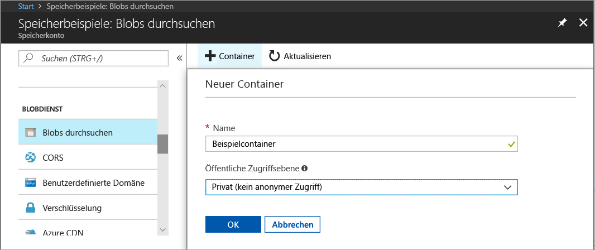
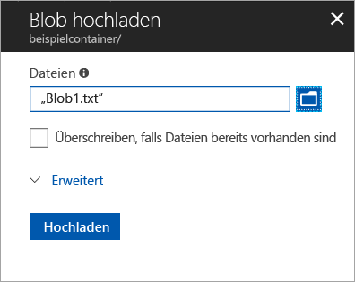
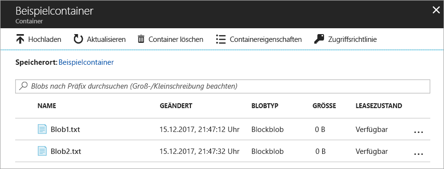
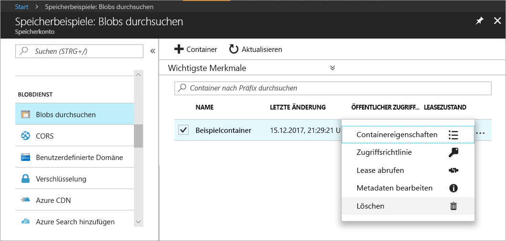

# Übertragen von Objekten nach/aus Azure Blob Storage über das Azure-Portal

In dieser Schnellstartanleitung erfahren Sie, wie Sie über das [Azure-Portal](https://portal.azure.com/) einen Container in Azure Storage erstellen und Blockblobs in diesen Container hochladen bzw. daraus herunterladen.

## Voraussetzungen

Wenn Sie kein Azure-Abonnement besitzen, können Sie ein [kostenloses Konto](https://azure.microsoft.com/free/?WT.mc_id=A261C142F) erstellen, bevor Sie beginnen.

[!INCLUDE [storage-quickstart-tutorial-create-account-portal](../../../includes/storage-quickstart-tutorial-create-account-portal.md)]

## Erstellen eines Containers

Führen Sie die folgenden Schritte aus, um einen Container über das Azure-Portal zu erstellen:

1. Navigieren Sie im Azure-Portal zu Ihrem neuen Speicherkonto.
2. Scrollen Sie im linken Menü für das Speicherkonto zum Abschnitt **Blob-Dienst**, und klicken Sie auf **Blobs durchsuchen**.
3. Klicken Sie auf die Schaltfläche **Container hinzufügen**.
4. Geben Sie einen Namen für den neuen Container ein. Der Containername muss klein geschrieben werden, mit einem Buchstaben oder einer Zahl beginnen und darf nur Buchstaben, Zahlen und Bindestriche (-) enthalten. Weitere Informationen zu Container- und Blobnamen finden Sie unter [Benennen von Containern, Blobs und Metadaten und Verweisen auf diese](https://docs.microsoft.com/rest/api/storageservices/naming-and-referencing-containers--blobs--and-metadata).
5. Legen Sie die öffentliche Zugriffsebene für den Container fest. Die Standardebene ist **Private (no anonymous access)** (Privat (kein anonymer Zugriff)).
6. Klicken Sie auf **OK** aus, um den Container zu erstellen.

    

## Hochladen eines Blockblobs

Blockblobs bestehen aus Datenblöcken, die zusammen ein Blob bilden. In den meisten Blob Storage-Szenarien werden Blockblobs verwendet. Blockblobs eignen sich perfekt zum Speichern von Text und Binärdaten in der Cloud. Hierzu zählen beispielsweise Dateien, Bilder und Videos. In dieser Schnellstartanleitung erfahren Sie, wie Sie Blockblobs verwenden. 

Gehen Sie wie folgt vor, um über das Azure-Portal ein Blockblob in Ihren neuen Container hochzuladen:

1. Navigieren Sie im Azure-Portal zu dem Container, den Sie im vorherigen Abschnitt erstellt haben.
2. Wählen Sie den Container aus, um eine Liste mit den darin enthaltenen Blobs anzuzeigen. Da es sich in diesem Fall um einen neu erstellten Container handelt, sind darin keine Blobs enthalten.
3. Klicken Sie auf die Schaltfläche **Hochladen**, um ein Blob in den Container hochzuladen.
4. Navigieren Sie in Ihrem lokalen Dateisystem zu einer Datei, die Sie als Blockblob hochladen möchten, und klicken Sie auf **Hochladen**.
     
    

5. Laden Sie auf diese Weise beliebig viele Blobs hoch. Wie Sie sehen, werden die neuen Blobs nun innerhalb des Containers aufgeführt.

    

## Herunterladen eines Blockblobs

Sie können ein Blockblob herunterladen, um es im Browser anzuzeigen oder in Ihrem lokalen Dateisystem zu speichern. Gehen Sie zum Herunterladen eines Blockblobs wie folgt vor:

1. Navigieren Sie zu der Liste mit den Blobs, die Sie im vorherigen Abschnitt hochgeladen haben. 
2. Wählen Sie das Blob aus, das Sie herunterladen möchten.
3. Klicken Sie mit der rechten Maustaste auf die Schaltfläche **Mehr** (**...**), und klicken Sie auf **Herunterladen**. 

## Bereinigen von Ressourcen

Wenn Sie die Ressourcen entfernen möchten, die Sie im Rahmen dieser Schnellstartanleitung erstellt haben, löschen Sie einfach den Container. Die Blobs im Container werden ebenfalls gelöscht.

So löschen Sie den Container:

1. Navigieren Sie im Azure-Portal zu der Liste mit den Containern in Ihrem Speicherkonto.
2. Wählen Sie den zu löschenden Container aus.
3. Klicken Sie mit der rechten Maustaste auf die Schaltfläche **Mehr** (**...**), und klicken Sie auf **Löschen**.
4. Bestätigen Sie, dass Sie den Container löschen möchten.

       

## Nächste Schritte

In diesem Schnellstart haben Sie gelernt, wie Sie mit .NET Dateien zwischen einem lokalen Datenträger und Azure Blob Storage übertragen. Weitere Informationen zum Arbeiten mit Blob Storage finden Sie in der exemplarischen Vorgehensweise zu Blob Storage.

> [!div class="nextstepaction"]
> [Gewusst wie: Blob Storage-Vorgänge](storage-dotnet-how-to-use-blobs.md)

