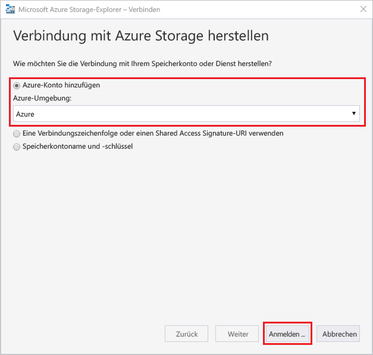
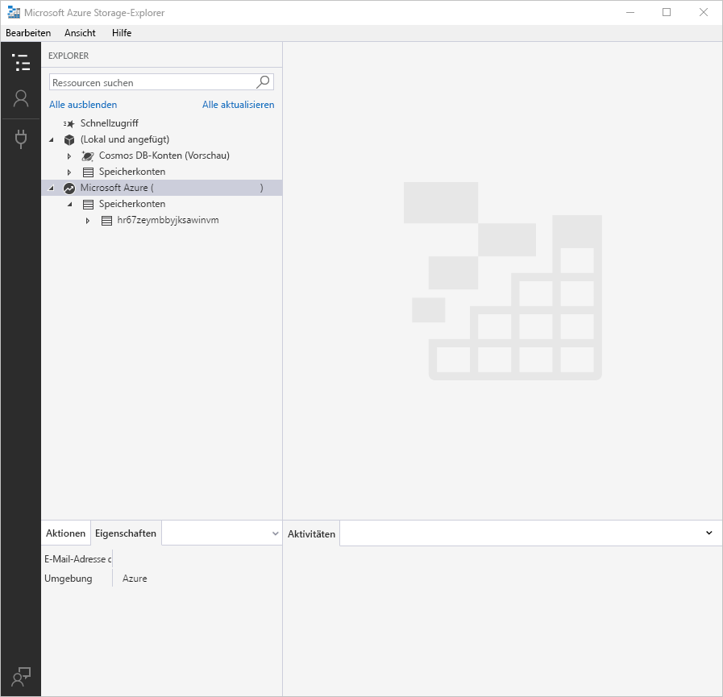
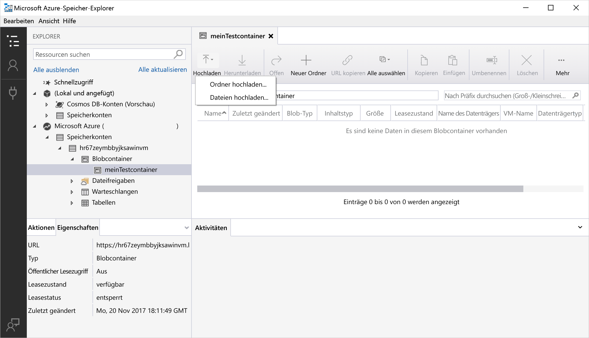
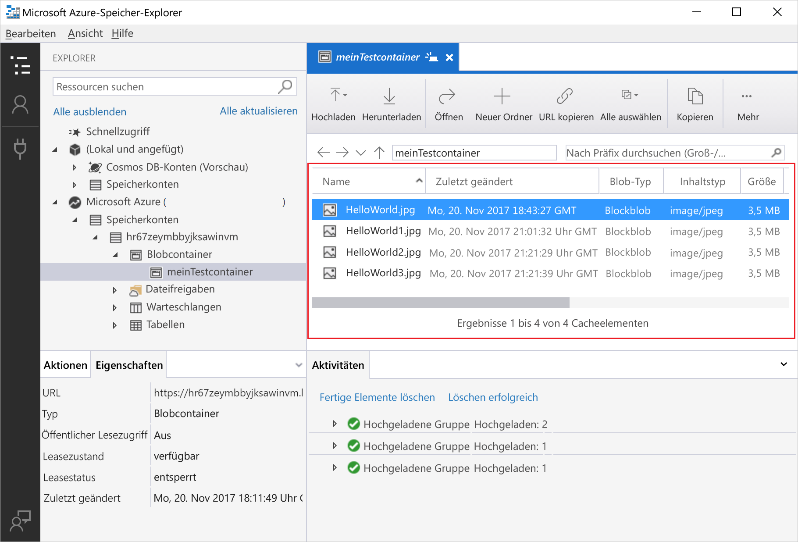
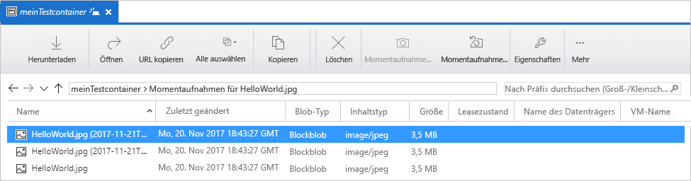
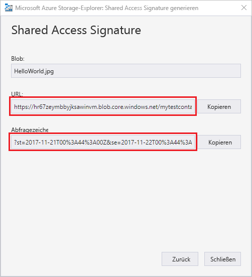

# Schnellstart: Verwenden von Azure Storage-Explorer zum Erstellen eines Blobs im Objektspeicher

In diesem Schnellstart erfahren Sie, wie Sie [Azure Storage-Explorer](https://azure.microsoft.com/features/storage-explorer/) verwenden, um einen Container und ein Blob zu erstellen. Als Nächstes erfahren Sie, wie Sie den Blob auf Ihren lokalen Computer herunterladen, und wie Sie alle Blobs in einem Container anzeigen. Außerdem erfahren Sie, wie Sie eine Momentaufnahme eines Blobs erstellen, Zugriffsrichtlinien für Container verwalten und eine SAS (Shared Access Signature) erstellen.

## Voraussetzungen

Wenn Sie kein Azure-Abonnement besitzen, können Sie ein [kostenloses Konto](https://azure.microsoft.com/free/?WT.mc_id=A261C142F) erstellen, bevor Sie beginnen.

Diese Schnellstartanleitung setzt voraus, dass Sie Azure Storage-Explorer installiert haben. Informationen zum Installieren von Azure Storage-Explorer für Windows, Macintosh oder Linux finden Sie unter [Azure Storage-Explorer](https://azure.microsoft.com/features/storage-explorer/).

[!INCLUDE [storage-create-account-portal-include](../../../includes/storage-create-account-portal-include.md)]

## Anmelden an Storage-Explorer

Nach dem ersten Start wird das Fenster **Microsoft Azure Storage-Explorer – Verbinden** angezeigt. Es gibt verschiedene Möglichkeiten, wie Sie den Storage-Explorer mit Speicherkonten verbinden können. Die folgende Tabelle enthält die verschiedenen Verbindungsmöglichkeiten:

|Aufgabe|Zweck|
|---|---|
|Hinzufügen eines Azure-Kontos | Führt die Umleitung auf die Anmeldeseite Ihrer Organisation durch, um Sie für Azure zu authentifizieren. |
|Verwenden einer Verbindungszeichenfolge oder eines Shared Access Signature-URI | Kann verwendet werden, um mit einem SAS-Token oder einer freigegebenen Verbindungszeichenfolge direkt auf einen Container oder ein Speicherkonto zuzugreifen. |
|Verwenden eines Speicherkontonamens und -schlüssels| Verwenden Sie den Speicherkontonamen und -schlüssel Ihres Speicherkontos, um eine Verbindung mit Azure Storage herzustellen.|

Wählen Sie **Azure-Konto hinzufügen**, und klicken Sie auf **Anmelden...**. Befolgen Sie die Anweisungen auf dem Bildschirm, um sich an Ihrem Azure-Konto anzumelden.

Nach Abschluss des Verbindungsvorgangs wird Azure Storage-Explorer geladen, und die Registerkarte **Explorer** wird angezeigt. So erhalten Sie einen Einblick in Ihre gesamten Azure Storage-Konten und in den lokalen Speicher, der über den [Azure-Speicheremulator](../common/storage-use-emulator.md?toc=%2fazure%2fstorage%2fblobs%2ftoc.json), [Cosmos DB](../../cosmos-db/storage-explorer.md?toc=%2fazure%2fstorage%2fblobs%2ftoc.json)-Konten oder [Azure Stack](../../azure-stack/user/azure-stack-storage-connect-se.md?toc=%2fazure%2fstorage%2fblobs%2ftoc.json)-Umgebungen konfiguriert wurde.

## Erstellen eines Containers

Blobs werden immer in einen Container hochgeladen. So können Sie Gruppen von Blobs wie Dateien in Ordnern auf Ihrem Computer organisieren.

Erweitern Sie das Speicherkonto, das Sie im vorherigen Schritt erstellt haben, um einen Container zu erstellen. Wählen Sie **BLOB-Container**, klicken Sie mit der rechten Maustaste, und wählen Sie **BLOB-Container erstellen**. Geben Sie den Namen für den Blobcontainer ein. Eine Liste mit den Regeln und Einschränkungen für die Benennung von Blobcontainern finden Sie im Abschnitt [Erstellen des Containers und Festlegen von Berechtigungen](storage-quickstart-blobs-dotnet.md#create-the-container-and-set-permissions). Drücken Sie nach Abschluss des Vorgangs die **EINGABETASTE**, um den Blobcontainer zu erstellen. Nach der erfolgreichen Erstellung des Blobcontainers wird er im Ordner **BLOB-Container** für das ausgewählte Speicherkonto angezeigt.

## Hochladen von Blobs in den Container

Blobspeicher unterstützt Block-, Anfüge- und Seitenblobs. Seitenblobs sind VHD-Dateien, mit denen IaaS-VMs gesichert werden. Anfügeblobs dienen der Protokollierung und können z.B. verwendet werden, um beim Schreiben in eine Datei zusätzliche Daten hinzuzufügen. Die meisten Dateien, die im Blob Storage gespeichert werden, sind allerdings Blockblobs.

Wählen Sie im Menüband des Containers die Option **Hochladen**. Bei diesem Vorgang besteht die Option, einen Ordner oder eine Datei hochzuladen.

Wählen Sie die Dateien oder den Ordner für den Upload aus. Wählen Sie den **BLOB-Typ** aus. Zulässige Optionen sind **Anfüge**-, **Seiten**- oder **Blockblobs**.

Wählen Sie **VHD-/VHDX-Dateien als Seitenblobs hochladen (empfohlen)**, falls Sie eine VHD- oder VHDX-Datei hochladen.

Geben Sie im Feld **In Ordner hochladen (optional)** den Namen eines Ordners ein, in dem die Dateien oder Ordner unter dem Container gespeichert werden sollen. Wenn kein Ordner ausgewählt ist, werden die Dateien in den Ordner auf der Ebene direkt unterhalb des Containers hochgeladen.

Wenn Sie **OK** wählen, werden die ausgewählten Dateien in die Warteschlange für den Upload eingereiht, und jede Datei wird hochgeladen. Nach Abschluss des Uploads werden die Ergebnisse im Fenster **Aktivitäten** angezeigt.

## Anzeigen von Blobs in einem Container

Wählen Sie in der Anwendung **Azure Storage-Explorer** einen Container unter einem Speicherkonto aus. Im Hauptbereich wird eine Liste mit den Blobs des ausgewählten Containers angezeigt.

## Herunterladen von Blobs

Wählen Sie im Menüband bei ausgewähltem Blob die Option **Herunterladen**, um mit dem **Azure Storage-Explorer** Blobs herunterzuladen. Ein Dialogfeld für Dateien wird geöffnet, und Sie können einen Dateinamen eingeben. Wählen Sie **Speichern**, um mit dem Herunterladen eines Blobs an den lokalen Speicherort zu beginnen.

## Verwalten von Momentaufnahmen

Azure Storage-Explorer bietet die Möglichkeit zum Erstellen und Verwalten von [Momentaufnahmen](storage-blob-snapshots.md) für Ihre Blobs. Klicken Sie zum Erstellen einer Momentaufnahme eines Blobs mit der rechten Maustaste auf das Blob, und wählen Sie **Momentaufnahme erstellen** aus. Klicken Sie zum Anzeigen von Momentaufnahmen für ein Blob mit der rechten Maustaste auf das Blob, und wählen Sie **Manage Snapshots** (Momentaufnahmen verwalten). Auf der aktuellen Registerkarte wird eine Liste mit den Momentaufnahmen des Blobs angezeigt.

## Verwalten von Zugriffsrichtlinien

Mit Storage-Explorer können Sie die Zugriffsrichtlinien für Container über die dazugehörige Benutzeroberfläche verwalten. Es gibt zwei Arten von sicheren Zugriffsrichtlinien (SAS): auf Dienstebene und auf Kontoebene. Eine SAS auf Kontoebene ist für das Speicherkonto ausgelegt und kann für mehrere Dienste und Ressourcen gelten. Eine SAS auf Dienstebene wird auf einer Ressource unter einem bestimmten Dienst definiert. Klicken Sie zum Generieren einer SAS auf Dienstebene mit der rechten Maustaste auf einen beliebigen Container, und wählen Sie **Manage Access Policies...** (Zugriffsrichtlinien verwalten...). Klicken Sie zum Generieren einer SAS auf Kontoebene mit der rechten Maustaste auf das Speicherkonto.

Wählen Sie **Hinzufügen**, um eine neue Zugriffsrichtlinie hinzuzufügen, und definieren Sie die Berechtigungen für die Richtlinie. Wählen Sie nach Abschluss des Vorgangs die Option **Speichern**, um die Zugriffsrichtlinie zu speichern. Diese Richtlinie kann nun beim Konfigurieren einer Shared Access Signature verwendet werden.

## Arbeiten mit Shared Access Signatures

Shared Access Signatures (SAS) können über den Storage-Explorer abgerufen werden. Klicken Sie mit der rechten Maustaste auf ein Speicherkonto, einen Container oder ein Blob, und wählen Sie die Option **Get Shared Access Signature...** (Shared Access Signature abrufen...). Wählen Sie die Start- und Ablaufzeit und die Berechtigungen für die SAS-URL aus, und klicken Sie auf **Erstellen**. Die vollständige URL mit der Abfragezeichenfolge sowie die Abfragezeichenfolge selbst werden bereitgestellt. Sie können diese Angaben auf dem nächsten Bildschirm kopieren.

## Nächste Schritte

In diesem Schnellstart haben Sie gelernt, wie Sie mit **Azure Storage-Explorer** Dateien zwischen einem lokalen Datenträger und Azure Blob Storage übertragen. Weitere Informationen zum Arbeiten mit Blob Storage finden Sie in der exemplarischen Vorgehensweise zu Blob Storage.

> [!div class="nextstepaction"]
> [Gewusst wie: Blob Storage-Vorgänge](storage-how-to-use-blobs-powershell.md)
