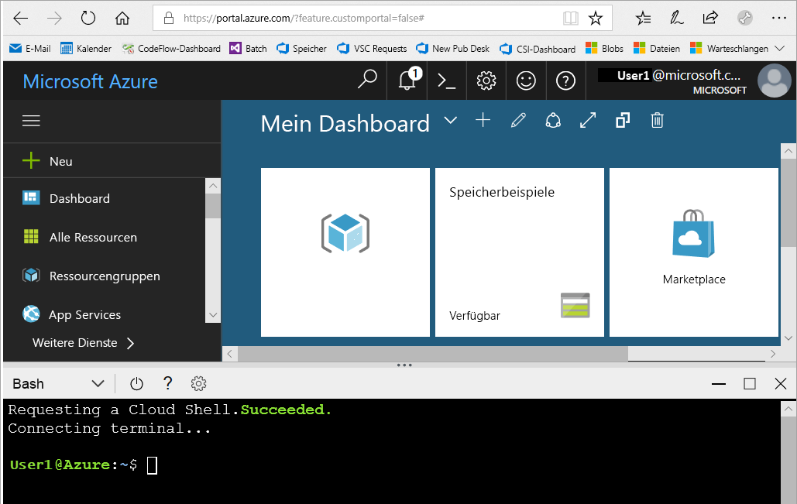
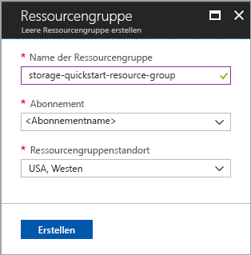
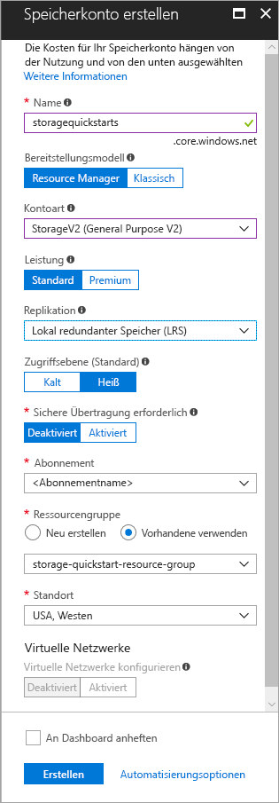

# <a name="create-a-storage-account"></a>Speicherkonto erstellen

Ein Azure-Speicherkonto stellt in der Cloud einen eindeutigen Namespace zum Speichern Ihrer Datenobjekte in Azure Storage sowie zum Zugreifen auf diese Objekte bereit. Ein Speicherkonto enthält alle Blobs, Dateien, Warteschlangen, Tabellen und Datenträger, die Sie unter diesem Konto erstellen. 

Für Ihre ersten Schritte mit Azure Storage müssen Sie zunächst ein neues Speicherkonto erstellen. Ein Azure-Speicherkonto kann über das [Azure-Portal](https://portal.azure.com/), mithilfe von [Azure PowerShell](https://docs.microsoft.com/powershell/azure/overview) oder über die [Azure-Befehlszeilenschnittstelle](https://docs.microsoft.com/cli/azure/overview?view=azure-cli-latest) erstellt werden. In dieser Schnellstartanleitung erfahren Sie, wie Sie Ihr neues Speicherkonto mit diesen Optionen erstellen. 


## <a name="prerequisites"></a>Voraussetzungen

Wenn Sie kein Azure-Abonnement besitzen, können Sie ein [kostenloses Konto](https://azure.microsoft.com/free/) erstellen, bevor Sie beginnen.

# <a name="portaltabportal"></a>[Portal](#tab/portal)

None (Keine):

# <a name="powershelltabpowershell"></a>[PowerShell](#tab/powershell)

Für diese Schnellstartanleitung ist das Azure PowerShell-Modul Version 3.6 oder höher erforderlich. Führen Sie `Get-Module -ListAvailable AzureRM` aus, um Ihre aktuelle Version zu ermitteln. Wenn Sie eine Installation oder ein Upgrade ausführen müssen, finden Sie unter [Install and configure Azure PowerShell](/powershell/azure/install-azurerm-ps) (Installieren des Azure PowerShell-Moduls) Informationen dazu.

# <a name="azure-clitabazure-cli"></a>[Azure-CLI](#tab/azure-cli)

Sie können sich bei Azure anmelden und Azure-CLI-Befehle ausführen. Dazu haben Sie zwei Möglichkeiten:

- Sie können CLI-Befehle innerhalb des Azure-Portals in Azure Cloud Shell ausführen. 
- Sie können die Befehlszeilenschnittstelle installieren und CLI-Befehle lokal ausführen.  

### <a name="use-azure-cloud-shell"></a>Verwenden von Azure Cloud Shell

Azure Cloud Shell ist eine kostenlose Bash-Shell, die Sie direkt im Azure-Portal ausführen können. Die Azure CLI ist vorinstalliert und für die Verwendung mit Ihrem Konto konfiguriert. Klicken Sie im Azure-Portal rechts oben im Menü auf die Schaltfläche **Cloud Shell**:

[](https://portal.azure.com)

Die Schaltfläche öffnet eine interaktive Shell, mit der Sie die Schritte in dieser Schnellstartanleitung ausführen können:

[](https://portal.azure.com)

### <a name="install-the-cli-locally"></a>Lokales Installieren der Befehlszeilenschnittstelle

Sie können die Azure-Befehlszeilenschnittstelle auch lokal installieren und verwenden. Für diese Schnellstartanleitung müssen Sie mindestens Version 2.0.4 der Azure-Befehlszeilenschnittstelle ausführen. Führen Sie `az --version` aus, um die Version zu finden. Wenn Sie eine Installation oder ein Upgrade ausführen müssen, finden Sie unter [Installieren von Azure CLI 2.0](/cli/azure/install-azure-cli) Informationen dazu. 

---

## <a name="log-in-to-azure"></a>Anmelden an Azure

# <a name="portaltabportal"></a>[Portal](#tab/portal)

Melden Sie sich beim [Azure-Portal](https://portal.azure.com)an.

# <a name="powershelltabpowershell"></a>[PowerShell](#tab/powershell)

Melden Sie sich mit dem Befehl `Login-AzureRmAccount` bei Ihrem Azure-Abonnement an, und befolgen Sie die Authentifizierungsanweisungen auf dem Bildschirm.

```powershell
Login-AzureRmAccount
```

# <a name="azure-clitabazure-cli"></a>[Azure-CLI](#tab/azure-cli)

Melden Sie sich zum Starten von Azure Cloud Shell beim [Azure-Portal](https://portal.azure.com) an.

Wenn Sie sich bei Ihrer lokalen Installation der Befehlszeilenschnittstelle anmelden möchten, führen Sie den folgenden Befehl aus:

```cli
az login
```

---

## <a name="create-a-resource-group"></a>Erstellen einer Ressourcengruppe

Eine Azure-Ressourcengruppe ist ein logischer Container, in dem Azure-Ressourcen bereitgestellt und verwaltet werden. Weitere Informationen zu Ressourcengruppen finden Sie unter [Übersicht über den Azure Resource Manager](../../azure-resource-manager/resource-group-overview.md).

# <a name="portaltabportal"></a>[Portal](#tab/portal)

Führen Sie die folgenden Schritte aus, um über das Azure-Portal eine Ressourcengruppe zu erstellen:

1. Erweitern Sie im Azure-Portal das Menü auf der linken Seite, um das Menü mit den Diensten zu öffnen, und klicken Sie auf **Ressourcengruppen**.
2. Klicken Sie auf **Hinzufügen**, um eine neue Ressourcengruppe hinzuzufügen.
3. Geben Sie einen Namen für die neue Ressourcengruppe ein.
4. Wählen Sie das Abonnement aus, in dem die neue Ressourcengruppe erstellt werden soll.
5. Wählen Sie den Standort für die Ressourcengruppe aus.
6. Klicken Sie auf die Schaltfläche **Erstellen** .  



# <a name="powershelltabpowershell"></a>[PowerShell](#tab/powershell)

Wenn Sie eine neue Ressourcengruppe mithilfe von PowerShell erstellen möchten, verwenden Sie den Befehl [New-AzureRmResourceGroup](/powershell/module/azurerm.resources/new-azurermresourcegroup): 

```powershell
# put resource group in a variable so you can use the same group name going forward,
# without hardcoding it repeatedly
$resourceGroup = "storage-quickstart-resource-group"
New-AzureRmResourceGroup -Name $resourceGroup -Location $location 
```

Falls Sie nicht wissen, welche Region Sie für den `-Location`-Parameter angeben sollen, können Sie mit dem Befehl [Get-AzureRmLocation](/powershell/module/azurerm.resources/get-azurermlocation) eine Liste der unterstützten Regionen für Ihr Abonnement abrufen:

```powershell
Get-AzureRmLocation | select Location 
$location = "westus"
```

# <a name="azure-clitabazure-cli"></a>[Azure-CLI](#tab/azure-cli)

Wenn Sie eine neue Ressourcengruppe über die Azure-Befehlszeilenschnittstelle erstellen möchten, verwenden Sie den Befehl [az group create](/cli/azure/group#az_group_create). 

```azurecli-interactive
az group create \
    --name storage-quickstart-resource-group \
    --location westus
```

Falls Sie nicht wissen, welche Region Sie für den `--location`-Parameter angeben sollen, können Sie mit dem Befehl [az account list-locations](/cli/azure/account#az_account_list) eine Liste der unterstützten Regionen für Ihr Abonnement abrufen.

```azurecli-interactive
az account list-locations \
    --query "[].{Region:name}" \
    --out table
```

---

## <a name="create-a-general-purpose-storage-account"></a>Erstellen eines allgemeinen Speicherkontos

Ein allgemeines Speicherkonto bietet Zugriff auf sämtliche Azure Storage-Dienste: Blobs, Dateien, Warteschlangen und Tabellen. Allgemeine Speicherkonten können in einem Standard- oder Premium-Tarif erstellt werden. In den Beispielen in diesem Artikel wird ein allgemeines Speicherkonto im Standardtarif (Standardeinstellung) erstellt.

Azure Storage verfügt über zwei Arten von allgemeinen Speicherkonten:

- Allgemeines Konto vom Typ „General Purpose v2“ 
- Allgemeines Konto vom Typ „General Purpose v1“ 

> [!NOTE]
> Es wird empfohlen, für neu erstellte Speicherkonten den Typ **General Purpose v2** zu verwenden, um die neueren Features nutzen zu können, die für diese Konten verfügbar sind.  

Weitere Informationen zu Arten von Speicherkonten finden Sie unter [Azure Storage-Kontooptionen](storage-account-options.md).

Beachten Sie bei der Benennung Ihres Speicherkontos folgende Regeln:

- Speicherkontonamen müssen zwischen 3 und 24 Zeichen lang sein und dürfen nur Zahlen und Kleinbuchstaben enthalten.
- Der Name Ihres Speicherkontos muss innerhalb von Azure eindeutig sein. Zwei Speicherkonten können nicht denselben Namen haben.

# <a name="portaltabportal"></a>[Portal](#tab/portal)

Führen Sie diese Schritte aus, wenn Sie ein allgemeines Speicherkonto vom Typ „General Purpose v2“ über das Azure-Portal erstellen möchten:

1. Erweitern Sie im Azure-Portal das Menü auf der linken Seite, um das Menü mit den Diensten zu öffnen, und klicken Sie auf **Alle Dienste**. Scrollen Sie anschließend nach unten zu **Speicher** und klicken Sie auf **Speicherkonten**. Klicken Sie im angezeigten Fenster **Speicherkonten** auf **Hinzufügen**.
2. Geben Sie einen Namen für Ihr Speicherkonto ein.
3. Legen Sie das Feld **Kontoart** auf **StorageV2 (General Purpose v2)** fest.
4. Übernehmen Sie für das Feld **Replikation** die Einstellung **Lokal redundanter Speicher (LRS)**. Alternativ hierzu können Sie **Zonenredundanter Speicher (ZRS – Vorschau)**, **Georedundanter Speicher (GRS)** oder **Read-Access Geo Redundant-Speicher (RA-GRS)** wählen.
5. Behalten Sie in den folgenden Feldern die Standardwerte bei: **Bereitstellungsmodell****Leistung**, **Sichere Übertragung erforderlich**.
6. Wählen Sie das Abonnement aus, in dem Sie das Speicherkonto erstellen möchten.
7. Wählen Sie im Abschnitt **Ressourcengruppe** die Option **Vorhandene verwenden** und anschließend die Ressourcengruppe aus, die Sie im vorherigen Abschnitt erstellt haben.
8. Wählen Sie den Standort für Ihr neues Speicherkonto aus.
9. Klicken Sie auf **Erstellen** , um das Speicherkonto zu erstellen.      



# <a name="powershelltabpowershell"></a>[PowerShell](#tab/powershell)

Verwenden Sie zum Erstellen eines Speicherkontos vom Typ „General Purpose v2“ per PowerShell mit lokal redundantem Speicher (LRS) den Befehl [New-AzureRmStorageAccount](/powershell/module/azurerm.storage/New-AzureRmStorageAccount): 

```powershell
New-AzureRmStorageAccount -ResourceGroupName $resourceGroup `
  -Name "storagequickstart" `
  -Location $location `
  -SkuName Standard_LRS `
  -Kind StorageV2 
```

Fügen Sie zum Erstellen eines Speicherkontos vom Typ „General Purpose v2“ mit zonenredundantem Speicher (ZRS – Vorschau), georedundantem Speicher (GRS) oder georedundantem Speicher mit Lesezugriff (RA-GRS) den gewünschten Wert in der Tabelle unten für den Parameter **SkuName** ein. 

|Replikationsoption  |SkuName-Parameter  |
|---------|---------|
|Lokal redundanter Speicher (LRS)     |Standard_LRS         |
|Zonenredundanter Speicher (ZRS)     |Standard_ZRS         |
|Georedundanter Speicher (GRS)     |Standard_GRS         |
|Georedundanter Speicher mit Lesezugriff (RA-GRS)     |Standard_RAGRS         |

# <a name="azure-clitabazure-cli"></a>[Azure-CLI](#tab/azure-cli)

Verwenden Sie zum Erstellen eines Speicherkontos vom Typ „General Purpose v2“ über die Azure CLI mit lokal redundantem Speicher den Befehl [az storage account create](/cli/azure/storage/account#az_storage_account_create).

```azurecli-interactive
az storage account create \
    --name storagequickstart \
    --resource-group storage-quickstart-resource-group \
    --location westus \
    --sku Standard_LRS \
    --kind StorageV2
```

Fügen Sie zum Erstellen eines Speicherkontos vom Typ „General Purpose v2“ mit zonenredundantem Speicher (ZRS – Vorschau), georedundantem Speicher (GRS) oder georedundantem Speicher mit Lesezugriff (RA-GRS) den gewünschten Wert in der Tabelle unten für den Parameter **sku** ein. 

|Replikationsoption  |sku-Parameter  |
|---------|---------|
|Lokal redundanter Speicher (LRS)     |Standard_LRS         |
|Zonenredundanter Speicher (ZRS)     |Standard_ZRS         |
|Georedundanter Speicher (GRS)     |Standard_GRS         |
|Georedundanter Speicher mit Lesezugriff (RA-GRS)     |Standard_RAGRS         |

---

> [!NOTE]
> Der [zonenredundante Speicher](https://azure.microsoft.com/blog/announcing-public-preview-of-azure-zone-redundant-storage/preview/) befindet sich derzeit in der Vorschauphase und ist nur für die folgenden Standorte verfügbar:
>    - USA (Ost 2)
>    - USA, Mitte
>    - Frankreich, Mitte (Diese Region befindet sich derzeit in der Vorschauphase. Informationen zum Anfordern des Zugriffs finden Sie unter [Microsoft Azure preview with Azure Availability Zones now open in France](https://azure.microsoft.com/blog/microsoft-azure-preview-with-azure-availability-zones-now-open-in-france) (Vorschauversion von Microsoft Azure mit Azure-Verfügbarkeitszonen jetzt auch in Frankreich).)
    
Weitere Informationen zu den verschiedenen Replikationsarten, die verfügbar sind, finden Sie unter [Azure Storage-Replikation](storage-redundancy.md).

## <a name="clean-up-resources"></a>Bereinigen von Ressourcen

Um die Ressourcen zu bereinigen, die im Rahmen dieser Schnellstartanleitung erstellt wurden, können Sie einfach die Ressourcengruppe löschen. Wenn Sie die Ressourcengruppe löschen, werden sowohl das zugeordnete Speicherkonto als auch alle anderen Ressourcen gelöscht, die der Ressourcengruppe zugeordnet sind.

# <a name="portaltabportal"></a>[Portal](#tab/portal)

So entfernen Sie eine Ressourcengruppe über das Azure-Portal:

1. Erweitern Sie im Azure-Portal das Menü auf der linken Seite, um das Menü mit den Diensten zu öffnen, und klicken Sie auf **Ressourcengruppen**, um die Liste mit Ihren Ressourcengruppen anzuzeigen.
2. Suchen Sie die zu löschende Ressourcengruppe, und klicken Sie mit der rechten Maustaste rechts neben dem Eintrag auf die Schaltfläche **Mehr** (**...**).
3. Klicken Sie auf **Ressourcengruppe löschen**, und bestätigen Sie den Vorgang.

# <a name="powershelltabpowershell"></a>[PowerShell](#tab/powershell)

Verwenden Sie den Befehl [Remove-AzureRmResourceGroup](/powershell/module/azurerm.resources/remove-azurermresourcegroup), um die Ressourcengruppe und die zugeordneten Ressourcen (einschließlich des neuen Speicherkontos) zu entfernen: 

```powershell
Remove-AzureRmResourceGroup -Name $resourceGroup
```

# <a name="azure-clitabazure-cli"></a>[Azure-CLI](#tab/azure-cli)

Verwenden Sie den Befehl [az group delete](/cli/azure/group#az_group_delete), um die Ressourcengruppe und die zugeordneten Ressourcen (einschließlich des neuen Speicherkontos) zu entfernen.

```azurecli-interactive
az group delete --name myResourceGroup
```

---

## <a name="next-steps"></a>Nächste Schritte

In diesem Schnellstart haben Sie ein allgemeines Standardspeicherkonto erstellt. Weitere Informationen zum Hoch- und Herunterladen von Blobs in Ihr bzw. aus Ihrem Speicherkonto finden Sie in der Schnellstartanleitung für Blob Storage.

# <a name="portaltabportal"></a>[Portal](#tab/portal)

> [!div class="nextstepaction"]
> [Übertragen von Objekten nach/aus Azure Blob Storage über das Azure-Portal](../blobs/storage-quickstart-blobs-portal.md)

# <a name="powershelltabpowershell"></a>[PowerShell](#tab/powershell)

> [!div class="nextstepaction"]
> [Übertragen von Objekten nach/aus Azure Blob Storage mit PowerShell](../blobs/storage-quickstart-blobs-powershell.md)

# <a name="azure-clitabazure-cli"></a>[Azure-CLI](#tab/azure-cli)

> [!div class="nextstepaction"]
> [Übertragen Objekten nach/aus Azure Blob Storage mit der Azure-Befehlszeilenschnittstelle](../blobs/storage-quickstart-blobs-cli.md)

---
