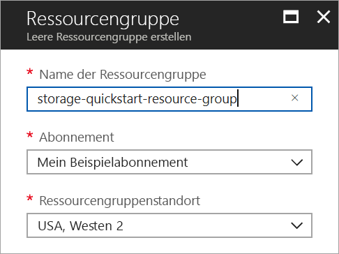
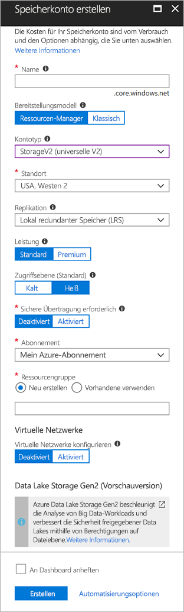

# <a name="quickstart-create-an-azure-data-lake-storage-gen2-preview-storage-account"></a>Schnellstart: Erstellen eines Speicherkontos in Azure Data Lake Storage Gen2 (Vorschauversion)

Konten in Azure Data Lake Storage Gen2 (Vorschauversion) [unterstützen einen hierarchischen Namespacedienst](introduction.md), der ein natives verzeichnisbasiertes Dateisystem für die Verwendung mit Hadoop Distributed File System (HDFS) bereitstellt. Wenn Sie über Hadoop Distributed File System auf Data Lake Storage Gen2-Daten zugreifen möchten, ist dies über den [ABFS-Treiber](abfs-driver.md) möglich.

Wenn Sie Data Lake Storage Gen2-Funktionen für Ihr Speicherkonto aktivieren möchten, [füllen Sie das Formular für die Vorschauversion aus, um Zugriff anzufordern](https://aka.ms/adlsgen2signup). Nach der Genehmigung können Sie ein neues Data Lake Storage Gen2-Konto erstellen. In dieser Schnellstartanleitung wird gezeigt, wie Sie ein Konto mit dem [Azure-Portal](https://portal.azure.com/), mit [Azure PowerShell](https://docs.microsoft.com/powershell/azure/overview) oder mit der [Azure CLI](https://docs.microsoft.com/cli/azure?view=azure-cli-latest) erstellen.

> [!NOTE]
> Die Benutzeroberfläche für die Kontoerstellung im Azure-Portal wird aktualisiert, sobald die Genehmigung zum Erstellen eines Data Lake Storage Gen2-Kontos für Sie erteilt wurde. Analog dazu können auch die PowerShell- und CLI-Argumente für Data Lake Storage Gen2 erst verwendet werden, wenn die Genehmigung für die Vorschauversion erteilt wurde.

## <a name="prerequisites"></a>Voraussetzungen

Wenn Sie kein Azure-Abonnement besitzen, können Sie ein [kostenloses Konto](https://azure.microsoft.com/free/) erstellen, bevor Sie beginnen.

|           | Voraussetzung |
|-----------|--------------|
|Portal     | Keine         |
|PowerShell | Für diese Schnellstartanleitung ist das Azure PowerShell-Modul Version **5.0.4-preview** oder höher erforderlich. Führen Sie `Get-Module -ListAvailable AzureRM` aus, um Ihre aktuelle Version zu ermitteln. Wenn Sie eine Installation oder ein Upgrade ausführen müssen, finden Sie unter [Install and configure Azure PowerShell](/powershell/azure/install-azurerm-ps) (Installieren des Azure PowerShell-Moduls) Informationen dazu. |
|Befehlszeilenschnittstelle (CLI)        | Sie können sich bei Azure anmelden und Azure-CLI-Befehle ausführen. Dazu haben Sie zwei Möglichkeiten: <ul><li>Sie können CLI-Befehle innerhalb des Azure-Portals in Azure Cloud Shell ausführen. </li><li>Sie können die Befehlszeilenschnittstelle installieren und CLI-Befehle lokal ausführen.</li></ul>|

Bei Verwendung der Befehlszeile können Sie Azure Cloud Shell ausführen oder die Befehlszeilenschnittstelle lokal installieren.

### <a name="use-azure-cloud-shell"></a>Verwenden von Azure Cloud Shell

Azure Cloud Shell ist eine kostenlose Bash-Shell, die Sie direkt im Azure-Portal ausführen können. Die Azure CLI ist vorinstalliert und für die Verwendung mit Ihrem Konto konfiguriert. Klicken Sie im Azure-Portal rechts oben im Menü auf die Schaltfläche **Cloud Shell**:

[](https://portal.azure.com)

Die Schaltfläche öffnet eine interaktive Shell, mit der Sie die Schritte in dieser Schnellstartanleitung ausführen können:

[](https://portal.azure.com)

### <a name="install-the-cli-locally"></a>Lokales Installieren der Befehlszeilenschnittstelle

Sie können die Azure-Befehlszeilenschnittstelle auch lokal installieren und verwenden. Für diese Schnellstartanleitung müssen Sie mindestens Version 2.0.38 der Azure-Befehlszeilenschnittstelle (Azure CLI) ausführen. Führen Sie `az --version` aus, um die Version zu finden. Wenn Sie eine Installation oder ein Upgrade ausführen müssen, finden Sie unter [Installieren von Azure CLI 2.0](/cli/azure/install-azure-cli) Informationen dazu.

## <a name="overview-of-creating-an-azure-data-lake-storage-gen2-account"></a>Übersicht über das Erstellen eines Azure Data Lake Storage Gen2-Kontos

Erstellen Sie vor der Erstellung des Kontos zunächst eine Ressourcengruppe, die als logischer Container für Speicherkonten oder andere von Ihnen erstellte Azure-Ressourcen fungiert. Um die Ressourcen zu bereinigen, die im Rahmen dieser Schnellstartanleitung erstellt wurden, können Sie einfach die Ressourcengruppe löschen. Wenn Sie die Ressourcengruppe löschen, werden sowohl das zugeordnete Speicherkonto als auch alle anderen Ressourcen gelöscht, die der Ressourcengruppe zugeordnet sind. Weitere Informationen zu Ressourcengruppen finden Sie unter [Übersicht über Azure Resource Manager](../../azure-resource-manager/resource-group-overview.md).

> [!NOTE]
> Die neuen Speicherkonten müssen vom Typ **StorageV2 (Allgemein v2 (GPv2))** sein, damit Sie die Funktionen von Data Lake Storage Gen2 nutzen können.  

Weitere Informationen zu Arten von Speicherkonten finden Sie unter [Azure Storage-Kontooptionen](../common/storage-account-options.md).

Beachten Sie bei der Benennung Ihres Speicherkontos folgende Regeln:

- Speicherkontonamen müssen zwischen 3 und 24 Zeichen lang sein und dürfen nur Zahlen und Kleinbuchstaben enthalten.
- Der Name Ihres Speicherkontos muss innerhalb von Azure eindeutig sein. Zwei Speicherkonten können nicht denselben Namen haben.

## <a name="create-an-account-using-the-azure-portal"></a>Erstellen eines Kontos im Azure-Portal

Melden Sie sich beim [Azure-Portal](https://portal.azure.com)an.

### <a name="create-a-resource-group"></a>Erstellen einer Ressourcengruppe

Führen Sie die folgenden Schritte aus, um über das Azure-Portal eine Ressourcengruppe zu erstellen:

1. Erweitern Sie im Azure-Portal das Menü auf der linken Seite, um das Menü mit den Diensten zu öffnen, und klicken Sie auf **Ressourcengruppen**.
2. Klicken Sie auf **Hinzufügen**, um eine neue Ressourcengruppe hinzuzufügen.
3. Geben Sie einen Namen für die neue Ressourcengruppe ein.
4. Wählen Sie das Abonnement aus, in dem die neue Ressourcengruppe erstellt werden soll.
5. Wählen Sie den Standort für die Ressourcengruppe aus.
6. Klicken Sie auf die Schaltfläche **Erstellen** .  



### <a name="create-a-general-purpose-v2-storage-account"></a>Erstellen eines Speicherkontos vom Typ „Allgemein v2 (GPv2)“

Führen Sie diese Schritte aus, wenn Sie ein allgemeines Speicherkonto vom Typ „General Purpose v2“ über das Azure-Portal erstellen möchten:

> [!NOTE]
> Der hierarchische Namespace ist nur in den Regionen „USA, Westen 2“ und „USA, Westen-Mitte“ aktiviert. Achten Sie darauf, beim Erstellen des Speicherkontos einen dieser beiden Standorte anzugeben.

1. Erweitern Sie im Azure-Portal das Menü auf der linken Seite, um das Menü mit den Diensten zu öffnen, und klicken Sie auf **Alle Dienste**. Scrollen Sie anschließend nach unten zu **Speicher** und klicken Sie auf **Speicherkonten**. Klicken Sie im angezeigten Fenster **Speicherkonten** auf **Hinzufügen**.
2. Geben Sie einen Namen für Ihr Speicherkonto ein.
3. Übernehmen Sie für **Bereitstellungsmodell** den Standardwert.
4. Legen Sie das Feld **Kontoart** auf **StorageV2 (General Purpose v2)** fest.
5. Legen Sie für **Standort** die Option **USA, Westen 2** fest.
6. Übernehmen Sie für das Feld **Replikation** die Einstellung **Lokal redundanter Speicher (LRS)**.
7. Übernehmen Sie für die folgenden Felder die Standardwerte: **Replikation**, **Leistung**, **Zugriffstarif**.
8. Wählen Sie das Abonnement aus, in dem Sie das Speicherkonto erstellen möchten.
9. Wählen Sie im Abschnitt **Ressourcengruppe** die Option **Vorhandene verwenden** und anschließend die Ressourcengruppe aus, die Sie im vorherigen Abschnitt erstellt haben.
10. Übernehmen Sie für **Virtuelle Netzwerke** den Standardwert.
11. Legen Sie im Abschnitt **Data Lake Storage Gen2 (preview)** (Data Lake Storage Gen2 (Vorschauversion)) die Option **Hierarchischer Namespace** auf **Aktiviert** fest.
12. Klicken Sie auf **Erstellen** , um das Speicherkonto zu erstellen.



Das Speicherkonto wird jetzt über das Portal erstellt.

### <a name="clean-up-resources"></a>Bereinigen von Ressourcen

So entfernen Sie eine Ressourcengruppe über das Azure-Portal:

1. Erweitern Sie im Azure-Portal das Menü auf der linken Seite, um das Menü mit den Diensten zu öffnen, und klicken Sie auf **Ressourcengruppen**, um die Liste mit Ihren Ressourcengruppen anzuzeigen.
2. Suchen Sie die zu löschende Ressourcengruppe, und klicken Sie mit der rechten Maustaste rechts neben dem Eintrag auf die Schaltfläche **Mehr** (**...**).
3. Klicken Sie auf **Ressourcengruppe löschen**, und bestätigen Sie den Vorgang.


## <a name="upgrade-your-powershell-module"></a>Aktualisieren Ihres PowerShell-Moduls

Um über PowerShell mit Data Lake Storage Gen2 interagieren zu können, müssen Sie für Ihr Modul das Upgrade auf die Vorschauversion durchführen.

Öffnen Sie hierzu eine PowerShell-Konsole mit erhöhten Rechten, und geben Sie den folgenden Befehl ein: `Install-Module AzureRM.Storage –Repository PSGallery -RequiredVersion 5.0.4-preview –AllowPrerelease –AllowClobber –Force `.

Starten Sie anschließend Ihre Shell neu.

## <a name="create-an-account-using-powershell"></a>Erstellen eines Kontos mithilfe von PowerShell

Melden Sie sich mit dem Befehl `Login-AzureRmAccount` bei Ihrem Azure-Abonnement an, und befolgen Sie die Authentifizierungsanweisungen auf dem Bildschirm.

```powershell
Login-AzureRmAccount
```

### <a name="create-a-resource-group"></a>Erstellen einer Ressourcengruppe

Wenn Sie eine neue Ressourcengruppe mithilfe von PowerShell erstellen möchten, verwenden Sie den Befehl [New-AzureRmResourceGroup](/powershell/module/azurerm.resources/new-azurermresourcegroup): 

> [!NOTE]
> Der hierarchische Namespace ist nur in den Regionen „USA, Westen 2“ und „USA, Westen-Mitte“ aktiviert. Achten Sie darauf, beim Erstellen des Speicherkontos einen dieser beiden Standorte anzugeben.

```powershell
# put resource group in a variable so you can use the same group name going forward,
# without hardcoding it repeatedly
$resourceGroup = "storage-quickstart-resource-group"
$location = "westus2"
New-AzureRmResourceGroup -Name $resourceGroup -Location $location
```

### <a name="create-a-general-purpose-v2-storage-account"></a>Erstellen eines Speicherkontos vom Typ „Allgemein v2 (GPv2)“

Verwenden Sie zum Erstellen eines Speicherkontos vom Typ „General Purpose v2“ per PowerShell mit lokal redundantem Speicher (LRS) den Befehl [New-AzureRmStorageAccount](/powershell/module/azurerm.storage/New-AzureRmStorageAccount):

```powershell
Get-AzureRmLocation | select Location 
$location = "westus2"

New-AzureRmStorageAccount -ResourceGroupName $resourceGroup `
  -Name "storagequickstart" `
  -Location $location `
  -SkuName Standard_LRS `
  -Kind StorageV2 
  -EnableHierarchicalNamespace $True
```

### <a name="clean-up-resources"></a>Bereinigen von Ressourcen

Verwenden Sie den Befehl [Remove-AzureRmResourceGroup](/powershell/module/azurerm.resources/remove-azurermresourcegroup), um die Ressourcengruppe und die zugeordneten Ressourcen (einschließlich des neuen Speicherkontos) zu entfernen: 

```powershell
Remove-AzureRmResourceGroup -Name $resourceGroup
```

## <a name="upgrade-your-cli-module"></a>Aktualisieren Ihres CLI-Moduls

Sie müssen Ihrer Shell die Erweiterung hinzufügen, um über die CLI mit Data Lake Storage Gen2 interagieren zu können.

Geben Sie den folgenden Befehl ein, um hierfür die Cloud Shell oder eine lokale Shell zu verwenden: `az extension add --name storage-preview`

## <a name="create-an-account-using-azure-cli"></a>Erstellen eines Kontos mithilfe der Azure-Befehlszeilenschnittstelle 

Melden Sie sich zum Starten von Azure Cloud Shell beim [Azure-Portal](https://portal.azure.com) an.

Wenn Sie sich bei Ihrer lokalen Installation der Befehlszeilenschnittstelle anmelden möchten, führen Sie den folgenden Befehl aus:

```cli
az login
```

### <a name="create-a-resource-group"></a>Erstellen einer Ressourcengruppe

Wenn Sie eine neue Ressourcengruppe über die Azure-Befehlszeilenschnittstelle erstellen möchten, verwenden Sie den Befehl [az group create](/cli/azure/group#az_group_create). 

```azurecli-interactive
az group create \
    --name storage-quickstart-resource-group \
    --location westus2
```

> [!NOTE]
> Der hierarchische Namespace ist nur in den Regionen „USA, Westen 2“ und „USA, Westen-Mitte“ aktiviert. Achten Sie darauf, beim Erstellen des Speicherkontos einen dieser beiden Standorte anzugeben.

### <a name="create-a-general-purpose-v2-storage-account"></a>Erstellen eines Speicherkontos vom Typ „Allgemein v2 (GPv2)“

Verwenden Sie zum Erstellen eines Speicherkontos vom Typ „General Purpose v2“ über die Azure CLI mit lokal redundantem Speicher den Befehl [az storage account create](/cli/azure/storage/account#az_storage_account_create).

```azurecli-interactive
az storage account create \
    --name storagequickstart \
    --resource-group storage-quickstart-resource-group \
    --location westus2 \
    --sku Standard_LRS \
    --kind StorageV2 \
    --Enable-hierarchical-namespace true
```

### <a name="clean-up-resources"></a>Bereinigen von Ressourcen

Verwenden Sie den Befehl [az group delete](/cli/azure/group#az_group_delete), um die Ressourcengruppe und die zugeordneten Ressourcen (einschließlich des neuen Speicherkontos) zu entfernen.

```azurecli-interactive
az group delete --name myResourceGroup
```

## <a name="next-steps"></a>Nächste Schritte

In dieser Schnellstartanleitung haben Sie ein Data Lake Storage Gen2-Speicherkonto erstellt. Weitere Informationen zum Hoch- und Herunterladen von Blobs in Ihr bzw. aus Ihrem Speicherkonto finden Sie in der Schnellstartanleitung für Blob Storage.

* [Verschieben von Daten in und aus Azure Blob Storage mithilfe von AzCopy](https://docs.microsoft.com/en-us/azure/machine-learning/team-data-science-process/move-data-to-azure-blob-using-azcopy)