# <a name="quickstart-run-a-spark-job-on-azure-databricks-using-the-azure-portal"></a>Schnellstart: Ausführen eines Spark-Auftrags in Azure Databricks mit dem Azure-Portal

In dieser Schnellstartanleitung erfahren Sie, wie Sie unter Verwendung von Azure Databricks einen Apache Spark-Auftrag ausführen, um in Azure Data Lake Storage Gen2 (Vorschauversion) gespeicherte Daten zu analysieren.

Im Rahmen des Spark-Auftrags werden die Abonnementdaten eines Radiosenders analysiert, um Einblicke in die Nutzung kostenloser/kostenpflichtiger Angebote auf der Grundlage demografischer Daten zu gewinnen.

Wenn Sie kein Azure-Abonnement besitzen, können Sie ein [kostenloses Konto](https://azure.microsoft.com/free/) erstellen, bevor Sie beginnen.

## <a name="prerequisites"></a>Voraussetzungen

- [Erstellen Sie ein Azure Data Lake Storage Gen2-Konto.](quickstart-create-account.md)

## <a name="set-aside-storage-account-configuration"></a>Bereithalten der Speicherkontokonfiguration

Im Verlauf dieses Tutorials benötigen Sie den Namen und den Zugriffsschlüssel Ihres Speicherkontos. Klicken Sie im Azure-Portal auf **Alle Dienste**, und filtern Sie nach *Speicher*. Klicken Sie auf **Speicherkonten**, und suchen Sie das Konto, das Sie für dieses Tutorial erstellt haben.

Kopieren Sie den Namen des Speicherkontos aus der **Übersicht** in einen Text-Editor. Klicken Sie als Nächstes auf **Zugriffsschlüssel**, und kopieren Sie den Wert für **key1** in Ihren Text-Editor. Beide Werte werden für spätere Befehle benötigt.

## <a name="create-an-azure-databricks-workspace"></a>Erstellen eines Azure Databricks-Arbeitsbereichs

In diesem Abschnitt erstellen Sie einen Azure Databricks-Arbeitsbereich über das Azure-Portal.

1. Klicken Sie im Azure-Portal auf **Ressource erstellen** > **Analysen** > **Azure Databricks**. 

    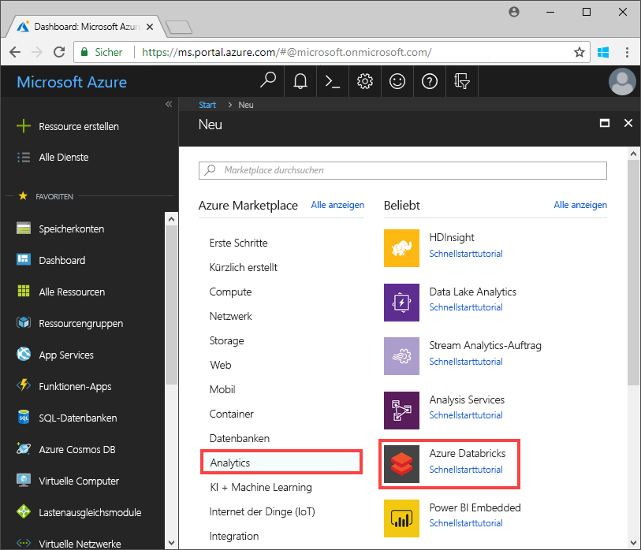

2. Geben Sie unter **Azure Databricks-Dienst** die Werte für die Erstellung eines Databricks-Arbeitsbereichs an.

    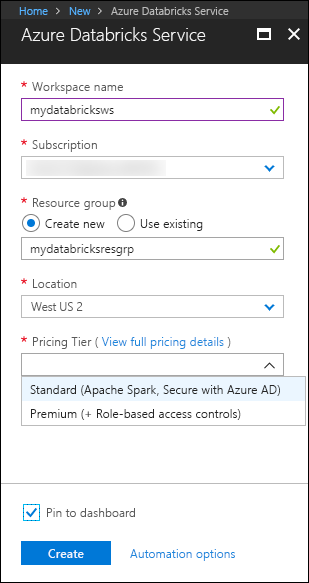

    Geben Sie außerdem die folgenden Werte an:
     
    |Eigenschaft  |BESCHREIBUNG  |
    |---------|---------|
    |**Arbeitsbereichsname**     | Geben Sie einen Namen für Ihren Databricks-Arbeitsbereich an.        |
    |**Abonnement**     | Wählen Sie in der Dropdownliste Ihr Azure-Abonnement aus.        |
    |**Ressourcengruppe**     | Geben Sie an, ob Sie eine neue Ressourcengruppe erstellen oder eine vorhandene Ressourcengruppe verwenden möchten. Eine Ressourcengruppe ist ein Container, der verwandte Ressourcen für eine Azure-Lösung enthält. Weitere Informationen finden Sie in der [Übersicht über den Azure Resource Manager](../../azure-resource-manager/resource-group-overview.md). |
    |**Location**     | Wählen Sie **USA, Westen 2** aus. Informationen zu weiteren verfügbaren Regionen finden Sie unter [Verfügbare Produkte nach Region](https://azure.microsoft.com/regions/services/).        |
    |**Tarif**     |  Wählen Sie zwischen **Standard** und **Premium**. Weitere Informationen zu diesen Tarifen, finden Sie unter [Azure Databricks – Preise](https://azure.microsoft.com/pricing/details/databricks/).       |

    Aktivieren Sie das Kontrollkästchen **An Dashboard anheften**, und klicken Sie anschließend auf **Erstellen**.

3. Die Erstellung des Arbeitsbereichs dauert einige Minuten. Während der Erstellung des Arbeitsbereichs wird im Portal auf der rechten Seite die Kachel **Bereitstellung für "Azure Databricks" wird gesendet** angezeigt. Möglicherweise müssen Sie im Dashboard nach rechts scrollen, um die Kachel zu sehen. Am oberen Bildschirmrand wird auch eine Statusanzeige angezeigt. Sie können den Status beider Bereiche beobachten.

    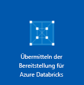

## <a name="create-a-spark-cluster-in-databricks"></a>Erstellen eines Spark-Clusters in Databricks

1. Navigieren Sie im Azure-Portal zum erstellten Databricks-Arbeitsbereich, und klicken Sie auf **Launch Workspace** (Arbeitsbereich starten).

2. Sie werden zum Azure Databricks-Portal weitergeleitet. Klicken Sie im Portal auf **Neu** > **Cluster**.

    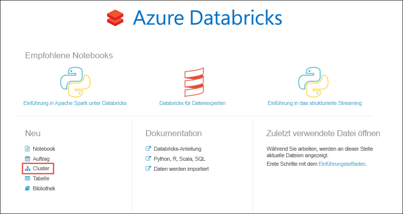

3. Geben Sie auf der Seite **Neuer Cluster** die erforderlichen Werte an, um einen Cluster zu erstellen.

    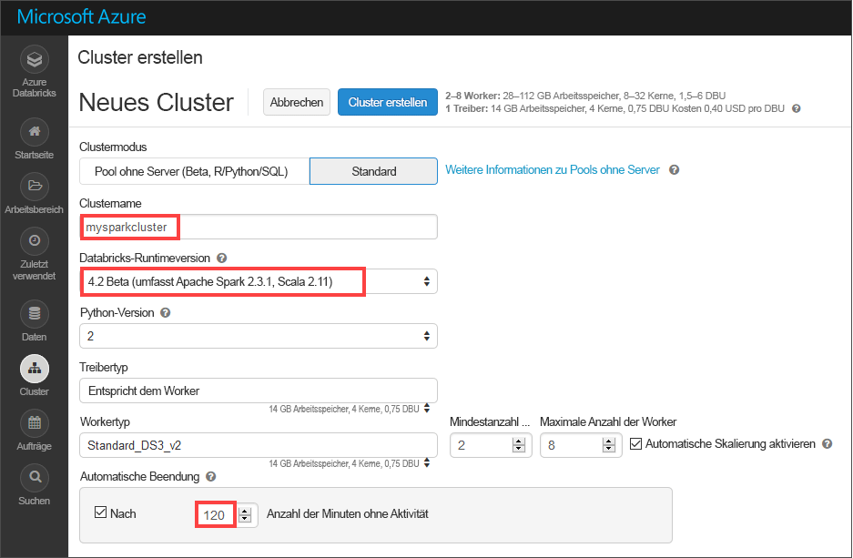

    Übernehmen Sie alle anderen Standardwerte bis auf Folgendes:

    * Geben Sie einen Namen für den Cluster ein.
    * Erstellen Sie einen Cluster mit der Laufzeit **4.2 beta**.
    * Aktivieren Sie das Kontrollkästchen **Terminate after 120 minutes of inactivity** (Nach 120 Minuten Inaktivität beenden). Geben Sie an, nach wie vielen Minuten der Cluster beendet werden soll, wenn er nicht verwendet wird.

4. Klicken Sie auf **Cluster erstellen**. Sobald der Cluster ausgeführt wird, können Sie Notizbücher an den Cluster anfügen und Spark-Aufträge ausführen.

Weitere Informationen zum Erstellen von Clustern in Azure Databricks finden Sie unter [Creating Clusters](https://docs.azuredatabricks.net/user-guide/clusters/create.html) (Erstellen von Clustern).

## <a name="create-storage-account-file-system"></a>Erstellen des Dateisystems für das Speicherkonto

In diesem Abschnitt erstellen Sie ein Notizbuch im Azure Databricks-Arbeitsbereich und führen anschließend Codeausschnitte aus, um das Speicherkonto zu konfigurieren.

1. Navigieren Sie im [Azure-Portal](https://portal.azure.com) zum erstellten Azure Databricks-Arbeitsbereich, und klicken Sie auf **Launch Workspace** (Arbeitsbereich starten).

2. Klicken Sie im linken Bereich auf **Arbeitsbereich**. Wählen Sie in der Dropdownliste **Arbeitsbereich** die Option **Erstellen** > **Notebook** aus.

    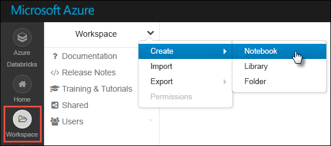

3. Geben Sie im Dialogfeld **Notizbuch erstellen** einen Namen für das Notebook ein. Wählen Sie **Scala** als Sprache und anschließend den zuvor erstellten Spark-Cluster aus.

    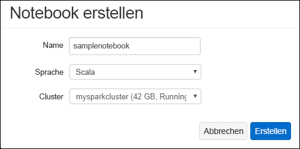

    Klicken Sie auf **Erstellen**.

4. Geben Sie in die erste Zelle den folgenden Code ein. Ersetzen Sie dabei die Platzhalterwerte durch Ihren Kontonamen, Ihren Schlüssel und einen Namen für Ihr Dateisystem.

    ```scala
    spark.conf.set("fs.azure.account.key.<ACCOUNT_NAME>.dfs.core.windows.net", "<ACCOUNT_KEY>") 
    spark.conf.set("fs.azure.createRemoteFileSystemDuringInitialization", "true")
    dbutils.fs.ls("abfs://<FILE_SYSTEM_NAME>@<ACCOUNT_NAME>.dfs.core.windows.net/")
    spark.conf.set("fs.azure.createRemoteFileSystemDuringInitialization", "false") 
    ```

    Drücken Sie **UMSCHALT+EINGABE**, um die Codezelle auszuführen.

    Daraufhin wird das Dateisystem für das Speicherkonto erstellt.

## <a name="ingest-sample-data"></a>Erfassen von Beispieldaten

Bevor Sie mit diesem Abschnitt beginnen, müssen folgende Schritte ausgeführt werden:

* Laden Sie **small_radio_json.json** von [GitHub](https://github.com/Azure/usql/blob/master/Examples/Samples/Data/json/radiowebsite/small_radio_json.json) herunter.
* Laden Sie die JSON-Beispieldatei mithilfe von **AzCopy (Version 10)** in das erstellte Blob-Speicherkonto mit dem erstellten Dateisystem hoch:

    ```bash
    set ACCOUNT_NAME=<ACCOUNT_NAME>
    set ACCOUNT_KEY=<ACCOUNT_KEY>
    azcopy cp "<LOCAL_FILE_PATH>\small_radio_json.json" https://<ACCOUNT_NAME>.dfs.core.windows.net/<CONTAINER_NAME> --recursive 
    ```

> [!NOTE]
> Die AzCopy-Version 10 steht nur Vorschaukunden zur Verfügung.

## <a name="run-a-spark-sql-job"></a>Ausführen eines Spark SQL-Auftrags

Führen Sie die folgenden Aufgaben aus, um einen Spark SQL-Auftrag für die Daten auszuführen.

1. Führen Sie eine SQL-Anweisung aus, um eine temporäre Tabelle mit Daten aus der JSON-Beispieldatendatei **small_radio_json.json** zu erstellen. Ersetzen Sie die Platzhalterwerte im folgenden Codeausschnitt durch den Namen Ihres Dateisystems bzw. Ihres Speicherkontos. Fügen Sie unter Verwendung des zuvor erstellten Notizbuchs den Codeausschnitt in eine Codezelle des Notizbuchs ein, und drücken Sie UMSCHALT+EINGABE.

    ```sql
    %sql
    DROP TABLE IF EXISTS radio_sample_data;
    CREATE TABLE radio_sample_data
    USING json
    OPTIONS (
     path  "abfs://<FILE_SYSTEM_NAME>@<ACCOUNT_NAME>.dfs.core.windows.net/<PATH>/small_radio_json.json"
    )
    ```

    Nach erfolgreicher Ausführung des Befehls liegen alle Daten aus der JSON-Datei als Tabelle im Databricks-Cluster vor.

    Der Befehl `%sql` ermöglicht die Ausführung von SQL-Code über das Notizbuch, auch wenn es sich um ein Notizbuch eines anderen Typs handelt. Weitere Informationen finden Sie unter [Mixing languages in a notebook](https://docs.azuredatabricks.net/user-guide/notebooks/index.html#mixing-languages-in-a-notebook) (Mischen von Sprachen in einem Notizbuch).

2. Zum besseren Verständnis der ausgeführten Abfrage sehen wir uns eine Momentaufnahme der JSON-Beispieldaten an. Fügen Sie den folgenden Codeausschnitt in die Codezelle ein, und drücken Sie **UMSCHALT+EINGABE**.

    ```sql
    %sql 
    SELECT * from radio_sample_data
    ```

3. Sie erhalten eine tabellarische Ausgabe wie im folgenden Screenshot, der allerdings nur einen Teil der Spalten zeigt:

    

    Neben verschiedenen anderen Details enthalten die Beispieldaten das Geschlecht der Zielgruppe eines Radiokanals (Spalte **gender**) und die Information, ob die jeweilige Person ein kostenloses oder ein kostenpflichtiges Abonnement nutzt (Spalte **level**).

4. Sie können nun eine visuelle Darstellung dieser Daten erstellen, die zeigt, wie viele Benutzer des jeweiligen Geschlechts über kostenlose Konten verfügen und bei wie vielen es sich um zahlende Abonnenten handelt. Klicken Sie im unteren Bereich der tabellarischen Ausgabe auf das Symbol **Balkendiagramm** und anschließend auf **Zeichnungsoptionen**.

    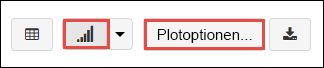

5. Platzieren Sie per Drag & Drop Werte in **Customize Plot** (Zeichnung anpassen), wie im folgenden Screenshot zu sehen.

    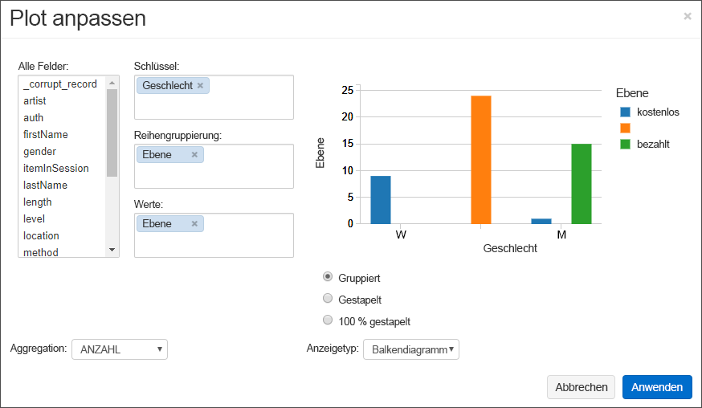

    - Legen Sie **Schlüssel** auf **gender** fest.
    - Legen Sie **Series groupings** (Reihengruppierungen) auf **level** fest.
    - Legen Sie **Werte** auf **level** fest.
    - Legen Sie **Aggregation** auf **ANZAHL** fest.

6. Klicken Sie auf **Anwenden**.

7. Die Ausgabe zeigt die visuelle Darstellung wie im folgenden Screenshot dargestellt:

     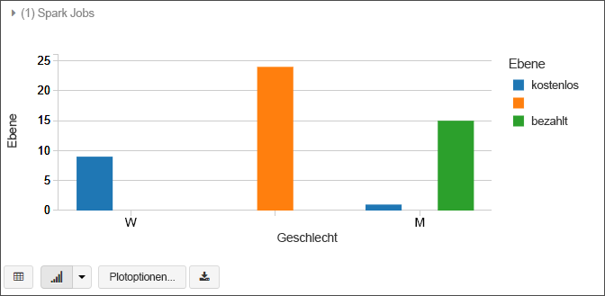

## <a name="clean-up-resources"></a>Bereinigen von Ressourcen

Am Ende dieses Artikels können Sie den Cluster beenden. Klicken Sie im Azure Databricks-Arbeitsbereich auf **Cluster**, und suchen Sie den Cluster, die Sie beenden möchten. Zeigen Sie mit dem Mauszeiger auf die Auslassungspunkte in der Spalte **Aktionen**, und klicken Sie auf das Symbol **Beenden**.

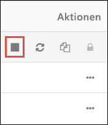

Wenn Sie den Cluster nicht manuell beenden, wird er automatisch beendet, sofern Sie bei der Erstellung des Clusters das Kontrollkästchen **Terminate after __ minutes of inactivity** (Nach __ Minuten Inaktivität beenden) aktiviert haben. Bei Verwendung dieser Option wird der Cluster beendet, wenn er für den angegebenen Zeitraum inaktiv war.

## <a name="next-steps"></a>Nächste Schritte

In diesem Artikel haben Sie einen Spark-Cluster in Azure Databricks erstellt und einen Spark-Auftrag mit Daten in Data Lake Storage Gen2 ausgeführt. Unter [Spark Data Sources](https://docs.azuredatabricks.net/spark/latest/data-sources/index.html) (Spark-Datenquellen) erfahren Sie, wie Sie Daten aus anderen Datenquellen in Azure Databricks importieren. Im nächsten Artikel erfahren Sie, wie Sie unter Verwendung von Azure Databricks einen ETL-Vorgang zum Extrahieren, Transformieren und Laden von Daten ausführen.

> [!div class="nextstepaction"]
>[Extrahieren, Transformieren und Laden von Daten mithilfe von Azure Databricks](../../azure-databricks/databricks-extract-load-sql-data-warehouse.md)
