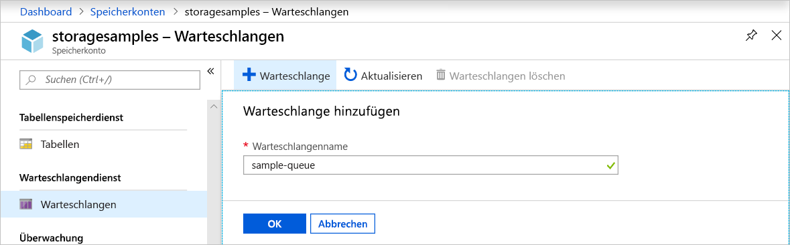
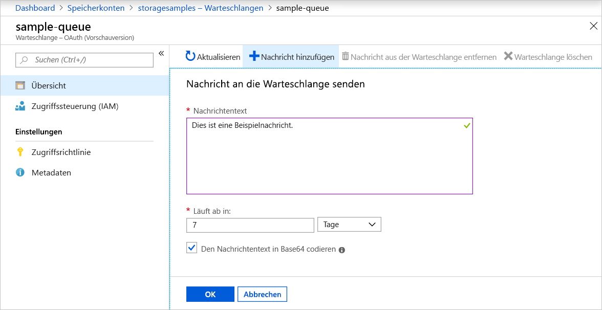
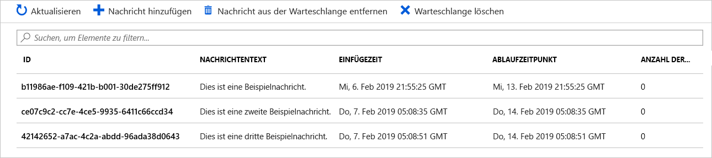
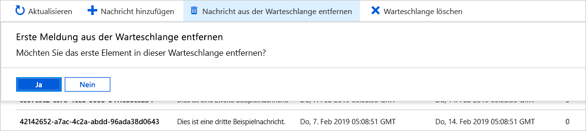

# Schnellstart: Erstellen einer Warteschlange und Hinzufügen einer Nachricht mit dem Azure-Portal

In dieser Schnellstartanleitung erfahren Sie, wie Sie mit dem [Azure-Portal](https://portal.azure.com/) eine Warteschlange in Azure Storage erstellen und ihr Nachrichten hinzufügen bzw. Nachrichten aus der Warteschlange entfernen.

## Voraussetzungen

[!INCLUDE [storage-quickstart-prereq-include](../../../includes/storage-quickstart-prereq-include.md)]

## Erstellen einer Warteschlange

Führen Sie die folgenden Schritte aus, um eine Warteschlange im Azure-Portal zu erstellen:

1. Navigieren Sie im Azure-Portal zu Ihrem neuen Speicherkonto.
2. Scrollen Sie im linken Menü für das Speicherkonto zum Abschnitt **Warteschlangendienst**, und wählen Sie **Warteschlangen** aus.
3. Wählen Sie die Schaltfläche **+ Warteschlange**.
4. Geben Sie einen Namen für die neue Warteschlange ein. Der Warteschlangenname muss klein geschrieben werden, mit einem Buchstaben oder einer Zahl beginnen und darf nur Buchstaben, Zahlen und Bindestriche (-) enthalten.
6. Wählen Sie **OK**, um die Warteschlange zu erstellen.

    

## Hinzufügen einer Nachricht

Fügen Sie als Nächstes der neuen Warteschlange eine Nachricht hinzu. Eine Nachricht kann bis zu 64 KB groß sein.

1. Wählen Sie die neue Warteschlange aus der Liste der Warteschlangen im Speicherkonto aus.
1. Wählen Sie die Schaltfläche **+ Nachricht hinzufügen**, um der Warteschlange eine Nachricht hinzuzufügen. Geben Sie eine Nachricht ins Feld **Nachrichtentext** ein. 
1. Geben Sie an, wann die Nachricht abläuft. Eine Nachricht kann maximal sieben Tage in der Warteschlange verbleiben.
1. Geben Sie an, ob die Nachricht als Base64 codiert werden soll. Die Codierung von binären Daten wird empfohlen.
1. Wählen Sie die Schaltfläche **OK**, um die Nachricht hinzuzufügen.

    

## Anzeigen von Nachrichteneigenschaften

Nachdem Sie eine Nachricht hinzugefügt haben, wird im Azure-Portal eine Liste aller Nachrichten in der Warteschlange angezeigt. Sie können die Nachrichten-ID, den Inhalt der Nachricht, den Zeitpunkt der Einfügung der Nachricht und die Ablaufzeit der Nachricht anzeigen. Darüber hinaus können Sie anzeigen, wie häufig eine bestimmte Nachricht aus der Warteschlange entfernt wurde.

## Entfernen einer Nachricht aus der Warteschlange

Sie können über das Azure-Portal eine Nachricht vom Anfang der Warteschlange entfernen. Wenn Sie eine Nachricht aus der Warteschlange entfernen, wird die Nachricht gelöscht. 

Beim Entfernen aus der Warteschlange wird immer die älteste Nachricht in der Warteschlange gelöscht. 

## Nächste Schritte

In dieser Schnellstartanleitung haben Sie gelernt, wie Sie eine Warteschlange erstellen, eine Nachricht hinzufügen, Nachrichteneigenschaften anzeigen und eine Nachricht über das Azure-Portal aus der Warteschlange entfernen.

> [!div class="nextstepaction"]
> [Einführung in Warteschlangen](storage-queues-introduction.md)