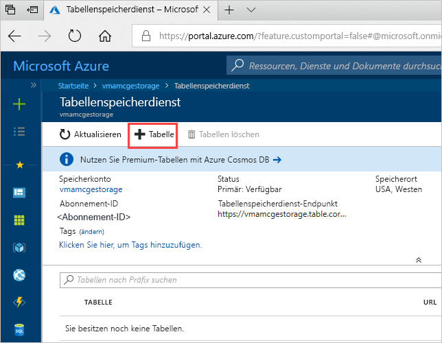
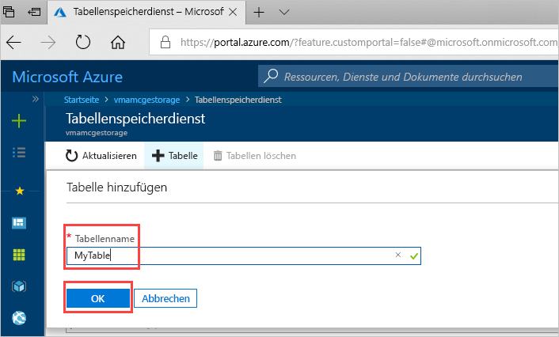

# Schnellstart: Erstellen einer Azure Storage-Tabelle über das Azure-Portal 

In dieser Schnellstartanleitung erfahren Sie, wie Sie Tabellen und Entitäten über das webbasierte Azure-Portal erstellen. Außerdem erfahren Sie, wie Sie ein Azure-Speicherkonto erstellen.

[!INCLUDE [quickstarts-free-trial-note](../../../includes/quickstarts-free-trial-note.md)]

## Voraussetzungen

Erstellen Sie zum Durchführen dieser Schnellstartanleitungen zuerst über das [Azure-Portal](https://portal.azure.com/#create/Microsoft.StorageAccount-ARM) ein Azure-Speicherkonto. Hilfe zur Erstellung des Kontos finden Sie unter [Erstellen eines Speicherkontos](../common/storage-quickstart-create-account.md).

## Hinzufügen einer Tabelle

Sie können jetzt den Tabellenspeicherdienst im Azure-Portal verwenden, um eine Tabelle zu erstellen.

1. Klicken Sie auf „Übersicht“ > „Tabellen“.

   

2. Klicken Sie auf **+Tabelle**.

   

3. Geben Sie im Feld **Tabellenname** einen Namen für Ihre Tabelle ein, und klicken Sie auf **OK**. 

   

## Nächste Schritte

- [Guidelines for table design](table-storage-design-guidelines.md) (Gestaltungsrichtlinien für Tabellen)