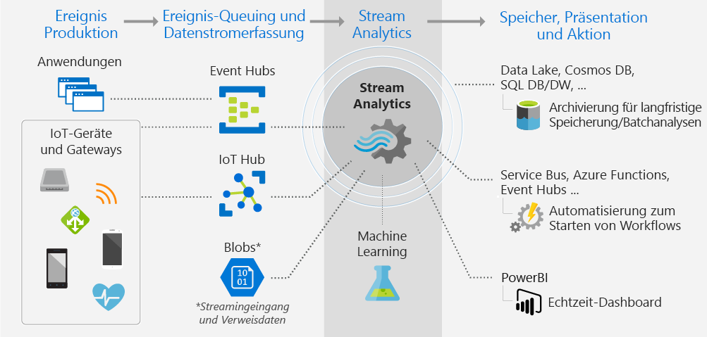

# Was ist Stream Analytics?

Azure Stream Analytics ist ein verwaltetes Ereignisverarbeitungsmodul zur Einrichtung analytischer Echtzeitberechnungen für Streamingdaten. Die Daten können von Geräten, Sensoren, Websites, Feeds sozialer Medien, Anwendungen, Infrastruktursystemen usw. stammen. 

Mit Stream Analytics können Sie umfangreiche Streamingdaten von Geräten oder Prozessen untersuchen, Informationen aus dem Datenstrom extrahieren und Muster, Trends und Beziehungen ermitteln. Auf der Grundlage dieser Muster können Sie weitere Prozesse oder Aktionen (beispielsweise Benachrichtigungen oder Automatisierungsworkflows) auslösen sowie Informationen an ein Berichtstool weitergeben oder zu späteren Untersuchung speichern. 

Hier einige Beispiele:

* Analysen und Benachrichtigungen für den Aktienhandel
* Betrugserkennung sowie Daten- und Identitätsschutz 
* Analyse von eingebetteten Sensoren und Aktoren
* Webklickstream-Analyse

## Funktionsweise von Stream Analytics

In der folgenden Abbildung ist die Stream Analytics-Pipeline dargestellt. Es wird gezeigt, wie Daten erfasst, analysiert und dann zur Anzeige oder Bearbeitung gesendet werden. 

Stream Analytics beginnt mit einer Quelle mit Streamingdaten. Die Daten können in Azure von einem Gerät erfasst werden, indem ein Azure Event Hub oder IoT Hub verwendet wird. Die Daten können auch aus einem Datenspeicher abgerufen werden, z.B. Azure Blob Storage. 

Zur Untersuchung des Datenstroms erstellen Sie einen Stream Analytics-*Auftrag*, der angibt, woher die Daten stammen. Im Auftrag ist auch eine *Transformation* angegeben (wie nach Daten, Mustern oder Beziehungen gesucht werden soll). Für diese Aufgabe unterstützt Stream Analytics eine SQL-ähnliche Abfragesprache, mit der Sie Streamingdaten für einen bestimmten Zeitraum filtern, sortieren, aggregieren und zusammenführen können.

Darüber hinaus ist in dem Auftrag eine Ausgabe für die transformierten Daten angegeben. Sie steuern, wie auf die analysierten Informationen reagiert werden soll. Aus der Analyse können sich beispielsweise folgende Schritte ergeben:

* Senden eines Befehls zum Ändern von Geräteeinstellungen 
* Senden von Daten an eine überwachte Warteschlange zur Ausführung weiterer ergebnisabhängiger Aktionen 
* Senden von Daten an ein Power BI-Dashboard
* Senden von Daten an einen Speicher wie Data Lake Store, Azure SQL-Datenbank oder Azure Blob Storage

Sie können anpassen, wie viele Ereignisse während der Auftragsausführung pro Sekunde verarbeitet werden sollen. Außerdem können Diagnoseprotokolle für die Problembehandlung generiert werden.

## Wichtige Funktionen und Vorteile

Stream Analytics ist benutzerfreundlich, flexibel und auf jede Auftragsgröße skalierbar.

### Verbinden von Eingaben und Ausgaben

Stream Analytics stellt eine Direktverbindung mit [Azure Event Hubs](https://azure.microsoft.com/services/event-hubs/) und [Azure IoT Hub](https://azure.microsoft.com/services/iot-hub/) (Datenstromerfassung) und mit dem [Azure Blob Storage-Dienst](https://docs.microsoft.com/azure/storage/storage-introduction#blob-storage-accounts) (Erfassung von Verlaufsdaten) her. Mit Stream Analytics können Sie Daten aus Event Hubs mit anderen Datenquellen und Verarbeitungsmodulen kombinieren. Die Auftragseingabe kann auch Referenzdaten enthalten (statische oder sich langsam ändernde Daten). Sie können Streamingdaten mit diesen Referenzdaten zusammenführen, um Suchvorgänge auf die gleiche Weise durchzuführen, wie Sie dies mit Datenbankabfragen tun.

Leiten Sie die Stream Analytics-Auftragsausgabe in viele verschiedene Richtungen weiter. Schreiben Sie Daten in Speicherlösungen wie Azure Blob Storage, Azure SQL-Datenbank, Azure Data Lake Store oder Azure Cosmos DB. Von dort können Sie Batchanalysen mit Azure HDInsight ausführen. Sie können die Ausgabe aber auch an einen anderen Dienst senden, um sie für einen anderen Prozess nutzbar zu machen. Beispiele wären etwa Event Hubs, Azure Service Bus, Warteschlangen oder Power BI (zur Visualisierung).

### Benutzerfreundlich

Zum Definieren von Transformationen setzen Sie eine einfache, deklarative [Stream Analytics-Abfragesprache](https://msdn.microsoft.com/library/azure/dn834998.aspx) ein, mit der Sie anspruchsvolle Analysen ohne Programmierung erstellen können. Die Abfragesprache nutzt Streamingdaten als Eingabe. Anschließend können Sie die Daten filtern und sortieren, Werte aggregieren, Berechnungen durchführen, Daten zusammenführen (innerhalb eines Datenstroms oder mit Referenzdaten) und Geofunktionen verwenden. Sie können Abfragen im Portal bearbeiten, indem Sie IntelliSense und die Syntaxprüfung nutzen, und Abfragen mithilfe von Datenstichproben testen, die Sie aus dem Livestream extrahieren.

### Erweiterbare Abfragesprache

Sie können die Funktionen der Abfragesprache erweitern, indem Sie zusätzliche Funktionen definieren und aufrufen. Definieren Sie Funktionsaufrufe im Azure Machine Learning-Dienst, um Azure Machine Learning-Lösungen zu nutzen. Außerdem können Sie benutzerdefinierte JavaScript-Funktionen (UDFs) integrieren, um im Rahmen einer Stream Analytics-Abfrage komplexe Berechnungen durchzuführen.

### Skalierbarkeit

Stream Analytics kann bis zu 1 GB eingehende Daten pro Sekunde verarbeiten. Die Integration von [Azure Event Hubs](https://azure.microsoft.com/services/event-hubs/) und [Azure IoT Hub](https://azure.microsoft.com/services/iot-hub/) macht es für Aufträge möglich, Millionen von Ereignissen pro Sekunde zu erfassen, die von verbundenen Geräten, aus Klickstreams, aus Protokolldateien usw. stammen. Indem Sie die Partitionsfunktion von Event Hubs verwenden, können Sie Berechnungen in logische Schritte partitionieren, die bei Bedarf jeweils weiter partitioniert werden können, um die Skalierbarkeit zu erhöhen.

### Niedrige Kosten

Stream Analytics ist als Clouddienst optimiert, damit Sie ohne größere Kosten starten können. Für Sie gilt die nutzungsbasierte Zahlung basierend auf der Streamingeinheitennutzung sowie auf den vom System verarbeiteten Daten. Die Nutzung wird auf Grundlage der Menge an verarbeiteten Ereignissen und dem Umfang der im Cluster bereitgestellten Rechenleistung berechnet, um die Stream Analytics-Aufträge zu verarbeiten.

### Zuverlässigkeit, schnelle Wiederherstellung und Wiederholbarkeit

Als verwalteter Dienst in der Cloud trägt Stream Analytics zur Verhinderung von Datenverlust und Sicherstellung der Geschäftskontinuität bei. Wenn es zu Ausfällen kommt, stellt der Dienst integrierte Wiederherstellungsfunktionen bereit. Mit der Möglichkeit, den Zustand intern beizubehalten, kann der Dienst wiederholbare Ergebnisse bereitstellen, wobei sichergestellt wird, dass Ereignisse archiviert und die Verarbeitung in Zukunft erneut angewendet werden können und immer dieselben Ergebnisse erzielt werden. Dies ermöglicht es Ihnen, zeitlich zurückzugehen und Berechnungen bei Ursachenanalysen, Was-wäre-wenn-Analysen usw. zu untersuchen.

## Nächste Schritte

* Experimentieren Sie mit Eingaben und Abfragen: [Erste Schritte mit Azure Stream Analytics zum Verarbeiten der Daten von IoT-Geräten](stream-analytics-get-started-with-azure-stream-analytics-to-process-data-from-iot-devices.md).
* Erstellen Sie eine [Stream Analytics-End-to-End-Lösung](stream-analytics-real-time-fraud-detection.md), mit der Telefonmetadaten auf betrügerische Anrufe untersucht werden.
* Informieren Sie sich über die SQL-ähnliche Abfragesprache für Stream Analytics und einzigartige Konzepte wie die [Fensterfunktionen](stream-analytics-window-functions.md).
* Antworten auf Ihre Fragen zu Stream Analytics finden Sie im [Azure Stream Analytics-Forum](https://social.msdn.microsoft.com/Forums/en-US/home?forum=AzureStreamAnalytics).

